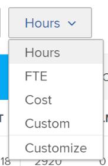

# Revisar la disponibilidad y asignación de recursos con el planificador de recursos de Adobe Workfront

Puede ver la disponibilidad de sus recursos y la cantidad de trabajo planificado o presupuestado para sus proyectos en el Planificador de recursos. Estos valores se muestran en cantidades de horas, de tiempo completo (equivalente a tiempo completo) o de costes y se organizan en columnas.

## Requisitos de acceso

Debe tener el siguiente acceso para realizar los pasos de este artículo:

<table style="table-layout:auto"> 
 <col> 
 <col> 
 <tbody> 
  <tr> 
   <td role="rowheader">plan de Adobe Workfront*</td> 
   <td> <p>Pro y superior</p> </td> 
  </tr> 
  <tr> 
   <td role="rowheader">Licencia de Adobe Workfront*</td> 
   <td> <p>Revisar o superior </p> </td> 
  </tr> 
  <tr> 
   <td role="rowheader">Configuraciones de nivel de acceso*</td> 
   <td> <p>Ver o acceso superior a lo siguiente:</p> 
    <ul> 
     <li> <p>Administración de recursos</p> </li> 
     <li> <p>Datos financieros</p> </li> 
     <li> <p>Usuarios</p> </li> 
     <li> <p>Proyectos</p> </li> 
    </ul> <p><b>NOTA</b>

Si todavía no tiene acceso, pregunte a su administrador de Workfront si establece restricciones adicionales en su nivel de acceso. Para obtener información sobre cómo un administrador de Workfront puede cambiar su nivel de acceso, consulte <a href="../../administration-and-setup/add-users/configure-and-grant-access/create-modify-access-levels.md" class="MCXref xref">Crear o modificar niveles de acceso personalizados</a>.</p> </td>
</tr> 
  <tr> 
   <td role="rowheader">Permisos de objeto</td> 
   <td> <p>Ver o permisos superiores de los proyectos que desea ver en el Planificador de recursos</p> <p>Para obtener información sobre la solicitud de acceso adicional, consulte <a href="../../workfront-basics/grant-and-request-access-to-objects/request-access.md" class="MCXref xref">Solicitar acceso a objetos </a>.</p> </td> 
  </tr> 
 </tbody> 
</table>

*Para saber qué plan, tipo de licencia o acceso tiene, póngase en contacto con el administrador de Workfront.

<!--note from the table about the license: Review or higher: 
      <MadCap:conditionalText data-mc-conditions="QuicksilverOrClassic.Draft mode">
       (waiting on Vazgen to confirm - working differenly in classic)
      </MadCap:conditionalText>
     -->

## Requisitos previos

Debe cumplir todos los requisitos previos necesarios para trabajar con el planificador de recursos. Para obtener más información, consulte [Información general del planificador de recursos](../../resource-mgmt/resource-planning/get-started-resource-planner.md).

>[!IMPORTANT]
>
>Si falta alguno de los requisitos previos necesarios para la correcta funcionalidad del Planificador de recursos, algunos números pueden ser cero o las horas presupuestadas pueden estar atenuadas.

## Disponibilidad y asignación de recursos

Las columnas que muestran la disponibilidad y la asignación de sus recursos cambian según la vista que aplique al planificador de recursos. Para obtener información sobre cómo mostrar la información en el Planificador de recursos por proyecto, función o usuario, consulte [Información general sobre navegación del planificador de recursos](../../resource-mgmt/resource-planning/resource-planner-navigation.md).

Tenga en cuenta lo siguiente cuando cambie su vista a Planificador de recursos:

* Al aplicar la variable **Ver por proyecto** o **Ver por función** , puede ver las columnas siguientes:

   <!--
  <MadCap:conditionalText data-mc-conditions="QuicksilverOrClassic.Draft mode">
  (NOTE: Alina: (some of the information in this area is also covered in Calculating Costs in the RP - https://workfront.zendesk.com/hc/en-us/articles/115004186433 - update this article also, when changes here occur)
  </MadCap:conditionalText>
  -->


   * Horas, FTE o costo disponibles
   * Horas, FTE o costo planeados
   * Horas, FTE o costo presupuestados
   * Horas, FTE o variación de coste
   * Horas netas, FTE o Coste

* Al aplicar la variable **Ver por usuario** puede ver las columnas siguientes:

   * Horas disponibles o FTE
   * Horas planificadas o FTE
   * Diferencia de hora o FTE
   * Porcentaje de asignación de horas planificadas

>[!TIP]
>
>La información no está disponible como Coste al aplicar la variable **Ver por usuario** vista al planificador de recursos.
>
>Para obtener más información sobre la visualización de cada columna, pase el ratón sobre el nombre de la columna en la que se muestra el número.\
>
>
>Para obtener más información sobre los datos mostrados en cada columna, consulte los siguientes artículos:
>
>* [Descripción general de las horas, los datos a tiempo completo y la información de costes en las vistas Proyecto y Función del planificador de recursos](../../resource-mgmt/resource-planning/overview-of-planner-hour-fte-cost-information-in-role-project-views.md)
>* [Ver las horas disponibles, planificadas y reales o FTE en el Planificador de recursos al utilizar la vista Usuario](../../resource-mgmt/resource-planning/view-hours-fte-user-view-resource-planner.md)
>


## Ver información por hora, tiempo de espera o costo

1. Vaya al Planificador de recursos.

   De forma predeterminada, la información se muestra por horas en el Planificador de recursos.

1. Expanda el menú desplegable.\
   

1. Seleccione entre las siguientes opciones:

   <table style="table-layout:auto"> 
    <col> 
    <col> 
    <tbody> 
     <tr> 
      <td role="rowheader">Horas</td> 
      <td>Muestra información de disponibilidad y asignación en horas.</td> 
     </tr> 
     <tr> 
      <td role="rowheader">ETC</td> 
      <td> <p>Muestra información de disponibilidad y asignación en FTE.</p> <p>Para obtener más información acerca de cómo se calcula el FTE en el planificador de recursos, consulte <a href="../../resource-mgmt/resource-planning/calculate-hours-fte-for-users-roles-resource-planner.md" class="MCXref xref">Descripción general del cálculo de horas y FTE para usuarios y funciones en el planificador de recursos</a>. </p> </td> 
     </tr> 
     <tr> 
      <td role="rowheader">Costo</td> 
      <td> <p>Muestra información de disponibilidad y asignación por costo si está viendo el Planificador de recursos en las vistas Proyecto o Función. La información muestra los valores en la moneda del sistema. El administrador de Workfront define la moneda del sistema. Para obtener más información sobre la configuración de la moneda del sistema en Workfront, consulte <a href="../../administration-and-setup/manage-workfront/exchange-rates/set-up-exchange-rates.md" class="MCXref xref">Configurar tipos de cambio</a>.</p> <p><b>NOTA</b>

   Debe asociar usuarios y funciones de trabajo con las tasas de Costo por hora para mostrar la información de Coste en el Planificador de Recursos.<br style="font-style: italic;">Para obtener más información sobre cómo asociar tasas de costo por hora con funciones de trabajo, consulte <a href="../../administration-and-setup/set-up-workfront/organizational-setup/create-manage-job-roles.md" class="MCXref xref">Crear y administrar funciones de trabajo</a>.<br style="font-style: italic;">Para obtener más información sobre cómo asociar las tasas de costo por hora con los usuarios, consulte <a href="../../administration-and-setup/add-users/create-and-manage-users/edit-a-users-profile.md" class="MCXref xref">Edición del perfil de un usuario</a>.<br style="font-style: italic;">Para obtener más información sobre cómo se calcula el coste en el planificador de recursos, consulte <a href="../../resource-mgmt/resource-planning/calculate-costs-resource-planner.md" class="MCXref xref">Calcular los costes en el planificador de recursos </a>.</p> </td>
   </tr> 
     <tr> 
      <td role="rowheader">Personalizar</td> 
      <td>Crea una vista personalizada de las columnas que se muestran en el Planificador de recursos. Seleccione las opciones que desee mostrar en el Planificador de recursos, tal como se describe en los pasos a continuación. </td> 
     </tr> 
    </tbody> 
   </table>

1. (Condicional) Si ha seleccionado **Personalizar**, indique las opciones de la sección **Personalizar las métricas mostradas** para configurar la vista personalizada.

   

1. En el **Tipo de vista** a la izquierda, seleccione una de las siguientes vistas:

   * Proyecto
   * Rol
   * Usuario

1. En el **Mostrar los elementos seleccionados** , seleccione el tipo de información que desea mostrar en las columnas de la vista seleccionada. La tabla siguiente muestra las opciones disponibles en cada vista:

   | **Opción** | Vista de usuario | Vista de proyectos | Vista de rol |
   |---|---|---|---|
   | Disponible | š | ✔ | ✔ |
   | Planificados | ✔ | ✔ | ✔ |
   | Presupuestado |   | ✔ | ✔ |
   | Desviación |   | ✔ | ✔ |
   | Neto |   | ✔ | ✔ |
   | Real | ✔ |   |   |
   | Diferencia | ✔ |   |   |
   | Porcentaje | ✔ |   |   |

1. Select **Utilizar valores planificados (PLN) en cálculos NET** para utilizar información Planificada en lugar de Presupuestada al calcular los valores de Red en las vistas Proyecto y Función.

   Al seleccionar esta opción, Workfront calcula los valores de red mediante la fórmula siguiente:

   ```
   Net = Available - Planned
   ```

   >[!TIP]
   >
   >**Esta opción solo se aplica cuando selecciona al menos una opción para personalizar la vista en la sección Mostrar elementos seleccionados .**

1. Haga clic en **Guardar**.

   Se muestra la vista personalizada que incluye las columnas seleccionadas.

   El planificador de recursos enumera la vista personalizada como Personalizada en el menú desplegable Horas .

   >[!NOTE]
   >
   >Solo puede tener una vista personalizada.

   

## Ver el gráfico de Asignación de usuarios

Puede mostrar la Asignación planificada de los usuarios en función de su disponibilidad en un gráfico.

Para mostrar la asignación de usuarios en un gráfico:

1. Vaya al Planificador de recursos.

   Para obtener más información sobre el acceso al planificador de recursos, consulte la [Localizar el planificador de recursos](../../resource-mgmt/resource-planning/get-started-resource-planner.md#accessing-the-resource-planner) sección del artículo [Información general del planificador de recursos](../../resource-mgmt/resource-planning/get-started-resource-planner.md).

1. Select **Ver por usuario**.

   >[!TIP]
   >
   >Solo puede ver el gráfico de asignación de usuarios en la vista Usuario.

1. Haga clic en el **Gráfico de asignación de usuarios** icono  para mostrar la siguiente información:

   <table style="table-layout:auto"> 
    <col> 
    <col> 
    <tbody> 
     <tr> 
      <td role="rowheader">% de disponibilidad sin asignación excesiva para todos los usuarios</td> 
      <td>Es la cantidad de tiempo que todos los usuarios están disponibles para trabajar en un período de tiempo, que se muestra como un porcentaje del tiempo total disponible. </td> 
     </tr> 
     <tr> 
      <td role="rowheader">% de asignación excesiva para todos los usuarios </td> 
      <td> <p>Es la cantidad de tiempo que los usuarios tienen una sobreasignación en un período de tiempo, que se muestra como un porcentaje del tiempo total disponible.</p> <p><b>NOTA</b>

   Una sobreasignación ocurre cuando las horas planificadas son superiores a las horas disponibles. </p> </td>
   </tr> 
     <tr> 
      <td role="rowheader">% de infrautilización para todos los usuarios</td> 
      <td> <p>Es la cantidad de tiempo que los usuarios están infrautilizados en un período de tiempo, que se muestra como un porcentaje del tiempo total disponible.</p> <p><b>NOTA</b>

   La infrautilización se produce cuando las horas planificadas son inferiores a las horas disponibles. </p> </td>
   </tr> 
     <tr> 
      <td role="rowheader">Al menos un usuario tiene una asignación excesiva durante este período de tiempo</td> 
      <td>Esto indica que hay una sobreasignación de al menos un usuario en un período de tiempo, aunque la cantidad total de tiempo de todos los usuarios no está sobreasignada para el período de tiempo.<br>Debe desplazarse por la lista de usuarios y las horas del usuario que está sobreasignado aparecerán resaltadas en rojo.</td> 
     </tr> 
    </tbody> 
   </table>

   

1. (Opcional) Haga clic en el **Sobreasignación % para todos los usuarios** del gráfico.\
   Todos los usuarios que están sobreasignados aparecen resaltados en rojo.
1. (Opcional) Haga clic en el **Subutilización % para todos los usuarios** del gráfico.\
   Todos los usuarios infrautilizados aparecen resaltados en azul.

1. (Opcional) Haga clic en el icono del indicador  que muestra dónde tiene al menos un usuario sobreasignado.\
   Los usuarios que están sobreasignados aparecen resaltados en rojo.

1. (Opcional) Actualice la página para contraer el gráfico.
