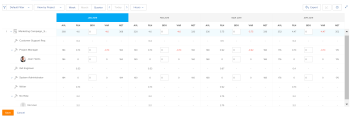
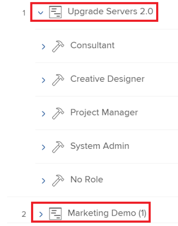
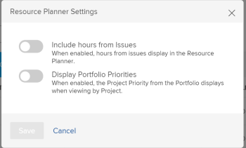

# Información general de navegación del planificador de recursos

Con el Planificador de recursos de Adobe Workfront puede comprender fácilmente la disponibilidad de sus recursos, así como el tiempo planificado necesario para completar el trabajo en sus proyectos. A continuación, puede administrar la asignación de los usuarios y sus funciones en los proyectos a los que están asignados.

>[!TIP]
>
>No puede administrar la asignación de equipos en las tareas a las que están asignados en el Planificador de recursos.

Debe cumplir los requisitos previos necesarios para utilizar completamente el Planificador de recursos. Para obtener más información sobre el Planificador de recursos, consulte [Información general del Planificador de recursos](../../resource-mgmt/resource-planning/get-started-resource-planner.md).

Las secciones siguientes describen todas las áreas del Planificador de recursos.

## Cronología de los proyectos

Utilice el calendario de la parte superior del Planificador de recursos para navegar por la cronología de los proyectos que está viendo. La cronología comienza con el mes de hoy de forma predeterminada.\
Para obtener más información acerca de cómo cambiar el intervalo de tiempo que se muestra en el Planificador de recursos, vea la sección [Selección del intervalo de tiempo](#timeframe-selection) en este artículo.

## Selección de intervalo  {#timeframe-selection}

De manera predeterminada, el Planificador de recursos muestra información de los recursos durante tres o cuatro meses a la vez, comenzando con el mes actual. El número de períodos de tiempo mostrados depende del ancho de la pantalla.

>[!TIP]
>
>No se pueden mostrar más de cuatro períodos de tiempo a la vez en el Planificador de recursos.

Para desplazarse por la cronología:

1. Haga clic en las flechas atrás y adelante para moverse hacia atrás y hacia adelante en la cronología.
1. Seleccione entre las siguientes opciones de intervalo de fechas en el Planificador de recursos haciendo clic en los botones correspondientes:

   <table style="table-layout:auto"> 
    <col> 
    <col> 
    <tbody> 
     <tr> 
      <td role="rowheader">Semana</td> 
      <td>Muestra información por semana. El número de semana se muestra junto a las fechas en el encabezado de columna. </td> 
     </tr> 
     <tr> 
      <td role="rowheader">Mes</td> 
      <td> Muestra información por mes.</td> 
     </tr> 
     <tr> 
      <td role="rowheader">Trimestre</td> 
      <td>Muestra información por trimestre. El número del trimestre se muestra junto a las fechas en el encabezado de columna. Los trimestres personalizados no se muestran en el Planificador de recursos. </td> 
     </tr> 
     <tr> 
      <td role="rowheader">Hoy</td> 
      <td>Devuelve al mes, semana o trimestre de hoy.</td> 
     </tr> 
    </tbody> 
   </table>

## Selección de proyecto/ rol/ vista de usuario

Puede cambiar la vista en el Planificador de recursos según cómo desee que se muestre la información.

De forma predeterminada, el Planificador de recursos se muestra en la Vista de usuario. Puede cambiar la vista a las vistas de proyecto o de rol. Al cambiarla a otra vista, la opción se convierte en la vista predeterminada.

Al cambiar la vista, también cambia la siguiente información:

* La jerarquía de objetos (información en las filas del Planificador de recursos).
* La información de asignación de horas (información en las columnas del Planificador de recursos).

  Para obtener más información sobre lo que muestran las columnas en el Planificador de recursos según la vista que seleccione, consulte [Revisar la disponibilidad y asignación de recursos con el Planificador de recursos de Adobe Workfront](../../resource-mgmt/resource-planning/resource-availability-allocation-resource-planner.md).

Para mostrar información precisa en el Planificador de recursos, debe cumplir un conjunto de requisitos previos. Para obtener más información sobre los requisitos previos, consulte la sección &quot;Requisitos previos para trabajar en el Planificador de recursos&quot; en el artículo [Información general del Planificador de recursos](../../resource-mgmt/resource-planning/get-started-resource-planner.md).  Para cambiar la vista en el Planificador de recursos:

1. Vaya al **Planificador de recursos**.\
   Para obtener más información sobre el acceso al Planificador de recursos, consulte la sección [Localizar el Planificador de recursos](../../resource-mgmt/resource-planning/get-started-resource-planner.md#accessing-the-resource-planner) en el artículo [Información general del Planificador de recursos](../../resource-mgmt/resource-planning/get-started-resource-planner.md).

1. En el menú desplegable **Ver por**, seleccione una de las siguientes vistas:

   * [Ver por proyecto](#view-by-project)
   * [Ver por rol](#view-by-role)
   * [Ver por usuario](#view-by-user)

### Ver por proyecto {#view-by-project}

Tenga en cuenta lo siguiente al seleccionar la vista de proyecto en el Planificador de recursos:

* Puede ver los proyectos para los que tiene permisos de visualización como mínimo.
* Cuando acceda al Planificador de recursos por primera vez, podrá ver los proyectos filtrados por el Filtro predeterminado.\
  Para obtener más información sobre el filtrado de información en el Planificador de recursos, consulte [Filtrar información en el Planificador de recursos](../../resource-mgmt/resource-planning/filter-resource-planner.md).

* El número de elementos que se muestran o que se pueden exportar desde la vista de proyecto es limitado para mejorar el rendimiento.\
  Para obtener más información sobre las limitaciones al ver el Planificador de recursos en la vista de proyecto, consulte la sección [Limitaciones en la vista de proyecto](../../resource-mgmt/resource-planning/resource-planner-display-limitations.md#project-view-limits) en el artículo [Limitaciones de visualización del Planificador de recursos](../../resource-mgmt/resource-planning/resource-planner-display-limitations.md).

* Los proyectos se enumeran por orden de prioridad en la vista de proyecto.\
  Para obtener más información acerca de la prioridad del proyecto en el Planificador de recursos, consulte la sección [Prioridad de planificación del proyecto](#project-planning-priority) en este artículo.

* A medida que expande cada proyecto, puede mostrar los roles de trabajo asociados a él.\
  A medida que expande cada función, puede mostrar los usuarios asociados a ella.\
  Desplácese para cargar más funciones y usuarios en cada proyecto.

* Cuando se aplica esta vista, las horas de rol, el valor de ETC o el costo se suman a las horas del proyecto, el valor de ETC o el costo.\
  

* Puede ver la siguiente información de horas, ETC o costos en la vista Proyecto:

   * Disponible
   * Planificados
   * Presupuestado
   * Desviación
   * Neto

     Para obtener más información, consulte [Recursos de presupuesto en el Planificador de recursos mediante las vistas Proyecto y Función](../../resource-mgmt/resource-planning/budget-resources-project-role-views-resource-planner.md).

### Ver por rol {#view-by-role}

Tenga en cuenta lo siguiente al seleccionar la vista de rol en el Planificador de recursos:

* Debe tener al menos acceso de Vista a Administración de recursos y permisos de vista en proyectos para ver las funciones asociadas con esos proyectos.
* Puede expandir cada función para mostrar la lista de proyectos y la lista de usuarios que pueden desempeñar esas funciones en esos proyectos.
* El número de elementos que se muestran o que se pueden exportar desde la vista de funciones es limitado para mejorar el rendimiento.\
  Para obtener más información acerca de las limitaciones al ver el Planificador de recursos en la vista de roles, vea la sección [Limitaciones en la vista de roles](../../resource-mgmt/resource-planning/resource-planner-display-limitations.md#role-view-limits) en [Limitaciones de la visualización del Planificador de recursos](../../resource-mgmt/resource-planning/resource-planner-display-limitations.md) .

* Los proyectos se enumeran en la función del puesto en el mismo orden de prioridad que en la vista de proyecto.
* Cuando se aplica esta vista, las horas del proyecto, el valor de ETC o el costo se suman a las horas del rol, el valor de ETC o el costo.\
  

* Puede ver la siguiente información de horas, ETC o costos en la vista Rol:

   * Disponible
   * Planificados
   * Presupuestado
   * Desviación
   * Neto

     Para obtener más información, consulte [Recursos de presupuesto en el Planificador de recursos mediante las vistas Proyecto y Función](../../resource-mgmt/resource-planning/budget-resources-project-role-views-resource-planner.md).

### Ver por usuario {#view-by-user}

Puede mostrar el Planificador de recursos en la vista de usuario para comprender la diferencia entre las horas planificadas y las horas disponibles o FTE para los usuarios o para ver la cantidad de horas reales que han registrado.

No puede presupuestar los recursos al aplicar la Vista de usuario al Planificador de recursos. Debe presupuestar los recursos mediante las vistas Proyecto o Función y utilizar la vista Usuario para revisar la asignación y disponibilidad de los usuarios en relación con el trabajo planificado.* *

La vista de usuario es la vista predeterminada del Planificador de recursos.

Tenga en cuenta lo siguiente al seleccionar la Vista de usuario en el Planificador de recursos:

* Puede ver todos los usuarios para los que tiene permisos de Vista, hasta 2000 usuarios, que están activos y han iniciado sesión en Adobe Workfront al menos una vez.\
  Filtre la lista de usuarios por equipo, rol o grupos para ver los usuarios asociados solo con esas entidades.
* Si ha filtrado la lista de usuarios por proyectos, solo se pueden expandir los usuarios asociados con los proyectos filtrados y también mostrar la información de las horas.\
  Para obtener más información sobre el filtrado de información en el Planificador de recursos, vea [Filtrar información en el Planificador de recursos](../../resource-mgmt/resource-planning/filter-resource-planner.md) .

* El número de elementos que se muestran o que se pueden exportar desde la vista de usuario es limitado para mejorar el rendimiento.\
  Para obtener más información sobre las limitaciones al ver el Planificador de recursos en la vista de usuarios, consulte la sección [Limitaciones en la vista de usuarios](../../resource-mgmt/resource-planning/resource-planner-display-limitations.md#user-view-limits) en [Limitaciones de visualización del Planificador de recursos](../../resource-mgmt/resource-planning/resource-planner-display-limitations.md) .

* Los proyectos se muestran bajo el nombre del usuario en el mismo orden de prioridad que en la vista de proyecto.\
  Para obtener más información acerca de la prioridad del proyecto en el Planificador de recursos, consulte la sección [Prioridad de planificación del proyecto](#project-planning-priority) en este artículo.

* Si los usuarios no tienen ningún rol asociado, los valores de Horas o FTE se enumeran en la sección **Sin rol**.
* Cuando se aplica esta vista, las horas del proyecto o FTE se suman a las horas del usuario o FTE.

  >[!TIP]
  >
  >No puede mostrar la asignación y disponibilidad de los usuarios por coste en la vista de usuario.

* Los permisos que tiene para proyectos y tareas determinan lo que se muestra bajo los nombres de los usuarios que ve en la vista de usuario.\
  Se dan los siguientes escenarios:

   * Si no tiene permisos para ver los proyectos y las tareas o problemas asignados a los usuarios que se muestran en el Planificador de recursos, esos elementos se enumeran en las secciones **Elementos inaccesibles**. Las secciones **Elementos inaccesibles** reemplazan a las secciones Proyecto o Tarea en este caso.

   * Cuando no tiene permisos para ver los proyectos, pero tiene acceso para ver las tareas o problemas de los proyectos, los proyectos, las tareas y los problemas se enumeran con los nombres de los usuarios asignados a ellos.
   * Cuando tiene permisos para ver los proyectos, pero no las tareas o problemas de los proyectos, se muestra el nombre del proyecto y las tareas y problemas se enumeran en la sección **Elementos inaccesibles**.\
     Para obtener más información acerca de los permisos en Workfront, vea [Información general sobre los permisos de uso compartido en objetos](../../workfront-basics/grant-and-request-access-to-objects/sharing-permissions-on-objects-overview.md).

     

   

* Puede ver la siguiente información de hora y FTE en la vista de usuario:

   * Disponible
   * Planificados
   * Real
   * Diferencia entre planificado y real
   * Porcentaje de asignación planificada

     Para obtener más información, vea [Ver horas disponibles, planificadas y reales o FTE en el Planificador de recursos al usar la vista de usuario](../../resource-mgmt/resource-planning/view-hours-fte-user-view-resource-planner.md)

## Nombre del proyecto

Puede ver los siguientes proyectos en el Planificador de recursos:

* Proyectos para los que tiene permisos de visualización como mínimo.

  También debe tener acceso al menos a Ver administración de recursos en su nivel de acceso.

  Para obtener información sobre el acceso necesario para usar el Planificador de recursos, consulte [Acceso necesario para presupuestar recursos en Adobe Workfront](../../resource-mgmt/resource-planning/access-needed-to-budget-resources.md).

* Proyectos limitados por el filtro aplicado al Planificador de recursos.

  Para obtener más información sobre el filtrado de información en el Planificador de recursos, consulte [Filtrar información en el Planificador de recursos](../../resource-mgmt/resource-planning/filter-resource-planner.md).

  >[!NOTE]
  >
  >Se recomienda utilizar filtros para reducir el número de proyectos que se muestran en el Planificador de recursos.

## Prioridad de planificación del proyecto {#project-planning-priority}

Los proyectos se enumeran en orden de prioridad en el Planificador de recursos, con el proyecto más importante en la parte superior. La prioridad se indica con un número delante del nombre del proyecto.

También puede habilitar una configuración para mostrar las prioridades del proyecto según sus portafolios, cuando estén asociados a un portafolio. Para obtener información sobre cómo priorizar proyectos y mostrar prioridades de portafolios en el Planificador de recursos, consulte [Priorizar proyectos en el Planificador de recursos](../../resource-mgmt/resource-planning/prioritize-projects-resource-planner.md).

## Nombre del rol

En el Planificador de recursos se enumeran las siguientes categorías de funciones del puesto:

* Funciones del puesto asignadas a tareas.
* Las funciones que no están asignadas a tareas, pero que son las funciones de trabajo principales de los usuarios asociados a los conjuntos de recursos de los proyectos.
* Las funciones secundarias de los usuarios asignados a tareas de esas funciones.
* Los roles secundarios de los usuarios que tienen un **porcentaje válido de disponibilidad de FTE** en su perfil.\
  Para obtener más información sobre el **porcentaje de disponibilidad de FTE** para los roles, consulte [Editar el perfil de un usuario](../../administration-and-setup/add-users/create-and-manage-users/edit-a-users-profile.md) .

>[!NOTE]
>
>Las funciones de trabajo asignadas a los problemas también se enumeran cuando la opción **Incluir horas del problema** está habilitada. Para obtener más información acerca de cómo habilitar las horas de problemas en el Planificador de recursos, consulte la sección [Configuración](#settings).

## Nombre de usuario

Los usuarios enumerados en las vistas Proyecto y Rol del Planificador de recursos pertenecen a los conjuntos de recursos asociados con los proyectos.\
Para obtener más información sobre cómo rellenar conjuntos de recursos con usuarios, consulte [Asociar conjuntos de recursos con usuarios](../../resource-mgmt/resource-planning/resource-pools/associate-resource-pools-with-users.md).

Todos los usuarios que tiene acceso a la vista y que han iniciado sesión en Workfront al menos una vez se muestran en la vista de usuario.

En las Vistas de proyecto y de funciones, los usuarios podrían aparecer enumerados bajo los siguientes tipos de funciones del puesto:

* Su rol principal
* Su rol secundario, en los siguientes escenarios:

   * Si el rol secundario tiene un número válido para el **Porcentaje de disponibilidad de FTE** en su perfil de usuario.
   * Si el usuario está asignado a tareas en esas funciones.

Para obtener más información sobre el **porcentaje de disponibilidad de FTE** para un rol, consulte [Editar el perfil de un usuario](../../administration-and-setup/add-users/create-and-manage-users/edit-a-users-profile.md) .

## Secciones &quot;Sin rol&quot; y &quot;Sin usuario&quot;

* [, sección &quot;Sin rol&quot;](#no-role-section)
* [Sección &quot;Sin usuario&quot;](#no-user-section)

### Sección &quot;Sin rol&quot;  {#no-role-section}

Cuando un usuario pertenece a un conjunto de recursos asociado a un proyecto, pero no tiene un rol asociado, aparece en la sección **Sin rol**, en lugar de en un rol específico.

No puede presupuestar horas para un usuario en una sección **Sin rol**. El usuario debe tener al menos un rol asociado para que se presupueste el trabajo.\

### Sección &quot;Sin usuario&quot;  {#no-user-section}

Cuando asigna una tarea a un equipo o la deja sin asignar, las horas planificadas aparecen en la sección **Sin usuario** que aparece en la sección **Sin rol** del Planificador de recursos. Estas tareas no aparecen en el Planificador de recursos al usar la vista **Ver por usuario**.

Puede ver la cantidad de horas planificadas atribuidas a tareas en el proyecto en la sección **Ningún usuario** del Planificador de recursos, pero no puede presupuestar estas asignaciones.

 

## Filtros

Mediante los filtros, puede limitar la información que se muestra en el Planificador de recursos.

Para obtener más información sobre el filtrado en el Planificador de recursos, consulte [Filtrar información en el Planificador de recursos](../../resource-mgmt/resource-planning/filter-resource-planner.md) .

## Configuración {#settings}

En el área Configuración, puede habilitar o deshabilitar las opciones para mostrar u ocultar información en el Planificador de recursos.

Para habilitar la configuración en el Planificador de recursos:

1. Abra el Planificador de recursos.
1. Haga clic en el icono **Configuración**.

   

   Aparece el cuadro Configuración del Planificador de recursos.

   

1. Habilite la opción **Incluir horas de problemas** para mostrar las horas planificadas de problemas en el Planificador de recursos. Esta opción está desactivada de forma predeterminada.

   Tenga en cuenta lo siguiente al habilitar esta configuración:

   * El nombre del usuario asignado a los problemas se muestra en la función de trabajo asociada a ellos en el problema y puede especificar Horas presupuestadas para el usuario y la función de trabajo en las vistas Proyecto y Función.
   * Los problemas que se asignan a los usuarios se enumeran con los nombres de los roles en la vista de usuario.

     >[!IMPORTANT]
     >
     >**Cuando las fechas de inicio y finalización planificadas del problema están fuera de la cronología del proyecto, las horas planificadas del problema se muestran según las fechas del problema. Por ejemplo, si la escala de tiempo del proyecto está entre enero y marzo, pero la escala de tiempo de los problemas está en agosto, las horas planificadas para los problemas aparecerán en el período de tiempo de agosto.**

1. (Condicional y opcional) Si seleccionó la vista Proyecto, habilite la opción Mostrar prioridades de Portfolio para mostrar las prioridades del proyecto según la Portfolio a la que estén asignadas. La prioridad de los proyectos según sus carteras se muestra junto a la prioridad del Planificador de recursos. Esta opción está desactivada de forma predeterminada.

   Para obtener información sobre cómo priorizar proyectos en el Planificador de recursos, consulte [Priorizar proyectos en el Planificador de recursos](../../resource-mgmt/resource-planning/prioritize-projects-resource-planner.md).

## Opción de pantalla completa

Puede mostrar el Planificador de recursos en pantalla completa para ampliar la cantidad de información que puede ver en pantalla.

La opción para ver información en pantalla completa está disponible para todas las vistas del Planificador de recursos.

Para mostrar el Planificador de recursos en pantalla completa:

1. Vaya al **Planificador de recursos**.
1. Haga clic en el icono **Pantalla completa** para ver el Planificador de recursos en pantalla completa.\
   \
   El Planificador de recursos se expande para ocupar toda la ventana del explorador y el icono se transforma en una opción de vista **Cerrar pantalla completa**.

1. (Opcional) Haga clic en el icono **Cerrar pantalla completa** para volver a la pantalla anterior.

## Opción Exportar

Puede exportar información a un archivo de Excel (.xlsx) desde cualquier vista del Planificador de recursos.\
Para obtener información acerca de cómo exportar información desde el Planificador de recursos, consulte [Exportar información desde el Planificador de recursos](../../resource-mgmt/resource-planning/export-resource-planner.md).

Puede administrar la cantidad de información y la visualización del archivo exportado.\
Para obtener información sobre qué información puede exportar desde el Planificador de recursos y cómo administrar la apariencia del archivo exportado, vea [Limitaciones de presentación del Planificador de recursos](../../resource-mgmt/resource-planning/resource-planner-display-limitations.md).
