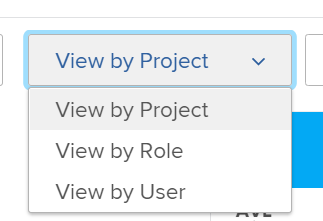

# Información general sobre navegación del planificador de recursos

Con el planificador de recursos de Adobe Workfront, puede comprender fácilmente la disponibilidad de sus recursos, así como el tiempo planificado necesario para completar el trabajo en sus proyectos. A continuación, puede administrar la asignación de los usuarios y sus funciones de trabajo en los proyectos a los que estén asignados.

>[!TIP]
>
>No puede administrar la asignación de equipos en las tareas asignadas en el Planificador de recursos.

Debe cumplir los requisitos previos necesarios para utilizar completamente el planificador de recursos. Para obtener más información acerca del planificador de recursos, consulte [Información general del planificador de recursos](../../resource-mgmt/resource-planning/get-started-resource-planner.md).

Las secciones siguientes resumen todas las áreas del Planificador de Recursos.

## Cronología de los proyectos

Utilice el calendario de la parte superior del planificador de recursos para desplazarse por la cronología de los proyectos que está viendo. La cronología comienza con el mes de hoy, de forma predeterminada.\
Para obtener más información sobre cómo cambiar el intervalo de tiempo de la cronología que se muestra en el Planificador de recursos, consulte la sección [Selección de intervalo de tiempo](#timeframe-selection) en este artículo.

## Selección de intervalo de tiempo  {#timeframe-selection}

De forma predeterminada, el planificador de recursos muestra la información de recursos durante tres o cuatro meses a la vez, a partir del mes actual. El número de períodos de tiempo mostrados depende del ancho de la pantalla.

>[!TIP]
>
>No puede mostrar más de cuatro períodos de tiempo a la vez en el Planificador de recursos.

Para navegar por la línea de tiempo:

1. Haga clic en las flechas hacia atrás y hacia adelante para moverse hacia atrás y hacia adelante en la cronología.
1. Seleccione entre las siguientes opciones de intervalo de fechas del Planificador de recursos haciendo clic en los botones correspondientes:

   <table style="table-layout:auto"> 
    <col> 
    <col> 
    <tbody> 
     <tr> 
      <td role="rowheader">Semana</td> 
      <td>Muestra información por semana. El número de la semana aparece junto a las fechas en el encabezado de la columna. </td> 
     </tr> 
     <tr> 
      <td role="rowheader">Mes</td> 
      <td> Muestra información por mes.</td> 
     </tr> 
     <tr> 
      <td role="rowheader">Trimestre</td> 
      <td>Muestra información por trimestre. El número del trimestre aparece junto a las fechas en el encabezado de la columna. Los trimestres personalizados no se muestran en el planificador de recursos. </td> 
     </tr> 
     <tr> 
      <td role="rowheader">Hoy</td> 
      <td>Devuelve al mes, la semana o el trimestre de hoy.</td> 
     </tr> 
    </tbody> 
   </table>

## Proyecto/ Función/ Selección de vista de usuario

Puede cambiar la vista en el Planificador de recursos en función de cómo desee que se muestre la información.

De forma predeterminada, el Planificador de recursos se muestra en la Vista de usuario. Puede cambiar la vista a Proyecto o a Vistas de funciones. Cuando lo cambia a otra vista, su opción se convierte en la vista predeterminada.

Al cambiar la vista, también cambia la siguiente información:

* La jerarquía de objetos (información en las filas del planificador de recursos).
* La información de asignación por hora (información en las columnas del Planificador de recursos).

   Para obtener más información sobre qué muestran las columnas en el Planificador de recursos en función de la vista seleccionada, consulte [Revisar la disponibilidad y asignación de recursos con el planificador de recursos de Adobe Workfront](../../resource-mgmt/resource-planning/resource-availability-allocation-resource-planner.md).

Para mostrar información precisa en el planificador de recursos, debe cumplir un conjunto de requisitos previos. Para obtener más información sobre los requisitos previos, consulte la sección &quot;Requisitos previos para trabajar en el planificador de recursos&quot; en la sección [Información general del planificador de recursos](../../resource-mgmt/resource-planning/get-started-resource-planner.md) artículo.  Para cambiar la vista en el Planificador de recursos:

1. Vaya a la **Planificador de recursos**.\
   Para obtener más información sobre el acceso al planificador de recursos, consulte la [Localizar el planificador de recursos](../../resource-mgmt/resource-planning/get-started-resource-planner.md#accessing-the-resource-planner) en la sección [Información general del planificador de recursos](../../resource-mgmt/resource-planning/get-started-resource-planner.md) artículo.

1. En el **Ver por** en el menú desplegable, seleccione una de las siguientes vistas:

   * [Ver por proyecto](#view-by-project)
   * [Ver por rol](#view-by-role)
   * [Ver por usuario](#view-by-user)

### Ver por proyecto {#view-by-project}

Tenga en cuenta lo siguiente al seleccionar la vista del proyecto en el Planificador de recursos:

* Puede ver los proyectos para los que tiene permisos al menos.
* Cuando accede al Planificador de recursos por primera vez, puede ver los proyectos filtrados por el Filtro predeterminado.\
   Para obtener más información sobre el filtrado de información en el planificador de recursos, consulte [Filtrar información en el planificador de recursos](../../resource-mgmt/resource-planning/filter-resource-planner.md).

* El número de elementos que se muestran o que se pueden exportar desde la vista de proyecto es limitado para mejorar el rendimiento.\
   Para obtener más información sobre las limitaciones al ver el Planificador de recursos en la Vista de proyecto, consulte la [Limitaciones en la vista de proyecto](../../resource-mgmt/resource-planning/resource-planner-display-limitations.md#project-view-limits) en la sección [Limitaciones de visualización del Planificador de recursos](../../resource-mgmt/resource-planning/resource-planner-display-limitations.md) artículo.

* Los proyectos se muestran en el orden de prioridad en la vista de proyecto.\
   Para obtener más información sobre la prioridad del proyecto en el planificador de recursos, consulte la [Prioridad de Planificación de Proyectos](#project-planning-priority) en este artículo.

* A medida que expande cada proyecto, puede mostrar las funciones de trabajo asociadas a él.\
   A medida que expande cada función, puede mostrar los usuarios asociados a ella.\
   Desplácese para cargar más funciones y usuarios en cada proyecto.

* Cuando se aplica esta vista, las horas de función, los FTE o el coste se suman a las horas, los FTE o el coste del proyecto.\
   

* En la vista Proyecto puede ver la siguiente hora, los datos a tiempo completo o la información de Coste:

   * Disponible
   * Planificados
   * Presupuestado
   * Desviación
   * Neto

      Para obtener más información, consulte [Recursos presupuestarios en el planificador de recursos utilizando las vistas Proyecto y Función](../../resource-mgmt/resource-planning/budget-resources-project-role-views-resource-planner.md).

### Ver por rol {#view-by-role}

Tenga en cuenta lo siguiente al seleccionar la vista de funciones en el Planificador de recursos:

* Debe tener al menos acceso Ver a la Administración de recursos y ver los permisos de los proyectos para ver las funciones asociadas a esos proyectos.
* Puede expandir cada función para mostrar una lista de proyectos y cada proyecto para mostrar una lista de usuarios que pueden desempeñar esas funciones en los proyectos.
* El número de elementos que se muestran o que se pueden exportar desde la vista de funciones es limitado para mejorar el rendimiento.\
   Para obtener más información sobre las limitaciones al ver el Planificador de recursos en la Vista de funciones, consulte la [Limitaciones en la vista de funciones](../../resource-mgmt/resource-planning/resource-planner-display-limitations.md#role-view-limits) en [Limitaciones de visualización del Planificador de recursos](../../resource-mgmt/resource-planning/resource-planner-display-limitations.md) .

* Los proyectos se muestran en la función de trabajo en el mismo orden de prioridad que en la vista de proyecto.
* Cuando se aplica esta vista, las horas del proyecto, los FTE o el coste se suman a las horas de función, los FTE o el coste.\
   

* Puede ver la siguiente hora, datos a tiempo completo o información de costes en la vista Función:

   * Disponible
   * Planificados
   * Presupuestado
   * Desviación
   * Neto

      Para obtener más información, consulte [Recursos presupuestarios en el planificador de recursos utilizando las vistas Proyecto y Función](../../resource-mgmt/resource-planning/budget-resources-project-role-views-resource-planner.md).

### Ver por usuario {#view-by-user}

Puede mostrar el Planificador de recursos en la Vista de usuario para comprender la diferencia entre el horario planificado y el horario disponible o el tiempo disponible para los usuarios, o para ver la cantidad de horas reales que han registrado.

Los recursos no se pueden presupuestar al aplicar la vista de usuario al planificador de recursos. Debe presupuestar los recursos mediante las vistas Proyecto o Función, y utilizar la vista Usuario para revisar la asignación y disponibilidad de los usuarios en relación con el trabajo planificado.* *

La vista de usuario es la vista predeterminada del planificador de recursos.

Tenga en cuenta lo siguiente al seleccionar la Vista del usuario en el Planificador de recursos:

* Puede ver todos los usuarios a los que tiene permisos para ver, hasta 2000 usuarios, que están activos y que han iniciado sesión en Adobe Workfront al menos una vez.\
   Filtre la lista de usuarios por equipo, función de trabajo o grupos para ver los usuarios asociados únicamente a esas entidades.
* Si ha filtrado la lista de usuarios por proyectos, solo se pueden expandir los usuarios asociados con los proyectos filtrados y también mostrar la información de la hora.\
   Para obtener más información sobre el filtrado de información en el planificador de recursos, consulte [Filtrar información en el planificador de recursos](../../resource-mgmt/resource-planning/filter-resource-planner.md) .

* El número de elementos que se muestran o que se pueden exportar desde la vista de usuario es limitado, para mejorar el rendimiento.\
   Para obtener más información sobre las limitaciones al ver el Planificador de recursos en la Vista de usuario, consulte la [Limitaciones en la vista de usuario](../../resource-mgmt/resource-planning/resource-planner-display-limitations.md#user-view-limits) en [Limitaciones de visualización del Planificador de recursos](../../resource-mgmt/resource-planning/resource-planner-display-limitations.md) .

* Los proyectos se enumeran con el nombre del usuario en el mismo orden de prioridad que se muestran en la vista del proyecto.\
   Para obtener más información sobre la prioridad del proyecto en el planificador de recursos, consulte la [Prioridad de Planificación de Proyectos](#project-planning-priority) en este artículo.

* Si los usuarios no tienen ninguna función de trabajo asociada a ellos, los valores de horas o de tiempo libre se enumeran en la sección **Sin función** para obtener más información.
* Cuando se aplica esta vista, las horas del proyecto o FTE se suman al horario del usuario o a FTE.

   >[!TIP]
   >
   >No puede mostrar la asignación y disponibilidad de los usuarios por Coste en la Vista de usuario.

* Los permisos para proyectos y tareas determinan lo que se muestra bajo los nombres de los usuarios que ve en la Vista de usuario.\
   Existen los siguientes escenarios:

   * Cuando no tiene permisos para ver proyectos y las tareas o problemas asignados a los usuarios mostrados en el Planificador de recursos, esos elementos se enumeran en el **Elementos inaccesibles** secciones. La variable **Elementos inaccesibles** en este caso, las secciones de proyecto o tarea sustituyen a las secciones de proyecto o tarea.

   * Cuando no tiene permisos para ver los proyectos, pero tiene acceso para ver las tareas o los problemas de los proyectos, los proyectos, las tareas y los problemas se enumeran con los nombres de los usuarios asignados a ellos.
   * Cuando tiene permisos para ver los proyectos, pero no para ninguna tarea o problema en los proyectos, se muestra el nombre del proyecto y las tareas y los problemas se enumeran en la sección **Elementos inaccesibles** para obtener más información.\
      Para obtener más información sobre los permisos en Workfront, consulte [Información general sobre cómo compartir permisos en objetos](../../workfront-basics/grant-and-request-access-to-objects/sharing-permissions-on-objects-overview.md).

      
    

* Puede ver la hora siguiente y la información de FTE en la vista Usuario:

   * Disponible
   * Planificados
   * Real
   * Diferencia entre Planificado y Real
   * Porcentaje de asignación planificada

      Para obtener más información, consulte [Ver las horas disponibles, planificadas y reales o FTE en el Planificador de recursos al utilizar la vista Usuario](../../resource-mgmt/resource-planning/view-hours-fte-user-view-resource-planner.md)

## Nombre del proyecto

Puede ver los siguientes proyectos en el Planificador de recursos:

* Proyectos para los que tiene permisos de al menos vista.

   También debe tener acceso al menos a Ver administración de recursos en el nivel de acceso.

   Para obtener información sobre el acceso necesario para utilizar el planificador de recursos, consulte [Acceso necesario para presupuestar recursos en Adobe Workfront](../../resource-mgmt/resource-planning/access-needed-to-budget-resources.md).

* Proyectos limitados por el filtro aplicado al planificador de recursos.

   Para obtener más información sobre el filtrado de información en el planificador de recursos, consulte [Filtrar información en el planificador de recursos](../../resource-mgmt/resource-planning/filter-resource-planner.md).

   >[!NOTE]
   >
   >Se recomienda utilizar filtros para reducir el número de proyectos que se muestran en el Planificador de recursos.

## Prioridad de Planificación de Proyectos {#project-planning-priority}

Los proyectos se enumeran por orden de prioridad en el Planificador de recursos con el proyecto más importante en la parte superior. La prioridad se indica con un número delante del nombre del proyecto.

También puede habilitar una configuración para mostrar las prioridades del proyecto según sus carteras, cuando estén asociadas a un portafolio. Para obtener información sobre cómo priorizar proyectos y mostrar las prioridades de portafolio en el Planificador de recursos , consulte [Priorizar los proyectos en el planificador de recursos](../../resource-mgmt/resource-planning/prioritize-projects-resource-planner.md).

## Nombre del rol

Las siguientes categorías de funciones de trabajo se enumeran en el Planificador de recursos:

* Las funciones de trabajo asignadas a tareas.
* Las funciones de trabajo que no están asignadas a tareas, sino que son las funciones de trabajo principales de los usuarios asociados a los grupos de recursos de los proyectos.
* Las funciones de trabajo secundarias de los usuarios asignados a tareas en esas funciones de trabajo.
* Las funciones de trabajo secundarias de los usuarios que tienen una **Porcentaje de disponibilidad de FTE** en su perfil.\
   Para obtener más información sobre la variable **Porcentaje de disponibilidad de FTE** para funciones de trabajo, consulte [Edición del perfil de un usuario](../../administration-and-setup/add-users/create-and-manage-users/edit-a-users-profile.md) .

>[!NOTE]
>
>Las funciones de trabajo asignadas a problemas también se enumeran cuando la variable **Incluir horas del problema** está activada. Para obtener más información sobre cómo habilitar las horas de problema en el planificador de recursos, consulte la [Configuración](#settings) para obtener más información.

## Nombre de usuario

Los usuarios enumerados en las vistas Proyecto y Función del Planificador de recursos pertenecen a los grupos de recursos asociados a los proyectos.\
Para obtener más información sobre cómo rellenar grupos de recursos con usuarios, consulte [Asociación de grupos de recursos con usuarios](../../resource-mgmt/resource-planning/resource-pools/associate-resource-pools-with-users.md).

Todos los usuarios a los que tenga acceso a Ver y que hayan iniciado sesión en Workfront al menos una vez aparecen en la Vista de usuario.

En las vistas Proyecto y Función, los usuarios podrían aparecer enumerados bajo los siguientes tipos de funciones de trabajo:

* Su función principal
* Su función de trabajo secundario, en los siguientes escenarios:

   * Si la función de trabajo secundario tiene un número válido para la función **Porcentaje de disponibilidad de FTE** en su perfil de usuario.
   * Si el usuario está asignado a tareas en esas funciones.

Para obtener más información sobre la variable **Porcentaje de disponibilidad de FTE** para una función de trabajo, consulte [Edición del perfil de un usuario](../../administration-and-setup/add-users/create-and-manage-users/edit-a-users-profile.md) .

## Secciones &quot;Sin función&quot; y &quot;Sin usuario&quot;

* [Sección &quot;Sin función&quot;](#no-role-section)
* [Sección &quot;Sin usuario&quot;](#no-user-section)

### Sección &quot;Sin función&quot;  {#no-role-section}

Cuando un usuario pertenece a un grupo de recursos asociado a un proyecto, pero no tiene una función de trabajo asociada a él, aparece en la sección **Sin función** en lugar de en una función de trabajo específica.

No puede presupuestar horas para un usuario en un **Sin función** para obtener más información. El usuario debe tener al menos una función de trabajo asociada para poder presupuestar el trabajo.\

### Sección &quot;Sin usuario&quot;  {#no-user-section}

Cuando asigna una tarea a un equipo o la deja sin asignar, las horas planificadas aparecen en la sección **Sin usuario** que aparece en la sección **Sin función** del Planificador de recursos. Estas tareas no aparecen en el planificador de recursos al usar la variable **Ver por usuario** vista.

Puede ver la cantidad de horas planificadas atribuidas a tareas del proyecto en la variable **Sin usuario** del Planificador de recursos, pero no puede presupuestar estas asignaciones.

 

## Filtros

Con los filtros, puede limitar la información que se muestra en el Planificador de recursos.

Para obtener más información sobre el filtrado en el planificador de recursos, consulte [Filtrar información en el planificador de recursos](../../resource-mgmt/resource-planning/filter-resource-planner.md) .

## Configuración {#settings}

Desde el área Configuración, puede activar o desactivar opciones para mostrar u ocultar información en el Planificador de recursos.

Para habilitar la configuración en el Planificador de recursos:

1. Abra el Planificador de recursos.
1. Haga clic en el **Configuración** icono.

   

   Aparece el cuadro Configuración del planificador de recursos .

   

1. Active la variable **Incluir horas de problemas** configuración para mostrar Horario planeado de problemas en el Planificador de recursos. Esta configuración está deshabilitada de forma predeterminada.

   Tenga en cuenta lo siguiente cuando habilite esta configuración:

   * El nombre del usuario asignado a los problemas se muestra en la función de trabajo asociada a ellos en el problema y puede especificar Horario presupuestado para el usuario y la función de trabajo en las vistas Proyecto y Función.
   * Los problemas a los que se asignan los usuarios se enumeran bajo los nombres de las funciones de trabajo en la vista Usuario.

      >[!IMPORTANT]
      >
      >**Cuando las fechas de inicio y finalización planeadas del problema están fuera de la cronología del proyecto, las horas planificadas para el problema se muestran según las fechas del problema. Por ejemplo, si el cronograma del proyecto se encuentra entre enero y marzo, pero el cronograma de los problemas se encuentra en agosto, las horas previstas para los problemas aparecerán en el período de tiempo de agosto.**

1. (Condicional y opcional) Si ha seleccionado la vista Proyecto, habilite la configuración Mostrar prioridades del Portfolio para mostrar las prioridades del proyecto según el Portfolio al que estén asignadas. La prioridad de los proyectos según sus portafolios se muestra junto a la prioridad Planificador de recursos . Esta configuración está deshabilitada de forma predeterminada.

   Para obtener información sobre cómo priorizar proyectos en el planificador de recursos, consulte [Priorizar los proyectos en el planificador de recursos](../../resource-mgmt/resource-planning/prioritize-projects-resource-planner.md).

## Opción de pantalla completa

Puede mostrar el Planificador de recursos en pantalla completa para ampliar la cantidad de información que puede ver en la pantalla.

La opción para ver información en pantalla completa está disponible para todas las vistas del Planificador de recursos.

Para mostrar el Planificador de recursos en pantalla completa:

1. Vaya a la **Planificador de recursos**.
1. Haga clic en el **Icono de pantalla completa** para ver el Planificador de recursos en pantalla completa.\
   \
   El planificador de recursos se expande para ocupar toda la ventana del explorador y el icono cambia a un **Cerrar la pantalla completa** vista.

1. (Opcional) Haga clic en el **Icono Cerrar pantalla completa** para volver a la visualización anterior.

## Opción Exportar

Puede exportar información a un archivo de Excel (.xlsx) desde cualquier vista del Planificador de recursos.\
Para obtener información sobre la exportación de información desde el planificador de recursos, consulte [Exportar información del planificador de recursos](../../resource-mgmt/resource-planning/export-resource-planner.md).

Puede administrar la cantidad de información y la visualización del archivo exportado.\
Para obtener información sobre qué información se puede exportar desde el planificador de recursos y cómo administrar el aspecto del archivo exportado, consulte [Limitaciones de visualización del Planificador de recursos](../../resource-mgmt/resource-planning/resource-planner-display-limitations.md).
