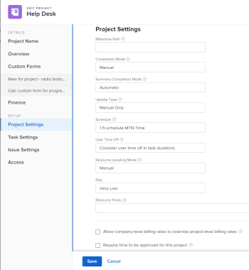

# Asociación de grupos de recursos con proyectos y plantillas

<!-- drafted for bulk editing projects: keep this in yellow till this releases to ALL customers - May 1, 2023

Also - take out all the references to Preview and Prod at prod final
-->

<!--The highlighted information on this page refers to functionality not yet generally available. It is available for all customers in the Preview environment and for a select group of customers in the Production environment.-->

<!--

The sections about how to add resource pools to templates, projects are duplicated from the articles listed in those sections (Editing Projects, Creating a Template, etc).

***I decided to keep these steps here, though, because it's hard to parse through those much lunger articles for just updating this one field.)

-->

Los grupos de recursos son colecciones de usuarios que ayudan a administrar los recursos en Adobe Workfront.

Una vez creados los grupos de recursos, puede asociarlos con proyectos o plantillas para posteriormente presupuestar los recursos en los proyectos.

Se recomienda crear los grupos de recursos con antelación, asociarlos a los proyectos y presupuestar los recursos antes de que se inicie el proyecto.

Para obtener información sobre los grupos de recursos, consulte [Resumen de los grupos de recursos](../../../resource-mgmt/resource-planning/resource-pools/work-with-resource-pools.md).

Para obtener información sobre la creación de grupos de recursos, consulte [Crear grupos de recursos](../../../resource-mgmt/resource-planning/resource-pools/create-resource-pools.md).

## Requisitos de acceso

Debe tener lo siguiente:

<table style="table-layout:auto"> 
 <col> 
 <col> 
 <tbody> 
  <tr> 
   <td role="rowheader">plan de Adobe Workfront*</td> 
   <td> 
Pro y superior
 </td> 
  </tr> 
  <tr> 
   <td role="rowheader">Licencia de Adobe Workfront*</td> 
   <td> 
Plan 
 </td> 
  </tr> 
  <tr> 
   <td role="rowheader">Configuraciones de nivel de acceso*</td> 
   <td> 
Editar el acceso a la Administración de recursos que incluye el acceso a Administrar grupos de recursos
 
Editar acceso a Proyectos, Plantillas y Usuarios
 
Nota: Si todavía no tiene acceso, pregunte a su administrador de Workfront si establece restricciones adicionales en su nivel de acceso. Para obtener información sobre cómo un administrador de Workfront puede cambiar su nivel de acceso, consulte <a href="../../../administration-and-setup/add-users/configure-and-grant-access/create-modify-access-levels.md" class="MCXref xref">Crear o modificar niveles de acceso personalizados</a>.
 </td> 
  </tr> 
  <tr data-mc-conditions=""> 
   <td role="rowheader">Permisos de objeto</td> 
   <td> 
Administre permisos para los proyectos, plantillas y usuarios con los que asocia los grupos de recursos
 
Para obtener información sobre la solicitud de acceso adicional, consulte <a href="../../../workfront-basics/grant-and-request-access-to-objects/request-access.md" class="MCXref xref">Solicitar acceso a objetos </a>.
 </td> 
  </tr> 
 </tbody> 
</table>

&#42;Para saber qué plan, tipo de licencia o acceso tiene, póngase en contacto con el administrador de Workfront.

## Asociar grupos de recursos con un proyecto o plantilla

Puede asociar grupos de recursos con una plantilla de la misma manera que asocia los grupos de recursos con un proyecto. En este artículo se describe cómo puede asociar grupos de recursos con proyectos.

1. Vaya a un proyecto y haga clic en el **Más** icono junto al nombre del proyecto y, a continuación, haga clic en **Editar**.

1. Haga clic en **Configuración del proyecto**.

1. Empiece a escribir el nombre de un grupo de recursos en la **Grupos de recursos** y, a continuación, selecciónelo en la lista cuando aparezca.\
   Puede asociar varios grupos de recursos con un proyecto o plantilla.

   

1. Haga clic en **Guardar**.

Para obtener más información sobre cómo editar un proyecto y asociarlo a grupos de recursos, consulte [Editar proyectos](../../../manage-work/projects/manage-projects/edit-projects.md).

Para obtener más información sobre cómo editar una plantilla y asociarla a grupos de recursos, consulte [Editar plantillas de proyecto](../../../manage-work/projects/create-and-manage-templates/edit-templates.md).

## Asociar grupos de recursos con varios proyectos o plantillas de forma masiva

Puede editar varios proyectos o plantillas de forma masiva y asociar los mismos grupos de recursos con todos ellos al mismo tiempo.

Puede asociar grupos de recursos con plantillas del mismo modo que asocia grupos de recursos con proyectos.

Para asociar grupos de recursos con varios proyectos en masa:

1. Vaya a una lista de proyectos.
1. Seleccione varios proyectos y haga clic en el botón **Editar** icono  en la parte superior de la lista.

1. Haga clic en **Configuración**.
1. Empiece a escribir el nombre de un grupo de recursos en la **Grupos de recursos** y, a continuación, selecciónelo en la lista cuando aparezca.\
   Puede asociar varios grupos de recursos con los proyectos o las plantillas.

   >[!NOTE]
   >
   >* Cuando edita plantillas de forma masiva, solo aparecen en este campo los grupos de recursos comunes a todas las plantillas seleccionadas. Si las plantillas seleccionadas no tienen grupos de recursos compartidos, este campo está vacío. Los grupos de recursos que especifique aquí sobrescriben los grupos de recursos individuales de los proyectos o plantillas.
   >
   >* Cuando edita proyectos de forma masiva, aparece un indicador &quot;Valores múltiples&quot; si los proyectos seleccionados tienen grupos de recursos diferentes. Si agrega grupos de recursos de forma masiva para proyectos, todos los grupos se agregan al proyecto seleccionado, sobrescribiendo los grupos de recursos originales.

   

1. Haga clic en **Guardar cambios**.\
   Cuando los grupos de recursos están asociados a sus proyectos o plantillas, puede presupuestar las asignaciones de usuario para sus proyectos dentro del Planificador de recursos.\
   Para obtener más información acerca del planificador de recursos, consulte [Información general del planificador de recursos](../../../resource-mgmt/resource-planning/get-started-resource-planner.md).

Para obtener más información sobre cómo editar proyectos de forma masiva, consulte la sección &quot;Editar proyectos de forma masiva&quot; en [Editar proyectos](../../../manage-work/projects/manage-projects/edit-projects.md).

Para obtener más información sobre cómo editar plantillas de forma masiva, consulte la sección &quot;Editar plantillas de forma masiva&quot; en [Editar plantillas de proyecto](../../../manage-work/projects/create-and-manage-templates/edit-templates.md).
