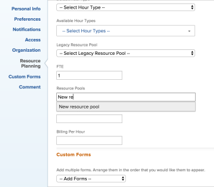

# Asociar conjuntos de recursos a los usuarios

<!--

(NOTE: The info about how to add resource pools to users, are duplicated from the articles listed in those sections (Creating Users, etc). I decided to keep the steps here because those articles are too long to rummage through for updating just this one field.)

-->

Los conjuntos de recursos son colecciones de usuarios que le ayudan a administrar los recursos en Adobe Workfront.

Debe crear un conjunto de recursos para poder asociarlo a los usuarios.

Puede asociar usuarios con conjuntos de recursos al crear los conjuntos de recursos.

Si crea conjuntos de recursos sin rellenarlos con usuarios, más adelante podrá asociarlos a los usuarios mientras edita o crea nuevos usuarios.

Para obtener información acerca de los conjuntos de recursos, consulte [Información general de los conjuntos de recursos](../../../resource-mgmt/resource-planning/resource-pools/work-with-resource-pools.md).

Para obtener información acerca de cómo crear conjuntos de recursos, consulte [Crear conjuntos de recursos](../../../resource-mgmt/resource-planning/resource-pools/create-resource-pools.md).

## Requisitos de acceso

+++ Expanda para ver los requisitos de acceso para la funcionalidad en este artículo.

<table style="table-layout:auto"> 
 <col> 
 <col> 
 <tbody> 
  <tr> 
   <td>Paquete de Adobe Workfront</td> 
   <td>
Cualquiera
</td> 
  </tr> 
  <tr> 
   <td>Licencia de Adobe Workfront</td> 
   <td>
Estándar

   
Plan
</td>
  </tr> 
  <tr> 
   <td>Configuraciones de nivel de acceso</td> 
   <td> 
Editar el acceso a la administración de recursos, que incluye el acceso a la administración de conjuntos de recursos
 
Editar acceso a proyectos, plantillas y usuarios
</td> 
  </tr> 
  <tr> 
   <td>Permisos de objeto</td> 
   <td>Administre permisos para los proyectos, plantillas y usuarios con los que desee asociar los conjuntos de recursos</td> 
  </tr> 
 </tbody> 
</table>

Para obtener más información, consulte [Requisitos de acceso en la documentación de Workfront](/help/quicksilver/administration-and-setup/add-users/access-levels-and-object-permissions/access-level-requirements-in-documentation.md).

+++

## Asociar conjuntos de recursos a un usuario

{{step-1-to-users}}

1. Marque la casilla junto al nombre de un usuario en la lista y luego haga clic en **Editar**.
1. Haga clic en **Planificación de recursos**.
1. Escriba el nombre de un conjunto de recursos que desee asociar con el usuario en el campo **Conjuntos de recursos** y, a continuación, selecciónelo en la lista cuando aparezca.\
   Puede asociar varios conjuntos de recursos a un usuario.\
   

1. Haga clic en **Guardar cambios**.

Para obtener más información sobre cómo editar usuarios, consulte [Editar el perfil de un usuario](../../../administration-and-setup/add-users/create-and-manage-users/edit-a-users-profile.md).

Para obtener más información sobre cómo crear usuarios nuevos, consulte [Añadir usuarios](../../../administration-and-setup/add-users/create-and-manage-users/add-users.md).

## Asociar conjuntos de recursos a usuarios de forma masiva

Puede editar varios usuarios de forma masiva y asociar los mismos conjuntos de recursos a todos ellos al mismo tiempo.

Para asociar conjuntos de recursos a varios usuarios de forma masiva:

{{step-1-to-users}}

1. Seleccione varios usuarios en la lista y haga clic en **Editar**.
1. Haga clic en **Planificación de recursos**.
1. Escriba el nombre de un conjunto de recursos que desee asociar con los usuarios en el campo **Conjuntos de recursos** y, a continuación, selecciónelo en la lista cuando aparezca.\
   Puede asociar varios conjuntos de recursos a varios usuarios.

   >[!NOTE]
   >
   >En este campo solo aparecen los conjuntos de recursos que son comunes a todos los usuarios seleccionados. Si los usuarios seleccionados no tienen conjuntos de recursos compartidos, este campo está vacío. Si este campo está vacío, los conjuntos de recursos que especifique aquí sobrescribirán sus conjuntos de recursos individuales.

1. Haga clic en **Guardar cambios**.

Para obtener más información sobre cómo editar usuarios de forma masiva, consulte [Editar perfiles de usuario de forma masiva](../../../administration-and-setup/add-users/create-and-manage-users/edit-user-profiles-in-bulk.md).
