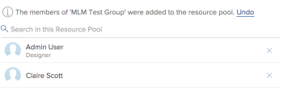

# Crear grupos de recursos

Los grupos de recursos son conjuntos de usuarios que ayudan a administrar los recursos con mayor facilidad en Adobe Workfront. Para obtener más información sobre los grupos de recursos, consulte [Resumen de los grupos de recursos](../../../resource-mgmt/resource-planning/resource-pools/work-with-resource-pools.md).

## Requisitos de acceso

Debe tener lo siguiente:

<table style="table-layout:auto"> 
 <col> 
 <col> 
 <tbody> 
  <tr> 
   <td role="rowheader">plan de Adobe Workfront*</td> 
   <td> 
Pro y superior
 </td> 
  </tr> 
  <tr> 
   <td role="rowheader">Licencia de Adobe Workfront*</td> 
   <td> 
Plan 
 </td> 
  </tr> 
  <tr> 
   <td role="rowheader">Configuraciones de nivel de acceso*</td> 
   <td> 
Editar el acceso a la Administración de recursos que incluye el acceso a Administrar grupos de recursos
 
Editar acceso a Usuarios, Proyectos y Plantillas
 
Nota: Si todavía no tiene acceso, pregunte a su administrador de Workfront si establece restricciones adicionales en su nivel de acceso. Para obtener información sobre cómo un administrador de Workfront puede cambiar su nivel de acceso, consulte <a href="../../../administration-and-setup/add-users/configure-and-grant-access/create-modify-access-levels.md" class="MCXref xref">Crear o modificar niveles de acceso personalizados</a>.
 </td> 
  </tr> 
  <tr data-mc-conditions=""> 
   <td role="rowheader">Permisos de objeto</td> 
   <td> 
Administre permisos para los proyectos y las plantillas con los que desee asociar los grupos de recursos
 
Para obtener información sobre la solicitud de acceso adicional, consulte <a href="../../../workfront-basics/grant-and-request-access-to-objects/request-access.md" class="MCXref xref">Solicitar acceso a objetos </a>.
 </td> 
  </tr> 
 </tbody> 
</table>

&#42;Para saber qué plan, tipo de licencia o acceso tiene, póngase en contacto con el administrador de Workfront.

## Crear un grupo de recursos {#create-a-resource-pool}

1. Inicie sesión como usuario que tiene acceso para editar grupos de recursos.\
   Para obtener más información, consulte [Crear un grupo de recursos](#create-a-resource-pool).

1. Haga clic en el **Menú principal** icono  en la esquina superior derecha de Adobe Workfront.

1. Haga clic en **Recurso**.
1. Haga clic en **Grupos de recursos** en el panel izquierdo.\
   

1. Haga clic en **Nuevo grupo de recursos**.
1. Especifique lo siguiente:

   <table style="table-layout:auto">
    <col>
    <col>
    <tbody>
     <tr>
      <td role="rowheader"><strong>Nombre</strong></td>
      <td>Este es el nombre del grupo de recursos.</td>
     </tr>
     <tr>
      <td role="rowheader"><strong>Descripción</strong></td>
      <td>Esta es una breve descripción de este grupo de recursos. Por ejemplo, puede especificar para qué propósito debe utilizarse.</td>
     </tr>
     <tr>
      <td role="rowheader"><strong>Miembros del conjunto</strong></td>
      <td>
 Agregue usuarios al grupo de recursos individualmente. O  Para agregar una gran cantidad de usuarios al grupo de recursos al mismo tiempo. Puede agregar una de las siguientes entidades asociadas con usuarios o con una colección de usuarios:
        <ul>
         <li><strong>Equipos</strong>: todos los miembros del equipo se agregan al grupo de recursos.</li>
         <li><strong>Grupos</strong>: todos los miembros del grupo se agregan al grupo de recursos.</li>
         <li><strong>Funciones</strong>: todos los usuarios asociados a esa función se agregan al grupo de recursos.</li>
         <li><strong>Compañías</strong>: todos los usuarios de la empresa se agregan al grupo de recursos.</li>
        </ul>
Sugerencia: Solo puede agregar usuarios activos, equipos y funciones, o empresas.

Nota: Si un usuario se convierte en miembro de un grupo, equipo, empresa o está asociado con una función de trabajo después de que el grupo, el equipo, la empresa o la función de trabajo se hayan agregado al grupo de recursos, el nuevo miembro no se agregará automáticamente al grupo de recursos.  Si un usuario pertenece al equipo, grupo, empresa y función de trabajo que está agregando, al mismo tiempo, el usuario se agrega una sola vez al grupo de recursos. Los usuarios que se desactivan después de haberse agregado al grupo de recursos aparecen atenuados en la lista de usuarios y marcados como desactivados.

</td>
     </tr>
    </tbody>
   </table>

1. (Opcional) Use la **Deshacer** para eliminar los usuarios agregados a través de un grupo, equipo, empresa o función de trabajo.

   >[!NOTE]
   >
   >No hay límite para cuántos usuarios puede tener en un grupo de recursos. Sin embargo, recomendamos no agregar demasiados usuarios a un grupo de recursos, ya que la administración de recursos podría convertirse en un desafío de lo contrario. La lista de usuarios solo muestra los 2000 primeros usuarios del grupo de recursos y se enumeran alfabéticamente.

   

1. (Opcional) Haga clic en el icono X a la derecha del nombre de un usuario para eliminarlo. Para obtener más información sobre cómo quitar usuarios de un grupo de recursos, consulte [Eliminar usuarios de grupos de recursos](../../../resource-mgmt/resource-planning/resource-pools/remove-users-from-resource-pool.md).
1. (Opcional) Use la **Buscar** para encontrar un usuario en el grupo de recursos.
1. Haga clic en **Crear**.
