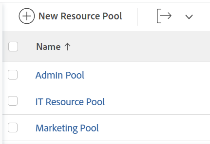
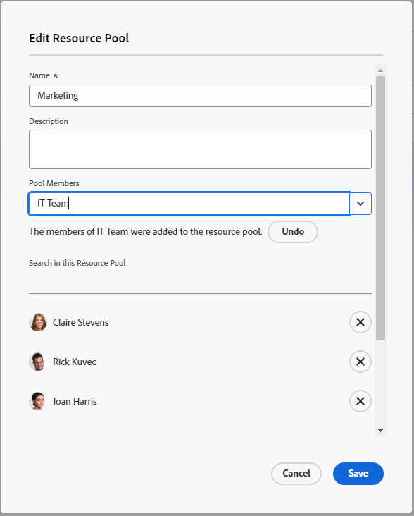

# Crear conjuntos de recursos {#create-resource-pools}

>[!CONTEXTUALHELP]
>id="wf_resource_pools"
>title="Conjuntos de recursos"
>abstract="Un conjunto de recursos es una colección de usuarios que se necesitan al mismo tiempo para la finalización de un proyecto. Después de crear un conjunto de recursos, puede asociarlo a proyectos y plantillas."

Los conjuntos de recursos son conjuntos de usuarios que ayudan a administrar recursos con mayor facilidad en Adobe Workfront. Para obtener más información acerca de los conjuntos de recursos, consulte [Información general sobre los conjuntos de recursos](../../../resource-mgmt/resource-planning/resource-pools/work-with-resource-pools.md).

## Requisitos de acceso

+++ Expanda para ver los requisitos de acceso para la funcionalidad en este artículo.

<table style="table-layout:auto"> 
 <col> 
 <col> 
 <tbody> 
  <tr> 
   <td>Paquete de Adobe Workfront</td> 
   <td>
Cualquiera
</td> 
  </tr> 
  <tr> 
   <td>Licencia de Adobe Workfront</td> 
   <td>
Estándar

   
Plan
</td>
  </tr> 
  <tr> 
   <td>Configuraciones de nivel de acceso</td> 
   <td> 
Editar el acceso a la administración de recursos, que incluye el acceso a la administración de conjuntos de recursos
 
Editar acceso a proyectos, plantillas y usuarios
</td> 
  </tr> 
  <tr> 
   <td>Permisos de objeto</td> 
   <td>Administre permisos para los proyectos, plantillas y usuarios con los que desee asociar los conjuntos de recursos</td> 
  </tr> 
 </tbody> 
</table>

Para obtener más información, consulte [Requisitos de acceso en la documentación de Workfront](/help/quicksilver/administration-and-setup/add-users/access-levels-and-object-permissions/access-level-requirements-in-documentation.md).

+++

## Crear un conjunto de recursos {#create-a-resource-pool}

{{step1-to-resourcing}}

1. Haga clic en **Conjuntos de recursos** en el panel de la izquierda.
1. Haga clic en **Nuevo conjunto de recursos**.

   

1. Especifique lo siguiente:

   <table style="table-layout:auto">
    <col>
    <col>
    <tbody>
     <tr>
      <td role="rowheader"><strong>Nombre</strong></td>
      <td>Este es el nombre del conjunto de recursos.</td>
     </tr>
     <tr>
      <td role="rowheader"><strong>Descripción</strong></td>
      <td>Esta es una breve descripción sobre este conjunto de recursos. Por ejemplo, especifique para qué propósito se debería utilizar.</td>
     </tr>
     <tr>
      <td role="rowheader"><strong>Miembros del conjunto</strong></td>
      <td>
 Agregar usuarios al conjunto de recursos individualmente. O  Para agregar una gran cantidad de usuarios al conjunto de recursos al mismo tiempo. Puede agregar una de las siguientes entidades asociadas con usuarios o una colección de usuarios:
        <ul>
         <li><strong>Equipos</strong>: todos los miembros del equipo se añaden al conjunto de recursos.</li>
         <li><strong>Grupos</strong>: todos los miembros del grupo se añaden al conjunto de recursos.</li>
         <li><strong>Funciones</strong>: todos los usuarios asociados con esa función se añaden al conjunto de recursos.</li>
         <li><strong>Compañías</strong>: todos los usuarios de la compañía se añaden al conjunto de recursos.</li>
        </ul>
Sugerencia: solo es posible añadir usuarios, equipos, funciones o compañías activos.
 Es posible que tenga que desplazarse hacia abajo en el cuadro de diálogo para ver a todos los usuarios del conjunto de recursos.
        
Nota: si un usuario se convierte en miembro de un grupo, equipo, empresa o estuviera asociado a una función después de que el grupo, equipo, empresa o función se añadieran al conjunto de recursos, el nuevo miembro no se añadirá automáticamente al conjunto de recursos.  Si un usuario pertenece al equipo, grupo, compañía y rol que está agregando, al mismo tiempo, el usuario se agrega una sola vez al conjunto de recursos. Los usuarios que se desactivan después de haberse agregado al conjunto de recursos aparecen atenuados en la lista de usuarios y se marcan como desactivados.

</td>
     </tr>
    </tbody>
   </table>

1. (Opcional) Use el vínculo **Deshacer** para quitar a los usuarios añadidos mediante grupos, equipos, compañías o funciones.

   >[!NOTE]
   >
   >No hay límite en cuanto a la cantidad de usuarios que se pueden tener en un conjunto de recursos. Sin embargo, se recomienda no añadir demasiados usuarios a un conjunto de recursos, ya que de lo contrario la administración de recursos se convertiría en un desafío. La lista de usuarios solo muestra los 2000 primeros usuarios del conjunto de recursos y se enumeran alfabéticamente.

   

1. (Opcional) Haga clic en el icono de la X de la derecha del nombre de un usuario para eliminarlo. Para obtener más información acerca de cómo quitar usuarios de un conjunto de recursos, consulte [Quitar usuarios de conjuntos de recursos](../../../resource-mgmt/resource-planning/resource-pools/remove-users-from-resource-pool.md).
1. (Opcional) Use la opción **Buscar** para encontrar a usuarios del conjunto de recursos.
1. Haga clic en **Crear**.
