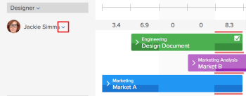
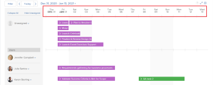

# Introducción a la programación de recursos

>[!IMPORTANT]
>  
>La funcionalidad Programación descrita en este artículo se ha desaprobado y eliminado de Adobe Workfront a partir de la versión 23.1 de enero de 2023.   
>  
>  Este artículo también se eliminará poco después de la versión 23.1, a principios de 2023. En este momento, le recomendamos que actualice los marcadores según corresponda. 
> 
> Ahora puede utilizar el equilibrador de carga de trabajo para programar el trabajo para sus recursos. 
>  
> Para obtener información sobre la programación de recursos mediante el equilibrador de carga de trabajo, consulte la sección [El equilibrador de carga de trabajo](../../resource-mgmt/workload-balancer/workload-balancer.md). 

<!--  

>[!CAUTION] 
> 
> 
> The information in this article refers to the Adobe Workfront's Scheduling tools. The Scheduling areas have been removed from the Preview environment and will be removed from the Production environment in **January 2023**.   
>  Instead, you can schedule resources in the Workload Balancer.  
> 
>*  For information about scheduling resources using the Workload Balancer, see the section [The Workload Balancer](../../resource-mgmt/workload-balancer/workload-balancer.md). 
> 
>*  For more information about the deprecation and removal of the Scheduling tools, see [Deprecation of Resource Scheduling tools in Adobe Workfront](../../resource-mgmt/resource-mgmt-overview/deprecate-resource-scheduling.md). 
-->

<!--

(NOTE: LINKED TO THE PRODUCT FROM: ALL SCHEDULING TOOLS: GLOBAL, TEAM, PROJECT STAFFING *** LINKED TO LOTS OF ARTICLES, AS WELL!) 

(NOTE: Alina: this article should be divided in multiple articles, but CAREFULLY because some sections are linked to the UI)

-->

Al utilizar la funcionalidad de programación de recursos en Adobe Workfront, puede asignar tareas y problemas a los usuarios adecuados con mayor facilidad. Puede determinar qué usuarios son capaces de completar la tarea o el problema, teniendo en cuenta tanto la función del trabajo como la disponibilidad del usuario.

Las secciones siguientes proporcionan más detalles sobre el uso de las áreas de programación en Workfront.

## Requisitos previos para utilizar las herramientas de programación en Workfront

>[!IMPORTANT]
>
>Los requisitos previos documentados en este artículo solo se aplican a las áreas de programación de Workfront. Para obtener información sobre las prácticas recomendadas para utilizar el equilibrador de carga de trabajo, consulte [Información general del equilibrador de carga de trabajo](../../resource-mgmt/workload-balancer/overview-workload-balancer.md).

Para utilizar correctamente la funcionalidad de programación de recursos en Workfront, primero debe asegurarse de que usted, sus proyectos y sus tareas y problemas cumplan los siguientes requisitos previos:

* [Requisitos previos de usuario](#user-prerequisites)
* [Requisitos previos del proyecto](#project-prerequisites)
* [Requisitos previos de tarea y problema](#task-and-issue-prerequisites)

### Requisitos previos de usuario {#user-prerequisites}

Puede utilizar las herramientas de programación de recursos disponibles desde la pestaña Scheduling , desde la pestaña Staffing o desde la pestaña Working On cuando se cumple cada una de las siguientes condiciones:

**Al programar los recursos como gestor de recursos (en la pestaña Scheduling ):**

* Se le designa como Administrador de recursos para los proyectos para los que desea administrar recursos.

   Para obtener más información sobre la designación de administradores de recursos para un proyecto, consulte el artículo [Designar gestores de recursos para un proyecto o plantilla](../../manage-work/projects/planning-a-project/designate-resource-managers-for-projects-and-templates.md).

* Usted es un usuario con una licencia de Plan.

De forma predeterminada, los usuarios se muestran en la cronología de la programación solo cuando tienen una función de trabajo definida en el sistema (la función de trabajo principal o una función de trabajo secundaria) y esa función de trabajo coincide con la función de trabajo asignada a una tarea o problema que actualmente está visible en la **No asignado** en la línea de tiempo de programación. Puede deshabilitar esta funcionalidad para permitir que se asignen tareas y problemas a cualquier usuario, independientemente de si ese usuario tiene una función definida en su perfil de usuario que coincida con la asignación de funciones de la tarea o el problema que se les está asignando. Para obtener más información, consulte el artículo [Permitir asignaciones de usuarios independientemente de la función y la pertenencia a grupos en las áreas de programación](../../resource-mgmt/resource-scheduling/assignments-regardless-of-role-or-group-scheduling-areas.md).

De forma predeterminada, las asignaciones solo se pueden realizar a usuarios que tengan una función definida en su perfil de usuario que coincida con la asignación de funciones de la tarea o problema que se les está asignando.

**Al programar los recursos como miembro del equipo del proyecto (desde la pestaña Dotación de personal de un proyecto):**

* Tiene permisos para Ver, Contribuir o Administrar el proyecto
* Tiene una licencia de plan o trabajo

<!--
<note type="note">  If Workfront has not removed the Use New Scheduling Area option from your Scheduling settings, users must have a Plan license and Manage permissions to the project to view the Scheduling timeline. For more information about the removal of the Use New Scheduling Area option, see the article
<a href="../../product-announcements/announcements/announcement-archive/replace-flash-tools.md" class="MCXref xref">Replacement of Flash-based tools in Adobe Workfront</a>.
</note>
-->

**Al programar los recursos como miembro del equipo (en la pestaña Trabajar en ):**

* Es miembro del equipo\
   Todos los miembros del equipo se muestran en la cronología de la programación. Las tareas y los problemas que están asignados al equipo y no están asignados a un usuario se muestran en el área Sin asignar . Las tareas y los problemas asignados al equipo y a un usuario del equipo se muestran en la fila del usuario al que están asignados.

### Requisitos previos del proyecto {#project-prerequisites}

Los requisitos previos del proyecto que se describen en esta sección solo se aplican cuando se programan recursos como administrador de recursos desde la cronología de programación.

Los proyectos que administra deben estar en uno de los siguientes estados (o en un estado que coincida con uno de estos estados) para que los elementos de trabajo de esos proyectos se muestren en la cronología de la programación: Planificación, Actual o Aprobado. De forma predeterminada, solo se muestran los proyectos con el estado Actual.

Para obtener más información sobre los estados del proyecto, consulte el artículo [Crear o editar un estado](../../administration-and-setup/customize-workfront/creating-custom-status-and-priority-labels/create-or-edit-a-status.md).

<!--

(NOTE: [! I assume this doesn't apply when using the Staffing tab on a single project? The project can be in whatever status?]) 

-->

### Requisitos previos de tarea y problema {#task-and-issue-prerequisites}

Para ser más eficaz al utilizar las herramientas de programación de recursos en Workfront, asegúrese de que las tareas y los problemas del sistema tengan los siguientes criterios definidos:

* Duraciones
* Fechas de inicio planificadas
* Horas planificadas\
   Se requieren horas planificadas para modificar las asignaciones de usuario, tal como se describe en el artículo [Administrar asignaciones de usuario en las áreas de programación](../../resource-mgmt/resource-scheduling/manage-allocations-scheduling-areas.md).

   >[!NOTE]
   >
   >El campo Horario planificado de la tarjeta Programación de recursos muestra la suma de todos los valores de workPerDay, no las horas planificadas de la tarea. los valores de workPerDay se calculan dividiendo el valor de horas planificadas por la duración de la tarea. En el caso de duraciones distintas de cero, los valores generalmente coinciden con las horas planificadas de la tarea, aunque podrían producirse algunas pequeñas discrepancias debidas al redondeo. Cuando una duración es 0 días, la opción Horas planificadas muestra 0 horas.

* Asignaciones de funciones

## Ver información en las áreas de programación

* [Localizar y ver información en las áreas de programación](#locate-and-view-information-in-the-scheduling-areas)
* [Ver asignaciones de recursos y detalles](#view-resource-assignments-and-details)
* [Minimizar tareas y problemas en las áreas de programación](#minimize-tasks-and-issues-on-the-scheduling-areas)
* [Ajustar el intervalo de fechas de las áreas de programación](#adjust-the-date-range-of-the-scheduling-areas)

### Localizar y ver información en las áreas de programación {#locate-and-view-information-in-the-scheduling-areas}

Según el lugar donde desee programar los recursos, puede acceder a la cronología de programación en las siguientes áreas de Workfront:

* Para varios proyectos, en el área Programación
* Para un proyecto en la sección Programación
* Para un equipo, en la sección Programar

1. Vaya a la cronología de programación de varios proyectos, de un proyecto individual o de un equipo:

   * **Para varios proyectos**:  Haga clic en el **Menú principal** icono  en la esquina superior derecha de Workfront, haga clic en **Recursos > Equilibrio de carga de trabajo** y, a continuación, seleccione **Programación** en el menú desplegable superior izquierdo.
   * **Para un proyecto individual**: Vaya a un proyecto y haga clic en el **Equilibrador de carga de trabajo** del panel izquierdo y, a continuación, seleccione **Programación** en el menú desplegable superior izquierdo.
   * **Para un equipo**: Haga clic en el **Menú principal** icono  en la esquina superior derecha de Workfront, haga clic en **Equipos**, seleccione un equipo, haga clic en **Equilibrador de carga de trabajo** en el panel izquierdo, seleccione **Programación** en el menú desplegable superior izquierdo.

1. (Opcional) Haga clic en el **Pantalla completa** , situado en la esquina superior derecha de la cronología de la programación.\
   \
   La cronología de la programación se muestra en modo de pantalla completa. Cuando se ve la cronología de la programación en modo de pantalla completa, la cronología de la programación ocupa toda la pantalla; el resto de la información está oculta (incluida la información de equipos o proyectos, la barra de navegación global y la información del explorador).

1. (Opcional) Para salir del modo de pantalla completa, realice una de las acciones siguientes:

   * Haga clic en el **Pantalla completa** icono.
   * Pulse la tecla Esc.

### Ver asignaciones de recursos y detalles {#view-resource-assignments-and-details}

Puede ver las asignaciones de recursos actuales y otros detalles sobre tareas individuales y problemas en la cronología de programación.

1. Vaya a la cronología de programación de varios proyectos, de un proyecto individual o de un equipo:

   * **Para varios proyectos**:  Haga clic en el **Menú principal** icono  en la esquina superior derecha de Workfront, haga clic en **Recursos > Equilibrio de carga de trabajo** y, a continuación, seleccione **Programación** en el menú desplegable superior izquierdo.
   * **Para un proyecto individual**: Vaya a un proyecto y haga clic en el **Equilibrador de carga de trabajo** del panel izquierdo y, a continuación, seleccione **Programación** en el menú desplegable superior izquierdo.
   * **Para un equipo**: Haga clic en el **Menú principal** icono  en la esquina superior derecha de Workfront, haga clic en **Equipos**, seleccione un equipo, haga clic en **Equilibrador de carga de trabajo** en el panel izquierdo, seleccione **Programación** en el menú desplegable superior izquierdo.

1. (Opcional) Para personalizar el contenido que se muestra en la cronología de la programación, cree un filtro, tal como se describe en [Filtrado de información en el área Programación](../../resource-mgmt/resource-scheduling/filter-scheduling-area.md).
1. Expanda una tarea o problema para ver la siguiente información:

   * **Proyecto:** Nombre y vínculo al proyecto en el que reside la tarea.

   * **Fechas:** Las fechas de inicio y vencimiento asociadas a la tarea.

   * **Horas planificadas:** Número de horas planificadas asociadas a la tarea.\
      Las horas planificadas solo se muestran si la tarea está asignada a un usuario o a una función de trabajo.

   * **Icono del predecesor:** Cualquier predecesor asociado a la tarea. El icono predecesor se muestra únicamente si hay predecesores asociados a la tarea. El icono del predecesor aparece en verde cuando el predecesor se completa y la tarea está lista para su trabajo.

   * **Asignaciones:** Cualquier asignación de funciones de usuario o trabajo asociada a la tarea. Las asignaciones de funciones de trabajo se muestran entre paréntesis junto a la asignación de usuario.\
      No se muestran las asignaciones de equipo.\
      Si tiene acceso de Contribute a la tarea o al problema, puede modificar las horas para las que se asignan los usuarios en cada día dentro de la tarea o la duración del problema. Para obtener más información sobre la modificación de las asignaciones de usuario, consulte el artículo [Administrar asignaciones de usuario en las áreas de programación](../../resource-mgmt/resource-scheduling/manage-allocations-scheduling-areas.md).

### Minimizar tareas y problemas en las áreas de programación {#minimize-tasks-and-issues-on-the-scheduling-areas}

La minimización de tareas y problemas le permite ver las asignaciones de usuario para un gran número de usuarios en una sola pantalla.\
De forma predeterminada, todas las tareas y problemas de la cronología de la programación se minimizan.

Cuando las tareas y los problemas se minimizan, puede:

* Ver duración de la tarea
* Ver color del proyecto
* Asignar tareas del área No asignada a usuarios en la cronología de programación

Cuando las tareas y los problemas se minimizan, no puede:

* Ver nombres de tareas
* Arrastre las tareas que ya están asignadas a un usuario y reasígnelas
* Expandir tareas para ver detalles

Si habilita la opción Mostrar totales para las horas planificadas diariamente , cuando las tareas y los problemas se minimizan, solo podrá:

* Ver el total de horas planificadas diarias para cada usuario.

Cuando se minimizan las tareas y los problemas como se describe en esta sección, esos cambios solo se muestran para usted. Las tareas y los problemas se reducen al mínimo hasta que los expanda o hasta que finalice la sesión del explorador. (Al actualizar la página no se revierten las tareas ni los problemas minimizados a un estado expandido).

En la cronología de programación, puede minimizar las tareas y los problemas que se muestran para usuarios individuales, para funciones de trabajo o para todos los usuarios.

* [Minimizar tareas y problemas para usuarios individuales](#minimize-tasks-and-issues-for-individual-users)
* [Minimizar tareas y problemas para una función de trabajo](#minimize-tasks-and-issues-for-a-job-role)
* [Minimizar tareas y problemas para todos los usuarios](#minimize-tasks-and-issues-for-all-users)

#### Minimizar tareas y problemas para usuarios individuales {#minimize-tasks-and-issues-for-individual-users}

1. Haga clic en el acento circunflejo al lado del usuario en la cronología de programación cuyas tareas y problemas desee minimizar.\
   \
   La forma en que se muestran las tareas y los problemas depende de la siguiente configuración:

   * Si activa la variable **Mostrar totales por horas planificadas diarias** se aplican las condiciones siguientes:

      * Solo se muestran las horas planificadas para el usuario
      * Tareas y problemas ocultos
   * Si activa la variable **Mostrar totales por horas planificadas diarias** las tareas y los problemas del usuario se minimizan.\
      

#### Minimizar tareas y problemas para una función de trabajo {#minimize-tasks-and-issues-for-a-job-role}

Puede minimizar las tareas y los problemas de todos los usuarios asociados a una función de trabajo específica.

1. Haga clic en el acento circunflejo que aparece junto a la función de trabajo en la cronología de programación y que contiene los usuarios cuyas tareas y problemas desea minimizar.\
   \
   Las tareas y los problemas de todos los usuarios asociados a esa función se minimizan si desactiva la función **Mostrar totales por horas planificadas diarias** configuración.\
   Las tareas y los problemas se ocultan y, si habilita esta configuración, solo se muestran las horas planificadas para los usuarios.\
   

#### Minimizar tareas y problemas para todos los usuarios {#minimize-tasks-and-issues-for-all-users}

1. Haga clic en **Contraer todo** en la parte superior del área Usuarios y roles .\
   \
   O\
   Haga clic en el acento circunflejo situado junto a cualquier función de usuario o de trabajo en la cronología de la programación mientras mantiene pulsada la tecla Mayús.\
   \
   Las tareas y los problemas de todos los usuarios y funciones se minimizan si desactiva la variable **Mostrar totales por horas planificadas diarias** y las tareas y los problemas se ocultan si la habilita.\
   Si la variable **Mostrar totales por horas planificadas diarias** se activa únicamente para mostrar las horas planificadas para los usuarios. Las tareas y los problemas se siguen minimizando para el área No asignado.\
   

### Ajustar el intervalo de fechas de las áreas de programación {#adjust-the-date-range-of-the-scheduling-areas}

De forma predeterminada, se muestran 14 días consecutivos (incluidos los fines de semana) en la cronología de programación, a partir del día actual.

Utilice cualquiera de las siguientes opciones para modificar el intervalo de fechas para el que se muestran los datos en la cronología de programación:

* **Opciones de intervalo de fechas:** Haga clic en el intervalo de fechas actual y, a continuación, seleccione el número de semanas que desea mostrar en la cronología. Puede mostrar Día (un solo día), 1 semana (7 días), 2 semanas (14 días), 3 semanas (21 días), 4 semanas (28 días) o 6 semanas (42 días).\
   Tenga en cuenta lo siguiente al ajustar el intervalo de fechas de la cronología de programación:

   * Las opciones de intervalo de fechas que seleccione se conservarán la próxima vez que visite la cronología de la programación.

      <!--   
     
(NOTE: [! Not sure if this is going to apply to all 3 scheduling areas...]) 
   
     -->

   * Al ver la cronología de programación en la vista Día, no se muestran las asignaciones de usuario.\
      

* **Calendario:** Haga clic en el intervalo de fechas actual y, a continuación, haga clic en el día anterior o posterior al día actual. La hora entre el día actual y el día seleccionado es el nuevo intervalo.\
   

* **Hoy:** Haga clic en esta opción para mostrar el día actual. A continuación, el día actual se muestra en el extremo izquierdo del intervalo de fechas.\
   Haga clic en las flechas izquierda y derecha para ver fechas pasadas o futuras.

   >[!NOTE]
   >
   >El lapso de tiempo seleccionado se conserva al actualizar la página.

   

* **Arrastre y suelte el intervalo de fechas:** Arrastre el intervalo de fechas en la parte superior de la cronología de programación.\
   

## Configuración en las áreas de programación

Cierta información se muestra de forma predeterminada en la cronología de programación. También puede configurar la configuración para que muestre información adicional.

Para obtener información sobre la configuración en la cronología de programación, consulte los siguientes artículos:

[Configuración de las áreas de programación](../../resource-mgmt/resource-scheduling/configure-settings-scheduling-areas.md)

[Permitir asignaciones de usuarios independientemente de la función y la pertenencia a grupos en las áreas de programación](../../resource-mgmt/resource-scheduling/assignments-regardless-of-role-or-group-scheduling-areas.md)

[Asignación automática de tareas y problemas no asignados en las áreas de programación](../../resource-mgmt/resource-scheduling/automatically-assign-items-scheduling-areas.md)

## Filtrado de información en las áreas de programación

Puede definir lo que se muestra en la cronología de programación creando un filtro.

Para obtener más información, consulte el artículo [Filtrado de información en el área Programación](../../resource-mgmt/resource-scheduling/filter-scheduling-area.md).

## Modificar asignaciones y asignaciones de usuarios

* [Modificar asignaciones de usuario](#modify-user-assignments)
* [Modificación de las asignaciones de usuario](#modify-user-allocations)

### Modificar asignaciones de usuario {#modify-user-assignments}

Puede modificar las asignaciones de usuario desde la ficha Programación (al programar recursos para proyectos) ya sea mediante la herramienta de intercambio o modificando tareas y problemas directamente desde la cronología de programación. Puede modificar las asignaciones de usuario desde la pestaña Trabajar en (al programar recursos para equipos) modificando tareas y problemas directamente desde la cronología de programación.

Para obtener más información, consulte el artículo [Asignación manual de tareas y problemas no asignados en las áreas de programación](../../resource-mgmt/resource-scheduling/manually-assign-items-scheduling-areas.md).

### Modificación de las asignaciones de usuario {#modify-user-allocations}

Puede determinar cómo se asignan a los usuarios las horas planificadas para una tarea o un problema. Las horas planificadas se pueden dividir de las siguientes maneras:

* Entre los usuarios asignados a la tarea o al problema.
* Durante toda la duración de la tarea o del problema.

Para obtener más información, consulte el artículo [Administrar asignaciones de usuario en las áreas de programación](../../resource-mgmt/resource-scheduling/manage-allocations-scheduling-areas.md).
