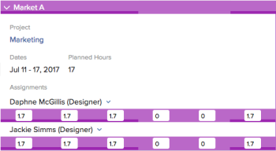
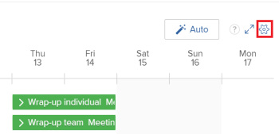

# Administrar asignaciones de usuario en las áreas de programación

>[!IMPORTANT]
>  
>La funcionalidad Programación descrita en este artículo se ha desaprobado y eliminado de Adobe Workfront a partir de la versión 23.1 de enero de 2023.   
>  
>  Este artículo también se eliminará poco después de la versión 23.1, a principios de 2023. En este momento, le recomendamos que actualice los marcadores según corresponda. 
> 
> Ahora puede utilizar el equilibrador de carga de trabajo para programar el trabajo para sus recursos. 
>  
> Para obtener información sobre la programación de recursos mediante el equilibrador de carga de trabajo, consulte la sección [El equilibrador de carga de trabajo](../../resource-mgmt/workload-balancer/workload-balancer.md). 

<!--  

>[!CAUTION] 
> 
> 
> The information in this article refers to the Adobe Workfront's Scheduling tools. The Scheduling areas have been removed from the Preview environment and will be removed from the Production environment in **January 2023**.   
>  Instead, you can schedule resources in the Workload Balancer.  
> 
>*  For information about scheduling resources using the Workload Balancer, see the section [The Workload Balancer](../../resource-mgmt/workload-balancer/workload-balancer.md). 
> 
>*  For more information about the deprecation and removal of the Scheduling tools, see [Deprecation of Resource Scheduling tools in Adobe Workfront](../../resource-mgmt/resource-mgmt-overview/deprecate-resource-scheduling.md). 

-->

Las asignaciones de usuario son cantidades de horas que indican el tiempo que un usuario debe invertir en un día determinado para completar un elemento de trabajo. Se incluyen en el horario previsto del tema de trabajo.

Este artículo describe cómo actualizar las asignaciones por hora diarias para los usuarios asignados a tareas o problemas usando el área de programación de recursos . Para obtener información sobre la administración de asignaciones generales para usuarios y funciones de trabajo en tareas, consulte [Administrar horas de asignación de usuarios y funciones en tareas](../../manage-work/tasks/assign-tasks/manage-allocation-hours-on-tasks.md). No puede actualizar las asignaciones generales para usuarios y funciones de trabajo por problemas.

Puede mostrar las asignaciones de usuarios en las siguientes áreas de Adobe Workfront:

* En la sección Programación del área Recursos.
* En la sección Programación de un proyecto (al programar recursos para un solo proyecto).
* En la sección Programar de un equipo (al programar recursos para un equipo).

## Requisitos de acceso

Debe tener lo siguiente:

<table style="table-layout:auto"> 
 <col> 
 <col> 
 <tbody> 
  <tr> 
   <td role="rowheader">plan de Adobe Workfront*</td> 
   <td> 
Cualquiera
 </td> 
  </tr> 
  <tr> 
   <td role="rowheader">Licencia de Adobe Workfront*</td> 
   <td> 
Trabajo o superior
 </td> 
  </tr> 
  <tr> 
   <td role="rowheader">Nivel de acceso*</td> 
   <td> 
Ver o tener más acceso a Proyectos, Tareas y Problemas
 
<b>NOTA</b>

Si todavía no tiene acceso, pregunte a su administrador de Workfront si establece restricciones adicionales en su nivel de acceso. Para obtener información sobre cómo un administrador de Workfront puede cambiar su nivel de acceso, consulte <a href="../../administration-and-setup/add-users/configure-and-grant-access/create-modify-access-levels.md" class="MCXref xref">Crear o modificar niveles de acceso personalizados</a>.
 </td>
</tr> 
  <tr> 
   <td role="rowheader">Permisos de objeto</td> 
   <td> 
Permisos de Contribute para proyectos, tareas y problemas
 
Para obtener información sobre la solicitud de acceso adicional, consulte <a href="../../workfront-basics/grant-and-request-access-to-objects/request-access.md" class="MCXref xref">Solicitar acceso a objetos </a>.
 </td> 
  </tr> 
 </tbody> 
</table>

*Para saber qué plan, tipo de licencia o acceso tiene, póngase en contacto con el administrador de Workfront.

## Asignaciones de usuario en las áreas de programación

Antes de empezar a asignar tiempo a los usuarios como se describe en este artículo, familiarícese con el funcionamiento de la programación de recursos en Workfront, tal como se describe en [Introducción a la programación de recursos](../../resource-mgmt/resource-scheduling/get-started-resource-scheduling.md).

Puede programar recursos para trabajar en tareas y problemas para un equipo individual del que sea miembro, para un proyecto individual en el que sea miembro del equipo del proyecto o para varios proyectos para los que sea el administrador de recursos.

Las secciones siguientes describen cómo habilitar y administrar las asignaciones de usuarios en Workfront:

* [Utilice las áreas de programación para asignar trabajo](#use-the-scheduling-areas-to-assign-work)
* [Asignaciones establecidas en los cuadros Editar tarea o Editar problema en las áreas de programación](#allocations-set-on-the-edit-task-or-the-edit-issue-boxes-vs-in-the-scheduling-areas)
* [Indicadores de asignación](#allocation-indicators)
* [Asignación predeterminada para horas planificadas](#default-allocation-for-planned-hours)
* [¿Quién puede ver y modificar las asignaciones?](#who-can-view-and-modify-allocations)
* [Consideraciones de zona horaria en las áreas de programación](#time-zone-considerations-in-the-scheduling-areas)

### Utilice las áreas de programación para asignar trabajo {#use-the-scheduling-areas-to-assign-work}

Al asignar un nuevo trabajo a los usuarios en la cronología de programación, puede determinar cómo se asignan a los usuarios las horas planificadas para una tarea o un problema.\
Para obtener más información sobre las horas planificadas, consulte [Información general sobre las horas planificadas](../../manage-work/tasks/task-information/planned-hours.md).

Las horas planificadas se pueden dividir de las siguientes maneras:

* Entre los usuarios asignados a la tarea o al problema
* Durante toda la duración de la tarea o el problema\
   Por ejemplo, una tarea relacionada con las ventas puede requerir más trabajo hacia el final de la duración de la tarea. Puede planificar esta distribución desigual de horas en su tarea.

>[!TIP]
>
>Al programar recursos para varios proyectos desde las áreas de programación , no todos los usuarios y elementos de trabajo se muestran en la cronología de programación. Para obtener información sobre qué información se muestra en la cronología de programación, consulte [Introducción a la programación de recursos](../../resource-mgmt/resource-scheduling/get-started-resource-scheduling.md).

### Asignaciones establecidas en los cuadros Editar tarea o Editar problema en las áreas de programación {#allocations-set-on-the-edit-task-or-the-edit-issue-boxes-vs-in-the-scheduling-areas}

Puede modificar las asignaciones de usuario para una tarea o problema desde las siguientes ubicaciones dentro de Workfront:

* La cronología de programación\
   La cronología de programación se encuentra en las siguientes áreas:

   * En la sección Programación del área Recursos.
   * En la sección Programación de un proyecto (al programar recursos para un solo proyecto).
   * En la sección Programar de un equipo (al programar recursos para un equipo).

   Al modificar las asignaciones de usuario desde la cronología de programación (como se describe en la [Modificación de las asignaciones de usuario](#modify-user-allocations) en este artículo), puede definir asignaciones para cada usuario sobre la tarea o el problema, así como para cada día dentro de la tarea o la duración del problema.\
   

* Cuadro de diálogo Editar tarea o Editar problema.\
   Cuando modifique las asignaciones de usuario desde un cuadro de diálogo Editar tarea o problema (como se describe en [Administrar el porcentaje de asignación de usuarios o funciones en tareas](../../manage-work/tasks/assign-tasks/manage-allocation-percentage-on-tasks.md)), puede definir asignaciones para la tarea o problema solo como un todo para cada usuario. Si desea administrar esas asignaciones diariamente, debe modificar las asignaciones en la cronología de programación, tal como se describe en la [Modificación de las asignaciones de usuario](#modify-user-allocations) en este artículo.

   >[!IMPORTANT]
   >
   >Al modificar las asignaciones de usuario desde un cuadro de diálogo Editar tarea o Problema, se sobrescriben las asignaciones configuradas previamente en la cronología de programación. Además, cualquier cambio que realice en las asignaciones de la cronología de programación no se verá reflejado en un cuadro de diálogo Editar tarea o Problema.

Se recomienda administrar las asignaciones de usuarios desde la cronología de programación en lugar de desde Editar tarea o problema para beneficiarse de las siguientes ventajas:

* Puede ver claramente cuándo se sobreasigna a los usuarios mediante indicadores de asignación, tal como se describe en la sección [Indicadores de asignación](#allocation-indicators) para obtener más información.
* Puede asignar más tiempo a un usuario sobre otro.\
   Los indicadores de asignación proporcionan una representación visual de la asignación de un usuario en comparación con otros usuarios, tal como se describe en la sección [Indicadores de asignación](#allocation-indicators) para obtener más información.

* Puede asignar más tiempo para el trabajo en un día durante otro.\
   Los indicadores de asignación proporcionan una representación visual de cómo se encuentran los usuarios asignados en un día determinado, tal como se describe en [Indicadores de asignación](#allocation-indicators).

* Puede realizar todas las responsabilidades de recursos en un solo lugar, en la cronología de programación.

### Indicadores de asignación {#allocation-indicators}

Hay varios indicadores visuales disponibles para proporcionar información rápida sobre el nivel al que se asigna un usuario para trabajar en un día determinado.

El administrador del sistema determina cómo calcula Workfront la disponibilidad de los usuarios a nivel del sistema (teniendo en cuenta las horas y la disponibilidad de los usuarios a tiempo completo). En función de esta configuración para todo el sistema, la disponibilidad del usuario se calcula mediante la programación predeterminada o la programación del usuario. Para obtener más información, consulte [Configure cómo calcula Workfront la hora del recurso y la disponibilidad de FTE para el área de programación](../../resource-mgmt/resource-scheduling/calculate-hours-fte-scheduling-area.md).

* **Sombreado de asignación**
La asignación se muestra visualmente en las tareas asignadas a los usuarios en forma de sombreado. El sombreado más oscuro indica las horas asignadas como un porcentaje del FTE de los usuarios asignados (equivalente a tiempo completo) en un día determinado. (Para obtener más información sobre cómo configurar FTE en Workfront, consulte [Configure cómo calcula Workfront la hora del recurso y la disponibilidad de FTE para el área de programación](../../resource-mgmt/resource-scheduling/calculate-hours-fte-scheduling-area.md).)\
   Por ejemplo, un solo usuario se asigna a una tarea que tiene una cantidad de 4 horas planificadas y una duración de 1 día. El FTE para el usuario se define en el sistema como 1 (lo que significa que el usuario está programado para trabajar a tiempo completo, o más bien 40 horas a la semana, o 8 horas al día). El sombreado de la tarea en un día determinado ocupa la mitad del espacio vertical de la tarea, lo que indica que se asigna al usuario la mitad de su FTE (4 horas) ese día.\
   \
   La tarea o el problema muestra la asignación acumulativa entre todos los usuarios asignados al elemento de trabajo. Puede expandir un elemento de trabajo para ver más detalles, incluido quién está asignado al elemento de trabajo y cuántas horas se asigna a cada usuario.\
   El sombreado no se muestra en las tareas del **No asignado** en la línea de tiempo de programación.\
   

* **Totales diarios de cada día para cada usuario:** Puede mostrar el total de horas planificadas asignadas a un usuario determinado cada día. Esta información se muestra en la parte superior de cada fila de usuario en la cronología de programación. Esta información no se muestra de forma predeterminada. Puede activarlo como se describe en [Habilitar asignaciones de usuario](#enable-user-allocations). Las tareas de proyectos con cualquiera de los siguientes estados se incluyen al determinar los totales diarios: Actuales, de planificación o aprobados.\
   

* **Indicadores de sobreasignación**
Cuando el número total de horas planificadas asignadas a un usuario en un día determinado supera el número de horas que el usuario trabaja en un día (en todas las tareas), ese usuario se considera sobreasignado en ese día.\
   Cuando un usuario está sobreasignado, se muestra una barra roja que describe cada tarea del día.\
   Las tareas de proyectos con cualquiera de los siguientes estados se incluyen al determinar la sobreasignación de un usuario: Actuales, de planificación o aprobados.\
   El número de horas que un usuario trabaja en un día se define mediante el campo FTE del perfil de cada usuario, como se describe en la sección [Configure cómo calcula Workfront la hora del recurso y la disponibilidad de FTE para el área de programación](../../resource-mgmt/resource-scheduling/calculate-hours-fte-scheduling-area.md).\
   \
   Al habilitar la variable **Mostrar totales por horas planificadas diarias** y **Mostrar resaltado de asignación de recursos** en la configuración, el número total diario de horas planificadas aparece en rojo cuando el usuario está sobreasignado. De forma predeterminada, las horas se muestran al décimo más cercano (por ejemplo, 1.3).\
   

### Asignación predeterminada para horas planificadas {#default-allocation-for-planned-hours}

Workfront intenta distribuir las horas planificadas entre los usuarios y días asignados de la siguiente manera:

* Cuando se asignan varios usuarios a una tarea o un problema, las horas se dividen de forma equitativa entre los usuarios.\
   La distribución refleja cualquier asignación avanzada que ya se haya realizado en la tarea.\
   Para obtener más información sobre las asignaciones avanzadas, consulte [Crear asignaciones avanzadas](../../manage-work/tasks/assign-tasks/create-advanced-assignments.md).

* Cuando la duración de la tarea o el problema abarca varios días, las horas planificadas se distribuyen de forma equitativa entre los días y entre todos los usuarios asignados a la tarea, según la programación del usuario.
* Cuando las horas planificadas de una tarea abarcan varios días, un usuario que vea la tarea desde un huso horario diferente puede ver una diferencia en la duración de la tarea o en la fecha de inicio planificada o la fecha de finalización planificada.

Las horas se muestran a la centésima más cercana de forma predeterminada (por ejemplo, 1,33). Puede desplazarse hacia la derecha para ver más información.\

### ¿Quién puede ver y modificar las asignaciones? {#who-can-view-and-modify-allocations}

Los siguientes tipos de usuarios pueden ver o modificar las asignaciones de usuario en Workfront:

* **Administradores de recursos:** Puede ver y modificar las asignaciones de usuario para tareas y problemas en cualquier proyecto para el que sea el Administrador de recursos. Puede hacerlo en la línea de tiempo de programación del área Personas o en la ficha Personal de un proyecto.\
   Para obtener información sobre cómo los gestores de recursos pueden realizar cambios en las tareas y los problemas entre los proyectos, consulte [Asignación manual de tareas y problemas no asignados en las áreas de programación](../../resource-mgmt/resource-scheduling/manually-assign-items-scheduling-areas.md).

* **Planificar y trabajar usuarios:** Puede ver las asignaciones para cualquier tarea y problema que tenga asignadas mediante el nuevo calendario Mi trabajo o el calendario Trabajar en un equipo del que sea miembro.\
   Además de ver las asignaciones, puede modificar las asignaciones si tiene acceso de Contribute a las tareas y los problemas.

   <!--
  <MadCap:conditionalText data-mc-conditions="QuicksilverOrClassic.Draft mode">
  (NOTE: Article is conditioned to classic.)
  </MadCap:conditionalText>
  -->

### Consideraciones de zona horaria en las áreas de programación  {#time-zone-considerations-in-the-scheduling-areas}

En casos excepcionales, los usuarios que ven la cronología de programación pueden ver incoherencias en las que las horas planificadas de una tarea no son iguales al total de horas asignadas de días individuales. Esto puede ocurrir cuando la configuración de zona horaria del sistema operativo de un usuario es tal que la fecha de inicio planeada o la fecha de finalización planeada difieren de la de otro usuario.

Por ejemplo, si la fecha de finalización planeada de una tarea se establece en 11:00 am del 11/3/18, MST, un usuario de Australia que vea la tarea verá la fecha de finalización planeada como 1:00 am del 11/4/18, al día siguiente. Si el usuario de Australia asigna las horas del 11/4/18, estas horas asignadas no serán visibles para el usuario en MST. Sin embargo, estas horas siempre se tienen en cuenta en las horas previstas del proyecto.

## Habilitar asignaciones de usuario {#enable-user-allocations}

La funcionalidad de asignación de usuarios está deshabilitada de forma predeterminada en la cronología de programación. Antes de poder utilizar la funcionalidad de asignación de usuarios descrita en esta sección, primero debe habilitarla.

>[!NOTE]
>
>Las asignaciones de usuario solo se pueden habilitar cuando la programación está configurada para usar fechas planificadas. Si la cronología de programación está configurada para usar Fechas proyectadas, no se pueden mostrar las asignaciones de usuario. Para obtener más información sobre la configuración de la cronología de programación para utilizar fechas planificadas o proyectadas, consulte &quot;Configuración de fechas proyectadas para mostrar en la cronología de programación&quot; en [Configuración de las áreas de programación](../../resource-mgmt/resource-scheduling/configure-settings-scheduling-areas.md).

Para habilitar asignaciones de usuario en la cronología de programación:

1. Vaya a la cronología de programación de varios proyectos, de un proyecto individual o de un equipo:

   * **Para varios proyectos**:  Haga clic en el **Menú principal** icono  en la esquina superior derecha de Workfront, haga clic en **Recursos > Equilibrio de carga de trabajo** y, a continuación, seleccione **Programación** en el menú desplegable superior izquierdo.
   * **Para un proyecto individual**: Vaya a un proyecto y haga clic en el **Equilibrador de carga de trabajo** del panel izquierdo y, a continuación, seleccione **Programación** en el menú desplegable superior izquierdo.
   * **Para un equipo**: Haga clic en el **Menú principal** icono  en la esquina superior derecha de Workfront, haga clic en **Equipos**, seleccione un equipo, haga clic en **Equilibrador de carga de trabajo** en el panel izquierdo, seleccione **Programación** en el menú desplegable superior izquierdo.

   

1. Haga clic en el **Configuración** en la línea de tiempo de programación.\
   \
   Aparecerá el cuadro de diálogo Configuración de programación de recursos.\
   

1. Active una o ambas de las siguientes opciones para mostrar las asignaciones de usuario en la cronología de programación:

   <table style="table-layout:auto"> 
    <col> 
    <col> 
    <tbody> 
     <tr> 
      <td role="rowheader">Resaltar la asignación de recursos</td> 
      <td> 
Muestre el sombreado de asignación de usuarios en tareas y problemas en la cronología de programación. 
 
Esta opción está desactivada de forma predeterminada.
 </td> 
     </tr> 
     <tr> 
      <td role="rowheader">Mostrar totales de horas planificadas diariamente</td> 
      <td>Muestra la cantidad total de horas planeadas que se asignan a cada usuario para cada día en la cronología de programación. Las horas planificadas se muestran en la décima parte más cercana (por ejemplo, 1,3). Esta opción está desactivada de forma predeterminada.</td> 
     </tr> 
    </tbody> 
   </table>

1. (Opcional) En la **Incluir problemas** , seleccione si desea que los problemas se muestren en la línea de tiempo de programación.\
   Esta opción está desactivada de forma predeterminada.

1. Haga clic en **Volver a la programación**.\
   Las asignaciones de usuario ahora se muestran en la cronología de programación.\
   

## Modificación de las asignaciones de usuario {#modify-user-allocations}

Puede modificar las asignaciones de usuario para una tarea o problema desde la cronología de programación (como se describe en esta sección) o desde el cuadro de diálogo Editar tarea o problema. Para obtener más información, consulte [Asignaciones establecidas en los cuadros Editar tarea o Editar problema en las áreas de programación](#allocations-set-on-the-edit-task-or-the-edit-issue-boxes-vs-in-the-scheduling-areas).

De forma predeterminada, los usuarios se asignan a una tarea o a un problema de forma uniforme entre los usuarios asignados y entre los días de la duración, tal como se describe en [Asignación predeterminada para horas planificadas](#default-allocation-for-planned-hours).

Para modificar las asignaciones de usuario para una tarea o problema desde la cronología de programación:

1. Vaya a la cronología de programación de varios proyectos, de un proyecto individual o de un equipo:

   * **Para varios proyectos**:  Haga clic en el **Menú principal** icono  en la esquina superior derecha de Workfront, haga clic en **Recursos > Equilibrio de carga de trabajo** y, a continuación, seleccione **Programación** en el menú desplegable superior izquierdo.
   * **Para un proyecto individual**: Vaya a un proyecto y haga clic en el **Equilibrador de carga de trabajo** del panel izquierdo y, a continuación, seleccione **Programación** en el menú desplegable superior izquierdo.
   * **Para un equipo**: Haga clic en el **Menú principal** icono  en la esquina superior derecha de Workfront, haga clic en **Equipos**, seleccione un equipo, haga clic en **Equilibrador de carga de trabajo** en el panel izquierdo, seleccione **Programación** en el menú desplegable superior izquierdo.

   

1. Asegúrese de que las asignaciones de usuario estén habilitadas en la cronología de programación, tal como se describe en la sección [Habilitar asignaciones de usuario](#enable-user-allocations) en este artículo.
1. Expanda la tarea donde desee administrar las asignaciones de usuario.\
   De forma predeterminada, las horas planificadas se dividen de forma equitativa entre los usuarios asignados y los días de la duración de la tarea. Las horas no se agregan los fines de semana (sábados y domingos). Para obtener más información, consulte la [Asignación predeterminada para horas planificadas](#default-allocation-for-planned-hours) en este artículo.

1. Haga clic en el campo del usuario cuyas horas desee ajustar en un día determinado.

   >[!NOTE]
   >
   >Para mantener la distribución original después de modificar las horas, haga clic en **Cancelar**.

1. Especifique el número de horas ajustado.
1. Haga clic en **Guardar**.\
   Solo puede guardar los cambios cuando el número total de horas para la tarea sea igual al número de horas planeadas originales. Este número se muestra en la variable **Horas planificadas** en la tarea. El número se muestra en rojo cuando el total no es igual al número total de horas planificadas.\
   

## Criterios que restablecen las asignaciones de usuario

Workfront restablece las asignaciones de usuario que edita manualmente en la cronología de programación cuando se producen varias acciones en las tareas o en el proyecto. Por lo general, Workfront restablece las asignaciones de usuarios cada vez que se vuelve a calcular la cronología del proyecto si el número de horas planificadas sobre las tareas y los problemas ha cambiado en este proceso.\
Para obtener más información sobre cómo volver a calcular la cronología de los proyectos, consulte [Volver a calcular las líneas de tiempo del proyecto](../../manage-work/projects/manage-projects/recalculate-project-timeline.md).

Algunos de los criterios más comunes que podrían restablecer las asignaciones de usuario en la cronología de programación son:

* Adición de una tarea a una iteración.\
   Como las iteraciones tienen fechas fijas, las fechas de las tareas y las asignaciones se vuelven a calcular.\
   Para obtener información sobre cómo las iteraciones pueden afectar a las fechas de las tareas, consulte [Añadir artículos a una iteración existente](../../agile/use-scrum-in-an-agile-team/iterations/add-stories-to-existing-iteration.md).

* Cambiar el tipo de duración de una tarea a Impulsado por esfuerzo.
* Cambiar el tipo de duración de una tarea a Asignación calculada cuando se asigna más de una persona.\
   Para obtener información sobre la duración de la tarea, consulte [Información general sobre la duración y el tipo de duración de la tarea](../../manage-work/tasks/taskdurtn/task-duration-and-duration-type.md).

* Cambio de las fechas de inicio y finalización planificadas del proyecto.\
   Para obtener información sobre las fechas planificadas del proyecto, consulte [Descripción general de la fecha de inicio prevista del proyecto](../../manage-work/projects/planning-a-project/project-planned-start-date.md) y [Establecer la fecha de finalización prevista del proyecto](../../manage-work/projects/planning-a-project/project-planned-completion-date.md).

   Para obtener información sobre la tarea Fecha de finalización planificada, consulte [Descripción general de la tarea Fecha de finalización planificada](../../manage-work/tasks/task-information/task-planned-completion-date.md).

* Cambiar las fechas de una tarea predecesora si la Restricción de tarea es una restricción flexible.\
   Por ejemplo, lo antes posible o lo más tarde posible.\
   Para obtener información sobre la restricción de tareas, consulte [Información general sobre la restricción de tareas](../../manage-work/tasks/task-constraints/task-constraint-overview.md).

* Cambiar la cantidad de horas planificadas de tareas o problemas.

   Para obtener información sobre las horas programadas en Workfront, consulte [Información general sobre las horas planificadas](../../manage-work/tasks/task-information/planned-hours.md).
