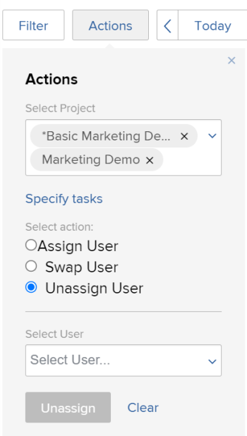

# Modificar asignaciones de varios usuarios a tareas en las áreas de programación

>[!IMPORTANT]
>  
>La funcionalidad Programación descrita en este artículo se ha desaprobado y eliminado de Adobe Workfront a partir de la versión 23.1 de enero de 2023.   
>  
>  Este artículo también se eliminará poco después de la versión 23.1, a principios de 2023. En este momento, le recomendamos que actualice los marcadores según corresponda. 
> 
> Ahora puede utilizar el equilibrador de carga de trabajo para programar el trabajo para sus recursos. 
>  
> Para obtener información sobre la programación de recursos mediante el equilibrador de carga de trabajo, consulte la sección [El equilibrador de carga de trabajo](../../resource-mgmt/workload-balancer/workload-balancer.md). 

<!--   

>[!CAUTION] 
> 
> 
> The information in this article refers to the Adobe Workfront's Scheduling tools. The Scheduling areas have been removed from the Preview environment and will be removed from the Production environment in **January 2023**.  
>  Instead, you can schedule resources in the Workload Balancer.  
> 
>*  For information about scheduling resources using the Workload Balancer, see the section [The Workload Balancer](../../resource-mgmt/workload-balancer/workload-balancer.md). 
> 
>*  For more information about the deprecation and removal of the Scheduling tools, see [Deprecation of Resource Scheduling tools in Adobe Workfront](../../resource-mgmt/resource-mgmt-overview/deprecate-resource-scheduling.md). 

This article refers to modifying user assignments for multiple tasks using the Scheduling area of Adobe Workfront. Also see the following articles for modifying assignments on multiple tasks in other areas:

* For information about modifying assignments on multiple tasks in a task list, see [Modify multiple user assignments in a task list](../../manage-work/tasks/assign-tasks/modify-multiple-assignments-in-task-list.md). 
* For information about scheduling resources using the new Workload Balancer, see the section [The Workload Balancer](../../resource-mgmt/workload-balancer/workload-balancer.md).
-->
Puede asignar usuarios a varias tareas al mismo tiempo que utiliza el planificador de recursos.

>[!NOTE]
>
>Este artículo solo se aplica cuando se programan recursos para varios proyectos (en la sección Programación ) o para un solo proyecto (en la sección Programación ); no puede administrar asignaciones de usuario para varias tareas como se describe en esta sección al programar recursos para un equipo (en la sección Programar ).

## Requisitos de acceso

Debe tener lo siguiente:

<table style="table-layout:auto"> 
 <col> 
 <col> 
 <tbody> 
  <tr> 
   <td role="rowheader">plan de Adobe Workfront*</td> 
   <td> 
Cualquiera
 </td> 
  </tr> 
  <tr> 
   <td role="rowheader">Información general sobre las licencias de Adobe Workfront*</td> 
   <td> 
Trabajo o superior
 </td> 
  </tr> 
  <tr> 
   <td role="rowheader">Nivel de acceso*</td> 
   <td> 
Ver o tener más acceso a Proyectos, Tareas y Problemas
 
<b>NOTA</b> Si todavía no tiene acceso, pregunte a su administrador de Workfront si establece restricciones adicionales en su nivel de acceso. Para obtener información sobre cómo un administrador de Workfront puede cambiar su nivel de acceso, consulte <a href="../../administration-and-setup/add-users/configure-and-grant-access/create-modify-access-levels.md" class="MCXref xref">Crear o modificar niveles de acceso personalizados</a>.
 </td> 
  </tr> 
  <tr> 
   <td role="rowheader">Permisos de objeto</td> 
   <td> 
Permisos de Contribute o superior a los proyectos, tareas y problemas para los que actualice asignaciones
 
Para obtener información sobre la solicitud de acceso adicional, consulte <a href="../../workfront-basics/grant-and-request-access-to-objects/request-access.md" class="MCXref xref">Solicitar acceso a objetos </a>.
 </td> 
  </tr> 
 </tbody> 
</table>

*Para saber qué plan, tipo de licencia o acceso tiene, póngase en contacto con el administrador de Workfront.

## Consideraciones para realizar varias asignaciones en las áreas de programación

Puede administrar rápidamente las asignaciones de usuario para varias tareas y problemas en uno o más proyectos (los cambios se reflejan en la cronología de programación).

Puede asignar un usuario a todas las tareas asignadas actualmente a una función de trabajo, intercambiar asignaciones de usuario entre usuarios o anular la asignación de un usuario de todas las tareas.

Por ejemplo:

* Un gestor de recursos es responsable de realizar asignaciones de usuarios en un nuevo proyecto. El proyecto se creó originalmente como plantilla y las funciones de trabajo ya están asignadas a las distintas tareas dentro del proyecto. El gestor de recursos desea asignar un usuario específico a todas las tareas que están asignadas actualmente a una función de trabajo.
* A Jackie Simms se le asignan 45 tareas en 3 proyectos diferentes. Jackie deja la organización, y ahora el gestor de recursos necesita reasignar sus tareas a otro usuario.

>[!NOTE]
>
>Tenga en cuenta las siguientes limitaciones al administrar asignaciones de usuario para varias tareas:
>
>* Al programar recursos para varios proyectos, los proyectos que administra deben estar en uno de los siguientes estados (o en un estado que coincida con uno de estos estados): Planificación, Actual o Aprobado. Para obtener más información sobre los estados de los proyectos, consulte [Crear o editar un estado](../../administration-and-setup/customize-workfront/creating-custom-status-and-priority-labels/create-or-edit-a-status.md).
>* Al programar recursos para un solo proyecto, el estado del proyecto no afecta a la disponibilidad de esta funcionalidad.
>* Puede realizar cambios en los recursos para los usuarios con las siguientes licencias: Planificar, Trabajar y Revisar. No puede realizar cambios de recursos para usuarios con una licencia de Solicitud.
>

## Administrar asignaciones de usuario para uno o varios proyectos

1. Vaya a la cronología de programación de varios proyectos o de un proyecto individual:

   * **Para varios proyectos**:  Haga clic en el **Menú principal** icono  en la esquina superior derecha de Workfront, haga clic en **Recursos > Equilibrio de carga de trabajo** y, a continuación, seleccione **Programación** en el menú desplegable superior izquierdo.
   * **Para un proyecto individual**: Vaya a un proyecto y haga clic en el **Equilibrador de carga de trabajo** del panel izquierdo y, a continuación, seleccione **Programación** en el menú desplegable superior izquierdo.

1. Haga clic en **Acciones**.\
   

1. En el **Seleccionar proyecto** , en función de si está viendo la cronología de programación de varios proyectos (en la ficha Programación) o de un proyecto individual (en la ficha Dotación de personal), realice una de las acciones siguientes:

   * **Para varios proyectos:** Empiece a escribir el nombre del proyecto en el que desea realizar cambios en la asignación y, a continuación, haga clic en el nombre cuando aparezca en la lista desplegable. O bien, haga clic en la flecha desplegable para elegir entre una lista de proyectos. Repita este proceso para realizar cambios de asignación en varios proyectos.\
      Deje este campo vacío para realizar cambios de asignación en todos los proyectos para los que sea el administrador de recursos.

      >[!NOTE]
      >
      >Los proyectos solo están disponibles para seleccionarse si:
      >
      >   
      >   
      >   * Se le designa como administrador de recursos del proyecto\
         >     Para obtener más información, consulte [Designar gestores de recursos para un proyecto o plantilla](../../manage-work/projects/planning-a-project/designate-resource-managers-for-projects-and-templates.md).
      >   
      >   * El proyecto se encuentra en uno de los siguientes estados (o un estado que coincide con uno de estos estados): Planificación, actual o aprobada\
         >     Para obtener más información sobre los estados de los proyectos, consulte [Crear o editar un estado](../../administration-and-setup/customize-workfront/creating-custom-status-and-priority-labels/create-or-edit-a-status.md).
      >   
      >   * Usted es un usuario con una licencia de Plan.

   * **Para un proyecto individual:** La variable **Seleccionar proyecto** no se puede modificar. La variable **Seleccionar proyecto** field siempre contiene el nombre del proyecto que está viendo.

1. (Opcional) Haga clic en **Especificar tareas** para modificar los cambios de asignación en tareas individuales. Al especificar tareas individuales, cualquier proyecto que haya seleccionado en la variable **Seleccionar proyecto** se ignoran.\
   En el **Seleccionar tareas** , empiece a escribir el nombre de la tarea en la que desea realizar cambios de asignación. Repita este paso para realizar cambios de asignación en tareas adicionales.\
   Si deja este campo en blanco, todas las tareas dentro de los proyectos seleccionados en el paso 3 se verán afectadas.\
   Al realizar cambios de asignación en tareas individuales, se aplican cambios a todas las subtareas para las tareas que especifique. Los cambios también se aplican a todos los problemas asociados con las tareas si los problemas están configurados para mostrarse en la cronología de programación, como se describe en [Se pueden configurar varias opciones para personalizar el modo y la información que se muestra en la cronología de la programación.](../../resource-mgmt/resource-scheduling/configure-settings-scheduling-areas.md#configuring-issues-to-display-on-the-scheduling-timeline) en [Configuración de las áreas de programación](../../resource-mgmt/resource-scheduling/configure-settings-scheduling-areas.md).

1. Continúe con cualquiera de las siguientes secciones:

   * [Asignar un usuario](#assign-a-user)
   * [Intercambiar un usuario](#swap-a-user)
   * [Cancelar la asignación de un usuario](#unassign-a-user)

### Asignar un usuario {#assign-a-user}

Puede asignar un usuario a todas las tareas asignadas actualmente a una función específica dentro de los proyectos seleccionados.

Al asignar un usuario de esta manera, el usuario no se asigna a los siguientes tipos de tareas:

* Asignaciones en tareas que ya están asignadas a un usuario
* Tareas que han finalizado

Para asignar un usuario a tareas en los proyectos o tareas seleccionados:

1. Select **Asignar usuario** en el **Seleccionar acción** para obtener más información.\
   

1. En el **Seleccionar función** , haga clic en la flecha desplegable para elegir entre una lista de funciones. Solo se muestran las funciones asignadas actualmente a tareas dentro de los proyectos especificados.\
   Al asignar un usuario, el usuario reemplaza las funciones que seleccione aquí.

1. En el **Seleccione el usuario que desea asignar** , haga clic en la flecha desplegable para elegir entre una lista de usuarios.\
   Si la variable **Limitar asignaciones a usuarios con una función coincidente** está activada en el área Configuración, los usuarios solo están disponibles para seleccionarlos si tienen la función seleccionada asignada en su configuración de usuario (ya sea como Función principal u Otra función). Si esta opción está desactivada, puede empezar a escribir el nombre de otro usuario que desee asignar, incluso si ese usuario no tiene una función coincidente definida en el sistema. La opción está activada de forma predeterminada.\
   Para obtener más información sobre esta opción, consulte [Permitir asignaciones de usuarios independientemente de la función y la pertenencia a grupos en las áreas de programación](../../resource-mgmt/resource-scheduling/assignments-regardless-of-role-or-group-scheduling-areas.md). De forma predeterminada, las asignaciones solo se pueden realizar a usuarios que tengan una función definida en su perfil de usuario que coincida con la asignación de funciones de la tarea o problema que se les está asignando.

1. Haga clic en **Asignar**.\
   Puede realizar un máximo de 1000 asignaciones en una sola acción. Si las selecciones que realice realizarán más de 1000 cambios en la asignación, deberá volver a ajustar las selecciones e intentarlo de nuevo.

### Intercambiar un usuario {#swap-a-user}

Puede intercambiar las asignaciones de tareas de un usuario por las asignaciones de tareas de otro usuario en los proyectos seleccionados o por las tareas seleccionadas.

Cuando intercambia asignaciones de tareas de un usuario como se describe en esta sección, las asignaciones que ya estén marcadas como Completada no se intercambian.

Para intercambiar asignaciones de tareas de un usuario con las asignaciones de tareas de otro usuario:

1. Select **Intercambiar usuario** en el **Seleccionar acción** para obtener más información.\
   

1. En el **Seleccionar usuario** , haga clic en la flecha desplegable para elegir entre una lista de usuarios (o empiece a escribir el nombre del usuario que desea intercambiar y, a continuación, haga clic en el nombre cuando aparezca en la lista desplegable).\
   Los usuarios solo se muestran cuando se les asigna una o más tareas incompletas dentro de los proyectos especificados.

1. (Condicional) El **Seleccionar una función** solo se muestra cuando el usuario seleccionado está asignado a varias tareas con diferentes funciones. (Para ver la función de trabajo definida en la tarea para un usuario, consulte la **Función del usuario asignado** en el cuadro de diálogo Asignación avanzada de la tarea, tal como se describe en [Crear asignaciones avanzadas](../../manage-work/tasks/assign-tasks/create-advanced-assignments.md)).\
   En el **Seleccionar una función** , seleccione la función para determinar el tipo de tareas que desea intercambiar. Solo las tareas para las que se asigna al usuario esta función se asignarán al nuevo usuario.\
   Por ejemplo, Hanna Marin se asigna a 5 tareas en el proyecto. En dos de las tareas, su rol de trabajo se define como &quot;Ingeniero&quot;. En las 3 tareas restantes, su función de trabajo se define como &quot;Diseñador&quot;. Si selecciona Designer en el campo Seleccionar función , significa que desea cambiar las asignaciones de las 3 tareas de Hanna donde su función de trabajo está definida como &quot;Diseñador&quot;. Las dos tareas en las que su rol de trabajo se define como &quot;Ingeniero&quot; permanecen inalteradas.\
   

1. En el **Seleccione el usuario que desea asignar** , haga clic en la flecha desplegable para elegir entre una lista de usuarios. Los usuarios solo están disponibles para asignar si sus funciones (tal y como se definen en la configuración de usuario) coinciden con las funciones del trabajo asignado al usuario que va a reemplazar.\
   Si la variable **Limitar asignaciones a usuarios con una función coincidente** está activada en el área Configuración, los usuarios están disponibles para asignar solo si sus funciones (tal como se definen en su configuración de usuario) coinciden con las funciones del trabajo asignado al usuario que va a reemplazar. Si esta opción está desactivada, puede empezar a escribir el nombre de otro usuario que desee asignar, incluso si ese usuario no tiene una función coincidente definida en el sistema. La opción está activada de forma predeterminada.\
   Para obtener más información sobre esta opción, consulte [Permitir asignaciones de usuarios independientemente de la función y la pertenencia a grupos en las áreas de programación](../../resource-mgmt/resource-scheduling/assignments-regardless-of-role-or-group-scheduling-areas.md). De forma predeterminada, las asignaciones solo se pueden realizar a usuarios que tengan una función definida en su perfil de usuario que coincida con la asignación de funciones de la tarea o problema que se les está asignando.\
   Si el usuario que va a reemplazar está asignado a varias funciones en tareas de los proyectos seleccionados y selecciona más de una función en la **Seleccionar una función** , el campo **Seleccione el usuario que desea asignar** solo muestra los usuarios que tienen todas las funciones especificadas.

1. Haga clic en **Intercambiar**.\
   Puede realizar un máximo de 1000 asignaciones en una sola acción. Si las selecciones que realice realizarán más de 1000 cambios en la asignación, deberá volver a ajustar las selecciones e intentarlo de nuevo.

### Cancelar la asignación de un usuario {#unassign-a-user}

Puede anular la asignación de un usuario de todas las tareas a las que el usuario esté asignado en los proyectos seleccionados o para las tareas seleccionadas. Cuando se anula la asignación de un usuario, las tareas asignadas a ese usuario se vuelven al estado de asignación antes de que se asignara al usuario.

Si un usuario tiene una función principal definida en el sistema y se anula la asignación del usuario, la tarea se asigna automáticamente a la función principal del usuario cuando se anula la asignación del usuario. O se asigna a la función a la que se asignó antes de que se asigne al usuario.

Si un usuario no tiene una función principal definida en el sistema y se anula la asignación del usuario, la tarea pasa a un estado no asignado al anular la asignación del usuario.

Las tareas marcadas como Completar no se pueden anular de asignar.

Para anular la asignación de un usuario de las tareas de los proyectos seleccionados o de las tareas seleccionadas:

1. Select **Cancelar la asignación de usuarios** en el **Seleccionar acción** para obtener más información.\
   

1. En el **Seleccionar usuario** , haga clic en la flecha desplegable para elegir entre una lista de usuarios (o empiece a escribir el nombre del usuario que desea anular la asignación y, a continuación, haga clic en el nombre cuando aparezca en la lista desplegable). Solo puede anular la asignación de un usuario a la vez.
1. (Condicional) El **Seleccionar una función** solo se muestra cuando el usuario seleccionado está asignado a varias tareas con diferentes funciones. (Para ver qué función de trabajo está configurada en la tarea para un usuario, consulte la **Función del usuario asignado** en el cuadro de diálogo Asignación avanzada de la tarea, tal como se describe en [Crear asignaciones avanzadas](../../manage-work/tasks/assign-tasks/create-advanced-assignments.md)).\
   En el **Seleccionar una función** , seleccione la función para determinar el tipo de tareas que desea anular la asignación. Solo se anularán las tareas a las que se asigne al usuario esta función.\
   Por ejemplo, Hanna Marin se asigna a 5 tareas en un proyecto. En 2 tareas, su función de trabajo se define como Ingeniero. En las 3 tareas restantes, su función de trabajo se define como Diseñador. Si selecciona Designer en el campo Seleccionar función , significa que desea anular la asignación de Hanna en las 3 tareas en las que su función de trabajo está definida como Diseñador. Las dos tareas en las que su puesto de trabajo se define como Ingeniero permanecerán sin cambios.\
   

1. Haga clic en **Anulación de asignación**.\
   Puede realizar un máximo de 1000 asignaciones en una sola acción. Si las selecciones que realice realizarán más de 1000 cambios en la asignación, deberá volver a ajustar las selecciones e intentarlo de nuevo.
