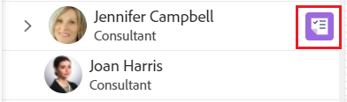

# Asignar trabajo en el Distribuidor de cargas de trabajo arrastrándolo y soltándolo

{{preview-fast-release-general}}

Puede asignar elementos de trabajo mediante el Distribuidor de cargas de trabajo de Adobe Workfront arrastrando elementos de trabajo y soltándolos en los usuarios correctos.

Para obtener información general acerca de cómo asignar trabajo a los usuarios mediante el Distribuidor de cargas de trabajo, consulte [Información general sobre la asignación de trabajo en el Distribuidor de cargas de trabajo](../../resource-mgmt/workload-balancer/assign-work-in-workload-balancer.md).

## Requisitos de acceso

+++ Expanda para ver los requisitos de acceso para la funcionalidad en este artículo.

<table style="table-layout:auto"> 
 <col> 
 <col> 
 <tbody> 
  <tr> 
   <td>paquete de Adobe Workfront</td> 
   <td>
Cualquiera
</td>
  </tr>
  <tr> 
   <td>Licencia de Adobe Workfront</td> 
   <td>
Estándar

       
Planificar, al utilizar el Distribuidor de cargas de trabajo en el área de Recursos; Trabajar, al utilizar el Distribuidor de cargas de trabajo de un equipo o proyecto
</td>
  </tr>
  <tr> 
   <td>Configuraciones de nivel de acceso</td> 
   <td> 
Acceso de edición a los siguientes elementos:
 
    <ul> 
     <li>Administración de recursos</li> 
     <li>Proyectos</li> 
     <li>Tareas</li> 
     <li>Problemas</li> 
    </ul>
   </td> 
  </tr> 
  <tr> 
   <td>Permisos de objeto</td> 
   <td>Permisos de contribuir o superiores para los proyectos, tareas y problemas que incluyan asignar tareas</td> 
  </tr> 
 </tbody> 
</table>

Para obtener más información, consulte [Requisitos de acceso en la documentación de Workfront](/help/quicksilver/administration-and-setup/add-users/access-levels-and-object-permissions/access-level-requirements-in-documentation.md).

+++

## Asignar un elemento arrastrándolo y soltándolo

Puede asignar a un usuario un elemento desde el área Trabajo sin asignar o reasignar un elemento ya asignado a otro usuario en el área Trabajo asignado.

1. Ir al Distribuidor de cargas de trabajo al que desea asignar el trabajo.

   Puede asignar trabajo a los usuarios mediante el Distribuidor de cargas de trabajo en el área de Recursos, en el proyecto o en el nivel de equipo. Para obtener más información sobre dónde se encuentra el Distribuidor de cargas de trabajo en Workfront, consulte [Buscar el Distribuidor de cargas de trabajo](../../resource-mgmt/workload-balancer/locate-workload-balancer.md).

1. (Opcional) Vaya al área de **Trabajo sin asignar** y aplique un filtro para ver las tareas, problemas, y asignaciones de roles que no estén asignados a los usuarios

   O

   Vaya al área **Trabajo asignado** y expanda el nombre de un usuario para ver los elementos de trabajo asignados a él, si desea reasignar sus elementos.

   >[!NOTE]
   >
   >Las asignaciones de rol se muestran en elementos de trabajo en el área de trabajo no asignado cuando la opción Mostrar asignaciones de rol está habilitada. Para obtener más información, consulte [Personalizar la vista](/help/quicksilver/resource-mgmt/workload-balancer/navigate-the-workload-balancer.md#customize-the-view) en [Desplazarse por el Distribuidor de cargas de trabajo](/help/quicksilver/resource-mgmt/workload-balancer/navigate-the-workload-balancer.md).

1. (Condicional) En el Distribuidor de cargas de trabajo de un proyecto, haga clic en el icono **Mostrar todos los usuarios**  para mostrar todos los usuarios de Workfront.

   Esto mostrará todos los usuarios a los que se tiene acceso de visualización.

   Los usuarios que también forman parte del equipo del proyecto y ya se han asignado a elementos del proyecto tienen el icono de proyecto a la derecha de su nombre en el área Trabajo asignado.

   

   >[!TIP]
   >
   >* La opción Mostrar todos los usuarios solo está disponible en el Distribuidor de cargas de trabajo de un proyecto.
   >* Utilice los filtros para mostrar solo los usuarios que le resultan importantes. Por ejemplo, utilice un filtro para mostrar solo los usuarios de sus equipos o grupos.

1. Haga clic en la barra de un elemento de trabajo o de una asignación de rol que indique la escala de tiempo planeada o proyectada y arrástrela sobre las horas de un usuario en el área **Asignado**.

   El usuario por encima del cual pasa el puntero para soltar el elemento de trabajo queda resaltado.

   Al arrastrar y soltar asignaciones de roles, el usuario se resalta en naranja si su rol actual no coincide con la asignación de roles. Aún puede asignar el trabajo al usuario cuando los roles no coincidan.

   >[!TIP]
   >
   >Las horas planificadas del usuario por encima del cual pasa el puntero se actualizan en tiempo real con el número de horas planificadas diarias desde el elemento de trabajo para indicar cómo impacta a su asignación general la inclusión de un nuevo elemento.

   Imagen de muestra en el entorno de vista previa:
   

   Imagen de muestra en el entorno de producción:
   

1. Cuando esté listo, suelte el elemento de trabajo seleccionado o la asignación de rol en la misma línea que el nombre del usuario en el área asignada. El elemento se asignará y las horas planificadas asignadas al usuario se actualizarán con las nuevas horas del elemento de trabajo.

   Si la opción Mostrar asignaciones de rol no está habilitada y el elemento de trabajo se asignó a un rol que el usuario no puede cumplir, el elemento se mostrará bajo el nombre del usuario en el área Trabajo asignado. También permanece en el área de Trabajo no asignado para indicar que el rol asociado a él aún no ha sido reemplazado por un usuario.

   >[!TIP]
   >
   >* Si ha habilitado la opción Agrupar por proyecto en el área Configuración, la tarea asignada aparece debajo del proyecto correspondiente. Si la opción se deshabilita, la tarea asignada se muestra en el área de usuario.
   >
   >
   >     El elemento se muestra según los criterios del Distribuidor de cargas de trabajo para ordenar los elementos de trabajo. Para obtener más información, consulte [Navegar por el Distribuidor de cargas de trabajo](../../resource-mgmt/workload-balancer/navigate-the-workload-balancer.md).
   >
   >
   >* Si en el Distribuidor de cargas de trabajo de un proyecto ha habilitado Mostrar todos los usuarios y ha asignado elementos a usuarios anteriormente no asignados a elementos del proyecto, los usuarios se añaden al Equipo del proyecto. Para obtener más información, consulte [Administración del equipo del proyecto](../../manage-work/projects/planning-a-project/manage-project-team.md).

1. (Opcional) Haga clic en la barra de un elemento de trabajo bajo el nombre de un usuario en el área de Trabajo asignado y arrástrelo y, a continuación, suéltelo en el área de Trabajo no asignado para anular la asignación. El elemento no está asignado al usuario, pero podría estar asignado a una función, en cuyo caso se mostrará en el área de Trabajo sin asignar. Si el elemento está asignado a otro usuario, permanecerá en el área Trabajo asignado bajo el nombre del usuario que aún esté asignado.
1. (Opcional) Haga clic en el icono **Mostrar asignaciones**  y, a continuación, haga clic en el **menú Más**  > **Editar asignaciones**.

   <!--
   (make sure these are still called this, and that the icon has not changed)
   -->
   O

   Haga doble clic en una asignación diaria o semanal para modificar la cantidad de tiempo que se asigna al usuario al elemento de trabajo.

   Para obtener información sobre cómo modificar las asignaciones de usuarios en el Distribuidor de cargas de trabajo, consulte la sección “Modificar asignaciones de usuarios” en el artículo [Administrar asignaciones de usuario en el Distribuidor de cargas de trabajo](../../resource-mgmt/workload-balancer/manage-user-allocations-workload-balancer.md).

   Para obtener información acerca de cómo quitar asignaciones de un elemento de trabajo mediante el Distribuidor de cargas de trabajo, consulte [Desasignar trabajo en el Distribuidor de cargas de trabajo](../../resource-mgmt/workload-balancer/unassign-work-in-workload-balancer.md).

