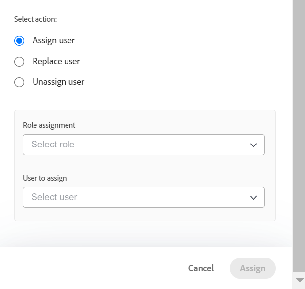
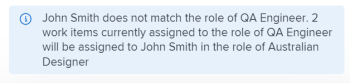
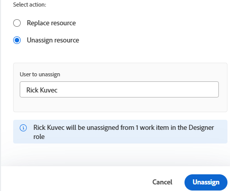

# Asignar trabajo de forma masiva mediante el Distribuidor de cargas de trabajo

<!--Audited: 07/2024-->

Puede asignar recursos a varias tareas y problemas de forma masiva mediante el Distribuidor de cargas de trabajo de Adobe Workfront.

Para obtener información general acerca de cómo asignar trabajo a los usuarios mediante el Distribuidor de cargas de trabajo, consulte [Información general sobre la asignación de trabajo en el Distribuidor de cargas de trabajo](../../resource-mgmt/workload-balancer/assign-work-in-workload-balancer.md).

## Requisitos de acceso

+++ Expanda para ver los requisitos de acceso para la funcionalidad en este artículo.

<table style="table-layout:auto"> 
 <col> 
 <col> 
 <tbody> 
  <tr> 
   <td>Paquete de Adobe Workfront</td> 
   <td>
Cualquiera
</td>
  </tr>
  <tr> 
   <td>Licencia de Adobe Workfront</td> 
   <td>
Estándar

       
Planificar, al utilizar el Distribuidor de cargas de trabajo en el área de Recursos; Trabajar, al utilizar el Distribuidor de cargas de trabajo de un equipo o proyecto
</td>
  </tr>
  <tr> 
   <td>Configuraciones de nivel de acceso</td> 
   <td> 
Acceso de edición a los siguientes elementos:
 
    <ul> 
     <li>Administración de recursos</li> 
     <li>Proyectos</li> 
     <li>Tareas</li> 
     <li>Problemas</li> 
    </ul>
   </td> 
  </tr> 
  <tr> 
   <td>Permisos de objeto</td> 
   <td>Permisos de contribuir o superiores para los proyectos, tareas y problemas que incluyan asignar tareas</td> 
  </tr> 
 </tbody> 
</table>

Para obtener más información, consulte [Requisitos de acceso en la documentación de Workfront](/help/quicksilver/administration-and-setup/add-users/access-levels-and-object-permissions/access-level-requirements-in-documentation.md).

+++

## Consideraciones a la hora de realizar asignaciones masivas en el Distribuidor de cargas de trabajo

* Puede administrar rápidamente asignaciones de recursos para varias tareas y problemas en uno o varios proyectos. Los cambios en las asignaciones se pueden ver inmediatamente en el Distribuidor de cargas de trabajo.
* No puede asignar recursos a elementos de trabajo que se hayan completado ni a elementos que se encuentren en un proyecto completado.
* Al asignar roles de trabajo y usuarios de forma masiva, puede hacer lo siguiente:

   * Reemplace las asignaciones entre usuarios y funciones en todas las combinaciones válidas.
   * Anular la asignación de un usuario a todos sus elementos de trabajo.

**EJEMPLOS**

* La realización de asignaciones de usuarios en varios proyectos nuevos es responsabilidad suya. Los proyectos se han creado originalmente a partir de plantillas y las funciones ya están asignadas a las distintas tareas de los proyectos. Por ejemplo, desea asignar una usuaria específica, María López, a todas las tareas actualmente asignadas a una función. Puede utilizar la función Reemplazar para asignar estas tareas a Jackie Simms.
* Se asignan 45 tareas de 3 proyectos diferentes a María López. María deja la organización y ahora debe reasignar sus tareas a otro usuario. Puede utilizar la función Reemplazar para asignar estas tareas a la nueva persona.
* Se asignan 10 tareas de 2 proyectos diferentes a otro usuario, Juan García. Advierte que a Juan se le asignaron estas tareas por error, pero no tiene la certidumbre de a quién deben asignarse en este momento. Tiene que anular la asignación de Juan a todas las tareas al mismo tiempo. Puede utilizar la función Anular asignación para quitar a Juan de estas tareas.

## Asignar trabajo de forma masiva en el Distribuidor de cargas de trabajo

1. Ir al Distribuidor de cargas de trabajo al que desea asignar el trabajo.

   Puede asignar trabajo a los usuarios mediante el Distribuidor de cargas de trabajo en el área de Recursos, en el proyecto o en el nivel de equipo. Para obtener más información sobre dónde se encuentra el Distribuidor de cargas de trabajo en Workfront, consulte [Buscar el Distribuidor de cargas de trabajo](../../resource-mgmt/workload-balancer/locate-workload-balancer.md).

1. Haga clic en **Asignaciones en lotes**  en la parte superior del Distribuidor de cargas de trabajo.

   El panel Asignaciones masivas se abrirá a la derecha del Distribuidor de cargas de trabajo.

1. (Condicional) Si accede al Distribuidor de cargas de trabajo desde el área Recursos o para un equipo, expanda el menú desplegable **Proyecto: nombre** y utilice los modificadores de filtro para seleccionar el o los proyectos para los que desea realizar asignaciones. Puede seleccionar proyectos por Nombre (esta es la opción predeterminada) o por Estado.

   Para obtener información acerca de los modificadores de filtro de Workfront, vea [Filtros y modificadores de condición](../../reports-and-dashboards/reports/reporting-elements/filter-condition-modifiers.md).

   >[!NOTE]
   >
   >El nombre del proyecto está seleccionado de forma predeterminada al acceder al Distribuidor de cargas de trabajo de un proyecto.

   

1. (Opcional) Haga clic en **Seleccionar tareas de proyecto** para seleccionar la tarea o tareas para las que desea realizar asignaciones y, a continuación, en el menú desplegable **Tarea: Nombre**, seleccione tareas por Nombre (esta es la opción predeterminada) o Estado y utilice los modificadores de filtro para buscar tareas específicas.

   Para obtener información acerca de los modificadores de filtro de Workfront, consulte [Filtros y modificadores de condición](../../reports-and-dashboards/reports/reporting-elements/filter-condition-modifiers.md).

   >[!NOTE]
   >
   >No puede seleccionar tareas en estado Completo.

   

   >[!TIP]
   >
   >Deje esta selección en blanco si desea realizar asignaciones masivas tanto para problemas como para tareas.

1. (Opcional) Haga clic en el icono **Eliminar**  junto a uno de los criterios seleccionados

   O

   Haga clic en **Borrar todo** en la esquina superior derecha del panel Asignaciones masivas para eliminar todas las selecciones.

1. Seleccione una de las siguientes opciones y continúe con los pasos que se describen a continuación:

   * [Reemplazar recurso](#replace-user)
   * [Anular asignación del recurso](#unassign-user)

   >[!TIP]
   >
   >Si ningún elemento coincide con los filtros seleccionados, estas opciones aparecen atenuadas.

<!--

### Assign user {#assign-user}

When you assign a user using Bulk Assignments in the Workload Balancer, the following things occur:

* A user is assigned to all work items currently assigned to a specified role within the selected projects.
* The user is not assigned to the following types of work items:

   * Items that are already assigned to a user.
   * Completed items.

* If the user you selected is not associated with the specified role, the role is replaced by the user in the user's Primary Role.

To assign a user to work items previously assigned to job roles:

1. Start assigning work items using Bulk Assignments in the Workload Balancer as described above and select **Assign**. 

1. In the **Role assignment** field, click the drop-down arrow to choose from a list of roles. Only roles currently assigned within the specified projects are displayed. This is a required field. 

   

1. In the **User to assign** field, click the drop-down arrow to choose from a list of suggested users or to type another user's name.

   Select users from the following areas:

   * **Suggested Assignments**: Users who can fulfill the selected role and who match the criteria for Smart Assignments. For more information, see [Smart assignments overview](../../manage-work/tasks/assign-tasks/smart-assignments.md).
   * **Other Assignments**: All users in the system who can fulfill the selected role. 
   
      >[!TIP]
      >
      >Only the first 50 users are listed in the Other Assignments area.

   After selecting a user, Workfront displays a note about the number of items where the user you specified will be assigned and what job role they will replace.

   >[!TIP]
   >
   >All the roles of the user display in the list, under the user's name.

1. Click **Assign**.

   The specified roles are replaced with the users that you selected.

   You receive a confirmation about how many work items have had the selected role replaced with the selected user.

   

-->

### Reemplazar recurso {#replace-user}

Puede reemplazar un recurso que ya esté asignado a elementos de trabajo con otro recurso en los proyectos seleccionados.

La sustitución de recursos puede ser:

* Rol con rol
* Usuario con usuario
* Usuario con rol
* Función con el usuario

Cuando reemplaza un recurso por otro mediante Asignaciones masivas en el Distribuidor de cargas de trabajo, se producen los siguientes problemas:

* El recurso de reemplazo se asigna a todos los elementos de trabajo asignados actualmente al recurso original dentro de los proyectos seleccionados.
* El nuevo recurso no está asignado a ningún elemento de trabajo que ya esté marcado como Completado.
* Para el reemplazo de usuario a usuario, si la función asociada con el primer usuario no coincide con ninguna de las funciones del segundo usuario, el segundo usuario se asigna en su función principal.

Para reemplazar un recurso por otro:

1. Seleccione elementos de trabajo en el área Asignaciones masivas del Distribuidor de cargas de trabajo como se ha descrito anteriormente y seleccione **Reemplazar recurso**.
1. En el campo **Recurso asignado actualmente**, haga clic en la flecha desplegable para elegir de una lista de recursos. Solo se muestran los recursos asignados actualmente a elementos de trabajo incompletos dentro de los proyectos especificados. Este campo es obligatorio.

   

1. En el campo **Recurso que asignar**, haga clic en la flecha desplegable para elegir entre una lista de recursos sugeridos o para escribir otro rol o nombre de usuario. Los recursos que aparecen primero de forma predeterminada coinciden con los criterios de Asignaciones inteligentes. Para obtener más información, consulte [Información general sobre las asignaciones inteligentes](../../manage-work/tasks/assign-tasks/smart-assignments.md).

   Workfront muestra una nota sobre el número de elementos donde el recurso asignado actualmente reemplazará al segundo recurso.

1. Haga clic en **Reemplazar**.

   El primer recurso se reemplaza por el segundo recurso en todos los elementos de trabajo del proyecto o tarea seleccionados.

   Recibirá una confirmación de cuántos elementos de trabajo se han reemplazado la asignación original por el segundo recurso seleccionado.

### Anular asignación del recurso {#unassign-user}

Puede anular la asignación de un recurso de todos los elementos de trabajo a los que esté asignado en los proyectos seleccionados.

Cuando se anula la asignación de un usuario a todas sus asignaciones mediante asignaciones masivas en el Distribuidor de cargas de trabajo, se producen los siguientes problemas:

* El usuario especificado se elimina de todos los elementos de trabajo a los que está asignado.
* Si el usuario para el que se ha anulado la asignación está asociado a funciones de trabajo, estas funciones de trabajo permanecen asignadas a los elementos de trabajo cuando se quita el usuario.

* Si el usuario especificado está asignado a elementos de trabajo completados, el usuario permanece asignado a esos elementos de trabajo.

Para obtener más información sobre las asignaciones y funciones de usuarios, consulte [Información general sobre la asignación de trabajo en el Distribuidor de cargas de trabajo](../../resource-mgmt/workload-balancer/assign-work-in-workload-balancer.md).

Para anular la asignación de un usuario a elementos de trabajo en los proyectos seleccionados o a tareas o problemas seleccionados donde se hayan asignado:

1. Seleccione elementos de trabajo en el área Asignaciones masivas del Distribuidor de cargas de trabajo como se ha descrito anteriormente y seleccione **Anular asignación de recursos**.

1. En el campo **Usuario para anular la asignación**, haga clic en la flecha desplegable para elegir uno de una lista de usuarios. Solo se muestran los usuarios asignados actualmente a elementos de trabajo incompletos dentro de los proyectos especificados. Este campo es obligatorio.

   

   Workfront muestra una nota sobre el número de elementos para los que se anulará la asignación del usuario asignado actualmente.

1. Haga clic en **Anular asignación**.\
   Recibirá una confirmación sobre el número de elementos de trabajo para los que se eliminó el usuario especificado.

