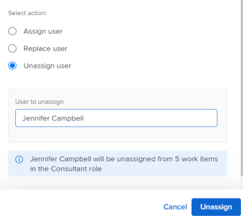

# Asignación de trabajo por lotes mediante el Distribuidor de cargas de trabajo

<!--drafted
The highlighted information on this page refers to functionality not yet generally available. It is available only in the Preview environment. 
-->

Puede asignar manualmente elementos de trabajo a los usuarios mediante el Distribuidor de cargas de trabajo de Adobe Workfront.

Para obtener información general sobre la asignación de trabajo a los usuarios mediante el Distribuidor de cargas de trabajo, consulte [Información general sobre la asignación de trabajo en el Distribuidor de cargas de trabajo](../../resource-mgmt/workload-balancer/assign-work-in-workload-balancer.md).

## Requisitos de acceso

Debe tener el siguiente acceso para realizar los pasos de este artículo:

<table style="table-layout:auto"> 
 <col> 
 <col> 
 <tbody> 
  <tr> 
   <td role="rowheader">plan Adobe Workfront*</td> 
   <td> 
Cualquiera 
 </td> 
  </tr> 
  <tr> 
   <td role="rowheader">Licencia de Adobe Workfront*</td> 
   <td> 
Planificar, al utilizar el Distribuidor de cargas de trabajo en el área de Recursos

   
Trabaje con el Distribuidor de cargas de trabajo de un equipo o proyecto

</td> 
  </tr> 
  <tr> 
   <td role="rowheader">Nivel de acceso*</td> 
   <td> 
Edite el acceso a lo siguiente:
 
    <ul> 
     <li> 
Administración de recursos
 </li> 
     <li> 
Proyectos
 </li> 
     <li> 
Tareas
 </li> 
     <li> 
Problemas
 </li> 
    </ul> 
<b>NOTA</b>

Si sigue sin tener acceso, pregunte al administrador de Workfront si ha establecido restricciones adicionales en su nivel de acceso. Para obtener información sobre cómo un administrador de Workfront puede cambiar su nivel de acceso, consulte <a href="../../administration-and-setup/add-users/configure-and-grant-access/create-modify-access-levels.md" class="MCXref xref">Crear o modificar niveles de acceso personalizados</a>.
 </td>
</tr> 
  <tr> 
   <td role="rowheader">Permisos de objeto</td> 
   <td> 
Aportar permisos o niveles superiores a los proyectos, tareas y problemas que incluyen Realizar asignaciones
 
Para obtener información sobre cómo solicitar acceso adicional, consulte <a href="../../workfront-basics/grant-and-request-access-to-objects/request-access.md" class="MCXref xref">Solicitud de acceso a objetos </a>.
 </td> 
  </tr> 
 </tbody> 
</table>

&#42;Para saber qué plan, tipo de licencia o acceso tiene, póngase en contacto con su administrador de Workfront.

## Consideraciones para realizar asignaciones masivas en el Distribuidor de cargas de trabajo

* Puede administrar rápidamente las asignaciones de usuarios para varias tareas y problemas en uno o varios proyectos. Los cambios en las asignaciones se pueden ver inmediatamente en el Distribuidor de cargas de trabajo.
* No puede asignar recursos a elementos de trabajo que se hayan completado o a elementos que se encuentren en un proyecto completado.
* Al asignar usuarios de forma masiva, puede hacer lo siguiente:

   * Asigne un usuario a todos los elementos de trabajo asignados actualmente a un rol.
   * Reemplazar asignaciones de usuarios entre usuarios.
   * Anular la asignación de un usuario a todos sus elementos de trabajo.

**EJEMPLOS**

* Usted es responsable de realizar asignaciones de usuarios en varios proyectos nuevos. Los proyectos se crearon originalmente a partir de plantillas y los roles de trabajo ya están asignados a las distintas tareas de los proyectos. Desea asignar un usuario específico, Jackie Simms, a todas las tareas que estén asignadas actualmente a un rol. Puede utilizar la función Asignar para asignar estas tareas a Jackie Simms.
* 45 tareas en 3 proyectos diferentes se asignan a Jackie Simms. Jackie deja la organización y ahora necesita reasignar sus tareas a otro usuario. Puede utilizar la función Reemplazar para asignar estas tareas a la nueva persona.
* Se asignan 10 tareas en 2 proyectos diferentes a otro usuario, Rick Kuvec. Te das cuenta de que Rick fue asignado a estas tareas por error, pero no estás seguro de a quién deben ser asignados en este momento. Necesitas desasignar a Rick a todas las tareas al mismo tiempo. Puede utilizar la función Desasignar para eliminar a Rick de estas tareas.

## Asignar trabajo por lotes en el Distribuidor de cargas de trabajo

1. Vaya al Distribuidor de cargas de trabajo al que desea asignar el trabajo.

   Puede asignar trabajo a los usuarios mediante el Distribuidor de cargas de trabajo en el área de Recursos, en el proyecto o en el nivel de equipo. Para obtener más información sobre dónde se encuentra el Distribuidor de cargas de trabajo en Workfront, consulte [Localización del Distribuidor de cargas de trabajo](../../resource-mgmt/workload-balancer/locate-workload-balancer.md).

1. Clic **Asignaciones masivas**  en la parte superior del Distribuidor de cargas de trabajo.

   El panel Asignaciones masivas se abre a la derecha del Distribuidor de cargas de trabajo.

1. (Condicional) Si accede al Distribuidor de cargas de trabajo desde el área de Recursos o para un equipo, expanda el **Proyecto: Nombre** y utilice los modificadores de filtro para seleccionar el proyecto o proyectos para los que desea realizar asignaciones. Puede seleccionar proyectos por Nombre (esta es la opción predeterminada) o por Estado.

Para obtener información sobre los modificadores de filtro de Workfront, consulte [Filtros y modificadores de condición](../../reports-and-dashboards/reports/reporting-elements/filter-condition-modifiers.md).

>[!NOTE]
>
>El nombre del proyecto está seleccionado de forma predeterminada al acceder al Distribuidor de cargas de trabajo de un proyecto.

1. (Opcional) Haga clic en **Seleccionar tareas del proyecto** para seleccionar la tarea o tareas para las que desea realizar asignaciones, en el **Tarea: Nombre** , seleccione las tareas por Nombre (esta es la opción predeterminada) o Estado y utilice los modificadores de filtro para buscar tareas específicas.

Para obtener información sobre los modificadores de filtro de Workfront, consulte [Filtros y modificadores de condición](../../reports-and-dashboards/reports/reporting-elements/filter-condition-modifiers.md).

>[!NOTE]
>
>No puede seleccionar tareas en estado Completo.

>[!TIP]
>
>Deje esta selección en blanco si desea realizar asignaciones masivas tanto para problemas como para tareas.

1. (Opcional) Haga clic en **Eliminar** icono  junto a uno de los criterios seleccionados

   O

   Clic **Borrar todo** en la esquina superior derecha del panel Asignaciones masivas para eliminar todas las selecciones.

1. Seleccione una de las siguientes opciones y continúe con los pasos que se describen a continuación:

   * [Asignar usuario](#assign-user)
   * [Reemplazar usuario](#replace-user)
   * [Quitar asignación de usuario](#unassign-user)

   >[!TIP]
   >
   >Si ningún elemento coincide con los filtros seleccionados, estas opciones aparecen atenuadas.

### Asignar usuario {#assign-user}

Cuando asigna un usuario mediante Asignaciones masivas en el Distribuidor de cargas de trabajo, se producen las siguientes cosas:

* Un usuario está asignado a todos los elementos de trabajo asignados actualmente a un rol especificado dentro de los proyectos seleccionados.
* El usuario no está asignado a los siguientes tipos de elementos de trabajo:

   * Elementos que ya se han asignado a un usuario.
   * Elementos completados.

* Si el usuario seleccionado no está asociado con el rol especificado, el rol será reemplazado por el usuario en el Rol principal del usuario.

Para asignar un usuario a elementos de trabajo previamente asignados a roles:

1. Comience a asignar elementos de trabajo mediante Asignaciones masivas en el Distribuidor de cargas de trabajo como se ha descrito anteriormente y seleccione **Asignar**.

1. En el **Asignación de funciones** , haga clic en la flecha desplegable para elegir entre una lista de funciones. Solo se muestran las funciones asignadas actualmente en los proyectos especificados. Este campo es obligatorio.

   

1. En el **Usuario al que asignar** , haga clic en la flecha desplegable para elegir entre una lista de usuarios sugeridos o para escribir el nombre de otro usuario.

   Seleccione usuarios de las siguientes áreas:

   * **Asignaciones sugeridas**: Usuarios que pueden cumplir la función seleccionada y que coinciden con los criterios de Asignaciones inteligentes. Para obtener más información, consulte [Información general sobre asignaciones inteligentes](../../manage-work/tasks/assign-tasks/smart-assignments.md).
   * **Otras asignaciones**: todos los usuarios del sistema que pueden desempeñar la función seleccionada.

     >[!TIP]
     >
     >Solo los 50 primeros usuarios aparecen en el área Otras asignaciones.

   Después de seleccionar un usuario, Workfront muestra una nota sobre el número de elementos donde se asignará al usuario especificado y la función de trabajo que reemplazará.

   >[!TIP]
   >
   >Todos los roles del usuario se muestran en la lista, bajo el nombre del usuario.

1. Clic **Asignar**.

   Los roles especificados se reemplazarán por los usuarios seleccionados.

   Recibirá una confirmación sobre cuántos elementos de trabajo se han reemplazado con el rol seleccionado.

   

### Reemplazar usuario {#replace-user}

Puede reemplazar a un usuario que ya esté asignado a elementos de trabajo con otro usuario en los proyectos seleccionados.

Cuando reemplaza un usuario por otro con Asignaciones masivas en el Distribuidor de cargas de trabajo, se producen los siguientes problemas:

* El usuario de reemplazo se asigna a todos los elementos de trabajo que estén asignados a un usuario original dentro de los proyectos seleccionados.

* El nuevo usuario no está asignado a ningún elemento de trabajo que ya esté marcado como Completado.
* Si la función asociada al primer usuario no coincide con ninguna de las funciones del segundo usuario, se asigna al segundo usuario en su función principal.

Para reemplazar a un usuario por otro:

1. Comience a asignar elementos de trabajo en el Distribuidor de cargas de trabajo como se describe anteriormente y seleccione **Reemplazar**.
1. En el **Usuario asignado actualmente** , haga clic en la flecha desplegable para elegir entre una lista de usuarios. Solo se muestran los usuarios asignados actualmente a elementos de trabajo incompletos dentro de los proyectos especificados. Este campo es obligatorio.

   

1. En el **Usuario al que asignar** , haga clic en la flecha desplegable para elegir entre una lista de usuarios sugeridos o para escribir otro nombre de usuario. Los usuarios enumerados en la lista coinciden de forma predeterminada con los criterios de Asignaciones inteligentes. Para obtener más información, consulte [Información general sobre asignaciones inteligentes](../../manage-work/tasks/assign-tasks/smart-assignments.md).

   Workfront muestra una nota sobre el número de elementos en los que el usuario asignado actualmente reemplazará al segundo usuario y las funciones a las que reemplazará.

   

1. Clic **Reemplazar**.

   El primer usuario seleccionado se reemplaza por el segundo usuario en todos los elementos de trabajo del proyecto seleccionado.

   Recibirá una confirmación de cuántos elementos de trabajo se han reemplazado la asignación de usuario original por el segundo usuario seleccionado.

### Quitar asignación de usuario {#unassign-user}

Puede anular la asignación de un usuario a todos los elementos de trabajo a los que esté asignado en los proyectos seleccionados.

Cuando anula la asignación de un usuario a todas sus asignaciones mediante Asignaciones masivas en el Distribuidor de cargas de trabajo, se producen los siguientes problemas:

* El usuario especificado se quita de todos los elementos de trabajo a los que está asignado.
* Si el usuario no asignado está asociado a roles de trabajo, los roles de trabajo permanecen asignados a los elementos de trabajo cuando se elimina el usuario.

* Si el usuario especificado está asignado a elementos de trabajo completados, el usuario permanece asignado a esos elementos de trabajo.

Para obtener más información sobre las asignaciones de usuarios y funciones, consulte [Información general sobre la asignación de trabajo en el Distribuidor de cargas de trabajo](../../resource-mgmt/workload-balancer/assign-work-in-workload-balancer.md).

Para anular la asignación de un usuario a elementos de trabajo en los proyectos seleccionados o a tareas o problemas seleccionados donde se hayan asignado:

1. Comience a asignar elementos de trabajo en el Distribuidor de cargas de trabajo como se describe anteriormente y seleccione **Desasignar**.

1. En el **Usuario que desasignar** , haga clic en la flecha desplegable para elegir entre una lista de usuarios. Solo se muestran los usuarios asignados actualmente a elementos de trabajo incompletos dentro de los proyectos especificados. Este campo es obligatorio.

   

   Workfront muestra una nota sobre el número de elementos a los que se quitará la asignación del usuario asignado actualmente.

   

1. Clic **Desasignar**.\
   Recibirá una confirmación sobre el número de elementos de trabajo en los que se eliminó el usuario especificado.

 
