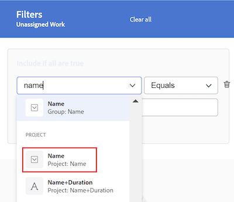
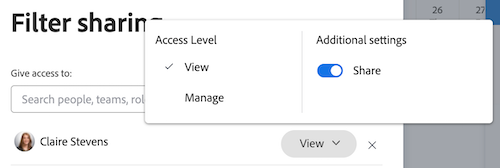

# Filtrar información en el distribuidor de cargas de trabajo

<!-- Audited: 6/2025 -->

<!--
(when they add custom fields to fitlering, add the caveat you added for the Resource Planner : only field NAMES and not LABELS are to be found in the drop-down >> ADD THIS IN THE STEP BELOW WHEN ADDING A FILTER)
-->

Como administrador de recursos, puede utilizar el Distribuidor de cargas de trabajo para ver y administrar la carga de trabajo de los usuarios. Para obtener más información general sobre el Distribuidor de cargas de trabajo, consulte los siguientes artículos:

* [Información general del Distribuidor de cargas de trabajo](../../resource-mgmt/workload-balancer/overview-workload-balancer.md)
* [Navegar por el equilibrador de carga de trabajo](../../resource-mgmt/workload-balancer/navigate-the-workload-balancer.md)

>[!IMPORTANT]
>
>Para encontrar de forma eficaz los elementos de trabajo y centrarse en los usuarios o elementos que administra, le recomendamos encarecidamente que utilice filtros en el Distribuidor de cargas de trabajo. Esto le permite mostrar la información correcta antes de empezar a administrar las asignaciones de los recursos.
>
>Cuando se aleja del Distribuidor de cargas de trabajo después de guardar y aplicar un nuevo filtro, este se sigue aplicando incluso después de cerrar la sesión y volver a iniciarla.

Este artículo contiene información sobre los filtros del Distribuidor de cargas de trabajo. Para obtener información sobre los filtros de Workfront, consulte [Información general sobre los filtros](../../reports-and-dashboards/reports/reporting-elements/filters-overview.md).

## Requisitos de acceso

<table style="table-layout:auto"> 
 <col> 
 <col>
 <tbody> 
  <tr> 
   <td>paquete de Adobe Workfront</td> 
   <td>
Cualquiera
</td>
  </tr>
  <tr> 
   <td>Licencia de Adobe Workfront</td> 
   <td>
Estándar

       
Planificar, al utilizar el Distribuidor de cargas de trabajo en el área de Recursos; Trabajar, al utilizar el Distribuidor de cargas de trabajo de un equipo o proyecto
</td>
  </tr>
  <tr> 
   <td>Configuraciones de nivel de acceso</td> 
   <td> 
Acceso de visualización o superior a lo siguiente:
 
    <ul> 
     <li>Administración de recursos</li> 
     <li>Proyectos</li> 
     <li>Tareas</li> 
     <li>Problemas</li>
     <li>Filtros, vistas y agrupaciones</li>
    </ul>
    
Editar el acceso a filtros, vistas y agrupaciones al crear o editar filtros 
 </td>
  </tr> 
  <tr> 
   <td>Permisos de objeto</td> 
   <td> 
Permisos de visualización o superiores para proyectos, tareas y problemas

   
Permisos de administración para los filtros que desee editar o eliminar

   </td> 
  </tr> 
 </tbody> 
</table>

Para obtener más información, consulte [Requisitos de acceso en la documentación de Workfront](/help/quicksilver/administration-and-setup/add-users/access-levels-and-object-permissions/access-level-requirements-in-documentation.md).

+++

## Información general sobre los filtros en el Distribuidor de cargas de trabajo

Tenga en cuenta lo siguiente al trabajar con filtros en el Distribuidor de cargas de trabajo:

* Según desde dónde acceda al Distribuidor de cargas de trabajo, es posible que Workfront ya esté filtrando la información por usted. Para obtener más información, consulte la siguiente sección en este artículo: [Filtros preaplicados en el Distribuidor de cargas de trabajo](#pre-applied-filters-in-the-workload-balancer).
* Puede crear y aplicar un filtro sin guardarlo, o bien puede guardar un filtro para reutilizarlo más adelante.
* Cuando aplique un filtro sin guardarlo, puede volver a las listas originales al actualizar la página.
* Puede ver los filtros que ha creado o los filtros que otros usuarios han creado y compartido con usted.
* Al eliminar o editar un filtro compartido, también se elimina o edita para todos con los que lo ha compartido.
* Cuando se crean filtros en el Distribuidor de cargas de trabajo en una área, no están disponibles en otras áreas.

  Por ejemplo, los filtros creados en el área de Recursos no están disponibles en el Distribuidor de cargas de trabajo de un proyecto o equipo.

  Para obtener información sobre dónde ubicar el Distribuidor de cargas de trabajo, consulte [Localizar el Distribuidor de cargas de trabajo](../../resource-mgmt/workload-balancer/locate-workload-balancer.md).

* Solo puede ver los elementos que coincidan con los filtros seleccionados si también coinciden con las fechas en la cronología mostrada en la pantalla del Distribuidor de cargas de trabajo.

## Filtros preaplicados en el Distribuidor de cargas de trabajo {#pre-applied-filters-in-the-workload-balancer}

El Distribuidor de cargas de trabajo muestra información en dos áreas independientes:

* **Área de trabajo sin asignar**: elementos de trabajo que aún no se han asignado a los usuarios.
* **Área de trabajo asignada**: elementos de trabajo asignados a usuarios.

  Para obtener información acerca de lo que se muestra en cada una de las áreas, consulte [Navegar por el Distribuidor de cargas de trabajo](../../resource-mgmt/workload-balancer/navigate-the-workload-balancer.md).

>[!IMPORTANT]
>
>Cada área del Distribuidor de cargas de trabajo tiene su propio conjunto de filtros que funcionan de forma independiente entre sí. Debe configurar ambos filtros para indicar qué información desea ver en cada área.

El Distribuidor de cargas de trabajo muestra los usuarios y sus elementos de trabajo.
Los elementos de trabajo asignados a los usuarios solo se muestran cuando las fechas de los elementos coinciden con el lapso de tiempo mostrado en la pantalla.

Según desde dónde acceda al Distribuidor de cargas de trabajo, las áreas sin asignar y asignadas ya están filtradas según determinados criterios, como se describe en la siguiente tabla:

<table style="table-layout:auto"> 
 <col> 
 <col> 
 <col> 
 <tbody> 
  <tr> 
   <td role="rowheader"><strong>Área de Workfront donde se accede al Distribuidor de cargas de trabajo</strong></td> 
   <td><b>Elementos que se muestran en el área de Trabajo sin asignar de manera predeterminada</b> </td> 
   <td><b>Elementos que se muestran en el área de Trabajo asignado de manera predeterminada</b> </td> 
  </tr> 
  <tr> 
   <td role="rowheader">El área de Recursos</td> 
   <td>De forma predeterminada, aquí no se muestra ningún elemento. Debe personalizar los filtros para ver los elementos de trabajo en esta área.</td> 
   <td>Usuarios que son miembros de cualquiera de sus equipos y sus elementos de trabajo. </td> 
  </tr> 
  <tr> 
   <td role="rowheader">Un equipo</td> 
   <td>Elementos de trabajo asignados al equipo o al equipo y una función. </td> 
   <td> 
Usuarios que son miembros del equipo seleccionado y sus elementos de trabajo.
 </td> 
  </tr> 
  <tr> 
   <td role="rowheader">Un proyecto</td> 
   <td> 
En esta área se muestran los elementos de trabajo sin asignar o los elementos asignados a equipos o funciones del proyecto seleccionado.
 </td> 
   <td> 
Usuarios asignados al menos a un elemento de trabajo del proyecto seleccionado y sus elementos de trabajo en el proyecto cuando el filtro predeterminado del sistema <b>Elementos de trabajo de este proyecto</b> está seleccionado. 

Cuando el filtro predeterminado del sistema <b>Elementos de trabajo de este proyecto</b> no está seleccionado, el área Trabajo asignado de un proyecto muestra todos los elementos de trabajo de los usuarios asignados al menos a un elemento del proyecto seleccionado.    De forma predeterminada, este filtro no está seleccionado.

 <b>Nota</b>: puede habilitar la opción <b>Mostrar todos los usuarios</b> en el Distribuidor de cargas de trabajo del proyecto para mostrar todos los usuarios del sistema. Para obtener más información, consulte <a href="../workload-balancer/navigate-the-workload-balancer.md" class="MCXref xref">Navegar por el Distribuidor de cargas de trabajo</a>

</td> 
  </tr> 
 </tbody> 
</table>

## Crear filtros del Distribuidor de cargas de trabajo

El proceso de creación de filtros para las áreas de Trabajo no asignado y Trabajo asignado en el Distribuidor de cargas de trabajo es idéntico independientemente de desde dónde acceda al Distribuidor de cargas de trabajo. Para obtener información sobre cómo localizar el Distribuidor de cargas de trabajo, consulte [Localizar el Distribuidor de cargas de trabajo](../../resource-mgmt/workload-balancer/locate-workload-balancer.md).

Puede crear un filtro desde cero o editar uno de los filtros predefinidos. Para obtener información sobre los filtros existentes que puede editar, consulte la sección [Editar un filtro existente en el Distribuidor de cargas de trabajo](#edit-an-existing-filter-in-the-workload-balancer) de este artículo.

1. Vaya al equilibrador de carga de trabajo.

   Para obtener información sobre el acceso al Distribuidor de cargas de trabajo, consulte [Navegar por el Distribuidor de cargas de trabajo](../../resource-mgmt/workload-balancer/navigate-the-workload-balancer.md).

1. En la esquina superior derecha de las áreas **Trabajo sin asignar** o **Trabajo asignado**, haga clic en el icono **Filtro** . El cuadro **Filtros** aparece a la derecha y el nombre del área para la que está creando el filtro se muestra en el encabezado.

   

1. (Opcional y condicional) Si accede al Distribuidor de cargas de trabajo en el área de **Recursos**, es posible que el filtro predeterminado predefinido ya se haya aplicado al área de **Trabajo asignado**. Puede editar y guardar una copia del filtro predeterminado.

   >[!TIP]
   >
   >El filtro predeterminado muestra los usuarios que pertenecen a cualquiera de sus equipos y sus elementos de trabajo. Puede editar una copia de este filtro.

   Si accede al [!UICONTROL Distribuidor de cargas de trabajo] desde un proyecto, es posible que el filtro **Elementos de trabajo de este proyecto** ya se haya aplicado. Esto muestra solamente los elementos de trabajo asignados a los usuarios de este proyecto. Puede duplicar y guardar una copia de este filtro.

   De manera predeterminada, [!UICONTROL Distribuidor de cargas de trabajo] del proyecto muestra todos los elementos de trabajo asignados a todos los usuarios del proyecto.

1. Haga clic en **Nuevo filtro**.

1. Para crear un filtro, haga lo siguiente:

   1. Seleccione un nombre de campo en el primer menú desplegable o haga clic en **Examinar campos** en la parte inferior de la lista desplegable para escribir el nombre de un campo que no se muestra de forma predeterminada.

      >[!IMPORTANT]
      >
      >Al hacer referencia a campos personalizados, debe escribir el nombre del campo y no la etiqueta del campo. La etiqueta de campo se muestra en un formulario personalizado adjunto a un objeto. Para obtener información acerca de la diferencia entre la etiqueta y el nombre de un campo personalizado, vea [Crear un formulario personalizado](/help/quicksilver/administration-and-setup/customize-workfront/create-manage-custom-forms/form-designer/design-a-form/design-a-form.md).

   1. (Condicional) Si ha hecho clic en **Examinar campos**, escriba el nombre de un campo en el campo **Buscar** y selecciónelo cuando se muestre en la lista.

      

      >[!TIP]
      >
      >Puede seleccionar un campo de las siguientes secciones:
      >
      >* **Selecciones recientes**: los campos para los que ha filtrado recientemente.
      >* **Sugeridos**: los campos más utilizados.

   1. Seleccione un modificador en el segundo menú desplegable. Para obtener información acerca de los modificadores de filtro de Workfront, consulte [Filtros y modificadores de condición](../../reports-and-dashboards/reports/reporting-elements/filter-condition-modifiers.md).
   1. Seleccione o escriba un valor para el campo que está filtrando.

      >[!NOTE]
      >
      > Si desea mostrar objetos de trabajo de un portafolio específico, puede aplicar el siguiente filtro: Portfolio ID Equals &lt; PORTFOLIO NAME >.
      >
      >
      >
      >Para excluir proyectos en un estado de En espera, debe aplicar el siguiente filtro: Proyecto: El estado no es igual a En espera. Esto evita que los elementos de trabajo de los proyectos en espera se muestren en el Distribuidor de cargas de trabajo.
      >
      >

   1. (Opcional) Haga clic en el icono **Eliminar**  para quitar un criterio de filtro.

1. (Opcional) Haga clic en **Añadir filtro** para añadir otros criterios de filtro y, a continuación, repita las acciones del paso 4.

   <!--(NOTE: ensure this stays correct)-->

1. Haga clic en **Aplicar** para aplicar los resultados del filtro al área seleccionada del Distribuidor de cargas de trabajo sin guardarlo. La lista de elementos de trabajo se actualiza a la izquierda.

   >[!IMPORTANT]
   >
   >Los resultados se muestran en el Distribuidor de cargas de trabajo cuando todas las instrucciones de filtro añadidas son verdaderas simultáneamente.

   El filtro se conserva hasta que actualice la página y el botón **Aplicar** se reemplaza por el botón **Guardar como nuevo**.

1. Haga clic en **Guardar como nuevo** para guardar el filtro y utilizarlo en el futuro.

   >[!TIP]
   >
   >Si hace clic en **Cancelar** en cualquier momento, volverá al área de creación de filtros.

1. En el campo **Filtro sin título**, escriba el nuevo nombre de filtro.
1. (Opcional) Seleccione un icono para el nuevo filtro en el menú desplegable **Icono**.

   

1. (Opcional) Agregue un filtro **Descripción**. La descripción se muestra debajo del nombre del filtro en la lista de filtros.
1. Haga clic en **Guardar**. El filtro guardado se muestra en el área **Mis filtros** del cuadro de filtro.

   Para obtener información acerca de cómo aplicar filtros guardados, consulte la sección [Eliminar un filtro guardado en el Distribuidor de cargas de trabajo](#delete-a-saved-filter-in-the-workload-balancer) de este artículo.

1. (Condicional) Pase el ratón sobre el icono **Filtro**  en la esquina superior derecha de las áreas de **Trabajo sin asignar** o **Trabajo asignado** para mostrar información de objeto con el nombre o el número de filtros aplicados actualmente.

   

## Duplicar un filtro

Puede duplicar y editar un filtro para crear uno nuevo.

1. Vaya al equilibrador de carga de trabajo.

   Para obtener información sobre el acceso al Distribuidor de cargas de trabajo, consulte [Navegar por el Distribuidor de cargas de trabajo](../../resource-mgmt/workload-balancer/navigate-the-workload-balancer.md).

1. En la esquina superior derecha de las áreas **Trabajo sin asignar** o **Trabajo asignado**, haga clic en el icono **Filtro** .  El cuadro **Filtros** aparece a la derecha y el nombre del área para la que está duplicando el filtro se muestra en el encabezado.

1. Pase el ratón sobre un filtro existente y luego haga clic en el menú **Más** .
1. Haga clic en **Duplicar**.

   >[!TIP]
   >
   > Mientras edita un filtro, puede hacer clic en el menú **Más**  en la esquina inferior izquierda del cuadro **Editar filtro** y, a continuación, hacer clic en **Duplicar**.

1. Edite la siguiente información para el filtro duplicado:

   * Nombre
   * Icono
   * Descripción
   * Cualquiera de los campos, modificadores o valores.

1. (Opcional) Haga clic en **Añadir filtro** para añadir más instrucciones al filtro duplicado.
1. Haga clic en **Guardar** para guardar el filtro duplicado en el área de **Mis filtros**. El filtro original permanece sin cambios y el filtro duplicado se guarda como un nuevo filtro.

## Editar un filtro existente en el Distribuidor de cargas de trabajo {#edit-an-existing-filter-in-the-workload-balancer}

Puede editar un filtro guardado en el Distribuidor de cargas de trabajo.

>[!TIP]
>
>Al editar un filtro compartido con otros usuarios, también verán los cambios que realice.

1. Vaya al equilibrador de carga de trabajo.

   Para obtener información sobre el acceso al Distribuidor de cargas de trabajo, consulte [Navegar por el Distribuidor de cargas de trabajo](../../resource-mgmt/workload-balancer/navigate-the-workload-balancer.md).

1. En la esquina superior derecha de las áreas **Sin asignar** o **Trabajo asignado**, haga clic en el icono **Filtro**  . El generador de filtros se muestra a la derecha.

1. Pase el ratón sobre el filtro que quiera editar y luego haga clic en el icono **Editar** .

1. Realice una de las siguientes acciones:

   * Modifique cualquiera de las instrucciones de filtro.
   * Haga clic en **Agregar filtro** para agregar nuevas instrucciones de filtro.
   * Haga clic en el icono **Eliminar**  para eliminar las instrucciones de filtro existentes.

1. (Opcional) Haga clic en **Aplicar**. Los resultados se actualizan en el Distribuidor de cargas de trabajo de la izquierda para reflejar los cambios realizados en el filtro.

1. Haga clic en **Guardar**. Los resultados se actualizan en el Distribuidor de cargas de trabajo de la izquierda y el filtro se actualiza con la nueva información seleccionada.

## Eliminar un filtro guardado en el Distribuidor de cargas de trabajo {#delete-a-saved-filter-in-the-workload-balancer}

Tenga en cuenta lo siguiente antes de eliminar un filtro:

* No puede recuperar los filtros eliminados.
* No puede eliminar filtros predefinidos.
* No puede eliminar un filtro sin guardar. Se eliminan automáticamente después de cerrar la sesión y volver a iniciarla en Workfront.
* Al eliminar un filtro compartido, también se elimina para todos los usuarios con los que se comparte.
* Después de eliminar todos los filtros guardados, el Distribuidor de cargas de trabajo se muestra según los valores predeterminados originales.

>[!NOTE]
>
>Cuando elimine un filtro compartido con otros, también se eliminará para ellos.

1. Vaya al equilibrador de carga de trabajo.

   Para obtener información sobre el acceso al Distribuidor de cargas de trabajo, consulte [Navegar por el Distribuidor de cargas de trabajo](../../resource-mgmt/workload-balancer/navigate-the-workload-balancer.md).

1. En la esquina superior derecha de las áreas **Trabajo sin asignar** o **Trabajo asignado**, haga clic en el **icono Filtro** . El cuadro **Filtros** aparece a la derecha.

1. Pase el cursor sobre un filtro, haga clic en el menú **Más**  y, a continuación, haga clic en **Eliminar**.

   >[!TIP]
   >
   >Mientras edita un filtro, puede hacer clic en el menú **Más**  en la esquina inferior izquierda del cuadro **Editar filtro** y, a continuación, hacer clic en **Eliminar**.

1. (Opcional) Haga clic en **Cancelar** para cancelar la eliminación y volver a la lista de filtros.
1. Haga clic en **Eliminar** para confirmar la eliminación. El filtro se eliminará en su nombre y en el de todos los usuarios que tengan permisos de uso.

## Compartir un filtro en el Distribuidor de cargas de trabajo

Puede compartir un filtro que haya creado o que otros usuarios hayan compartido con usted.

Tenga en cuenta lo siguiente al compartir filtros en el Distribuidor de cargas de trabajo:

* Puede compartir filtros con usuarios, equipos, funciones y compañías activos, o bien puede hacerlos visibles para todos los usuarios de la instancia de Workfront.
* Los filtros que comparte en el área Asignando recursos no son visibles en el Distribuidor de cargas de trabajo de un proyecto o equipo.
* Los filtros del Distribuidor de cargas de trabajo que comparte con otros usuarios no son visibles en otras áreas de Workfront.

Para compartir un filtro:

1. Vaya al equilibrador de carga de trabajo.

   Para obtener información sobre el acceso al Distribuidor de cargas de trabajo, consulte [Navegar por el Distribuidor de cargas de trabajo](../../resource-mgmt/workload-balancer/navigate-the-workload-balancer.md).

1. En la esquina superior derecha de las áreas **Trabajo sin asignar** o **Trabajo asignado**, haga clic en el **icono Filtro** . El cuadro **Filtros** aparece a la derecha.

1. Pase el ratón sobre un filtro y luego haga clic en el menú **Más** .

1. Haga clic en **Compartir**. Se muestra el cuadro **Uso compartido de filtros**.

   >[!TIP]
   >
   > Mientras edita un filtro, puede hacer clic en el menú **Más**  en la esquina inferior izquierda del cuadro **Editar filtro** y, a continuación, hacer clic en **Compartir**.

1. En el campo **Dar acceso a**, escriba los nombres de los usuarios, equipos, roles, grupos o empresas con los que desea compartir el filtro y, a continuación, selecciónelos cuando aparezcan.

1. (Opcional) Para editar los permisos de filtro de una entidad, haga clic en la flecha hacia la derecha junto a su nombre y, a continuación, seleccione **Ver** o **Administrar**.

   

1. (Opcional) Habilite o deshabilite los permisos adicionales para una entidad mediante uno de los procedimientos siguientes:

   1. Haga clic en **Visualización** y deshabilite la opción **Compartir**. Esta opción está habilitada de forma predeterminada.

   1. Haga clic en **Administrar** y habilite la opción **Compartir** o **Eliminar**.

   >[!TIP]
   >
   >Los usuarios no pueden recibir un permiso superior a su nivel de acceso. Si no tienen acceso a Editar filtros en su nivel de acceso, no pueden recibir permisos para administrar un filtro. Workfront deshabilita la opción Administrar para estos usuarios.

1. Haga clic en **Compartir**. El filtro se comparte con las entidades especificadas y el filtro compartido se muestra en el área **Compartido conmigo** del cuadro **Filtros**.

   

<!--   

## Add a filter to your favorites list

You can mark a filter as a favorite for quicker access to it. 

The filters that you mark as a favorite do not count towards your system Favorites list. There is no limit for how many filters you can favorite. 

1. Go to the Workload Balancer
1. Click the **Filter** icon  in the upper-right corner of the **Unassigned Work** or **Assigned Work** areas. The filter builder box displays on the right. 
1. Mouse over a filter, then click the **Favorite** . 
(NOTE: insert screen shot here with Favorite as part of this menu - same as above ones but with Favorite)
1. The filter is listed in the **Favorited** section inside the filter panel. 
1. (Optional) Click the **Favorite** icon again to remove the filter from the list of favorite filters
(I logged bugs for "Favorited" and "Unfavorite" wordings - make sure these have not updated)
-->
