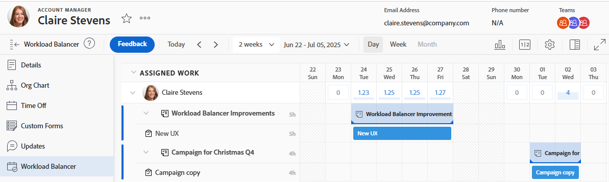

# Buscar el Distribuidor de cargas de trabajo

Puede utilizar el Distribuidor de cargas de trabajo para programar los recursos para el trabajo o revisar su disponibilidad y las asignaciones actuales.

Puede acceder al Distribuidor de cargas de trabajo de las siguientes maneras:

* Desde varias áreas predefinidas por Adobe Workfront
* Añadiéndolo al panel izquierdo como un panel

Este artículo describe las áreas a las que puede acceder al Distribuidor de cargas de trabajo.

>[!NOTE]
>
>Independientemente del método que utilice para acceder al Distribuidor de cargas de trabajo, navegar por él y administrar los recursos es idéntico.
>
>Para obtener información sobre el Distribuidor de cargas de trabajo y cómo utilizarlo para administrar y programar los recursos para el trabajo, consulte los siguientes artículos:
>
>* [Información general del Distribuidor de cargas de trabajo](../../resource-mgmt/workload-balancer/overview-workload-balancer.md)
>* [Navegar por el Distribuidor de cargas de trabajo](../../resource-mgmt/workload-balancer/navigate-the-workload-balancer.md)
>* [Información general sobre la asignación de trabajo en el Distribuidor de cargas de trabajo](../../resource-mgmt/workload-balancer/assign-work-in-workload-balancer.md)
>* [Administrar asignaciones de usuario en el Distribuidor de cargas de trabajo](../../resource-mgmt/workload-balancer/manage-user-allocations-workload-balancer.md)

## Requisitos de acceso

+++ Expanda para ver los requisitos de acceso para la funcionalidad en este artículo.

<table style="table-layout:auto"> 
 <col> 
 <col> 
 <tbody> 
  <tr> 
   <td>paquete de Adobe Workfront</td> 
   <td>
Cualquiera
</td>
  </tr> 
  <tr> 
   <td>Licencia de Adobe Workfront</td> 
   <td>
Estándar

       
Planificar, al utilizar el Distribuidor de cargas de trabajo en el área de Recursos; Trabajar, al utilizar el Distribuidor de cargas de trabajo de un equipo o proyecto

       
Nota: Todos los usuarios pueden acceder al Distribuidor de cargas de trabajo en sus propios perfiles de usuario, sin ningún requisito de licencia.
</td>
  </tr> 
   <td>Configuraciones de nivel de acceso</td> 
   <td> 
Acceso de visualización o superior a lo siguiente:
 
    <ul> 
     <li>Administración de recursos</li> 
     <li>Proyectos</li> 
     <li>Tareas</li> 
     <li>Problemas</li> 
    </ul> </td> 
  </tr> 
  <tr> 
   <td>Permisos de objeto</td> 
   <td>Permisos de visualización o superiores a proyectos, tareas y problemas</td> 
  </tr> 
 </tbody> 
</table>

Para obtener más información, consulte [Requisitos de acceso en la documentación de Workfront](/help/quicksilver/administration-and-setup/add-users/access-levels-and-object-permissions/access-level-requirements-in-documentation.md).

+++

## Acceso al Distribuidor de cargas de trabajo en áreas predefinidas

Las secciones siguientes ilustran dónde puede acceder al Distribuidor de cargas de trabajo dentro de Workfront.

### Acceso al Distribuidor de cargas de trabajo para varios proyectos en el área de Recursos

{{step1-to-resourcing}}

1. Haga clic en **Distribuidor de cargas de trabajo** en el panel de la izquierda.

   

   El Distribuidor de cargas de trabajo muestra la siguiente información de forma predeterminada en el área de Recursos:

   * **Trabajo sin asignar**: no hay elementos de trabajo sin asignar.
   * **Trabajo asignado**: todos los usuarios activos en el sistema.

     Se recomienda utilizar filtros al mostrar los usuarios en el área de Trabajo asignado. Para obtener más información, consulte [Filtrar información en el Distribuidor de cargas de trabajo](../workload-balancer/filter-information-workload-balancer.md).

### Acceso al Distribuidor de cargas de trabajo para un equipo

Para obtener más información sobre los equipos en Workfront, consulte [Información general de los equipos](/help/quicksilver/people-teams-and-groups/create-and-manage-teams/teams-overview.md).

{{step1-to-team}}

Se muestra la página de su equipo de inicio.

1. Haga clic en **Distribuidor de cargas de trabajo** en el panel de la izquierda.

   

   El Distribuidor de cargas de trabajo de un equipo muestra la siguiente información de forma predeterminada:

   * **Trabajo sin asignar**: elementos asignados al equipo y no asignados a usuarios.
   * **Trabajo asignado**: todos los miembros del equipo con todas sus asignaciones.

     >[!TIP]
     >
     >Los integrantes del equipo pueden estar asignados a trabajos que también están asignados al equipo o a trabajos asignados a otros equipos o funciones.

### Acceso al Distribuidor de cargas de trabajo para un proyecto

{{step1-to-projects}}

1. Haga clic en el nombre de un proyecto para abrir su página.
1. Haga clic en **Distribuidor de cargas de trabajo** en el panel de la izquierda.

   Se muestra el Distribuidor de cargas de trabajo para el proyecto.

   

   El Distribuidor de cargas de trabajo de un proyecto muestra lo siguiente a modo de información de forma predeterminada:

   * **Trabajo sin asignar**: elementos del proyecto que están asignados a funciones o equipos de trabajo y no están asignados a usuarios.
   * **Trabajo asignado**: usuarios asignados a elementos del proyecto.

     >[!TIP]
     >
     >Puede mostrar todos los usuarios del sistema en lugar de solo los del proyecto (en el área de Trabajo asignado) habilitando la opción Mostrar todos los usuarios. Para obtener más información, consulte [Navegar por el Distribuidor de cargas de trabajo](../workload-balancer/navigate-the-workload-balancer.md).

### Acceso al Distribuidor de cargas de trabajo para un usuario

Todos los usuarios tienen acceso para ver el Distribuidor de cargas de trabajo en sus propios perfiles. Los datos del Distribuidor de cargas de trabajo de un usuario son de solo lectura. No puede asignar trabajo, anular la asignación de trabajo ni ajustar asignaciones en el nivel de usuario.

Todos los ajustes de visualización están disponibles para el Distribuidor de cargas de trabajo de un usuario. Para obtener más información, consulte [Navegar por el Distribuidor de cargas de trabajo](/help/quicksilver/resource-mgmt/workload-balancer/navigate-the-workload-balancer.md).

{{step1-click-profile-pic}}

1. Haga clic en **Distribuidor de cargas de trabajo** en el panel de la izquierda.

   Aparece el Distribuidor de cargas de trabajo para el usuario.

   

   El Distribuidor de cargas de trabajo de un usuario muestra lo siguiente a modo de información de forma predeterminada:

   * **Trabajo asignado**: las tareas y problemas asignados al usuario específico.

## Añada el Distribuidor de cargas de trabajo al panel izquierdo como panel

Puede agregar el Distribuidor de cargas de trabajo como un panel de control al panel izquierdo de objetos que permiten la personalización.

La mayoría de las personalizaciones que ya se han aplicado al Distribuidor de cargas de trabajo se conservan al agregarlo al panel izquierdo.

1. Acceda al Distribuidor de cargas de trabajo en cualquiera de las siguientes áreas:

   * El área de Recursos
   * Un equipo
   * Un proyecto

1. Obtenga un vínculo que se puede compartir y cópielo en el portapapeles tal como se describe en [Compartir el Distribuidor de cargas de trabajo con un vínculo](../../resource-mgmt/workload-balancer/share-link-for-workload-balancer.md).
1. Cree un panel de control con una página externa como se describe en [Incrustar una página web externa en un panel de control](../../reports-and-dashboards/dashboards/creating-and-managing-dashboards/embed-external-web-page-dashboard.md). Utilice el vínculo que se puede compartir obtenido en el paso 2 para la página externa.

   <!--
      (NOTE: ensure this stays correct)
      -->

1. Agregue un tablero al panel de navegación izquierdo de un objeto, tal como se describe en [Agregue un tablero al panel izquierdo de un objeto o área de Workfront](../../workfront-basics/manage-your-account-and-profile/configuring-your-user-profile/create-custom-tabs.md) para colocar el tablero en la ficha personalizada.

   Al acceder al Distribuidor de cargas de trabajo desde el panel, puede verlo como si estuviera accediendo directamente desde una de sus áreas originales enumeradas en el paso 1.

   <!--
      (NOTE: ensure this stays correct)
     -->

1. (Opcional) Comparta el tablero en una plantilla de diseño como se describe en [Personalice el panel izquierdo con una plantilla de diseño](../../administration-and-setup/customize-workfront/use-layout-templates/customize-left-panel.md)

<!--
For a team:

* From the Workload Balancer section of a team.

  You can adjust allocations and review or assign work from multiple projects to individual team members.

For a project:

  You can do the following when you use the Workload Balancer within a project:

   * Assign work on the project to users already assigned other work on the project.
   * Assign work to any user that might not be on the project.

   * View additional work that users are assigned to on other projects.
   * Adjust user allocations to work items.-->
