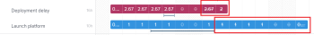
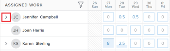

# Administrar asignaciones de usuario en el equilibrador de carga de trabajo

Como administrador de recursos, puede asignar trabajo a usuarios y administrar sus asignaciones diarias, semanales o mensuales desde el equilibrador de carga de trabajo para garantizar que se les asigne una cantidad de horas que se ajuste a sus programaciones disponibles.

## Requisitos de acceso {#access-requirements}

Debe tener lo siguiente:

<table style="table-layout:auto"> 
 <col> 
 <col> 
 <tbody> 
  <tr> 
   <td role="rowheader">plan de Adobe Workfront*</td> 
   <td> <p>Cualquiera </p> </td> 
  </tr> 
  <tr> 
   <td role="rowheader">Licencia de Adobe Workfront*</td> 
   <td> <p>Planificar, al utilizar el equilibrador de carga de trabajo para un equipo o en el área de recursos </p>
   <p>Trabajar, al utilizar el equilibrador de carga de trabajo de un proyecto </p>
 </td> 
  </tr> 
  <tr> 
   <td role="rowheader">Configuración del nivel de acceso*</td> 
   <td> <p>Edite el acceso a lo siguiente:</p> 
    <ul> 
     <li> <p>Administración de recursos</p> </li> 
     <li> <p>Proyectos</p> </li> 
     <li> <p>Tareas</p> </li> 
     <li> <p>Problemas</p> </li> 
    </ul> <p>Si todavía no tiene acceso, pregunte a su administrador de Workfront si establece restricciones adicionales en su nivel de acceso. Para obtener información sobre cómo un administrador de Workfront puede cambiar su nivel de acceso, consulte <a href="../../administration-and-setup/add-users/configure-and-grant-access/create-modify-access-levels.md" class="MCXref xref">Crear o modificar niveles de acceso personalizados</a>.</p> </td> 
  </tr> 
  <tr> 
   <td role="rowheader">Permisos de objeto</td> 
   <td> <p>Permisos de Contribute o superiores que incluyen Realizar asignaciones a las tareas y problemas para los que desea administrar asignaciones. </p> <p>O </p> <p>Administre permisos para las tareas para las que desea actualizar las horas planificadas, además de actualizar las asignaciones. Para obtener información sobre la actualización de las horas planificadas en el equilibrador de carga de trabajo, consulte la <a href="#update-task-planned-hours-when-managing-user-allocations">Actualizar las horas planificadas de la tarea al administrar las asignaciones de usuario</a> en este artículo. </p> <p>Para obtener información sobre los permisos de tareas, consulte <a href="../../workfront-basics/grant-and-request-access-to-objects/share-a-task.md">Compartir una tarea </a><span> y para obtener información sobre los permisos del problema, consulte</span> <span href="../../workfront-basics/grant-and-request-access-to-objects/share-an-issue.md"><a href="../../workfront-basics/grant-and-request-access-to-objects/share-an-issue.md">Compartir un problema </a></span>. </p> <p>Para obtener información sobre la solicitud de acceso adicional, consulte <a href="../../workfront-basics/grant-and-request-access-to-objects/request-access.md">Solicitar acceso a objetos </a>.</p> </td> 
  </tr> 
 </tbody> 
</table>

*Para saber qué plan, tipo de licencia o acceso tiene, póngase en contacto con el administrador de Workfront.

## Comprender las asignaciones de usuario

Las asignaciones de usuario son cantidades de horas que indican el tiempo que un usuario debe pasar en un día o día de la semana, semana o mes determinados para completar el elemento de trabajo. Se incluyen en el horario previsto del tema de trabajo.

Este artículo describe cómo actualizar las asignaciones diarias, semanales o mensuales por hora para los usuarios asignados a tareas o problemas. Para obtener información sobre la administración de asignaciones generales para usuarios y funciones de trabajo en tareas, consulte [Administrar horas de asignación de usuarios y funciones en tareas](../../manage-work/tasks/assign-tasks/manage-allocation-hours-on-tasks.md) .

* [Información general sobre la asignación de usuarios](#user-allocation-overview)
* [Criterios que restablecen las asignaciones de usuario](#criteria-that-reset-user-allocations)

### Información general sobre la asignación de usuarios {#user-allocation-overview}

Puede mostrar la asignación de usuarios como horas o como un valor de porcentaje en el equilibrador de carga de trabajo. Puede ajustar las horas o los porcentajes.

Las asignaciones de usuario se incluyen en el número de horas planificadas de un elemento de trabajo. Para obtener información sobre las horas planificadas, consulte [Información general sobre las horas planificadas](../../manage-work/tasks/task-information/planned-hours.md).

La tarea Horario planificado se distribuye equitativamente entre todos los días dentro de la Duración de la tarea para el usuario asignado a la tarea. Por ejemplo, si una tarea tiene una duración de 5 días y un total de 10 horas planificadas, el número de asignaciones diarias para la tarea es de 2 horas. La asignación semanal es de 10 horas. Esto significa que se asigna a un usuario para que trabaje en la tarea durante 2 horas al día. Sin embargo, puede cambiar manualmente la asignación diaria para el usuario mediante el equilibrador de carga de trabajo.

>[!CAUTION]
>
>El equilibrador de carga de trabajo solo muestra hasta 1000 horas planificadas por elemento de trabajo y hasta 1000 días de la duración de un elemento. Las asignaciones del equilibrador de carga de trabajo se muestran como cero después de alcanzar el límite de 1000 horas o 1000 días. Se recomienda dividir las tareas en subtareas más pequeñas para dar cabida a un mayor número de horas planificadas o a duraciones de más de 1000 días.

Tenga en cuenta lo siguiente cuando busque asignaciones diarias, semanales o mensuales para tareas o problemas en el equilibrador de carga de trabajo:

* Puede ver las asignaciones diarias, semanales y mensuales de los usuarios a sus elementos de trabajo. Active la vista Semana o Mes para mostrar las asignaciones semanales o mensuales.
* Puede utilizar el equilibrador de carga de trabajo para modificar la asignación diaria, semanal o mensual de los usuarios a las tareas o problemas. Para obtener información sobre el ajuste de la vista del equilibrador de carga de trabajo, consulte [Navegar por el equilibrador de carga de trabajo](../../resource-mgmt/workload-balancer/navigate-the-workload-balancer.md).

   >[!NOTE]
   >
   >Le recomendamos que tome una decisión sobre el intervalo de tiempo (diario, semanal o mensual) que desee usar siempre al administrar las asignaciones de usuario y no cambiar entre ellas para los mismos elementos de trabajo. Al actualizar las asignaciones semanales para el mismo usuario para el que actualizó anteriormente las asignaciones diarias, se cambia la asignación diaria para el usuario.

* Puede actualizar las asignaciones para los días laborables y no laborables.
* Las marcas de tiempo para las fechas de inicio y finalización planificadas de los elementos de trabajo, así como la programación del proyecto, son importantes cuando Workfront calcula automáticamente la asignación diaria de la tarea.

>[!INFO]
>
> Por ejemplo, una tarea puede tener una duración de 2 días y 2 horas planificadas y tiene una hora de inicio planeada de 12:00 p.m. el primer día de la duración con un usuario y una programación de proyecto que termina a las 5 p.m. La capacidad del usuario para el primer día es de 5 horas. La capacidad del usuario para el segundo día es de 8 horas (si la programación comienza a las 9 de la mañana).
>
>Workfront calcula la asignación de las 2 horas durante los 2 días de la duración mediante la fórmula siguiente:
>
>
```
>
>   Daily allocation hours = (Total Planned Hours / Total of available hours) * Daily available hours
>```
>
>  Para nuestro ejemplo, las horas de asignación diarias para cada día son:
>   
>  (2 / 13) * 5 = 0,77 horas de asignación para el primer día
>
>  (2 / 13) * 8 = 1,23 horas de asignación para el segundo día
>
>  En los cálculos anteriores, 13 es el total de horas disponibles para la tarea: 5 + 8 = 13


* Dos usuarios con diferentes zonas horarias o programaciones en zonas horarias diferentes a las de los usuarios asignados pueden hacer que las cantidades de asignación aparezcan de forma diferente a dos usuarios que ven los mismos elementos de trabajo.

* Cuando un usuario ha programado la hora de descanso, el día o la parte del día aparecen en un fondo gris. Si el administrador de Workfront habilitó la configuración Tiempo de espera de usuario en el área Configuración para tener en cuenta el tiempo de espera del usuario, las horas asignadas se trasladarán al siguiente día disponible en la cronología. Si se deshabilita la configuración, las horas asignadas permanecerán en el día marcado para el tiempo libre y el usuario se mostrará como sobreasignado. Para obtener más información, consulte [Configurar las preferencias de proyecto de todo el sistema](../../administration-and-setup/set-up-workfront/configure-system-defaults/set-project-preferences.md).

   >[!TIP]
   >
   >Si el tiempo de espera se marcó después de que el usuario fuera asignado a un elemento de trabajo, debe volver a calcular la cronología del proyecto para mostrar la asignación movida. Para obtener más información, consulte [Volver a calcular las líneas de tiempo del proyecto](../../manage-work/projects/manage-projects/recalculate-project-timeline.md).

* Si hay varios usuarios asignados a la tarea, la cantidad de horas planeadas se distribuye uniformemente entre cada usuario primero y luego uniformemente a cada día dentro de la Duración de la tarea. Esta distribución se convierte en la asignación de cada usuario a la tarea.

   Por ejemplo, podrían darse los siguientes escenarios:

   * Para una tarea con una duración de 2 días y con 10 horas planificadas asignadas a un usuario, la asignación diaria para el usuario es de 5 horas para cada día de forma predeterminada.
   * Para una tarea con una duración de 2 días y con 10 horas planificadas asignadas a dos usuarios, la asignación diaria para cada usuario es de 2,5 horas para cada día de forma predeterminada.

* Si se completa una tarea o un problema antes de la fecha de finalización planeada, se elimina el número de horas asignadas para los días restantes y no se cuenta para la asignación general del usuario. Esto solo se muestra cuando están activados el icono Mostrar asignaciones y el ajuste Mostrar fechas proyectadas . Para obtener más información sobre cómo habilitar la configuración en el equilibrador de carga de trabajo, consulte [Navegar por el equilibrador de carga de trabajo](../../resource-mgmt/workload-balancer/navigate-the-workload-balancer.md).

   

* Cuando un usuario está sobreasignado, sus horas asignadas se muestran con un fondo rojo en el campo de usuario.
* Cuando se asigna al usuario una cantidad inferior a la asignada o de horas iguales a la hora disponible programada, las horas se muestran con un fondo azul.
* Puede mostrar la asignación de usuarios en una vista de gráfico en la línea de usuario. Para obtener información sobre cómo habilitar la vista de gráfico para las asignaciones de usuario, consulte la sección &quot;Navegar por el equilibrador de carga de trabajo&quot; en el artículo [Navegar por el equilibrador de carga de trabajo](../../resource-mgmt/workload-balancer/navigate-the-workload-balancer.md).

   

### Criterios que restablecen las asignaciones de usuario {#criteria-that-reset-user-allocations}

No todos los cambios de tareas déclencheur las asignaciones modificadas para redistribuir. Sin embargo, hay ciertas acciones que podrían restablecer las asignaciones ya ajustadas de sus recursos y redistribuirlas uniformemente a todos los días durante la duración del elemento de trabajo para cada uno de los asignadores.

>[!NOTE]
>
>Si no ha modificado la distribución automática de asignaciones en elementos de trabajo, las horas se redistribuyen de manera uniforme entre todos los asignadores cuando hay un cambio en el número de asignadores, la duración de una tarea o la cantidad de horas planificadas en el elemento de trabajo.

* [Acciones que restablecen asignaciones ajustadas](#actions-that-reset-adjusted-allocations)
* [Acciones que no restablecen asignaciones ajustadas](#actions-that-do-not-reset-adjusted-allocations)

#### Acciones que restablecen asignaciones ajustadas {#actions-that-reset-adjusted-allocations}

Las siguientes acciones restablecen o modifican las asignaciones diarias, semanales o mensuales para los usuarios después de ajustarlas manualmente como se describe en la sección [Modificación de las asignaciones de usuario](#modify-user-allocations) en este artículo:

* Cuando acorta la longitud de un elemento de trabajo que acorta la cantidad de días en su Duración, las horas asignadas ajustadas de los días perdidos se agregan a la cantidad de asignación del último día del elemento de trabajo.
* Cuando se cambia la cantidad de horas planificadas en una asignación o en el elemento de trabajo, el nuevo número de horas planificadas se redistribuye uniformemente durante toda la duración del elemento de trabajo.
* Cuando se agrega o se elimina un usuario asignado a un elemento de trabajo y esto hace que cambien las horas planificadas de la tarea, los valores ajustados se redistribuyen uniformemente.

#### Acciones que no restablecen asignaciones ajustadas {#actions-that-do-not-reset-adjusted-allocations}

Los siguientes cambios en un elemento de trabajo no tienen en déclencheur las asignaciones ajustadas para restablecer o modificar:

* Cuando se mueven los días de un elemento de trabajo pero la cantidad de días en Duración no cambia, los valores asignados ajustados permanecen iguales y se mueven a las nuevas fechas.
* Cuando se aumenta la duración de un elemento de trabajo que aumenta el número de días en su duración, las horas asignadas ajustadas siguen siendo las mismas para los días ajustados. Se agregan días adicionales al elemento de trabajo con 0 horas asignadas.
* Cuando agrega o elimina un usuario asignado a un elemento de trabajo y esto no provoca que cambien las horas planificadas del elemento, los valores ajustados siguen siendo los mismos.

## Localizar horas planificadas en el equilibrador de carga de trabajo

Puede modificar las asignaciones de usuario a tareas o problemas mediante el equilibrador de carga de trabajo buscando las horas planificadas de las tareas o problemas asignados a los usuarios.

Tenga en cuenta lo siguiente al ver las horas planificadas en el equilibrador de carga de trabajo:

* El total de horas planificadas para una tarea o un problema aparece junto al nombre de la tarea o del problema a la izquierda del equilibrador de carga de trabajo.

* El total de horas planificadas para un proyecto se muestra junto al nombre del proyecto a la izquierda del equilibrador de carga de trabajo. Esto representa el total de horas planificadas para todas las tareas y problemas enumerados en el proyecto en el equilibrador de carga de trabajo y no todas las horas planificadas del proyecto.
* La cantidad de tiempo que se asigna diariamente o semanalmente para todas las tareas y para todos los proyectos solo se muestra cuando se habilita manualmente la opción Mostrar asignaciones. Para obtener información sobre cómo habilitar la configuración en el equilibrador de carga de trabajo, consulte [Navegar por el equilibrador de carga de trabajo](../../resource-mgmt/workload-balancer/navigate-the-workload-balancer.md).

## Modificación de las asignaciones de usuario {#modify-user-allocations}

Como parte de la asignación de trabajo a los usuarios, puede modificar las asignaciones de usuario en el equilibrador de carga de trabajo para asegurarse de que nunca se sobreasignen, o para garantizar un equilibrio preciso de horas entre los recursos. Para obtener información sobre cómo identificar si un usuario está sobreasignado, consulte la sección [Información general sobre la asignación de usuarios](#user-allocation-overview) en este artículo.

1. Asegúrese de que tiene tareas y problemas asignados a los usuarios. Para obtener información sobre la asignación de trabajo a usuarios en el equilibrador de carga de trabajo, consulte [Información general sobre la asignación de trabajo en el equilibrador de carga de trabajo](../../resource-mgmt/workload-balancer/assign-work-in-workload-balancer.md).
1. Vaya al equilibrador de carga de trabajo .
1. (Opcional) Haga clic en **Semana** o **Mes** para administrar las asignaciones semanales o mensuales para los usuarios.

   

1. En el **Trabajo asignado** , busque el usuario para el que desea modificar manualmente la asignación y haga clic en la flecha que apunta a la derecha a la izquierda del nombre de usuario para expandir el usuario.

   

1. Haga clic en la flecha hacia la derecha situada a la izquierda del nombre del proyecto para expandir el proyecto y mostrar los elementos de trabajo a los que está asignado el usuario.

   >[!TIP]
   >
   >Puede modificar las asignaciones de usuario solo para tareas y problemas. No se pueden modificar las asignaciones de usuario para los proyectos.

1. (Opcional) Haga clic en el **Mostrar icono de asignaciones**  para mostrar las asignaciones de todos los elementos de trabajo.

   El nombre de las tareas y de los proyectos se sustituye por la asignación del usuario para la tarea o el proyecto.

1. (Opcional) Haga clic en el **Configuración** icono  y seleccione cualquiera de las siguientes opciones:

   1. **Incluir horas de problemas**. Esto le permite administrar asignaciones de problemas además de asignaciones de tareas.
   1. **Mostrar trabajo finalizado** . Se muestran los elementos completados y programados durante la cronología para la que administra las asignaciones.
   1. **Mostrar tiempo restante** . El número total de horas para cada usuario (en la línea de usuario) cambia. Con esta configuración habilitada, el equilibrador de carga de trabajo muestra las horas que cada usuario tiene disponibles para el trabajo en lugar del número de horas asignadas.

      >[!TIP]
      >
      >Modificar las asignaciones cuando esta configuración está habilitada hace que disminuya el número total en la línea de usuario.

   1. **Proyecto** en el **Seleccionar tema de color** para obtener más información. Esto muestra cada proyecto y sus respectivos elementos de trabajo en colores únicos y facilita la comprensión de los elementos que pertenecen a cada proyecto.
   1. **Porcentaje** en el **Mostrar la asignación de usuarios en** para obtener más información. Esto muestra las asignaciones como un valor de porcentaje. La capacidad del usuario según la programación se considera del 100 %. Por ejemplo, si un usuario está asociado con una programación de 8 horas al día, 8 horas equivale a un 100% de capacidad. Si desea asignar al usuario para que trabaje 4 horas al día, actualizaría su asignación al 50%.

      >[!NOTE]
      >
      >El administrador de Workfront decide qué programación utilizar en el sistema para calcular la capacidad del usuario en el área de administración de recursos de la configuración. Para obtener más información, consulte [Configurar las preferencias de Administración de recursos](../../administration-and-setup/set-up-workfront/configure-system-defaults/configure-resource-mgmt-preferences.md).


1. Haga clic en el **Más** menú  para un elemento de trabajo, haga clic en **Editar asignaciones**.


O

Haga doble clic en el día, la semana o el mes en la barra de una tarea o problema.

Los cuadros de asignación pasan a ser editables.

1. Haga clic dentro del cuadro de cada asignación diaria, semanal o mensual para actualizar manualmente la cantidad de horas o el valor porcentual para el que desea asignar al usuario cada día, semana o mes y, a continuación, haga clic en el botón **Guardar** icono .

   >[!TIP]
   >
   >Haga clic en el **Cancelar** icono  para eliminar las asignaciones ajustadas.

   

   Las asignaciones para la actualización del usuario.

   >[!TIP]
   >
   >Si se completa una tarea o un problema antes de la fecha de finalización planeada, se elimina el número de horas asignadas para los días restantes y no se cuenta para la asignación general del usuario. Esto solo se muestra cuando están activados el icono Mostrar asignaciones y el ajuste Mostrar fechas proyectadas .

   Existen los siguientes escenarios:

   * Para las tareas con tipos de duración que no son simples o para problemas, el total de las asignaciones debe coincidir con la tarea Horario planificado antes de poder hacer clic en el icono de marca de verificación.
   * Para las tareas con una duración simple Tipo , el total de las asignaciones puede ser mayor o menor que las horas planificadas y puede hacer clic en el icono de la marca de verificación aunque no coincidan. Esto también actualiza la cantidad de horas planificadas para la tarea. Debe tener los permisos y el acceso correctos para actualizar las horas planificadas en las tareas desde el equilibrador de carga de trabajo.

      >[!TIP]
      >
      >Aparece un icono de bloqueo a la derecha del nombre de la tarea cuando se empiezan a ajustar las asignaciones para indicar que la tarea tiene un Tipo de duración simple.

      
   Para obtener más información sobre las condiciones que deben cumplirse para actualizar las horas planificadas en el equilibrador de carga de trabajo, consulte la siguiente sección de este artículo: [Actualizar las horas planificadas de la tarea al administrar las asignaciones de usuario](#update-task-planned-hours-when-managing-user-allocations). Para obtener información sobre los tipos de duración de la tarea, consulte [Información general sobre la duración y el tipo de duración de la tarea](../../manage-work/tasks/taskdurtn/task-duration-and-duration-type.md).

1. (Condicional) Si la tarea está asignada a más de un usuario, repita estos pasos para cada usuario asignado a la tarea para actualizar las asignaciones para cada usuario.

   Cualquier persona que tenga acceso para ver el equilibrador de carga de trabajo y vea los mismos usuarios y los mismos proyectos que administró, ahora verá la asignación actualizada para los usuarios que administró.

## Actualizar las horas planificadas de la tarea al administrar las asignaciones de usuario {#update-task-planned-hours-when-managing-user-allocations}

Puede actualizar las horas planificadas de una tarea al administrar las asignaciones de usuario en el equilibrador de carga de trabajo para la tarea. Esto sucede cuando el total de las horas asignadas actualizadas no coincide con el total original de las horas planificadas para una tarea.

>[!IMPORTANT]
>
>* La actualización de las horas previstas para las tareas puede afectar al progreso del proyecto.
>* Actualizar manualmente las horas planificadas cambiando las asignaciones diarias puede tener un impacto en las horas planificadas al eliminar asignaciones de las tareas en el futuro. Para obtener más información, consulte [Información general sobre las horas planificadas](../../manage-work/tasks/task-information/planned-hours.md).
>
>* No es posible actualizar las horas planificadas para problemas actualizando las asignaciones en el equilibrador de carga de trabajo.
>


Esto es posible cuando existen las siguientes condiciones:

* Tiene los permisos y el acceso correctos para administrar las horas planificadas desde el equilibrador de carga de trabajo. Entre ellas se incluyen las siguientes:

   * Administre permisos para las tareas.
   * Actualice las horas planificadas en el acceso del equilibrador de carga de trabajo en el área Administración de recursos de su nivel de acceso.

   Para obtener más información sobre el acceso necesario para utilizar el equilibrador de carga de trabajo, consulte la siguiente sección en este artículo: [Requisitos de acceso](#access-requirements) .

* La tarea tiene un Tipo de duración de Simple.

   <!--
  <p data-mc-conditions="QuicksilverOrClassic.Draft mode">(NOTE:&nbsp;the statement above might include other duration types in the future)</p>
  -->
