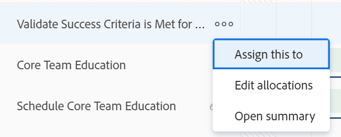

# Administrar asignaciones de usuario en el equilibrador de carga de trabajo

<!-- Audited: 01/2024 -->

Como administrador de recursos, puede asignar trabajo a los usuarios y administrar sus asignaciones diarias, semanales o mensuales desde el equilibrador de carga de trabajo para asegurarse de que se les asigna una cantidad de horas que se ajusta a sus programaciones disponibles.

## Requisitos de acceso {#access-requirements}

+++ Expanda para ver los requisitos de acceso para la funcionalidad en este artículo.

<table style="table-layout:auto"> 
 <col> 
 <col> 
 <tbody> 
  <tr> 
   <td>paquete de Adobe Workfront</td> 
   <td>
Cualquiera
</td>
  </tr>
  <tr> 
   <td>Licencia de Adobe Workfront</td> 
   <td>
Estándar

       
Planificar, al utilizar el Distribuidor de cargas de trabajo en el área de Recursos; Trabajar, al utilizar el Distribuidor de cargas de trabajo de un equipo o proyecto
</td>
  </tr>
  <tr> 
   <td>Configuraciones de nivel de acceso</td> 
   <td> 
Acceso de edición a los siguientes elementos:
 
    <ul> 
     <li>Administración de recursos</li> 
     <li>Proyectos</li> 
     <li>Tareas</li> 
     <li>Problemas</li> 
    </ul>
   </td> 
  </tr> 
  <tr> 
   <td>Permisos de objeto</td> 
   <td> 
Permisos de aportación o superiores que incluyen realizar asignaciones a las tareas y problemas para los que desea administrar asignaciones. 
 
O 
 
Permisos de administración de las tareas para las que desea actualizar las horas planificadas, además de actualizar las asignaciones. Para obtener información sobre cómo actualizar las horas planificadas en el equilibrador de carga de trabajo, consulte la sección <a href="#update-task-planned-hours-when-managing-user-allocations">Actualizar las horas planificadas de una tarea al administrar asignaciones de usuario</a> en este artículo.
 </td> 
  </tr> 
 </tbody> 
</table>

Para obtener más información, consulte [Requisitos de acceso en la documentación de Workfront](/help/quicksilver/administration-and-setup/add-users/access-levels-and-object-permissions/access-level-requirements-in-documentation.md).

+++

## Comprender las asignaciones de usuario

Las asignaciones de usuario son cantidades de horas que indican el tiempo que un usuario debe pasar un día, día de la semana, semana o mes determinados para completar el elemento de trabajo. Se incluyen en las horas planificadas del elemento de trabajo.

En este artículo se describe cómo actualizar las asignaciones por horas diarias, semanales o mensuales para los usuarios asignados a tareas o problemas. Para obtener información sobre cómo administrar las asignaciones generales de usuarios y funciones a las tareas, consulte [Administrar horas de asignación de usuarios y funciones en las tareas](../../manage-work/tasks/assign-tasks/manage-allocation-hours-on-tasks.md).

### Información general sobre la asignación de usuarios {#user-allocation-overview}

Puede mostrar la asignación de usuarios como horas o como un valor porcentual en el equilibrador de carga de trabajo. Puede ajustar las horas o los porcentajes.

Las asignaciones de usuarios se incluyen en el número de horas planificadas de un elemento de trabajo. Para obtener información sobre las horas planificadas, consulte [Información general de las horas planificadas](../../manage-work/tasks/task-information/planned-hours.md).

Las horas planificadas de la tarea se distribuyen equitativamente entre todos los días dentro de la duración de la tarea para el usuario asignado a la tarea. Por ejemplo, si una tarea tiene una duración de 5 días y un total de 10 horas planificadas, el número de asignaciones diarias de la tarea es de 2 horas. La asignación semanal es de 10 horas. Esto significa que a un usuario se le asignan 2 horas diarias para trabajar en la tarea. Sin embargo, puede cambiar manualmente la asignación diaria del usuario mediante el equilibrador de carga de trabajo.

>[!CAUTION]
>
>El Distribuidor de cargas de trabajo solo muestra <!--up to 1000 Planned Hours per work item per user, and--> hasta 1000 días de la duración de un elemento. Las asignaciones del Distribuidor de cargas de trabajo se muestran como cero después de alcanzar el límite de 1000 días. Se recomienda dividir las tareas en subtareas más pequeñas <!--to accommodate a larger number of Planned Hours or--> para duraciones de más de 1000 días.

Tenga en cuenta lo siguiente a la hora de localizar asignaciones diarias, semanales o mensuales para tareas o problemas en el equilibrador de carga de trabajo:

* Puede ver las asignaciones diarias, semanales y mensuales de los usuarios a sus elementos de trabajo. Habilite la vista Semana o Mes para mostrar las asignaciones semanales o mensuales.
* Puede usar el Equilibrador de carga de trabajo para modificar la asignación diaria, semanal o mensual de los usuarios a las tareas o problemas. Para obtener información sobre cómo ajustar la vista del Equilibrador de carga de trabajo, consulte [Navegar por el equilibrador de carga de trabajo](../../resource-mgmt/workload-balancer/navigate-the-workload-balancer.md).

  >[!NOTE]
  >
  >Le recomendamos que tome una decisión sobre el lapso de tiempo (diario, semanal o mensual) que desea utilizar siempre al administrar las asignaciones de usuarios y que no cambie entre ellos para los mismos elementos de trabajo. La actualización de las asignaciones semanales para el mismo usuario para el que previamente actualizó las asignaciones diarias cambia la asignación diaria para el usuario.

* Puede actualizar las asignaciones tanto de los días laborables como de los no laborables.
* Las marcas de tiempo para las fechas planificadas de inicio y de finalización de los elementos de trabajo, así como la programación del proyecto, son importantes cuando Workfront calcula automáticamente la asignación diaria para la tarea.

  >[!INFO]
  >
  > Por ejemplo, una tarea puede tener una duración de 2 días y 2 horas planificadas y tiene una hora de inicio planificada de 12:00 p.m. en el primer día de la duración con un usuario y una programación de proyecto que termina a las 5 p.m. La capacidad del usuario para el primer día es de 5 horas. La capacidad del usuario para el segundo día es de 8 horas (si la programación empieza a las 9 de la mañana).
  >
  >Workfront calcula la asignación de las dos horas durante los dos días de la duración mediante la fórmula siguiente:
  >
  >`Daily allocation hours = (Total Planned Hours / Total of available hours) * Daily available hours`
  >
  >Para nuestro ejemplo, las horas de asignación diarias para cada día son las siguientes:
  >   
  >(2 / 13) * 5 = 0,77 horas de asignación para el primer día
  >
  >(2 / 13) * 8 = 1,23 horas de asignación para el segundo día
  >
  >En los cálculos anteriores, 13 es el total de horas disponibles para la tarea: 5 + 8 = 13

* Dos usuarios en zonas horarias o programaciones diferentes a las de los usuarios asignados pueden hacer que las cantidades asignadas aparezcan de forma diferente para dos usuarios que vean los mismos elementos de trabajo.

* Cuando un usuario tiene días libres programados, el día o la parte del día se muestra en un fondo gris y un icono de avión indica los días libres. Si el administrador de Workfront habilitó la configuración de días libres del usuario en el área de Configuración para tener en cuenta los días libres del usuario, las horas asignadas pasan al siguiente día disponible en la línea de tiempo. Si la configuración está deshabilitada, las horas asignadas permanecen en el día marcado como días libres y el usuario se muestra como sobreasignado. Para obtener más información, consulte [Configurar las preferencias de proyecto de todo el sistema](../../administration-and-setup/set-up-workfront/configure-system-defaults/set-project-preferences.md).

  >[!TIP]
  >
  >Si los días libres se marcaron después de que el usuario se asignara a un elemento de trabajo, debe recalcular la línea de tiempo del proyecto para mostrar la asignación desplazada. Para obtener más información, consulte [Recalcular líneas de tiempo de proyecto](../../manage-work/projects/manage-projects/recalculate-project-timeline.md).

   * Cuando se asignan varios usuarios a una tarea y el usuario principal asignado tiene días libres programados, la línea de tiempo se desplaza (si las fechas no son fijas) y las horas planificadas de todos los usuarios asignados se redistribuyen a lo largo de la nueva duración de la tarea. Si la tarea tiene fechas fijas, la línea de tiempo no cambia debido a las horas libres y las horas se reasignan entre los días restantes.
   * Si las asignaciones se realizan manualmente, las horas planificadas no se reasignan después de las horas libres.

* Si hay varios usuarios asignados a la tarea, la cantidad de horas planificadas se distribuye equitativamente a cada usuario, en primer lugar, y luego equitativamente a cada día dentro de la duración de la tarea. Esta distribución se convierte en la asignación de cada usuario a la tarea.

  Por ejemplo, podrían darse los siguientes casos:

   * Para una tarea de una duración de 2 días y con 10 horas planificadas asignadas a un usuario, la asignación diaria para el usuario es de 5 horas por día de forma predeterminada.
   * Para una tarea de una duración de 2 días y con 10 horas planificadas asignadas a dos usuarios, la asignación diaria para cada usuario es de 2,5 horas por día de forma predeterminada.

* Si una tarea o incidencia finaliza antes de la fecha de finalización prevista, el número de horas asignadas para los días restantes se tacha y no cuenta para la asignación global del usuario. Esto solo se muestra cuando están habilitados tanto el icono Mostrar asignaciones como la configuración Mostrar fechas proyectadas. Para obtener más información sobre cómo habilitar la configuración en el Equilibrador de carga de trabajo, consulte [Navegar por el equilibrador de carga de trabajo](../../resource-mgmt/workload-balancer/navigate-the-workload-balancer.md).

  

* Cuando se sobreasigna a un usuario, sus horas asignadas se muestran con un fondo rojo en el campo del usuario.
* Cuando el usuario está infraasignado o se le asigna una cantidad de horas igual a su tiempo disponible programado, las horas se muestran con un fondo azul.
* Puede mostrar la asignación de los usuarios en una vista de gráfico en la línea del usuario. Para obtener información sobre cómo habilitar la vista de gráficos para las asignaciones de usuarios, consulte la sección “Navegar por el equilibrador de carga de trabajo” en el artículo [Navegar por el equilibrador de carga de trabajo](../../resource-mgmt/workload-balancer/navigate-the-workload-balancer.md).

  

### Criterios que restablecen las asignaciones de usuario {#criteria-that-reset-user-allocations}

No todos los cambios de tareas activan las asignaciones modificadas para su redistribución. Sin embargo, hay determinadas acciones que podrían restablecer las asignaciones ya ajustadas en sus recursos y redistribuirlas uniformemente a todos los días durante la duración del elemento de trabajo para cada uno de las personas asignadas.

>[!NOTE]
>
>Si no ha modificado la distribución automática de asignaciones en elementos de trabajo, las horas se redistribuyen de manera uniforme entre todas las personas asignadas cuando hay un cambio en el número de personas asignadas, la duración de una tarea o la cantidad de horas planificadas en el elemento de trabajo.

#### Acciones que restablecen asignaciones ajustadas {#actions-that-reset-adjusted-allocations}

Las siguientes acciones restablecen o modifican las asignaciones diarias, semanales o mensuales para los usuarios después de haberlas ajustado manualmente, tal como se describe en la sección [Modificar asignaciones de usuario](#modify-user-allocations) de este artículo:

* Cuando se acorta la longitud de un elemento de trabajo que acorta la cantidad de días en su Duración, las horas asignadas ajustadas de los días perdidos se añaden a la cantidad de asignación del último día del elemento de trabajo.
* Al cambiar la cantidad de horas planificadas en una asignación o en el elemento de trabajo, el nuevo número de horas planificadas se redistribuye uniformemente para toda la duración del elemento de trabajo.
* Cuando se añade o se quita una persona asignada a una elemento de trabajo y esto hace que cambien las horas planificadas de la tarea, los valores ajustados se redistribuyen uniformemente.

#### Acciones que no restablecen asignaciones ajustadas {#actions-that-do-not-reset-adjusted-allocations}

Los siguientes cambios realizados en un elemento de trabajo no activan las asignaciones ajustadas para su restablecimiento o modificación:

* Cuando se mueven los días de un elemento de trabajo pero la cantidad de días de la duración no cambia, los valores asignados ajustados permanecen igual y se mueven a las nuevas fechas.
* Al aumentar la duración de un elemento de trabajo que aumenta el número de días en su duración, las horas asignadas ajustadas siguen siendo las mismas para los días ajustados. Se añaden días adicionales al elemento de trabajo con 0 horas asignadas.
* Cuando añade o quita un usuario asignado a un elemento de trabajo y esto no hace que cambien las horas planificadas del elemento, los valores ajustados permanecen igual.

## Localizar las horas planificadas en el equilibrador de carga de trabajo

Puede modificar las asignaciones de usuarios a tareas o problemas mediante el equilibrador de carga de trabajo buscando las horas planificadas de las tareas o problemas asignados a los usuarios.

Tenga en cuenta lo siguiente al ver las horas planificadas en el equilibrador de carga de trabajo:

* El total de horas planificadas de una tarea o un problema se muestra junto al nombre de la tarea o el problema a la izquierda del equilibrador de carga de trabajo.

* El total de horas planificadas de un proyecto se muestra junto al nombre del proyecto a la izquierda del equilibrador de carga de trabajo. Representa el total de horas planificadas de todas las tareas y problemas enumerados en el proyecto en el equilibrador de carga de trabajo y no todas las horas planificadas del proyecto.
* La cantidad de tiempo asignado diaria o semanalmente para todas las tareas y todos los proyectos solo se muestra cuando habilita manualmente la configuración Mostrar asignaciones. Para obtener información sobre cómo habilitar la configuración en el equilibrador de carga de trabajo, consulte [Navegar por el equilibrador de carga de trabajo](../../resource-mgmt/workload-balancer/navigate-the-workload-balancer.md).

## Modificar asignaciones de usuario {#modify-user-allocations}

Como parte de la asignación de trabajo a los usuarios, puede modificar las asignaciones de usuarios en el equilibrador de carga de trabajo para garantizar que nunca se sobreasignen o para garantizar un equilibrio preciso de horas entre los recursos. Para obtener información sobre cómo identificar si un usuario está sobreasignado, consulte la sección [Información general sobre la asignación de usuarios](#user-allocation-overview) en este artículo.

1. Asegúrese de que tiene tareas y problemas asignados a los usuarios. Para obtener información sobre cómo asignar trabajo a los usuarios en el equilibrador de carga de trabajo, consulte [Información general sobre la asignación de trabajo en el equilibrador de carga de trabajo](../../resource-mgmt/workload-balancer/assign-work-in-workload-balancer.md).
1. Vaya al equilibrador de carga de trabajo.
1. (Opcional) Haga clic en **Semana** o **Mes** para administrar las asignaciones semanales o mensuales para los usuarios.

   

1. En el área **Trabajo asignado**, busque el usuario para el que desea modificar manualmente la asignación y haga clic en la flecha que señala a la derecha situada a la izquierda del nombre de usuario para expandir dicho usuario.

   

1. Haga clic en la flecha que señala a la derecha situada a la izquierda del nombre del proyecto para expandir el proyecto y mostrar los elementos de trabajo que tiene asignados el usuario.

   >[!TIP]
   >
   >Solo puede modificar las asignaciones de usuario para tareas y problemas. No puede modificar las asignaciones de usuario para proyectos.

1. (Opcional) Haga clic en el icono **Mostrar asignaciones**  para mostrar las asignaciones de todos los elementos de trabajo.

   El nombre de las tareas y de los proyectos se reemplaza por la asignación del usuario de la tarea o el proyecto.

1. (Opcional) Haga clic en el icono **Configuración**  y seleccione cualquiera de las siguientes opciones:

   1. **Incluir las horas de los problemas** Esto le permite administrar las asignaciones de problemas, además de las asignaciones de tareas.
   1. **Mostrar trabajo completado** Esto muestra los elementos que se han completado y que están programados durante la línea de tiempo para la que administra las asignaciones.
   1. **Mostrar tiempo restante**. El número total de horas de cada usuario (en la línea de usuario). Con esta configuración habilitada, el equilibrador de carga de trabajo muestra las horas que cada usuario tiene disponibles para trabajar en lugar del número de horas que se le asignan.

      >[!TIP]
      >
      >Modificar asignaciones cuando esta configuración está habilitada hace que disminuya el número total en la línea del usuario.

   1. **Proyecto** en la sección **Seleccionar tema de color**. Esto muestra cada proyecto y sus respectivos elementos de trabajo en colores únicos y facilita la comprensión de qué elementos pertenecen a qué proyecto.
   1. **Porcentaje** en la sección **Mostrar asignación de usuarios en**. Muestra las asignaciones de usuarios como un valor porcentual. La capacidad del usuario según la programación se considera que es del 100 %. Por ejemplo, si un usuario se asocia a una programación de 8 horas al día, 8 horas equivalen al 100 % de la capacidad. Si desea asignar al usuario 4 horas de trabajo al día, deberá actualizar su asignación al 50 %.

      >[!NOTE]
      >
      >El administrador de Workfront decide qué programación utilizar en el sistema para calcular la capacidad del usuario en el área de Administración de recursos de la configuración. Para obtener más información, consulte [Configurar las preferencias de administración de recursos](../../administration-and-setup/set-up-workfront/configure-system-defaults/configure-resource-mgmt-preferences.md).

1. Haga clic en el menú **Más**  para un elemento de trabajo y, a continuación, haga clic en **Editar asignaciones**.

   

   O

   Haga doble clic en el día, la semana o el mes en la barra de una tarea o un problema.

   Los cuadros de asignación se pueden editar.

1. Haga clic dentro del cuadro de cada asignación diaria, semanal o mensual para actualizar manualmente la cantidad de horas o el valor porcentual para el que desea que se asigne al usuario cada día, semana o mes y, a continuación, haga clic en el icono **Guardar** .

   >[!TIP]
   >
   >Haga clic en el icono **Cancelar**  para quitar las asignaciones que ha ajustado.

   

   Las asignaciones para la actualización de usuario.

   >[!TIP]
   >
   >Si una tarea o incidencia finaliza antes de la fecha de finalización prevista, el número de horas asignadas para los días restantes se tacha y no cuenta para la asignación global del usuario. Esto solo se muestra cuando el icono de **Mostrar asignaciones** y la configuración **Mostrar fechas proyectadas** están habilitados.

   Se dan los siguientes escenarios:

   * En el caso de tareas con tipos de duración que no son simples o para problemas, el total de las asignaciones debe coincidir con las horas planificadas de la tarea para que pueda hacer clic en el icono de marca de verificación.
   * En el caso de tareas con un tipo de duración simple, el total de las asignaciones puede ser mayor o menor que las horas planificadas y puede hacer clic en el icono de la marca de verificación aunque no coincidan. Esto también actualiza la cantidad de horas planificadas de la tarea. Debe tener los permisos y el acceso correctos para actualizar las horas planificadas en las tareas desde el equilibrador de carga de trabajo.

     >[!TIP]
     >
     >Se muestra un icono de candado a la derecha del nombre de la tarea a medida que empieza a ajustar las asignaciones para indicar que la tarea tiene un tipo de duración simple.

     

   Para obtener más información sobre las condiciones que se deben cumplir para actualizar las horas planificadas en el equilibrador de carga de trabajo, consulte la sección [Actualizar las horas planificadas de una tarea al administrar asignaciones de usuario](#update-task-planned-hours-when-managing-user-allocations) en este artículo. Para obtener información sobre los tipos de duración de tareas, consulte [Información general sobre la duración de tareas y el tipo de duración](../../manage-work/tasks/taskdurtn/task-duration-and-duration-type.md).

1. (Condicional) Si la tarea se asigna a más de un usuario, repita estos pasos para cada usuario asignado a la tarea para actualizar las asignaciones de cada usuario.

   Cualquier persona que tenga acceso para ver el equilibrador de carga de trabajo y vea los mismos usuarios y los mismos proyectos que administró ahora verá la asignación actualizada para los usuarios que administró.

>[!TIP]
>
>Aparece un icono de lápiz a la derecha del nombre del elemento de trabajo para indicar que se ajustó manualmente.

## Actualizar las horas planificadas de una tarea al administrar las asignaciones de usuario {#update-task-planned-hours-when-managing-user-allocations}

Puede actualizar las horas planificadas de una tarea al administrar las asignaciones de usuarios en el equilibrador de carga de trabajo de la tarea. Esto sucede cuando el total de las horas asignadas actualizadas no coincide con el total original de las horas planificadas de una tarea.

>[!IMPORTANT]
>
>* Actualizar las horas planificadas de las tareas puede afectar al progreso del proyecto.
>* Actualizar manualmente las horas planificadas cambiando las asignaciones diarias puede afectar a las horas planificadas cuando se quitan asignaciones de las tareas en el futuro. Para más información, consulte [Información general de las horas planificadas](../../manage-work/tasks/task-information/planned-hours.md).
>
>* No es posible actualizar las horas planificadas de los problemas actualizando las asignaciones en el equilibrador de carga de trabajo.

Esto es posible cuando existen las siguientes condiciones:

* Tiene los permisos y el acceso correctos para administrar las horas planificadas desde el equilibrador de carga de trabajo. Entre ellos se incluyen los siguientes:

   * Permisos de administración de las tareas.
   * Acceso para actualizar las horas planificadas en el equilibrador de carga de trabajo en el área de Administración de recursos de su nivel de acceso.

  Para obtener más información sobre el acceso necesario para usar el equilibrador de carga de trabajo, consulte la sección [Requisitos de acceso](#access-requirements) en este artículo.

* La tarea tiene un tipo de duración simple.

