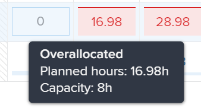

# Navegar por el equilibrador de carga de trabajo

Utilice el equilibrador de carga de trabajo en Adobe Workfront para asignar trabajo a los usuarios según su disponibilidad. En este artículo se describe cómo puede utilizar la configuración y las opciones para desplazarse por el equilibrador de carga de trabajo y mostrar la información que le interesa. Los artículos adicionales que se enumeran aquí describen cómo puede utilizar el equilibrador de carga de trabajo para administrar sus recursos y su asignación para funcionar.

El equilibrador de carga de trabajo está disponible en varias áreas de Adobe Workfront. Navegar es similar en todas las áreas.

Para obtener más información sobre la ubicación del equilibrador de carga de trabajo, consulte [Localizar el equilibrador de carga de trabajo](https://experienceleague.adobe.com/docs/workfront/using/manage-resources/the-workload-balancer/locate-workload-balancer.html?lang=en).

## Requisitos de acceso

<!--drafted - replace table for P&P:

<table style="table-layout:auto"> 
 <col> 
 <col> 
 <tbody> 
  <tr> 
   <td role="rowheader">Adobe Workfront plan*</td> 
   <td> 
Any 
 </td> 
  </tr> 
  <tr> 
   <td role="rowheader">Adobe Workfront license*</td> 
<td>
Current license: Standard 

    Or 

Legacy license:

    <ul>
    <li>
Plan, when using the Workload Balancer for a team or in the Resourcing area 
</li>
    <li>
Work, when using the Workload Balancer of a project 
</li>
    </ul>
 </td> 
  </tr> 
  <tr> 
   <td role="rowheader">Access level configurations*</td> 
   <td> 
View or higher access to the following:
 
    <ul> 
     <li> 
Resource Management
 </li> 
     <li> 
Projects
 </li> 
     <li> 
Tasks
 </li> 
     <li> 
Issues
 </li> 
    </ul> 
If you still don't have access, ask your Workfront administrator if they set additional restrictions in your access level. For information on how a Workfront administrator can change your access level, see <a href="../../administration-and-setup/add-users/configure-and-grant-access/create-modify-access-levels.md" class="MCXref xref">Create or modify custom access levels</a>.
 </td> 
  </tr> 
  <tr> 
   <td role="rowheader">Object permissions</td> 
   <td> 
View or higher permissions to the projects, tasks, and issues 
 
For information on requesting additional access, see <a href="../../workfront-basics/grant-and-request-access-to-objects/request-access.md" class="MCXref xref">Request access to objects </a>.
 </td> 
  </tr> 
 </tbody> 
</table>
-->

Debe tener el siguiente acceso para realizar los pasos de este artículo:

<table style="table-layout:auto"> 
 <col> 
 <col> 
 <tbody> 
  <tr> 
   <td role="rowheader">plan de Adobe Workfront*</td> 
   <td> 
Cualquiera 
 </td> 
  </tr> 
  <tr> 
   <td role="rowheader">Licencia de Adobe Workfront*</td> 
   <td> 
Planificar, al utilizar el equilibrador de carga de trabajo para un equipo o en el área de recursos 

   
Trabajar, al utilizar el equilibrador de carga de trabajo de un proyecto 

 </td> 
  </tr> 
  <tr> 
   <td role="rowheader">Configuraciones de nivel de acceso*</td> 
   <td> 
Ver o acceso superior a lo siguiente:
 
    <ul> 
     <li> 
Administración de recursos
 </li> 
     <li> 
Proyectos
 </li> 
     <li> 
Tareas
 </li> 
     <li> 
Problemas
 </li> 
    </ul> 
Si todavía no tiene acceso, pregunte a su administrador de Workfront si establece restricciones adicionales en su nivel de acceso. Para obtener información sobre cómo un administrador de Workfront puede cambiar su nivel de acceso, consulte <a href="../../administration-and-setup/add-users/configure-and-grant-access/create-modify-access-levels.md" class="MCXref xref">Crear o modificar niveles de acceso personalizados</a>.
 </td> 
  </tr> 
  <tr> 
   <td role="rowheader">Permisos de objeto</td> 
   <td> 
Ver o permisos superiores para proyectos, tareas y problemas 
 
Para obtener información sobre la solicitud de acceso adicional, consulte <a href="../../workfront-basics/grant-and-request-access-to-objects/request-access.md" class="MCXref xref">Solicitar acceso a objetos </a>.
 </td> 
  </tr> 
 </tbody> 
</table>

*Para saber qué plan, tipo de licencia o acceso tiene, póngase en contacto con el administrador de Workfront.

## Consideraciones para ver elementos en el equilibrador de carga de trabajo

Tenga en cuenta lo siguiente al ver el equilibrador de carga de trabajo:

* El equilibrador de carga de trabajo muestra elementos de trabajo en dos áreas independientes, según sus asignaciones. Los elementos de trabajo y los usuarios se muestran en las siguientes áreas:

   * **Trabajo no asignado**: Los artículos que no tienen asignaciones o que están asignados únicamente a roles de trabajo o equipos.
   * **Trabajo asignado**: Elementos que están asignados a al menos un usuario. Los elementos asignados se muestran bajo el nombre del usuario asignado.

   >[!NOTE]
   >
   >* Los elementos asignados a una función de trabajo o a un equipo que también están asignados a un usuario que es el usuario asignado principal no se muestran en el área Trabajo no asignado.
   >
   >* Los elementos asignados a un usuario y una función de trabajo donde la función de trabajo está seleccionada como asignador principal del elemento se muestran en el área Trabajo no asignado.
   >* Los elementos asignados a más de un usuario se muestran con los nombres de todos los usuarios en el área Trabajo asignado .

* Cuando un proyecto no tiene tareas durante un período de tiempo, la barra a nivel de proyecto se convierte en un color tenue.

   

* Cuando no tiene permisos para ver ciertos elementos, aparecen como **Elementos de trabajo inaccesibles** o **Proyectos inaccesibles**.

   

* Los nombres de los elementos de trabajo se muestran a la izquierda y su cronología aparece a la derecha.
* El total de horas planificadas para cada elemento de trabajo se muestra a la derecha del nombre del elemento de trabajo y a la izquierda de la barra que representa la cronología del elemento de trabajo.
* El total de horas planificadas para cada proyecto se muestra a la derecha del nombre del proyecto y a la izquierda de la barra que representa la cronología del proyecto.

   La información Horario planificado para el proyecto es un total de Horas planificadas de todos los elementos enumerados en el equilibrador de carga de trabajo, y no un total de Horas planificadas para el proyecto.

Para obtener más información sobre la visualización de información en el equilibrador de carga de trabajo, consulte también los siguientes artículos:

* [Localizar el equilibrador de carga de trabajo](../workload-balancer/locate-workload-balancer.md)
* [Filtrar información en el equilibrador de carga de trabajo](../workload-balancer/filter-information-workload-balancer.md)
* [Uso compartido de Workload Balancer con un vínculo](../workload-balancer/share-link-for-workload-balancer.md)
* [Actualizar elementos de trabajo en el equilibrador de carga de trabajo mediante el resumen](../workload-balancer/update-items-in-summary-panel-in-workload-balancer.md)

Para obtener información sobre la administración de recursos mediante el equilibrador de carga de trabajo, consulte también los siguientes artículos:

* [Información general sobre la asignación de trabajo en el equilibrador de carga de trabajo](https://experienceleague.adobe.com/docs/workfront/using/manage-resources/the-workload-balancer/assign-work-in-workload-balancer.html?lang=en)
* [Administrar asignaciones de usuario en el equilibrador de carga de trabajo](https://experienceleague.adobe.com/docs/workfront/using/manage-resources/the-workload-balancer/manage-user-allocations-workload-balancer.html?lang=en)

## Navegar por el equilibrador de carga de trabajo para varios proyectos en el área de recursos

El desplazamiento por el equilibrador de carga de trabajo es similar en todas las áreas desde las que se accede a él.

Las siguientes subsecciones describen cómo ver la información en el equilibrador de carga de trabajo para varios proyectos.

Puede ajustar una serie de configuraciones y opciones en el equilibrador de carga de trabajo para mostrar la información en la que debe centrarse en el lapso de tiempo más adecuado para usted.

Después de seleccionar la configuración que desea aplicar a la vista, el equilibrador de carga de trabajo recuerda esta configuración cada vez que accede a ella desde cualquier explorador o dispositivo.

### Acceso al equilibrador de carga de trabajo para varios proyectos en el área de recursos

Para desplazarse por el equilibrador de carga de trabajo en varios proyectos:

1. Haga clic en el **Menú principal** icono  en la esquina superior derecha de Workfront, haga clic en **Recurso**.
1. Haga clic en **Equilibrador de carga de trabajo** en el panel izquierdo.

   

   El equilibrador de carga de trabajo muestra la información de asignación de trabajo a partir de la semana actual en las dos áreas siguientes:

   * La variable **Trabajo no asignado** muestra los siguientes elementos de trabajo:

      * Después de aplicar filtros, aparecen los elementos de trabajo (tareas y problemas) asignados a funciones, equipos o que no están asignados.
El área de trabajo sin asignar no muestra ningún elemento de trabajo de forma predeterminada. Se recomienda utilizar filtros para mostrar información relevante para usted en esta área.

         Para obtener información sobre el uso de filtros, consulte [Filtrar información en el equilibrador de carga de trabajo](../workload-balancer/filter-information-workload-balancer.md).

      * Los proyectos solo se muestran cuando se activa la opción Agrupar por proyecto . Para obtener más información, consulte la sección [Personalizar la vista](#customize-the-view) en este artículo.
   * La variable **Trabajo asignado** muestra los siguientes elementos de trabajo:

      * Todos los usuarios activos del sistema se muestran en esta área de forma predeterminada. Se recomienda utilizar filtros para limitar la cantidad de información en esta área. Si los usuarios están asignados a elementos, los elementos de trabajo también se muestran bajo su nombre.

      * Las tareas y los problemas asignados a al menos un usuario se muestran bajo el nombre del usuario.

         Los elementos de trabajo bajo los nombres de los usuarios en el área Trabajo asignado se ordenan según los siguientes criterios, en este orden:

         1. Fecha de inicio planeada (la más antigua primero)
         1. Fecha de finalización planeada (la más antigua primero)
         1. Alfabético por proyecto (solo cuando los dos primeros criterios son idénticos para varios elementos de trabajo)

            >[!TIP]
            >
            >* Puede personalizar la ordenación del proyecto seleccionando una opción en el ajuste &quot;Ordenar proyectos por&quot;.
            >
            >* Los proyectos solo se muestran cuando se activa la opción &quot;Agrupar por proyecto&quot;.

            > 
            >Para obtener información sobre la personalización de la configuración, consulte la sección [Personalizar la vista](#customize-the-view) en este artículo.

1. (Opcional) Haga clic en el **Filtro** icono  en el **Trabajo asignado** y, a continuación, seleccione **Filtro predeterminado** en el **Sugerido** del cuadro de filtro.

   Al aplicar el filtro Predeterminado, se muestran los usuarios que pertenecen a cualquiera de sus equipos y sus elementos de trabajo. Puede editar una copia de este filtro.

   >[!TIP]
   >
   >El filtro Predeterminado solo está disponible en el equilibrador de carga de trabajo del área Recursos.

1. Continúe con los siguientes pasos para navegar por el equilibrador de carga de trabajo:

   * [Seleccionar un lapso de tiempo en el equilibrador de carga de trabajo](#select-a-time-frame-in-the-workload-balancer)
   * [Personalizar la vista](#customize-the-view)
   * [Asignar elementos de trabajo y ajustar las asignaciones de usuario](#assign-work-items-and-adjust-user-allocations)
   * [Ver asignaciones en un gráfico](#view-allocations-in-a-chart)

### Seleccionar un lapso de tiempo en el equilibrador de carga de trabajo

1. Acceda al equilibrador de carga de trabajo en la **Recurso** , tal como se describe en la sección [Acceso al equilibrador de carga de trabajo para varios proyectos en el área de recursos](#access-the-workload-balancer-for-multiple-projects-in-the-resourcing-area) en este artículo.

   El equilibrador de carga de trabajo muestra la información de asignación de trabajo a partir de la semana actual.

1. Utilice el desplazamiento horizontal para ver la cronología de los elementos de trabajo que se extienden más allá de los límites de la pantalla.
1. Haga clic en el **hacia atrás o hacia adelante** iconos  en la esquina superior izquierda para desplazarse por la cronología y, a continuación, haga clic en **Hoy** para volver a la semana actual.
1. Haga clic en el **menú desplegable marco de tiempo** en la barra de herramientas, haga clic en la fecha de inicio del periodo que desee mostrar. De forma predeterminada, la primera semana seleccionada en el calendario es la semana a la que navegó.

   

1. Seleccione el número de semanas que desea mostrar al mismo tiempo en el equilibrador de carga de trabajo de las siguientes opciones:
   * 1 semana
   * 2 semanas
   * 4 semanas. Esta es la configuración predeterminada.
   * 6 semanas
   * 3 meses

   

1. Haga clic en una de las siguientes opciones de la barra de herramientas para mostrar la información en distintos intervalos de tiempo:
   * **Día**: Muestra información por día durante cuatro semanas a partir de la fecha de hoy, de forma predeterminada.
   * **Semana**: Muestra información por semana durante cuatro semanas.
   * **Mes**: Muestra información por mes durante tres meses.

1. Continúe navegando por el equilibrador de carga de trabajo como se describe en las secciones siguientes.

### Personalizar la vista

1. Acceda al equilibrador de carga de trabajo en la **Recurso** , tal como se describe en la sección [Acceso al equilibrador de carga de trabajo para varios proyectos en el área de recursos](#access-the-workload-balancer-for-multiple-projects-in-the-resourcing-area) en este artículo.

   Los nombres de los elementos de trabajo se enumeran en el lado izquierdo y se representan mediante barras en el lado derecho del equilibrador de carga de trabajo. La longitud de la barra representa la línea de tiempo de un elemento de trabajo.

1. (Opcional y recomendada) Utilice filtros en las áreas Trabajo sin asignar y Trabajo asignado para mostrar solo los elementos de trabajo o usuarios que sean relevantes para usted.

   Para obtener más información, consulte [Filtrar información en el equilibrador de carga de trabajo](../workload-balancer/filter-information-workload-balancer.md).

   De forma predeterminada, las barras azules representan las líneas de tiempo de los proyectos y las tareas, y las barras de exploración representan problemas.

   Puede cambiar el color de las barras para proyectos y tareas cuando seleccione el tema de color para que coincida con el proyecto. Para obtener más información, siga leyendo este procedimiento.

   Los elementos de trabajo del área Trabajo asignado se ordenan por proyectos según los criterios siguientes, en este orden:
   1. Fecha de inicio planeada (la más antigua primero)
   1. Fecha de finalización planeada (la más antigua primero)
   1. Alfabético por proyecto (solo cuando los dos primeros criterios son idénticos para varios elementos de trabajo)

1. Haga clic en el **flecha hacia la derecha** a la izquierda de las áreas No asignadas o Asignadas para expandir todos los elementos bajo los nombres de proyecto (en el área No asignado) y bajo los nombres de usuario (en el área Asignado).

   >[!TIP]
   >
   >Los elementos de trabajo aparecen bajo nombres de proyecto en el área No asignado solo cuando se habilita la configuración &quot;Agrupar por proyecto&quot;.

1. Haga clic en el **flecha hacia abajo** a la izquierda de las áreas No asignadas o Asignadas para contraer todos los elementos bajo los nombres de proyecto (en el área No asignado) y bajo los nombres de usuario (en el área Asignado).

1. Arrastre y suelte la **línea de separación** entre el panel izquierdo y el área de la cronología para ajustar el tamaño del panel izquierdo.

   

1. Haga clic en el **Configuración** icono .

   El panel Configuración aparece a la derecha.

   

   Seleccione entre las opciones que se enumeran a continuación para actualizar la información que ve en el equilibrador de carga de trabajo y, a continuación, haga clic en el botón **Icono X** en la parte superior derecha del cuadro Configuración para cerrarlo.

   * **Agrupar por proyecto**: Cuando se selecciona esta opción, los elementos de las áreas Trabajo sin asignar y Trabajo asignado se agrupan por proyecto. Esta opción está seleccionada de forma predeterminada.

   * **Incluir horas de problemas**: Cuando se selecciona esta opción, los problemas asignados a los usuarios se muestran bajo el nombre del usuario en el área Trabajo asignado y los problemas que no están asignados a los usuarios se muestran en el área Trabajo no asignado . Las horas previstas a partir de los problemas se contabilizan en el horario planificado para el proyecto y para el usuario en el área Trabajo asignado.
   * **Mostrar fechas proyectadas**: Cuando se selecciona, la cronología proyectada de los elementos de trabajo se muestra además de la cronología planificada. Observe lo siguiente:
      * La cronología prevista de proyectos, tareas y problemas se muestra como una línea azul oscuro encima de las barras de tareas, problemas y proyectos.
      * La línea de tiempo proyectada que está fuera de la línea de tiempo planificada se muestra en azul claro, incluso al actualizar el tema de color, como se describe a continuación.
      * La línea de tiempo prevista para los elementos a los que no tiene acceso se muestra en gris claro con una línea debajo.
      * Cuando una tarea o un problema se completa antes de la fecha de finalización planeada debido, los números de asignación de los días restantes se rellenan y no se contabilizan en la asignación del usuario. Esto solo se muestra cuando están activados tanto la configuración Mostrar fechas proyectadas como el icono Mostrar asignación .

      >[!TIP]
      >
      >Observe que los elementos de trabajo se muestran en el equilibrador de carga de trabajo cuando sus líneas de tiempo planificadas o proyectadas (no necesariamente ambas al mismo tiempo) se producen durante el lapso de tiempo seleccionado.

   * **Mostrar trabajo completado**: Cuando está activado, las tareas completadas y los problemas se muestran en el área Trabajo asignado . Esta opción está activada de forma predeterminada.

      Cuando se completan, aparece un icono de marca de verificación verde en la esquina superior derecha de una tarea o barra de problemas. El mismo icono se muestra para un proyecto cuando se completan las tareas o los problemas del lapso de tiempo seleccionado.
   * **Mostrar tiempo restante**: Cuando está habilitada, Workfront muestra la diferencia entre el tiempo diario para el que el usuario está disponible para trabajar en función de sus programaciones y las horas para las que está asignado en el área Trabajo asignado para los usuarios. Esta opción está desactivada de forma predeterminada y se muestra el tiempo asignado de forma predeterminada.
   * En el **Seleccionar tema de color** , seleccione el color que desee para las barras de proyecto y tarea.

      >[!TIP]
      >
      >La configuración para seleccionar el tema del color no afecta al color de las barras de problemas. Los problemas siempre se muestran en una barra de color.

      Seleccione una de las siguientes opciones:
      * **Predeterminado**: Las barras de todos los proyectos y sus elementos de trabajo se muestran en azul.
      * **Proyecto**: Las barras asociadas con cada proyecto y sus tareas cambian según el nombre del proyecto. Todas las tareas que pertenecen al proyecto se muestran en barras que coinciden con el color del proyecto. Las barras del proyecto se muestran en un tono más claro para distinguirlas de las tareas. Las barras de proyecto también incluyen un icono de proyecto cuando se decide no mostrar las asignaciones.
      * **Estado del proyecto**: Las barras asociadas con cada proyecto y sus elementos de trabajo cambian al color del estado del proyecto.

         El estado del proyecto es el asociado al grupo del proyecto. Si el grupo no tiene estados específicos del grupo, el color de las barras de elementos de trabajo es el del estado del proyecto a nivel del sistema. Se muestran tanto los estados del sistema como los personalizados. Para obtener información sobre los estados de grupo, consulte [Crear o editar un estado de grupo](../../administration-and-setup/manage-groups/manage-group-statuses/create-or-edit-a-group-status.md).
   * En el **Mostrar la asignación de usuarios en** , seleccione una de las siguientes opciones:
      * **Horas**: Muestra las horas asignadas como horas. Este es el valor predeterminado.
      * **Porcentaje**: Muestra el tiempo asignado como un porcentaje del tiempo total disponible
   * En el **Clasificación de preferencias** , seleccione cómo desea que se ordenen los elementos en el equilibrador de carga de trabajo. Seleccione entre las siguientes opciones:
      * **Ordenar usuarios por función principal**: Los usuarios se muestran en el orden alfabético de sus funciones principales en el área Trabajo asignado .
      * **Ordenar usuarios alfabéticamente**: Los usuarios se muestran en el orden alfabético de sus nombres en el área Trabajo asignado .
      * **Ordenar proyectos por**: Seleccione un campo de proyecto del menú desplegable para ordenar los proyectos alfabéticamente por ese campo en las áreas de trabajo sin asignar o asignadas.

   >[!TIP]
   >
   >Solo puede ordenar por proyectos si está habilitada la opción Agrupar por proyecto . De lo contrario, esta configuración se verá atenuada.

1. (Opcional y condicional) Cuando cambia el tema de color a Estado del proyecto, pase el ratón sobre el nombre de un proyecto a la izquierda para ver el estado del proyecto.

   

### Asignar elementos de trabajo y ajustar las asignaciones de usuario

1. Acceda al equilibrador de carga de trabajo en el área Recursos, tal como se describe en la sección [Acceso al equilibrador de carga de trabajo para varios proyectos en el área de recursos](#access-the-workload-balancer-for-multiple-projects-in-the-resourcing-area) en este artículo.
1. Haga clic en el **Mostrar icono de asignaciones**  para ver el horario planificado diario o semanal de los elementos de trabajo.

   Esto reemplaza el nombre en las barras de los elementos de trabajo con la cantidad de horas planificadas diarias o semanales en las áreas de trabajo no asignadas y asignadas. Esta configuración está deshabilitada de forma predeterminada.

   Los días que muestran sobreasignaciones se muestran en rojo.

   >[!TIP]
   >
   >* La opción Mostrar asignaciones solo afecta a lo que se muestra para proyectos, tareas, problemas y elementos inaccesibles. Las horas planificadas diarias para los usuarios se muestran de forma predeterminada y no se pueden ocultar.
   >* Debe habilitar la configuración Agrupar por proyecto para que se muestren las horas planificadas diarias de los proyectos.
   >* Cuando ve el equilibrador de carga de trabajo por semana, las horas mostradas son las horas planificadas semanalmente.

1. (Opcional) Pase el ratón sobre el tiempo asignado en la línea de usuario para comprender la capacidad y asignación del usuario. La capacidad es la disponibilidad del usuario según su programación.

   

1. (Opcional) Haga clic en el **Ocultar icono de asignaciones**  para mostrar el nombre de las tareas y los problemas en las barras de los elementos de trabajo.
1. Haga clic en el **Más menú** icono  a la derecha del nombre de una tarea o problema, haga clic en una de las opciones siguientes.

   

   * **Asigne esto a** y, a continuación, empiece a escribir el nombre de un usuario, función o equipo al que desee asignar el elemento de trabajo en la **Buscar personas, roles o equipos** campo .

      También puede utilizar los siguientes métodos abreviados para asignar tareas o problemas:

      * En Windows: CTRL+clic en la tarea o en la barra de problemas.
      * En Mac: CMD+clic en la tarea o en la barra de problemas.

      Para obtener más información sobre la asignación de elementos de trabajo a usuarios en el equilibrador de carga de trabajo, consulte [Información general sobre la asignación de trabajo en el equilibrador de carga de trabajo](../workload-balancer/assign-work-in-workload-balancer.md).

      >[!TIP]
      >
      >Si el administrador de Workfront o de grupo ha habilitado las delegaciones en su entorno, utilice la pestaña Asignaciones para asignar usuarios a la tarea o el problema. Para obtener información sobre la delegación de trabajo, consulte [Administrar delegación de tareas y problemas](../../manage-work/delegate-work/how-to-delegate-work.md).

   * **Editar asignaciones** y, a continuación, edite las asignaciones diarias o semanales para el usuario. Para obtener información sobre la administración de asignaciones de usuarios, consulte [Administrar asignaciones de usuario en el equilibrador de carga de trabajo](../workload-balancer/manage-user-allocations-workload-balancer.md).

   * **Abrir resumen**. El panel Resumen se abre a la derecha, haga clic en el campo Asignaciones y empiece a escribir el nombre de un usuario, función o equipo en la **Buscar personas, roles o equipos** para asignar el artículo. Para obtener más información, consulte la sección [Mostrar más información sobre tareas y problemas](#display-more-information-about-tasks-and-issues) en este artículo.

1. (Opcional) Haga doble clic en una asignación diaria o semanal para un usuario dentro de la barra de un elemento de trabajo para editar el número de horas asignadas y, a continuación, haga clic en el botón **Guardar** icono  para guardar las asignaciones o la variable **Cancelar** icono   para eliminar las asignaciones ajustadas.

   >[!TIP]
   >
   >Los iconos Guardar y Cancelar se muestran hacia el final de una tarea o de la barra de tiempo de un problema.
   >
   >

   Para obtener información sobre la administración de asignaciones de usuarios, consulte [Administrar asignaciones de usuario en el equilibrador de carga de trabajo](../workload-balancer/manage-user-allocations-workload-balancer.md).

1. Haga clic en **Asignaciones masivas** para asignar elementos de trabajo de forma masiva.

   Para obtener más información, consulte [Asignar trabajo de forma masiva mediante el equilibrador de carga de trabajo](../workload-balancer/assign-work-in-workload-balancer-in-bulk.md).
1. Arrastrar elementos desde el **Trabajo no asignado** o de un usuario y suéltelos en otro usuario para asignarlos.

   Para obtener más información, consulte [Asignar trabajo en el equilibrador de carga de trabajo arrastrando y soltando](../workload-balancer/assign-work-in-workload-balancer-by-drag-and-drop.md).

### Ver asignaciones en un gráfico

En lugar de ver las asignaciones en números diarios o semanales, puede verlas en un gráfico.

1. Acceda al equilibrador de carga de trabajo en el área Recursos, tal como se describe en la sección [Acceso al equilibrador de carga de trabajo para varios proyectos en el área de recursos](#access-the-workload-balancer-for-multiple-projects-in-the-resourcing-area) en este artículo.
1. Haga clic en el **Icono de gráfico**  para mostrar la asignación de usuario en formato de gráfico.

   Los días en los que el usuario está sobreasignado se muestran como bloques rojos y los días en los que el usuario está subasignado o en los que la capacidad se muestra como bloques azules.

   El tamaño de los bloques indica la cantidad de asignación: cuanto más grande sea el cuadro, más tiempo se asignará al usuario a los elementos de trabajo para ese día o semana.

   

### Mostrar más información sobre tareas y problemas

Puede ver más información sobre las tareas y los problemas en el equilibrador de carga de trabajo.

1. Acceda al equilibrador de carga de trabajo en el área Recursos, tal como se describe en la sección [Acceso al equilibrador de carga de trabajo para varios proyectos en el área de recursos](#access-the-workload-balancer-for-multiple-projects-in-the-resourcing-area) en este artículo.
1. Para ver más información en el panel Resumen, realice una de las siguientes acciones:

   * Haga clic en la barra de una tarea o problema para abrir el panel Resumen a la derecha.
   * Haga clic en el **Abrir resumen** icono y, a continuación, haga clic en la barra de una tarea o problema para abrir el panel Resumen.
   * Haga clic en el **Más** a la derecha de una tarea o un problema y, a continuación, haga clic en **Abrir resumen**.

   Para obtener información sobre la actualización de información de tareas en el Resumen del equilibrador de carga de trabajo, consulte [Actualizar elementos de trabajo en el equilibrador de carga de trabajo mediante el resumen](../workload-balancer/update-items-in-summary-panel-in-workload-balancer.md).

1. Pase el ratón sobre el nombre de una tarea o problema para ver más información al respecto. Aparece un cuadro encima de la tarea o del problema con la siguiente información:

   * Nombre de la tarea o problema.
   * Nombre del proyecto.
   * Fechas de inicio y finalización previstas.
   * Número de horas planificadas.
   * Para las tareas, el número predecesor.
   * Para las tareas, un indicador en la esquina superior del cuadro que indica si la tarea está lista para trabajar o no.

   

1. Haga clic en el nombre de un elemento de trabajo a la izquierda para acceder. El elemento de trabajo se abre en una nueva pestaña del explorador.

### Mostrar el equilibrador de carga de trabajo en pantalla completa

1. Acceda al equilibrador de carga de trabajo en el área Recursos, tal como se describe en la sección [Acceso al equilibrador de carga de trabajo para varios proyectos en el área de recursos](#access-the-workload-balancer-for-multiple-projects-in-the-resourcing-area) en este artículo.

1. Haga clic en el **Pantalla completa** icono  para mostrar el equilibrador de carga de trabajo en pantalla completa.

   El equilibrador de carga de trabajo ocupa toda la pantalla. Las ventanas y pestañas del explorador se excluyen de la vista.

1. Haga clic en el **Salir de pantalla completa** icono  para volver a la pantalla predeterminada y ver el equilibrador de carga de trabajo dentro de la pestaña del explorador.

## Navegar por el equilibrador de carga de trabajo de un equipo

Navegar por el equilibrador de carga de trabajo de un equipo es similar a cómo navegar por el equilibrador de carga de trabajo para varios proyectos. Para obtener más información, consulte la sección [Navegar por el equilibrador de carga de trabajo para varios proyectos](#navigate-the-workload-balancer-for-multiple-projects-in-the-resourcing-area) en este artículo.

1. Haga clic en el **Menú principal** icono y haga clic en **Equipos**.
La página del equipo principal se muestra de forma predeterminada.
1. Haga clic en **Equilibrador de carga de trabajo** en el panel izquierdo. El equilibrador de carga de trabajo de un equipo debe mostrarse de forma predeterminada.

   

   El equilibrador de carga de trabajo de un equipo muestra la siguiente información de forma predeterminada:

   * En el **Trabajo no asignado** área: Elementos de trabajo asignados al equipo o a las funciones de equipo y trabajo que no están asignados a los usuarios.
   * En el **Trabajo asignado** área: Los elementos de trabajo asignados a los usuarios se muestran bajo los nombres de los usuarios.

1. Continúe navegando por el equilibrador de carga de trabajo de un equipo como se describe en la sección [Navegar por el equilibrador de carga de trabajo para varios proyectos en el área de recursos](#navigate-the-workload-balancer-for-multiple-projects-in-the-resourcing-area) de este artículo.

## Navegar por el equilibrador de carga de trabajo de un solo proyecto

1. Haga clic en el **Menú principal** icono y haga clic en **Proyectos**.
1. Haga clic en el nombre de un proyecto para abrir la página del proyecto.
1. Haga clic en **Equilibrador de carga de trabajo** en el panel izquierdo. Es posible que tenga que hacer clic en **Mostrar más**, luego **Equilibrador de carga de trabajo**.

   

   El equilibrador de carga de trabajo del proyecto muestra la siguiente información de forma predeterminada:

   * En el **Trabajo no asignado** área: Los elementos de trabajo del proyecto que están asignados a funciones o equipos y no están asignados a usuarios.
   * En el **Trabajo asignado** área: Elementos de trabajo del proyecto que están asignados al menos a un usuario.

   Se recomienda utilizar filtros para mostrar solo los usuarios que sean importantes para usted.

   Por ejemplo, puede considerar la posibilidad de mostrar solo los usuarios que pertenecen a sus equipos o grupos. Para obtener más información, consulte [Filtrar información en el equilibrador de carga de trabajo](../workload-balancer/filter-information-workload-balancer.md).

1. (Opcional) Haga clic en el **Filtro** icono  en el área Trabajo asignado y seleccione la **Elementos de trabajo de este proyecto** de la **Sugerido** del panel de filtro. Este filtro está deseleccionado de forma predeterminada.

   Cuando se selecciona esta opción, solo se muestran los elementos asignados a los usuarios del proyecto seleccionado.

   Cuando no se selecciona la opción, se muestran todos los elementos asignados a los usuarios del proyecto, independientemente de los proyectos a los que pertenezcan los elementos.

1. (Opcional y recomendada) Aplique un filtro en el área Trabajo asignado para mostrar a los usuarios que son importantes para usted pero que podrían no estar asignados a elementos del proyecto y, a continuación, haga clic en el botón **Mostrar todos los usuarios** icono .

   Al mostrar todos los usuarios, puede mostrar todos los usuarios de Workfront que aún no estén asignados al trabajo u otras funciones del proyecto.

   Puede aplicar primero un filtro para reducir el número de usuarios que muestra.

   Por ejemplo, puede que desee filtrar primero para los usuarios que pertenezcan a sus equipos o grupos y, a continuación, mostrar todos esos usuarios.

   Para obtener información sobre cómo crear un filtro, consulte [Filtrar información en el equilibrador de carga de trabajo](../workload-balancer/filter-information-workload-balancer.md).

   >[!NOTE]
   >
   > La opción Mostrar todos los usuarios solo está disponible para el equilibrador de carga de trabajo de un proyecto.

1. (Opcional) Haga clic en el **Mostrar asignaciones de funciones** icono .

   Se muestra el panel Asignación de funciones .

   Puede ver información sobre las horas planificadas asociadas con las funciones de trabajo del proyecto y las funciones de trabajo asociadas con iniciativas vinculadas a los proyectos desde el planificador de escenarios.

   Para obtener más información, consulte [Visión general de la conciliación de las asignaciones de recursos entre proyectos e iniciativas](../../scenario-planner/overview-reconcile-allocations-between-projects-initiatives.md).

   >[!NOTE]
   >
   >No puede ver la información de la función de trabajo de la iniciativa si su organización no ha adquirido una licencia para el planificador de situaciones de Workfront. En este caso, solo puede ver las horas programadas asociadas con las funciones de trabajo en el proyecto. Para obtener más información, consulte [Acceso necesario para utilizar el planificador de escenarios](../../scenario-planner/access-needed-to-use-sp.md).

1. Continúe navegando por el equilibrador de carga de trabajo de un proyecto como se describe en la sección [Navegar por el equilibrador de carga de trabajo para varios proyectos](#navigate-the-workload-balancer-for-multiple-projects-in-the-resourcing-area) de este artículo.

<!--old content below - this used to be a one-large-procedure article - outdated, and rewrote it above with several smaller procedures: 

# Navigate the Workload Balancer

<!-drafted note for 22.4 release: remove all production/ preview references at Prod release>

The highlighted information on this page refers to functionality not yet generally available. It is available only in the Preview environment. 

Use the Workload Balancer to understand the availability of your resources as well as to assign work to your users. This article walks you through using the icons and settings available to update the view for and navigate the Workload Balancer.

>[!NOTE]
>
>The Workload Balancer is a resource scheduling tool that will eventually replace the current resource scheduling tools which are currently deprecated. 
>
>For more information about removing the resource scheduling tools and replacing them with the Workload Balancer, see [Deprecation of Resource Scheduling tools in Adobe Workfront](../../resource-mgmt/resource-mgmt-overview/deprecate-resource-scheduling.md).
>
>We recommend that you use the Workload Balancer for scheduling your resources.

The Workload Balancer is available in multiple areas of Adobe Workfront. Navigating it is similar in all areas. This article describes how to navigate the Workload Balancer for multiple projects in the Resourcing area. For more information about where the Workload Balancer is located, see [Locate the Workload Balancer](../../resource-mgmt/workload-balancer/locate-workload-balancer.md).

For information about managing resources using the Workload Balancer, also consider reading the following articles:

* [Overview of assigning work in the Workload Balancer](../../resource-mgmt/workload-balancer/assign-work-in-workload-balancer.md)
* [Manage user allocations in the Workload Balancer](../../resource-mgmt/workload-balancer/manage-user-allocations-workload-balancer.md)

## Access requirements

You must have the following access to perform the steps in this article:

<table style="table-layout:auto"> 
 <col> 
 <col> 
 <tbody> 
  <tr> 
   <td role="rowheader">Adobe Workfront plan*</td> 
   <td> 
Any 
 </td> 
  </tr> 
  <tr> 
   <td role="rowheader">Adobe Workfront license*</td> 
   <td> 
Plan, when using the Workload Balancer in all areas in the Production environment

   
Work, when using the Workload Balancer of a project, in the Preview environment 
 </td> 
  </tr> 
  <tr> 
   <td role="rowheader">Access level configurations*</td> 
   <td> 
View or higher access to the following:
 
    <ul> 
     <li> 
Resource Management
 </li> 
     <li> 
Projects
 </li> 
     <li> 
Tasks
 </li> 
     <li> 
Issues
 </li> 
    </ul> 
If you still don't have access, ask your Workfront administrator if they set additional restrictions in your access level. For information on how a Workfront administrator can change your access level, see <a href="../../administration-and-setup/add-users/configure-and-grant-access/create-modify-access-levels.md" class="MCXref xref">Create or modify custom access levels</a>.
 </td> 
  </tr> 
  <tr> 
   <td role="rowheader">Object permissions</td> 
   <td> 
View or higher permissions to the projects, tasks, and issues 
 
For information on requesting additional access, see <a href="../../workfront-basics/grant-and-request-access-to-objects/request-access.md" class="MCXref xref">Request access to objects </a>.
 </td> 
  </tr> 
 </tbody> 
</table>

*To find out what plan, license type, or access you have, contact your Workfront administrator.

## Considerations for viewing items in the Workload Balancer

Consider the following when viewing the Workload Balancer:

* Projects display in the Workload Balancer only when the Group by Project setting is enabled. This setting is enabled by default.
* Mousing over a task or an issue displays the following additional information about the task or issue:

  * Project name

  * Task or issue name

  * Parent task

  * Planned Start and Completion Dates

  * Number of Planned Hours

  * Ready to start or Not ready status

  

* When a project has no tasks during a period of time, the bar at the project level becomes a dimmed color.

  

* When you don't have permissions to see certain items, they display as **Inaccessible work items** or **Inaccessible projects**.

  

* The names of the work items display on the left and within the timeline selected on the right. 
* The total of Planned Hours for each work item displays to the right of the name of the work items on the left. 
* The total of the Planned Hours for each project displays to the right of the name of the project on the left.

  The Planned Hours information for the project is a total of Planned Hours from all items listed in the Workload Balancer, and not a total of Planned Hours on the project.

## Overview of the Unassigned Work and Assigned Work areas

The Workload Balancer displays work items in two separate areas, depending on their assignments.

The two areas of the Workload Balancer display the following information:

<table style="table-layout:auto"> 
 <col> 
 <col> 
 <tbody> 
  <tr> 
   <td role="rowheader">Unassigned Work</td> 
   <td> 
This area displays tasks and issues unassigned to users. 
 
Projects display when the Group by Project setting is enabled.
 
This area does not display any work items by default. We recommend using filters to display relevant information for you in this area.
 
After you apply a filter, this area displays the following work items:
 
    <ul> 
     <li>unassigned</li> 
     <li>assigned to a team </li> 
     <li>assigned to a job role</li> 
     <li> 
assigned to a team and a role at the same time
 </li> 
    </ul> 
Tip: Items assigned to a user as the primary assignee do not display in the Unassigned Work area. 
 </td> 
  </tr> 
  <tr> 
   <td role="rowheader">Assigned Work</td> 
   <td> 
 All active users in the system display in this area by default. We recommend using filters to limit the amount of information in this area.  
 
Both tasks and issues display in the Assigned Work area. 
 
Projects display when the Group by Project setting is enabled.
 
The work items that the users are assigned to display under their names. 
 
If a work item is assigned to multiple users, the item displays under each assigned user. 
 </td> 
  </tr> 
 </tbody> 
</table>

For information about applying a filter in the Workload Balancer, see [Filter information in the Workload Balancer](../../resource-mgmt/workload-balancer/filter-information-workload-balancer.md).

## Navigate the Workload Balancer

You can update the view in the Workload Balancer to display exactly the information you need to focus on in the time frame that makes the most sense to you.

After selecting the settings you want to apply to your view, the Workload Balancer remembers these settings every time you access it from any browser or device.

1. Click the **Main Menu** icon  in the upper-right corner of Workfront, then click **Resourcing**.
1. Click **Workload Balancer** in the left panel.

   The Workload Balancer displays work assignment information starting with the current week. The names of work items are listed on the left side as well as represented by bars on the right side of the of the Workload Balancer within their respective timelines. By default, blue bars represent the timelines of projects and tasks and maroon bars represent issues.

   >[!TIP]
   >
   >You can change the color of the bars for projects and tasks when you select your color scheme to match the project. For more information, continue reading this procedure.

   The work items that display under the name of users in the Workload Balancer are sorted by the following criteria, in this order:

   1. Planned Start Date (oldest first)
   1. Planned Completion Date (oldest first)
   1. Alphabetical by project (only when the first two criteria are identical for multiple work items)

1. Click the right-pointing arrow to the left of the Unassigned or Assigned areas to expand all items under the project names (in the Unassigned area) and under the user names (in the Assigned area).
1. Click the down-pointing arrow to the left of the Unassigned or Assigned areas to collapse all items under the project names (in the Unassigned area) and under the user names (in the Assigned area).
1. Use the horizontal scroll to navigate the timelines of work items that extends beyond the limits of the screen. 
1. Use the vertical scroll to display additional users and work items. 
1. Drag and drop the separation line between the left panel and the timeline areas to adjust the size of the left panel.

   

1. Click the **Filter icon**  in the upper-right corner of the **Unassigned Work** or the **Assigned Work** areas to select the type of information to display in the Workload Balancer.

   For information about filtering information in the Workload Balancer, see [Manage filters in the Workload Balancer](../../resource-mgmt/workload-balancer/filter-information-workload-balancer.md). 

1. Click the right-pointing arrow next to **Unassigned Work** to expand this area or the down-pointing arrow to collapse it.

   >[!TIP]
   >
   >No items display in this area by default. You must apply a filter to view unassigned work items.

1. Drag and drop the separation line between the **Unassigned Work** and **Assigned Work** areas to adjust their size.

   

1. Click the back or forward icons  to navigate the timeline, then click **Today** to return to the current week. 

1. Click the **time frame drop-down menu** on the toolbar, then click the beginning date of the period you want to display. By default, the first week selected on the calendar is the week you navigated to.

   

1. Click one of the following options in the toolbar to display information by different time frames:

   <table style="table-layout:auto"> 
    <col> 
    <col> 
    <tbody> 
     <tr> 
      <td role="rowheader">Day</td> 
      <td>Displays information by day for four weeks starting with today's date, by default. </td> 
     </tr> 
     <tr> 
      <td role="rowheader">Week</td> 
      <td>Displays information by week for four weeks. </td> 
     </tr> 
     <tr data-mc-conditions=""> 
      <td role="rowheader">Month</td> 
      <td> 
Displays information by month for three months. 
 </td> 
     </tr> 
    </tbody> 
   </table>

1. Select the number of weeks you want to display at one time in the Workload Balancer from the following options:

   * 1 week
   * 2 weeks
   * 4 weeks. This is the default setting.
   * 6 weeks
   * 3 months
        

1. Click the **Settings** icon .

   The Settings panel displays.

   

   Select from the options listed below to update the information you view in the Workload Balancer, then click the **X icon** in the upper-right of the Settings box to close it.

   * **Group by Project**: When this is selected, the items in the Unassigned and Assigned Work areas are grouped by project. This is selected by default.

     

   * **Include hours from issues**: When this is selected, issues assigned to users display under the user's name in the Assigned Work area and issues that are not assigned to users display in the Unassigned Work area. The Planned Hours from the issues count towards the Planned Hours for the project and for the user in the Assigned Work area. 

        

   
      * **Show Projected Dates**: When this is selected, the projected timeline of work items displays in addition to the planned timeline. Notice the following:

         * The projected timeline of project, tasks, and issues displays as a dark blue line above the task, issue, and project bars.
         * The projected timeline that is outside of the planned timeline displays in light blue, even when you update the color theme, as described below.
         * The projected timeline for the items that you have no access to view displays in light gray with a line underneath.
         * When a task or issue completes before the due Planned Completion Date the allocation numbers for the remaining days are struck through and do not count towards the user's allocation. This displays only when both the Show Projected Dates setting and the Show allocation icon are enabled.

         

         >[!TIP]
         >
         >Notice that work items display in the Workload Balancer when either their planned or the projected timelines (not necessarily both at the same time) occur during the timeframe selected.

   * **Show completed work**: When this is enabled, tasks and issues that are completed display in the Assigned Work area. This is enabled by default.

     A green checkmark icon  displays to the upper-right corner of a task or issue bar when they are completed. The same icon displays for a project when the tasks or issues for the selected time frame of the project are completed. 
   
   * **Show remaining time**: When this is enabled, Workfront displays the difference between the daily time for which the user is available to work based on their schedules and the hours for which they are allocated in the Assigned Work area for the users. This is disabled by default and allocated time displays by default.

   * In the **Select color theme** section, select the color that you want for the project and task bars.  

      >[!NOTE]
      >
      >The setting for selecting the color theme  does not affect the color of the issue bars. Issues always display in a maroon-color bar. 

      Select from the following:

      * **Default**: The bars for all projects and their work items display in blue.  
      * **Project**: The bars associated with each project and its tasks change according to the name of the project. All tasks that belong to the project display in bars that match the color of the project. The project bars display in a lighter shade to distinguish them from the tasks. The project bars also include a project icon when choosing not to display allocations.
      * **Project Status**: The bars associated with each project and its work items change to the color of the status of the project.

        >[!TIP]
        >
        >* The project status is that associated with the Group of the project. If the Group does not have group-specific statuses, the color of the work item bars is that of the system-level project status. Both system as well as custom statuses display. For information about group statuses, see [Create or edit a group status](../../administration-and-setup/manage-groups/manage-group-statuses/create-or-edit-a-group-status.md).
        
   * In the **Display user allocation in** section, select from the following:

      * **Hours**: Displays allocated time as hours. This is the default. 
      * **Percentage**: Displays allocated time as a percentage of the total available time

   * In the **Sorting preferences** section, select how you want the items to be sorted in the Workload Balancer. Select from the following options: 

      * **Sort users by Primary Role**: Users display in the alphabetical order of their Primary Roles in the Assigned Work area.

      * **Sort users alphabetically**: Users display in the alphabetical order of their first names in the Assigned Work area.

      * **Sort projects by**: Select a project field from the drop-down menu to sort projects alphabetically by that field in the Unassigned or Assigned Work areas. 

      >[!TIP]
      >
      >You can sort by projects only when the Group by Project setting is enabled. Otherwise, this setting is dimmed.

1. (Optional and conditional) If you changed the color theme to Project Status, hover over the name of a project on the left to view the status of the project.

   

1. (Conditional and recommended) In the Workload Balancer of a project, apply a filter in the Assigned Work area to display users that are important to you but might not be assigned to items on the project, then click the **Show all users** icon . This displays other users in the system that are not yet assigned on the project. For information about how to build a filter, see [Manage filters in the Workload Balancer](../workload-balancer/filter-information-workload-balancer.md).

 
   >[!TIP]
   >
   >The Show all users icon is available only for the Workload Balancer of a project. 

1. Click the **Chart icon**  to display the user allocation in a chart format. Days where the user is overallocated display as red blocks, and days where the user is underallocated or at capacity display as blue blocks. The size of the blocks indicates the amount of the allocation: the larger the box, the more time the user is allocated to work items for that day or week.

   

1. Click the **Show allocations icon**  to view the daily or weekly Planned Hours for work items.

   This replaces the name in the bars of the work items with the amount of daily or weekly Planned Hours in the Unassigned and Assigned Work areas. This setting is disabled by default.

   >[!TIP]
   >
   >* The Show allocations setting only affects what displays for projects, tasks, issues and inaccessible items. Daily Planned Hours for users display by default and cannot be hidden.
   >* You must enable the Group by Project setting to display daily Planned Hours for projects. 
   >* When you view the Workload Balancer by week, the hours displayed are the weekly Planned Hours. 

   Days that show overallocations display in red. 

1. (Optional) Hover over the allocated time in the user line to understand what the capacity and allocation of the user. The capacity is the availability of the user according to their schedule.

   

1. (Optional) Click the **Hide allocations icon**  to display the name of the tasks in the bars of the work items. 
1. Click the **More menu** icon  to the right of a task or issue name, then click one of options below. 

   

      * **Assign this to**, then start typing the name of a user, role, or team you want to assign the work item to in the **Search people, role, or teams** field.
    
      >[!TIP]
      >
      >You can also use the following shortcuts to assign tasks or issues:
      >
      >* In Windows: CTRL+click the task or issue bar.
      >* In Mac: CMD+click the task or issue bar.

      For more information about assigning work items to users in the Workload Balancer, see [Overview of assigning work in the Workload Balancer](../../resource-mgmt/workload-balancer/assign-work-in-workload-balancer.md). 

      >[!TIP]
      >
      >If your Workfront or group administrator enabled delegations in your environment, use the Assignments tab to assign users to the task or issue. For information about delegating work, see [Manage task and issue delegation](../../manage-work/delegate-work/how-to-delegate-work.md).

   * **Edit allocations**, then edit the daily or weekly allocations for the user. For information about managing user allocations, see [Manage user allocations in the Workload Balancer](../../resource-mgmt/workload-balancer/manage-user-allocations-workload-balancer.md).

1. Click the bar of a task or issue to open the Summary panel on the right

   Or

   Click **Open Summary** icon , then click the bar of a task or issue to open the Summary panel

   Or

   Click the **More** menu  to the right of a task or issue, then click **Open Summary**.

   For information about updating task information in the Summary in the Workload Balancer, see [Update work items in the Workload Balancer using the Summary](../../resource-mgmt/workload-balancer/update-items-in-summary-panel-in-workload-balancer.md).

    The Summary panel opens on the right. 

1. Click **Bulk Assignments** to assign work items in bulk.

   For more information, see [Assign work in bulk using the Workload Balancer](../../resource-mgmt/workload-balancer/assign-work-in-workload-balancer-in-bulk.md). 

1. Click the **Full screen** icon  to display the Workload Balancer in full screen, then click the **Exit full screen** icon  to return to the default screen. 
1. (Optional) Double-click a daily or weekly allocation for a user inside the bar of a work item to edit the number of allocated hours, then click the **Save** icon  to save the allocations or the **Cancel** icon  to remove the allocations you adjusted.

   >[!TIP]
   >
   >The Save and Cancel icons display towards the end of a task or an issue's timeline bar.

   For information about managing user allocations, see [Manage user allocations in the Workload Balancer](../../resource-mgmt/workload-balancer/manage-user-allocations-workload-balancer.md). 

1. Click the name of a work item on the left to access it. 
1. Click the **Shareable link icon**  to copy the direct URL for the Workload Balancer to your clipboard. 
1. (Optional) Share the link with any user who does not have direct access to the Workload Balancer.

   For information about sharing the Workload Balancer with a link, see [Share the Workload Balancer with a link](../../resource-mgmt/workload-balancer/share-link-for-workload-balancer.md). 

1. (Conditional) From the Workload Balancer of a project, click the **Show role allocations** icon .

   The Role Allocation panel displays. You can view information about Planned Hours associated with job roles on the project and job roles associated with initiatives from the Scenario Planner. For more information, see [Overview of reconciling resource allocations between projects and initiatives](../../scenario-planner/overview-reconcile-allocations-between-projects-initiatives.md).

   >[!TIP]
   >
   >You cannot view initiative job role information if your organization has not purchased a license for the Workfront Scenario Planner. In this case, you can only view the planned hours associated with job roles on the project. For more information, see [Access needed to use the Scenario Planner](../../scenario-planner/access-needed-to-use-sp.md).

-->