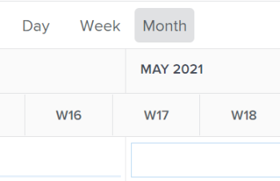

# Compartir el equilibrador de carga con un vínculo

Puede compartir el Distribuidor de cargas de trabajo con otros usuarios que podrían no tener el área de Recursos disponible en el menú principal. Para obtener información acerca del uso del Distribuidor de cargas de trabajo, consulte [Navegar por el Distribuidor de cargas de trabajo](../../resource-mgmt/workload-balancer/navigate-the-workload-balancer.md).

## Requisitos de acceso

+++ Expanda para ver los requisitos de acceso para la funcionalidad en este artículo.

<table style="table-layout:auto"> 
 <col> 
 <col> 
 <tbody> 
  <tr> 
   <td>Paquete de Adobe Workfront</td> 
   <td>
Cualquiera
</td>
  </tr>
  <tr> 
   <td>Licencia de Adobe Workfront</td> 
   <td>
Estándar

       
Planificar, al utilizar el Distribuidor de cargas de trabajo en el área de Recursos; Trabajar, al utilizar el Distribuidor de cargas de trabajo de un equipo o proyecto
</td>
  </tr>
  <tr> 
   <td>Configuraciones de nivel de acceso</td> 
   <td> 
Acceso de visualización o superior a lo siguiente:
 
    <ul> 
     <li>Administración de recursos</li> 
     <li>Proyectos</li> 
     <li>Tareas</li> 
     <li>Problemas</li> 
    </ul>
   </td> 
  </tr> 
  <tr> 
   <td>Permisos de objeto</td> 
   <td>Ver o permisos superiores en los proyectos, tareas y problemas</td> 
  </tr> 
 </tbody> 
</table>

Para obtener más información, consulte [Requisitos de acceso en la documentación de Workfront](/help/quicksilver/administration-and-setup/add-users/access-levels-and-object-permissions/access-level-requirements-in-documentation.md).

+++

## Información incluida en el Distribuidor de cargas de trabajo al verla desde un vínculo compartido

Cuando comparte un vínculo al Distribuidor de cargas de trabajo con otros usuarios, se incluye la siguiente información con el vínculo compartido:

* El área Trabajo asignado del Distribuidor de cargas de trabajo.
* Proyecto, tarea, información de usuario. Esto incluye la información de asignación de usuarios.
* La información se muestra según el filtro seleccionado.

  >[!IMPORTANT]
  >
  >Si elimina los filtros después de compartir el vínculo, los usuarios que vean el Distribuidor de cargas de trabajo desde el vínculo recibirán una advertencia avisando de que los filtros se han eliminado. Ven todos los usuarios en el área de Trabajo asignado. Esta es la vista predeterminada del Distribuidor de cargas de trabajo.

* Número de semanas seleccionadas anteriormente.

Las siguientes opciones están disponibles para que el usuario que visualiza el Distribuidor de cargas de trabajo desde un vínculo compartido se actualice:

* Las siguientes selecciones de cronología:

   * Hoy
   * Iconos de atrás y adelante
   * Selección de calendario

* Los iconos Día, Semana y Mes
* El icono Configuración
* Icono Mostrar asignaciones

  Para obtener información acerca del uso de estas opciones, vea [Desplazarse por el Distribuidor de cargas de trabajo](../../resource-mgmt/workload-balancer/navigate-the-workload-balancer.md).

* Icono Mostrar asignaciones de roles

  Esto solo está disponible para el Distribuidor de cargas de trabajo de un proyecto.

El usuario que recibe el vínculo compartido no puede hacer lo siguiente en el Distribuidor de cargas de trabajo desde este vínculo:

* Asignar elementos de trabajo a los usuarios
* Administrar asignaciones de usuarios
* Generar filtros nuevos o actualizar los aplicados originalmente

## Acceso necesario para ver información en el Distribuidor de cargas de trabajo desde un vínculo compartido

Necesita el siguiente acceso para ver información en el Distribuidor de cargas de trabajo desde un vínculo compartido:

* Una licencia de Adobe Workfront válida y debe iniciar sesión en Workfront.
* Al menos Ver el acceso a la administración de recursos en su nivel de acceso. Para obtener información acerca de cómo conceder acceso a Administración de recursos, vea [Conceder acceso a Administración de recursos](../../administration-and-setup/add-users/configure-and-grant-access/grant-access-resource-management.md).
* Ver permisos para los proyectos, tareas, problemas y usuarios mostrados en el Distribuidor de cargas de trabajo.

## Uso compartido del Distribuidor de cargas de trabajo con otros usuarios desde un vínculo

1. Vaya al Distribuidor de cargas de trabajo.

   Para obtener información sobre el acceso al Distribuidor de cargas de trabajo, consulte [Navegar por el Distribuidor de cargas de trabajo](../../resource-mgmt/workload-balancer/navigate-the-workload-balancer.md).

1. (Opcional) Realice una o varias de las siguientes acciones:

   * Actualice la selección del período de tiempo.
   * Haga clic en **Día, Semana** o **Mes** para ver información diaria, semanal o mensual.

     

   * Aplique filtros a las áreas de trabajo no asignado y asignado.

     Para obtener información sobre el filtrado en el Distribuidor de cargas de trabajo, consulte [Filtrar información en el Distribuidor de cargas de trabajo](../../resource-mgmt/workload-balancer/filter-information-workload-balancer.md).

1. Haga clic en el **icono de vínculo** .

   Esto agrega el vínculo al portapapeles.

1. Realice una de las siguientes acciones para compartir el vínculo con otros usuarios:

   * Péguelo en un mensaje de correo electrónico, un mensaje de chat o cualquier otra aplicación y compártalo con otros usuarios.
   * Añádalo a un tablero como una página externa, añada el tablero al perfil de un usuario o a una plantilla de diseño y, a continuación, comparta la plantilla de diseño con usuarios, equipos, funciones o grupos.

     Para obtener información acerca de cómo crear una página externa, vea [Incrustar una página web externa en un panel](../../reports-and-dashboards/dashboards/creating-and-managing-dashboards/embed-external-web-page-dashboard.md). Para obtener información sobre cómo agregar paneles a una plantilla de diseño, consulte [Personalizar el panel izquierdo con una plantilla de diseño](../../administration-and-setup/customize-workfront/use-layout-templates/customize-left-panel.md).

     >[!IMPORTANT]
     >
     >Cuando se agrega el Distribuidor de cargas de trabajo como un panel a la izquierda de un objeto, la información del Distribuidor de cargas de trabajo no se filtra con el objeto. El Distribuidor de cargas de trabajo muestra la información filtrada por los filtros aplicados originalmente.
