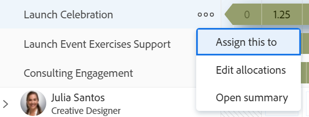

# Desasignar trabajo en el equilibrador de carga

Puede anular la asignación de usuarios a elementos de trabajo en el área de Trabajo asignado del Distribuidor de cargas de trabajo de Adobe Workfront o reasignarlos a otros usuarios, roles o equipos.

Puede anular la asignación de usuarios a elementos de trabajo manualmente, arrastrando y soltando o de forma masiva. Este artículo describe cómo anular la asignación de usuarios manualmente.

Para obtener información sobre cómo anular la asignación de usuarios arrastrando y soltando, consulte [Asignar trabajo en el Distribuidor de cargas de trabajo arrastrando y soltando](../../resource-mgmt/workload-balancer/assign-work-in-workload-balancer-by-drag-and-drop.md)

Para obtener información sobre cómo anular la asignación de usuarios en lotes, consulte [Asignar trabajo en lotes mediante el Distribuidor de cargas de trabajo](../../resource-mgmt/workload-balancer/assign-work-in-workload-balancer-in-bulk.md).

## Requisitos de acceso

+++ Expanda para ver los requisitos de acceso para la funcionalidad en este artículo.

<table style="table-layout:auto"> 
 <col> 
 <col> 
 <tbody> 
  <tr> 
   <td>Paquete de Adobe Workfront</td> 
   <td>
Cualquiera
</td>
  </tr>
  <tr> 
   <td>Licencia de Adobe Workfront</td> 
   <td>
Estándar

       
Planificar, al utilizar el Distribuidor de cargas de trabajo en el área de Recursos; Trabajar, al utilizar el Distribuidor de cargas de trabajo de un equipo o proyecto
</td>
  </tr> 
  <tr> 
   <td>Configuraciones de nivel de acceso</td> 
   <td> 
Acceso de edición a los siguientes elementos:
 
    <ul> 
     <li>Administración de recursos</li> 
     <li>Proyectos</li> 
     <li>Tareas</li> 
     <li>Problemas</li> 
    </ul></td>
  </tr> 
  <tr> 
   <td>Permisos de objeto</td> 
   <td>Permisos de contribuir o superiores para los proyectos, tareas y problemas que incluyan asignar tareas</td> 
  </tr> 
 </tbody> 
</table>

Para obtener más información, consulte [Requisitos de acceso en la documentación de Workfront](/help/quicksilver/administration-and-setup/add-users/access-levels-and-object-permissions/access-level-requirements-in-documentation.md).

+++

## Desasignar elementos de trabajo en el Distribuidor de cargas de trabajo

Puede anular la asignación de elementos de los usuarios y moverlos al área de Trabajo no asignado o reasignarlos a otros usuarios.

Para anular la asignación de elementos de trabajo a los usuarios:

1. En el Distribuidor de cargas de trabajo, vaya al área de **Trabajo asignado** y expanda un usuario.
1. Realice una de las siguientes acciones:

   * Busque el elemento cuya asignación desea anular en el área de un usuario, haga clic en él y arrástrelo y suéltelo en el área No asignada o en el área de otro usuario.
   * Haga clic en el icono **Más**  a la derecha del nombre de un elemento de trabajo, haga clic en **Asignar esto a**, quite el nombre de las entidades asignadas al elemento de trabajo o escriba otro nombre y haga clic en **Guardar**.

     

   El elemento se muestra en el área de trabajo no asignado si coincide con los criterios de filtrado de dicha área y no está asignado a ningún otro usuario, o si está asignado a otro usuario, en el área de usuario.

   Para obtener información sobre el filtrado en el Distribuidor de cargas de trabajo, consulte [Filtrar información en el Distribuidor de cargas de trabajo](../../resource-mgmt/workload-balancer/filter-information-workload-balancer.md).
