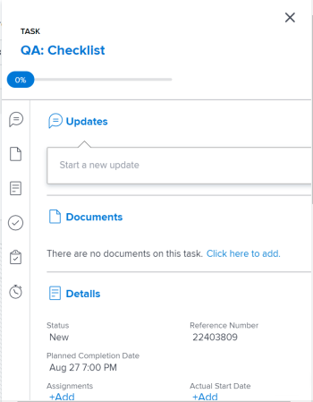

# Actualizar elementos de trabajo en el equilibrador de carga de trabajo mediante el resumen

Puede utilizar el panel Resumen de una tarea o un problema para actualizar información importante para ese elemento. en el equilibrador de carga de trabajo.

El panel Resumen está disponible para tareas y problemas en las áreas de trabajo asignadas y no asignadas del equilibrador de carga de trabajo.

## Requisitos de acceso

Debe tener lo siguiente:

<table style="table-layout:auto"> 
 <col> 
 <col> 
 <tbody> 
  <tr> 
   <td role="rowheader">plan de Adobe Workfront*</td> 
   <td> 
Cualquiera 
 </td> 
  </tr> 
  <tr> 
   <td role="rowheader">Licencia de Adobe Workfront*</td> 
   <td> 
Planificar, al utilizar el equilibrador de carga de trabajo para un equipo o en el área de recursos 

   
Trabajar, al utilizar el equilibrador de carga de trabajo de un proyecto 

 
 </td> 
  </tr> 
  <tr> 
   <td role="rowheader">Configuraciones de nivel de acceso*</td> 
   <td> 
Edite el acceso a lo siguiente:
 
    <ul> 
     <li> 
Administración de recursos
 </li> 
     <li> 
Proyectos
 </li> 
     <li> 
Tareas
 </li> 
     <li> 
Problemas
 </li> 
    </ul> 
Si todavía no tiene acceso, pregunte a su administrador de Workfront si establece restricciones adicionales en su nivel de acceso. Para obtener información sobre cómo un administrador de Workfront puede cambiar su nivel de acceso, consulte <a href="../../administration-and-setup/add-users/configure-and-grant-access/create-modify-access-levels.md" class="MCXref xref">Crear o modificar niveles de acceso personalizados</a>.
 </td> 
  </tr> 
  <tr> 
   <td role="rowheader">Permisos de objeto</td> 
   <td> 
Permisos de Contribute o superior a proyectos, tareas y problemas 
 
Para obtener información sobre la solicitud de acceso adicional, consulte <a href="../../workfront-basics/grant-and-request-access-to-objects/request-access.md" class="MCXref xref">Solicitar acceso a objetos </a>.
 </td> 
  </tr> 
 </tbody> 
</table>

&#42;Para saber qué plan, tipo de licencia o acceso tiene, póngase en contacto con el administrador de Workfront.

## Actualizar tareas y problemas en el panel Resumen del equilibrador de carga de trabajo

1. Vaya al equilibrador de carga de trabajo.

   El equilibrador de carga de trabajo muestra la información de asignación de trabajo a partir de la semana actual.

1. Vaya a la **Trabajo no asignado** y busque un elemento de trabajo.

   O

   Vaya a la **Trabajo asignado** , expanda un usuario y busque un elemento de trabajo.

1. Haga clic en la barra de una tarea o problema para abrir el panel Resumen a la derecha

   O

   Haga clic en **Abrir resumen** icono y, a continuación, haga clic en la barra de una tarea o problema para abrir el panel Resumen

   O

   Haga clic en el **Más** menú  a la derecha de una tarea o problema, haga clic en **Abrir resumen**.

   El panel Resumen se abre a la derecha.

   

1. Modifique varios campos para el elemento de trabajo, introduzca una actualización o navegue desde aquí a otras áreas de Workfront para agregar documentos u otra información al elemento de trabajo.

   >[!CAUTION]
   >
   >Al navegar desde la sección Resumen a la sección Subtareas para agregar subtareas, se elimina la tarea original, ya que las tareas principales no se muestran en el equilibrador de carga de trabajo.

   Para obtener más información sobre la actualización de información mediante el Resumen, consulte [Resumen](../../workfront-basics/the-new-workfront-experience/summary-overview.md).

1. (Condicional) Si ha abierto cualquiera de las secciones del elemento de trabajo, haga clic en el **Botón Atrás** para volver al equilibrador de carga de trabajo.
1. Haga clic en el **Icono Cerrar**  en la esquina superior derecha del resumen, para cerrarlo.
