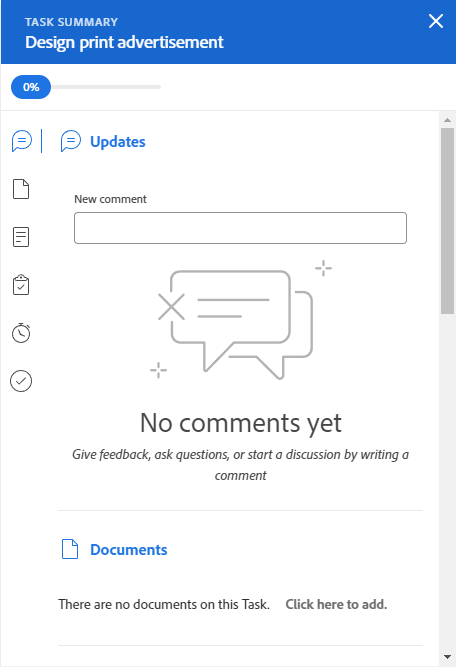

# Actualizar los elementos de trabajo en el distribuidor de cargas de trabajo mediante el resumen

Puede usar el panel de resumen de una tarea o un problema para actualizar información importante para ese elemento. en el distribuidor de cargas de trabajo.

El panel Resumen está disponible para tareas y problemas tanto en las áreas de Trabajo asignado como en las no asignadas del Distribuidor de cargas de trabajo.

## Requisitos de acceso

+++ Expanda para ver los requisitos de acceso para la funcionalidad en este artículo.

<table style="table-layout:auto"> 
 <col> 
 <col> 
 <tbody> 
  <tr> 
   <td>Paquete de Adobe Workfront</td> 
   <td>
Cualquiera
</td>
  </tr>
  <tr> 
   <td>Licencia de Adobe Workfront</td> 
   <td>
Estándar

       
Planificar, al utilizar el Distribuidor de cargas de trabajo en el área de Recursos; Trabajar, al utilizar el Distribuidor de cargas de trabajo de un equipo o proyecto
</td>
  </tr>
  <tr> 
   <td>Configuraciones de nivel de acceso</td> 
   <td> 
Acceso de visualización o superior a lo siguiente:
 
    <ul> 
     <li>Administración de recursos</li> 
     <li>Proyectos</li> 
     <li>Tareas</li> 
     <li>Problemas</li> 
    </ul>
   </td> 
  </tr> 
  <tr> 
   <td>Permisos de objeto</td> 
   <td>Aportar o permisos superiores a los proyectos, tareas y problemas</td> 
  </tr> 
 </tbody> 
</table>

Para obtener más información, consulte [Requisitos de acceso en la documentación de Workfront](/help/quicksilver/administration-and-setup/add-users/access-levels-and-object-permissions/access-level-requirements-in-documentation.md).

+++

## Actualizar tareas y problemas en el panel resumen del distribuidor de cargas de trabajo

1. Vaya al equilibrador de carga de trabajo.

   El distribuidor de cargas de trabajo muestra información sobre la asignación de trabajo a partir de la semana actual.

1. Vaya al área **Trabajo sin asignar** y busque un elemento de trabajo.

   O

   Vaya al área **Trabajo asignado**, expanda un usuario y busque un elemento de trabajo.

1. Haga clic en la barra de una tarea o un problema para abrir el panel de resumen a la derecha.

   O

   Haga clic en el icono **Abrir resumen**  y, a continuación, haga clic en la barra de una tarea o problema para abrir el panel Resumen.

   O

   Haga clic en el icono **Más** del menú  a la derecha de una tarea o problema y, a continuación, haga clic en **Abrir resumen**.

   Se abre a la derecha el panel Resumen.

   

1. Modifique una serie de campos del elemento de trabajo, introduzca una actualización o navegue desde aquí a otras áreas de Workfront para añadir documentos u otra información al elemento de trabajo.

   >[!CAUTION]
   >
   >Si se desplaza del resumen a la sección subtareas para añadir subtareas, se elimina la tarea original, ya que las tareas principales no se muestran en el distribuidor de cargas de trabajo.

   Para obtener más información sobre cómo actualizar información mediante el resumen, consulte [Resumen](../../workfront-basics/the-new-workfront-experience/summary-overview.md).

   >[!NOTE]
   >
   >Si su organización utiliza el almacenamiento en la nube de Adobe para documentos, no puede agregar documentos a los elementos de trabajo del almacenamiento en la nube de Adobe en el Panel de resumen.
   >
   >Para obtener más información, vea [Información general sobre la administración de documentos de proyectos y objetos relacionados](/help/quicksilver/manage-work/projects/manage-projects/manage-documents-on-projects.md).

1. (Condicional) Si ha abierto alguna de las secciones del elemento de trabajo, haga clic en el botón **Atrás** de su navegador para volver al distribuidor de cargas de trabajo.
1. Haga clic en el **icono Cerrar**  en la esquina superior derecha del Resumen para cerrarlo.
