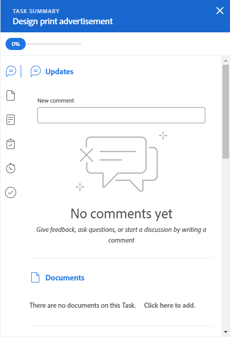

# Actualizar los elementos de trabajo en el Distribuidor de cargas de trabajo mediante el Resumen

{{highlighted-preview}}

Puede usar el Panel de resumen de una tarea o un problema para actualizar información importante para ese elemento. en el Distribuidor de cargas de trabajo.

El panel Resumen está disponible para tareas y problemas en las áreas de Trabajo asignado y no asignado del Distribuidor de cargas de trabajo.

## Requisitos de acceso

Debe tener lo siguiente:

<table style="table-layout:auto"> 
 <col> 
 <col> 
 <tbody> 
  <tr> 
   <td role="rowheader">plan Adobe Workfront*</td> 
   <td> 
Cualquiera 
 </td> 
  </tr> 
  <tr> 
   <td role="rowheader">Licencia de Adobe Workfront*</td> 
   <td> 
Planificar, al utilizar el Distribuidor de cargas de trabajo en el área de Recursos

   
Trabaje con el Distribuidor de cargas de trabajo de un equipo o proyecto
 
 
 </td> 
  </tr> 
  <tr> 
   <td role="rowheader">Configuraciones de nivel de acceso*</td> 
   <td> 
Edite el acceso a lo siguiente:
 
    <ul> 
     <li> 
Administración de recursos
 </li> 
     <li> 
Proyectos
 </li> 
     <li> 
Tareas
 </li> 
     <li> 
Problemas
 </li> 
    </ul> 
Si sigue sin tener acceso, pregunte al administrador de Workfront si ha establecido restricciones adicionales en su nivel de acceso. Para obtener información sobre cómo un administrador de Workfront puede cambiar su nivel de acceso, vea <a href="../../administration-and-setup/add-users/configure-and-grant-access/create-modify-access-levels.md" class="MCXref xref">Crear o modificar niveles de acceso personalizados</a>.
 </td> 
  </tr> 
  <tr> 
   <td role="rowheader">Permisos de objeto</td> 
   <td> 
Permisos de Contribute o superiores para los proyectos, tareas y problemas 
 
Para obtener información sobre cómo solicitar acceso adicional, vea <a href="../../workfront-basics/grant-and-request-access-to-objects/request-access.md" class="MCXref xref">Solicitar acceso a los objetos </a>.
 </td> 
  </tr> 
 </tbody> 
</table>

&#42;Para saber qué plan, tipo de licencia o acceso tiene, póngase en contacto con el administrador de Workfront.

## Actualizar tareas y problemas en el panel Resumen del Distribuidor de cargas de trabajo

1. Vaya al Distribuidor de cargas de trabajo.

   El Distribuidor de cargas de trabajo muestra información sobre la asignación de trabajo a partir de la semana actual.

1. Vaya al área **Trabajo sin asignar** y busque un elemento de trabajo.

   O

   Vaya al área **Trabajo asignado**, expanda un usuario y busque un elemento de trabajo.

1. Haga clic en la barra de una tarea o un problema para abrir el Panel de resumen a la derecha.

   O

   Haga clic en el icono **Abrir resumen**  y, a continuación, haga clic en la barra de una tarea o un problema para abrir el Panel de resumen.

   O

   Haga clic en el menú **Más**  que se encuentra a la derecha de una tarea o problema y, a continuación, haga clic en **Abrir resumen**.

   El panel Resumen se abre a la derecha.

   

   Ejemplo del panel Resumen en el entorno de vista previa:
   

   

   Ejemplo del panel Resumen en el entorno de producción:
   

1. Modifique una serie de campos para el elemento de trabajo, introduzca una actualización o navegue desde aquí a otras áreas de Workfront para agregar documentos u otra información al elemento de trabajo.

   >[!CAUTION]
   >
   >Si se desplaza del Resumen a la sección Subtareas para agregar subtareas, se elimina la tarea original, ya que las tareas principales no se muestran en el Distribuidor de cargas de trabajo.

   Para obtener más información sobre cómo actualizar información mediante el Resumen, consulte [Resumen](../../workfront-basics/the-new-workfront-experience/summary-overview.md).

1. (Condicional) Si ha abierto cualquiera de las secciones del elemento de trabajo, haga clic en el **botón Atrás** del explorador para volver al Distribuidor de cargas de trabajo.
1. Haga clic en el icono **Cerrar** , en la esquina superior derecha del resumen, para cerrarlo.
