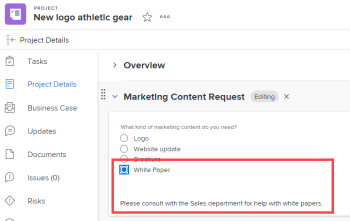
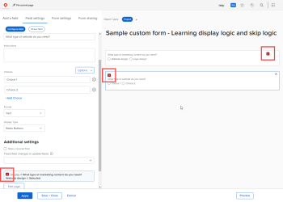

# Agregar lógica de visualización y de omisión de lógica a un formulario personalizado

Puede utilizar reglas inteligentes para que un formulario personalizado sea dinámico y más relevante para los usuarios que lo rellenen. Cuando un usuario responde de cierta manera a un campo de selección múltiple de un formulario, una regla inteligente les muestra lo que desea que vean a continuación, en función de esa respuesta.

Los tipos de campo de opción múltiple son Desplegable, Casillas de verificación y Botones de radio.

* **Mostrar lógica**: Puede configurar una regla de lógica de visualización en el campo, la utilidad o la sección que desea que vea el usuario solo después de que seleccione una opción específica en un campo de opción múltiple anterior.

   **Ejemplo:** Está creando un formulario de solicitud de contenido de marketing en el que las personas de su organización pueden solicitar un nuevo logotipo, una actualización del sitio web, un folleto u otro tipo de contenido de marketing. En función del tipo de contenido que el usuario desee, debe solicitarlos distintos tipos de detalles, como colores e ideas de diseño si necesitan un logotipo o una lista de características del producto si necesitan un folleto.

   En el campo que pregunta sobre los colores y los detalles de un nuevo logotipo, puede agregar una regla de lógica de visualización que muestre ese campo solo después de que el usuario seleccione el botón de opción Logotipo en el primer campo.

   Del mismo modo, en el campo que pregunta sobre las funciones del producto, puede agregar una regla de lógica de visualización que muestre ese campo solo después de que un usuario seleccione el botón de opción Folleto en el primer campo.

   

   Puede configurar las reglas de lógica de visualización en cualquier campo, widget o salto de sección personalizado que siga a un campo de opción múltiple.

* **Omitir regla lógica**: Puede configurar esta regla para ocultar partes de un formulario que el usuario no necesite. Cuando el usuario selecciona un elemento específico en un campo de opciones múltiples anterior, la regla de la lógica de omisión las omite hasta el final del formulario o hasta un campo, widget o sección personalizados que desee que vean.

   **Ejemplo:** Alguien usa el formulario de solicitud de contenido de marketing anterior para solicitar un libro blanco, que son proporcionados por Ventas, no por Marketing. Para este usuario, una regla de lógica de omisión puede ocultar la pregunta que solicita detalles y saltar a una línea de texto que los remite al departamento que necesitan.

   

   En este caso, puede agregar un campo de Texto descriptivo que lleve al usuario al departamento de ventas. En el primer campo personalizado que pregunta qué tipo de contenido de marketing necesita el usuario, puede agregar una regla de omitir lógica que muestre únicamente la línea de texto cuando un usuario seleccione el botón de opción Libro blanco en el primer campo.

   Esto sería especialmente útil si agrega muchos otros campos sobre logotipos, actualizaciones de sitios web y folletos que este usuario no necesita ver.
Puede aplicar una regla de lógica de omisión solo a un campo personalizado, no a un widget o sección.

Para obtener información sobre los campos personalizados y las utilidades de los formularios personalizados, consulte [Añadir un campo personalizado a un formulario personalizado](../../administration-and-setup/customize-workfront/create-manage-custom-forms/add-a-custom-field-to-a-custom-form.md) y [Agregar o editar un widget de recursos en un formulario personalizado](../../administration-and-setup/customize-workfront/create-manage-custom-forms/add-widget-or-edit-its-properties-in-a-custom-form.md).

## Requisitos de acceso

Debe tener lo siguiente para realizar los pasos de este artículo:

<table style="table-layout:auto"> 
 <col> 
 <col> 
 <tbody> 
  <tr data-mc-conditions=""> 
   <td role="rowheader"> 
plan de Adobe Workfront*
 </td> 
   <td>Cualquiera</td> 
  </tr> 
  <tr> 
   <td role="rowheader">Licencia de Adobe Workfront*</td> 
   <td> 
Plan 
 </td> 
  </tr> 
  <tr data-mc-conditions=""> 
   <td role="rowheader">Configuraciones de nivel de acceso*</td> 
   <td> 
Acceso administrativo a formularios personalizados
 
Para obtener información sobre cómo los administradores de Workfront conceden este acceso, consulte <a href="../../administration-and-setup/add-users/configure-and-grant-access/grant-users-admin-access-certain-areas.md" class="MCXref xref">Conceder a los usuarios acceso administrativo a determinadas áreas</a>.
 </td> 
  </tr>  
 </tbody> 
</table>

&#42;Para saber qué plan, tipo de licencia o configuraciones de nivel de acceso tiene, póngase en contacto con el administrador de Workfront.

## Crear un formulario personalizado de ejemplo con lógica de visualización y omisión

La mejor manera de aprender a agregar lógica de visualización y omisión a un formulario personalizado es mediante el ejemplo práctico explicado en las dos secciones siguientes:

* [lógica de visualización: ejemplo práctico](#display-logic-practical-example)
* [Omitir lógica: ejemplo práctico](#skip-logic-practical-example)

### lógica de visualización: ejemplo práctico {#display-logic-practical-example}

En este ejemplo, se crea un formulario personalizado con un campo de botón de opción de opción múltiple. A continuación, agregará la lógica de visualización que conecte este campo a un segundo campo.

1. Haga clic en el **Menú principal** icono  en la esquina superior derecha de Adobe Workfront, haga clic en **Configuración** .

1. En el panel izquierdo, seleccione **Forms personalizado** .

1. Haga clic en **Nuevo formulario personalizado**, seleccione **Proyecto** en el cuadro que aparece y, a continuación, seleccione **Continuar**.

1. En el **Título del formulario** cuadro de texto, escriba **Formulario personalizado de ejemplo: aprendizaje de la lógica de visualización y la lógica de omisión** para asignar un nombre al formulario.

   

1. Para añadir el primer campo al formulario:

   1. Abra el **Agregar un campo** pestaña .

      

   1. Seleccione el **Botones de radio** tipo de campo y, a continuación, escriba *¿Qué tipo de contenido de marketing necesita?* como el **Etiqueta** para el campo .

   1. En **Opciones**, reemplazar **Opción 1** y **Opción 2** con el siguiente texto para crear dos opciones, los usuarios pueden elegir en el campo :

      *Actualización del sitio web*

      *Diseño de logotipo*

1. Para agregar el siguiente campo personalizado y agregarle una regla de lógica de visualización:

   1. Abra el **Añadir un campo** pestaña de nuevo y agregue una nueva **Botones de radio** campo llamado *¿Qué tipo de actualización de sitio web necesita?*

      Añadiremos las opciones para este campo más adelante.

   1. En el **Ajustes adicionales** , seleccione **Agregar lógica**.

      

1. En el cuadro que aparece, con la variable **Mostrar lógica** pestaña abrir, configurar el segundo campo para que aparezca solo para los usuarios que seleccionaron *Diseño del sitio web* en el primer campo:

   1. En la primera lista desplegable, seleccione **¿Qué tipo de contenido de marketing necesita?**
   1. En la segunda lista desplegable, seleccione **Diseño del sitio web**.
   1. Deje la tercera lista desplegable configurada en **Seleccionado**, seleccione **Guardar**.

   Observe los pequeños cuadrados de color con una D, que indican que el segundo campo está conectado con la lógica de visualización a la selección del usuario en el primer campo:

   

1. Select **Vista previa** para asegurarse de que la lógica funciona del modo deseado en el formulario, seleccione **Finalizar vista previa**.

1. Haga clic en **Guardar + Cerrar** guarde el formulario y, a continuación, continúe con [Omitir lógica: ejemplo práctico](#skip-logic-practical-example) más abajo.

### Omitir lógica: ejemplo práctico {#skip-logic-practical-example}

La lógica Skip funciona de forma similar a la lógica de visualización, pero actúa de forma inversa: en lugar de hacer que se muestren campos de opción múltiple personalizados específicos en función de selecciones de usuario anteriores, debe determinar cuáles deben ocultarse (omitirse) porque no son relevantes para el usuario.

Para obtener más información, siga trabajando en el formulario personalizado de ejemplo que ha creado en la sección [lógica de visualización: ejemplo práctico](#display-logic-practical-example) en este artículo.

1. Haga clic en el **Menú principal** icono  en la esquina superior derecha de Adobe Workfront, haga clic en **Configuración** .

1. Haga clic en **Forms personalizado**.
1. Haga clic en el nombre del formulario **Formulario personalizado de ejemplo: aprendizaje de la lógica de visualización y la lógica de omisión** que ha creado en los pasos anteriores, para abrirlo y editarlo.
1. Seleccione el campo desplegable que ha creado con el nombre *¿Qué tipo de sitio web necesita?*, añada las siguientes opciones para el campo y haga clic en **Aplicar**:

   *Comercio electrónico*

   *Folleto*

   *Membresía*

1. Abra el **Añadir un campo** , cree un campo **Campo de texto con formato **llamado *¿Cuál es el objetivo del sitio web?* y haga clic en **Aplicar**.

   En esta organización, el equipo de escritura técnica crea un sitio de documentación de ayuda, no el departamento de marketing. Por lo tanto, no se necesita más información de un usuario que selecciona la documentación de Ayuda en el segundo campo. Crearemos una línea de texto (un campo de texto descriptivo) que les indicará que vean al equipo de escritura técnica. Y usaremos una regla de omitir lógica que omita al usuario hasta esa línea de texto.

1. Para crear la línea de texto:

   1. Abra el **Añadir un campo** y cree un **Campo Texto descriptivo**.

   1. Para la variable **Etiqueta**, tipo *Consulte Equipo de escritura técnica*.

   1. Para la variable **Texto descriptivo**, tipo *Consulte al equipo de escritura técnica acerca de la creación de documentación de ayuda en línea*.

   1. Select **Aplicar**.

1. Para crear la regla de lógica de omisión:

   1. Seleccione el segundo campo desplegable, *¿Qué tipo de sitio web necesita?*
   1. En el **Configuración adicional** en la sección , seleccione **Editar lógica**.
   1. En el cuadro que aparece, abra la **Omitir lógica** pestaña .
   1. Defina la primera lista desplegable como **Documentación de ayuda**, deje la segunda lista desplegable configurada en **Seleccionado** y establezca la tercera lista desplegable en **Consulte el equipo de escritura técnica**.
   1. Select **Guardar**.

   Observe los pequeños cuadrados de la lógica de omisión con una S, que indican que el usuario saltará algo después de seleccionar una determinada opción en el segundo campo.

   

1. Haga clic en **Vista previa**  para asegurarse de que la lógica se aplica de la manera que desea.
1. Haga clic en **Guardar + Cerrar**.

Al crear un formulario como este, se pueden agregar más campos de texto para solicitar información a los usuarios que seleccionan Comercio electrónico o Folleto en el segundo campo. Estos campos podrían preguntar quién es la audiencia de destino del sitio web, cuál es el objetivo para crearlo, qué es el presupuesto, etc.

Y, con reglas lógicas, se pueden crear rutas de preguntas de ramificación.

Por ejemplo, para los usuarios que seleccionen Comercio electrónico, puede crear campos en los que se hagan preguntas sobre las fotos del producto, las descripciones, los precios y las opciones de pago. Para los usuarios que seleccionan Folleto, puede crear campos que pregunten sobre el contenido.

Un usuario que seleccionó la documentación de Ayuda nunca vería ninguno de estos campos adicionales que sean irrelevantes para ellos.

>[!TIP]
>
>Puede agregar lógica de visualización y de omisión a un campo personalizado si todo lo siguiente es verdadero sobre el campo:
>
>* Se trata de un campo de opción múltiple (botones de opción, menú desplegable o casillas de verificación)
>* Está precedido por un campo de opción múltiple
>* Le sigue otro campo personalizado
>

<!--
<h2 data-mc-conditions="QuicksilverOrClassic.Draft mode">Multi-field display logic statements</h2>
-->

