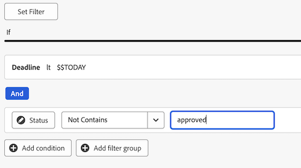
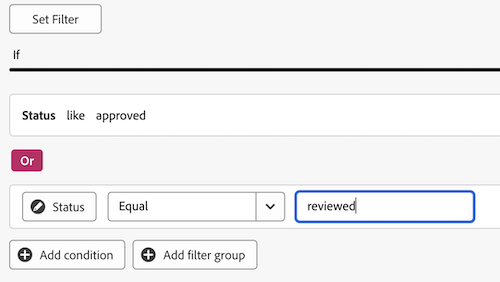
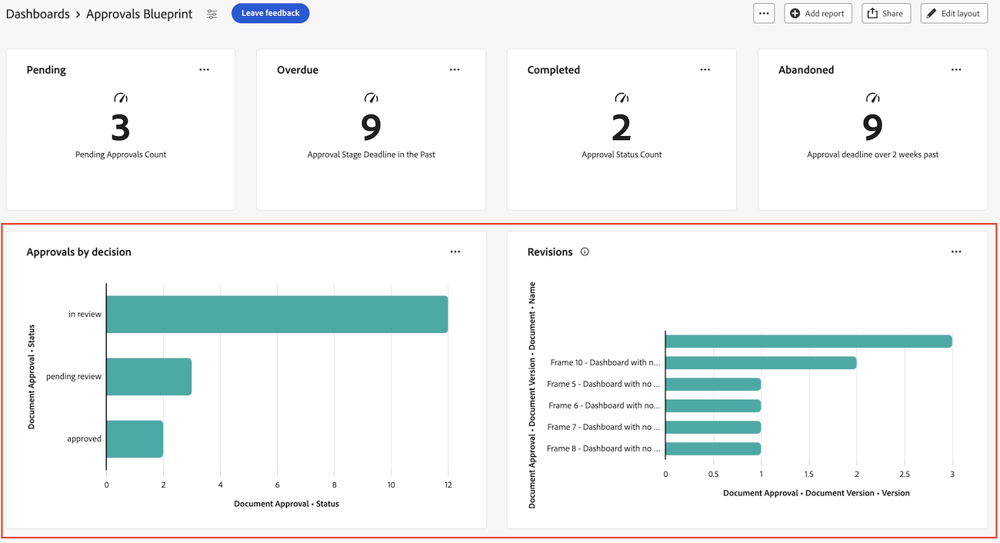
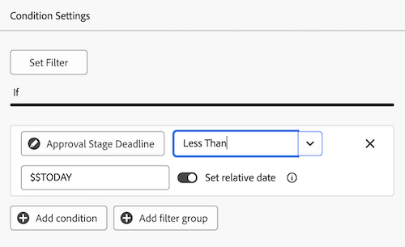

# Creación de un tablero de informes para revisión y aprobaciones

Puede crear un tablero de informes en el área de Tableros de lienzo para mostrar información de alto nivel y detallada acerca de las revisiones y aprobaciones con la nueva funcionalidad de aprobaciones de documentos.

>[!IMPORTANT]
>
>Esta funcionalidad solo está disponible para los clientes que utilizan el nuevo servicio de aprobaciones de documentos e están inscritos en la versión beta de paneles de lienzo.

## Creación de un panel

{{step1-to-dashboards}}

1. En el panel izquierdo, haga clic en **Paneles de lienzo**.
1. Haga clic en **Nuevo panel**.
1. Asigne un nombre al tablero.
1. (Opcional) Añada una descripción.
1. Haga clic en **Crear**.
   

Una vez creado un panel, puede empezar a agregar KPI, gráficos y tablas. Consulte las secciones siguientes para obtener más información:

* [Agregar información de revisión y aprobación de alto nivel con KPI y gráficos](#add-high-level-review-and-approval-information-with-kpis-and-charts)
* [Agregar información detallada de revisión y aprobación con tablas](#add-detailed-review-and-approval-information-with-tables)

## Agregar información de revisión y aprobación de alto nivel con KPI y gráficos

Puede ver información de alto nivel sobre aprobaciones de documentos con KPI y gráficos. La información de desglose no está disponible actualmente en la versión beta.

### KPI

#### Aprobaciones pendientes

1. [Cree un tablero](#create-a-dashboard) tal como se describe en la sección anterior.
1. En la tarjeta **KPI**, haga clic en **Agregar**.
1. Escriba _Pending_ en el cuadro de texto **Título de KPI**.
1. Escriba _aprobaciones pendientes_ en el cuadro de texto **Rótulo de KPI**. Este texto describe lo que muestra el KPI.
1. En la parte superior de la página, haga clic en **Seleccionar campo KPI**.
1. Desplácese hacia abajo y busque la **carpeta de aprobación de documentos**.
1. Elija **Estado** y, a continuación, seleccione **Recuento** en el menú desplegable.
1. Haga clic en **Editar filtro** > **Agregar condición**.
   1. Haga clic en el filtro de condición vacío, haga clic en **Elegir un campo** y, a continuación, elija **Estado**.
   1. Deje el operador como **Equal** y escriba _pending review_ en el cuadro de texto.
      
1. Haga clic en **Listo** en la esquina superior derecha de la pantalla.

#### Aprobaciones vencidas

1. [Cree un tablero](#create-a-dashboard) tal como se describe en la sección anterior.
1. En la tarjeta **KPI**, haga clic en **Agregar**.
1. Escriba _Vencido_ en el cuadro de texto **Título de KPI**.
1. Escriba _Límite de fase de aprobación en el último_ en el cuadro de texto **Rótulo de KPI**. Este texto describe lo que muestra el KPI.
1. En la parte superior de la página, haga clic en **Seleccionar campo KPI**.
1. Desplácese hacia abajo y busque la **carpeta de aprobación de documentos**.
1. Elija **Estado** y, a continuación, seleccione **Recuento** en el menú desplegable.
1. Haga clic en **Editar filtro** > **Agregar condición**:
   1. Haga clic en el filtro de condición vacío, haga clic en **Elegir un campo** y, a continuación, elija **Plazo**.
   1. Cambie el operador a **Less Than** y active la opción Relative date On y luego escriba _$$TODAY_ en el cuadro de texto.
      
1. Haga clic en **Agregar condición**:
   1. Haga clic en el filtro de condición vacío, haga clic en **Elegir un campo** y, a continuación, elija **Estado**.
   1. Cambie el operador a **No contiene** y, a continuación, escriba _aprobado_ en el cuadro de texto.
      
1. Haga clic en **Listo** en la esquina superior derecha de la pantalla.

#### Aprobaciones completadas

1. [Cree un tablero](#create-a-dashboard) tal como se describe en la sección anterior.
1. En la tarjeta **KPI**, haga clic en **Agregar**.
1. Escriba _Completed_ en el cuadro de texto **Título de KPI**.
1. Escriba _Approval Status Count_ en el cuadro de texto **Rótulo de KPI**. Este texto describe lo que muestra el KPI.
1. En la parte superior de la página, haga clic en **Seleccionar campo KPI**.
1. Desplácese hacia abajo y busque la **carpeta de aprobación de documentos**.
1. Elija **Estado** y, a continuación, seleccione **Recuento** en el menú desplegable.
1. Haga clic en **Editar filtro** > **Agregar condición**:
   1. Haga clic en el filtro de condición vacío, haga clic en **Elegir un campo** y, a continuación, elija **Estado**.
   1. Cambie el operador a **Contains** y escriba _approved_ en el cuadro de texto.
      
1. Haga clic en **Agregar condición**:
   1. Haga clic en **Y** para cambiarlo a **O**.
   1. Haga clic en el filtro de condición vacío, haga clic en **Elegir un campo** y, a continuación, elija **Estado**.
   1. Cambie el operador a **Igual a** y, a continuación, escriba _revisado_ en el cuadro de texto.
      
1. Haga clic en **Listo** en la esquina superior derecha de la pantalla.

#### Aprobaciones abandonadas

1. [Cree un tablero](#create-a-dashboard) tal como se describe en la sección anterior.
1. En la tarjeta **KPI**, haga clic en **Agregar**.
1. Escriba _Abandonado_ en el cuadro de texto **Título de KPI**.
1. Escriba _Plazo de aprobación de más de 2 semanas después de_ en el cuadro de texto **Rótulo de KPI**. Este texto describe lo que muestra el KPI.
1. En la parte superior de la página, haga clic en **Seleccionar campo KPI**.
1. Desplácese hacia abajo y busque la carpeta **Fase de aprobación del documento**.
1. Elija **Plazo** y, a continuación, seleccione **Recuento** en el menú desplegable.
1. Haga clic en **Editar filtro** > **Agregar condición**:
   1. Haga clic en el filtro de condición vacío, haga clic en **Elegir un campo** y, a continuación, elija **Estado**.
   1. Cambie el operador a **No contiene** y escriba _aprobado_ en el cuadro de texto.
      
1. Haga clic en **Agregar condición**:
   1. Haga clic en el filtro de condición vacío, haga clic en **Elegir un campo** y, a continuación, elija **Plazo**.
   1. Cambie el operador a **Less Than**, luego cambie Relative date On y luego escriba _$$TODAY-2w_ en el cuadro de texto.
      
1. Haga clic en **Listo** en la esquina superior derecha de la pantalla.

### Gráficos

#### Gráfico de barras de decisión de aprobaciones

1. [Cree un tablero](#create-a-dashboard) tal como se describe en la sección anterior.
1. En la tarjeta **Gráfico**, haga clic en **Agregar**.
1. Escriba _Aprobaciones por decisión_ en el cuadro de texto **Nombre**.
1. (Opcional) Escriba una descripción en el cuadro de texto **Descripción**. Este texto se muestra como información de objeto junto al nombre del gráfico.
1. Haga clic en **Abrir detalles del gráfico**.
1. En el menú desplegable **Tipo de gráfico**, deje seleccionado **Gráfico de barras**.
1. En el menú desplegable **Tipo de barra**, deje seleccionado **Simple**.
1. Haga clic en **Actualizar campo** para el **eje inferior (X)** y elija la primera carpeta de **Aprobación del documento** y después **Estado**.
1. Establezca el Tipo de agregación en **Count**.
1. Haga clic en **Actualizar campo** para el **eje izquierdo (Y)** y elija la primera opción de **Aprobación del documento** y después **Estado**.
1. Haga clic en la ficha Filtro .
1. Haga clic en **Editar filtro** > **Agregar condición**:
   1. Haga clic en el filtro de condición vacío, haga clic en **Elegir un campo** y, a continuación, elija **Versión del documento**.
   1. Cambiar el operador a **No es nulo**.
      
1. Haga clic en **Listo** en la esquina superior derecha de la pantalla.

#### Gráfico de barras de revisiones

1. [Cree un tablero](#create-a-dashboard) tal como se describe en la sección anterior.
1. En la tarjeta **Gráfico**, haga clic en **Agregar**.
1. Escriba _Revisiones_ en el cuadro de texto **Nombre**.
1. Escriba _Número de revisiones de documentos con decisiones incompletas planeadas antes de que finalice este mes_ en el cuadro de texto **Descripción**. Este texto se muestra como información de objeto junto al nombre del gráfico.
1. Haga clic en **Abrir detalles del gráfico**.
1. En el menú desplegable **Tipo de gráfico**, deje seleccionado **Gráfico de barras**.
1. En el menú desplegable **Tipo de barra**, deje seleccionado **Simple**.
1. Haga clic en **Actualizar campo** para el **eje inferior (X)** y elija la primera carpeta de **Aprobación del documento** y después **Versión del documento** > **Versión**.
1. Establezca el Tipo de agregación en **Count**.
1. Haga clic en **Actualizar campo** para el **eje izquierdo (Y)** y elija la primera opción de **Aprobación del documento** y después **Versión del documento** > **Documento** > **Nombre**.
1. Haga clic en la ficha Filtro .
1. Haga clic en **Editar filtro** > **Agregar condición**:
   1. Haga clic en el filtro de condición vacío, haga clic en **Elegir un campo** y, a continuación, elija **Fecha de decisión de los participantes en la fase de aprobación**.
   1. Cambie el operador a **Is Null**.
      
1. Haga clic en **Editar filtro** > **Agregar condición**:
   1. Haga clic en el filtro de condición vacío, haga clic en **Elegir un campo** y, a continuación, elija **Plazo para la fase de aprobación**.
   1. Cambie el operador a **Menor o igual que**, luego active Establecer fecha relativa en y escriba _$$TODAYem_ en el cuadro de texto.
      
1. Haga clic en **Listo** en la esquina superior derecha de la pantalla.

## Agregar información detallada de revisión y aprobación con tablas

### Lista de aprobaciones pendientes

1. [Cree un tablero](#create-a-dashboard) tal como se describe en la sección anterior.
1. En la tarjeta **Tabla**, haga clic en **Agregar**.
1. Escriba _Aprobaciones pendientes_ en el cuadro de texto **Nombre**.
1. (Opcional) Escriba una descripción en el cuadro de texto **Descripción**. Este texto se muestra como información de objeto junto al nombre del gráfico.
1. Haga clic en **Abrir configuración de columna**.
1. Haga clic en **Agregar columna**, desplácese hacia abajo y haga clic en la primera carpeta de **Aprobaciones de documentos**, y después elija **Estado**.
1. Añada las siguientes columnas:

   <table>
    <tr>
    <td><strong>Nombre del proyecto</strong></td>
    <td>Versión del documento &gt; Documento &gt; Proyecto &gt; Nombre</td>
    </tr>
    <tr>
    <td><strong>Nombre de documento</strong></td>
    <td>Versión del documento &gt; Documento &gt; escriba _Name_ en el cuadro de búsqueda.</td>
    </tr>
    <tr>
    <td><strong>Versión del documento</strong></td>
    <td>Versión del documento &gt; Documento &gt; Versión</td>
    </tr>
    <tr>
    <td><strong>Fecha límite</strong></td>
    <td>Documento &gt; Fase de aprobación &gt; Plazo</td>
    </tr>
    <tr>
    <td><strong>Solicitado por</strong></td>
    <td>Documento &gt; Fase de aprobación &gt; Participantes en la fase de aprobación* &gt; Solicitante &gt; escriba _Name_ en el cuadro de búsqueda.</td>
    </tr>
     <tr>
    <td><strong>Fecha de solicitud</strong></td>
    <td>Documento &gt; Fase de aprobación &gt; Participantes de la fase de aprobación* &gt; Creado en</td>
    </tr>
     <tr>
    <td><strong>Aprobador</strong></td>
    <td>Documento &gt; Fase de aprobación &gt; Participantes en la fase de aprobación* &gt; Usuario participante &gt; escriba _Name_ en el cuadro de búsqueda.</td>
    </tr>
    <table>

   *Los participantes de la fase de aprobación se truncan a la fase de aprobación Pa..

1. Continuar a [Agregue el filtro necesario debajo de](#add-the-required-filter).

#### Añadir el filtro de aprobaciones pendientes necesario

1. Haga clic en la ficha Filtro .
1. Haga clic en **Editar filtro** > **Agregar condición**:
   1. Haga clic en el filtro de condición vacío, haga clic en **Elegir un campo** y, a continuación, elija **Estado**.
   1. Cambie el operador a **Equal** y, a continuación, escriba _pending approval_.
      
1. Agregue filtros opcionales como se describe a continuación, o haga clic en **Listo** en la esquina superior derecha de la pantalla.

**Filtros opcionales**

Para ver información más específica según el caso de uso, puede añadir condiciones de filtro adicionales. Es posible que desee volver a crear la tabla y agregar nuevas condiciones de filtro por caso de uso.

+++ Expandir para ver opciones de filtro adicionales

**Mis proyectos**

1. Haga clic en **Editar filtro** > **Agregar condición**:
   1. Haga clic en el filtro de condición vacío, haga clic en **Elegir un campo** y, a continuación, elija **Versión del documento** > **Documento** > **Proyecto** > **Propietario** > escriba _Nombre_ en el cuadro de búsqueda.
   1. Cambie el operador a **Equal** y, a continuación, elija **Me (usuario conectado)** para mostrar los proyectos en Workfront en los que esté marcado como propietario del proyecto.
      
1. Haga clic en **Listo** en la esquina superior derecha de la pantalla.

**Aprobaciones enviadas**

1. Haga clic en **Editar filtro** > **Agregar condición**:
   1. Haga clic en el filtro de condición vacío, haga clic en **Elegir un campo** y, a continuación, elija **Fase de aprobación** > **Participantes en la fase de aprobación** > **Solicitante** > escriba _Nombre_ en el cuadro de búsqueda.
   1. Cambie el operador a **Equal** y, a continuación, elija **Me (usuario conectado)** para mostrar los proyectos en Workfront en los que esté marcado como propietario del proyecto.
      
1. Haga clic en **Listo** en la esquina superior derecha de la pantalla.

+++

### Lista de aprobaciones vencidas

1. [Cree un tablero](#create-a-dashboard) tal como se describe en la sección anterior.
1. En la tarjeta Tabla, haga clic en **Agregar**.
1. Escriba _Aprobaciones vencidas_ en el cuadro de texto **Nombre**.
1. (Opcional) Escriba una descripción en el cuadro de texto **Descripción**. Este texto se muestra como información de objeto junto al nombre del gráfico.
1. Haga clic en **Abrir configuración de columna**.
1. Haga clic en **Agregar columna**, desplácese hacia abajo y haga clic en la primera carpeta de **Aprobaciones de documentos**, y después elija **Estado**.
1. Añada las siguientes columnas:

   <table>
    <tr>
    <td><strong>Nombre del proyecto</strong></td>
    <td>Versión del documento &gt; Documento &gt; Proyecto &gt; Nombre</td>
    </tr>
    <tr>
    <td><strong>Nombre de documento</strong></td>
    <td>Versión del documento &gt; Documento &gt; escriba _Name_ en el cuadro de búsqueda.</td>
    </tr>
    <tr>
    <td><strong>Versión del documento</strong></td>
    <td>Versión del documento &gt; Documento &gt; Versión</td>
    </tr>
    <tr>
    <td><strong>Fecha límite</strong></td>
    <td>Documento &gt; Fase de aprobación &gt; Plazo</td>
    </tr>
    <tr>
    <td><strong>Solicitado por</strong></td>
    <td>Documento &gt; Fase de aprobación &gt; Participantes en la fase de aprobación* &gt; Solicitante &gt; escriba _Name_ en el cuadro de búsqueda.</td>
    </tr>
     <tr>
    <td><strong>Fecha de solicitud</strong></td>
    <td>Documento &gt; Fase de aprobación &gt; Participantes de la fase de aprobación* &gt; Creado en</td>
    </tr>
     <tr>
    <td><strong>Aprobador</strong></td>
    <td>Documento &gt; Fase de aprobación &gt; Participantes en la fase de aprobación* &gt; Usuario participante &gt; escriba _Name_ en el cuadro de búsqueda.</td>
    </tr>
    <table>

   *Los participantes de la fase de aprobación se truncan a la fase de aprobación Pa..

1. Continuar a [Agregue el filtro necesario debajo de](#add-the-required-filter-1).

#### Añadir el filtro de aprobaciones vencidas necesario

1. Haga clic en la ficha Filtro .
1. Haga clic en **Editar filtro** > **Agregar condición**:
   1. Haga clic en el filtro de condición vacío, haga clic en **Elegir un campo** y, a continuación, elija **Fase de aprobación** > **Plazo**.
   1. Cambie el operador a **Less than**, alterne **Set relative date** On y luego escriba _$$TODAY_.
      
1. Agregue filtros opcionales como se describe a continuación, o haga clic en **Listo** en la esquina superior derecha de la pantalla.

**Filtros opcionales**

Para ver información más específica según el caso de uso, puede añadir condiciones de filtro adicionales. Es posible que desee volver a crear la tabla y agregar nuevas condiciones de filtro opcionales por caso de uso.

+++ Expandir para ver opciones de filtro adicionales

**Mis proyectos**

1. Haga clic en **Editar filtro** > **Agregar condición**:
   1. Haga clic en el filtro de condición vacío, haga clic en **Elegir un campo** y, a continuación, elija **Versión del documento** > **Documento** > **Proyecto** > **Propietario** > escriba _Nombre_ en el cuadro de búsqueda.
   1. Cambie el operador a **Equal** y, a continuación, elija **Me (usuario conectado)** para mostrar los proyectos en Workfront en los que esté marcado como propietario del proyecto.
      
1. Haga clic en **Listo** en la esquina superior derecha de la pantalla.

**Aprobaciones enviadas**

1. Haga clic en **Editar filtro** > **Agregar condición**:
   1. Haga clic en el filtro de condición vacío, haga clic en **Elegir un campo** y, a continuación, elija **Fase de aprobación** > **Participantes en la fase de aprobación** > **Solicitante** > escriba _Nombre_ en el cuadro de búsqueda.
   1. Cambie el operador a **Equal** y, a continuación, elija **Me (usuario conectado)** para mostrar los proyectos en Workfront en los que esté marcado como propietario del proyecto.
      
1. Haga clic en **Listo** en la esquina superior derecha de la pantalla.

**Mi equipo**

1. Haga clic en **Editar filtro** > **Agregar condición**:
   1. Haga clic en el filtro de condición vacío, haga clic en **Elegir un campo** y, a continuación, elija **Fase de aprobación** > **Participantes en la fase de aprobación** > **Equipo de participantes** > escriba _Nombre_ en el cuadro de búsqueda.
   1. Cambie el operador a **Equal** y, a continuación, elija **Mis equipos predeterminados (Usuario con sesión iniciada)** o **Mis otros equipos (Usuario con sesión iniciada)** para mostrar los proyectos asignados a su equipo predeterminado o a otros equipos en los que esté.
      
1. Haga clic en **Listo** en la esquina superior derecha de la pantalla.
+++
