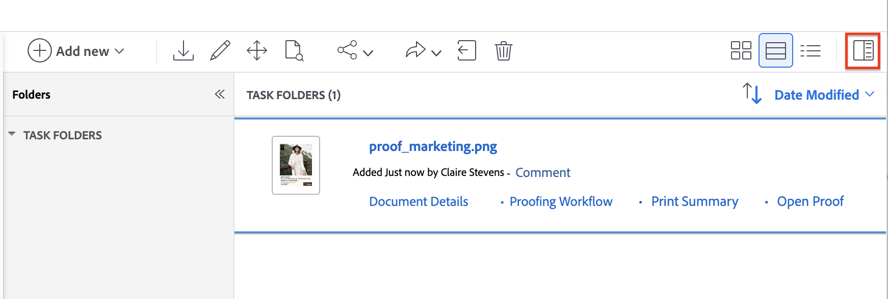

# Usar las aprobaciones unificadas y la revisión de forma conjunta

Aprobaciones unificadas en Workfront presenta un nuevo conjunto de funciones para ayudarle a revisar y aprobar documentos. Puede utilizar un flujo de trabajo de aprobaciones unificadas con el visor de revisiones existente para agregar comentarios y marcas a los documentos que se están revisando.

Existen algunas diferencias clave en el flujo de trabajo al utilizar aprobaciones unificadas y revisiones juntas:

* Los participantes se muestran en el documento Resumen, no en el flujo de trabajo de revisión.

* Los detalles enviados, abiertos, comentarios y decisiones (SOCD) de la lista de documentos están relacionados con la revisión y no reflejan el estado de decisión del documento.

## Cargar un documento y crear una prueba

1. Vaya al proyecto, tarea o problema en el que desee agregar un documento nuevo.
1. Haga clic en la ficha **Documentos** y, a continuación, haga clic en el menú desplegable **Agregar nuevo**.
O
Arrastre y suelte el documento en la lista de documentos.

   >[!NOTE]
   >
   >Si tiene la opción **Generar pruebas automáticamente al cargar documentos** habilitada en su perfil de usuario, el sistema crea automáticamente una prueba simple.

1. Pase el ratón sobre el documento, luego haga clic en el vínculo **Crear revisión** que aparece debajo del nombre del documento y seleccione **Revisión simple**. Debe crear una prueba sencilla, ya que no utilizará el flujo de trabajo de prueba para las aprobaciones.

Los usuarios asignados como participantes pueden utilizar el visor de revisión para agregar comentarios y marcas en el documento. Continúe con la siguiente sección para aprender a agregar participantes de la revisión.

<!--
## Open the document Summary and assign participants in Production

You have the option to assign reviewers, approvers, or a mix of both:

* **Reviewers** can add comments and mark up assets. Once finished, they can mark their review as complete. Marking the review as complete is not required for the document to move forward in the approval process.
* **Approvers** can add comments and mark up assets. They must make a decision to move the approval process forward. 

To assign participants:

1. Select the document you uploaded and open the document Summary.
    

1. Scroll down to the **Approvals** section, then click **Create workflow**.

1. Fill in the following details:

   <table>
   <tr>
   <td><strong>Stage name</strong></td>
   <td>Add a stage name. You can change the name to something more descriptive, such as <em>Initial Review</em> or <em>Final Approval</em>.</td>
   </tr>
   <tr>
   <td><strong>Add names or emails</strong></td>
   <td>Begin typing a user or team name to add as an approver or reviewer. If you only have reviewers, they will be notified and have the option to complete the review but no decision will be required or made.</td>
   </tr>
   <tr>
   <td><strong>One decision required (optional)</strong></td>
   <td>The first person who makes a decision completes the stage.</td>
   </tr>
   <tr>
   <td><strong>Due date (optional)</strong></td>
   <td>Set a due date for the approval. Users and teams are notified by email 72 hours, then 24 hours before the specified due date.</td>
   </tr>
   </table>

1. (Optional) Repeat the previous step to add additional stages as needed.

   >[!NOTE]
   >
   >If you add multiple stages, the approval workflow proceeds in the order the stages are listed. When all required decisions are made, the next stage begins and the previous stage is locked.

   

1. Once you've added all reviewers and approvers, click **Request approvals**. Participants are notified via email.
-->

## Abra el documento Resumen y asigne participantes

El cuadro de diálogo Solicitar aprobación se abre en el modo Básico de forma predeterminada para una aprobación de una sola etapa. Cambie al modo avanzado para configurar aprobaciones de varias etapas o rutas paralelas.

Para asignar participantes:

1. Seleccione el documento que ha cargado y abra el documento Resumen.

   

1. Desplácese hacia abajo hasta la sección **Aprobaciones** y haga clic en **Crear flujo de trabajo**. El cuadro de diálogo **Solicitar aprobación** se abre en el modo Básico.

1. Configure el flujo de trabajo de aprobación. Para obtener descripciones de los campos, la opción Modo avanzado y el flujo de rutas paralelas, consulte [Crear un flujo de trabajo de aprobación de documentos](/help/quicksilver/review-and-approve-work/document-reviews-and-approvals/manage-document-approvals/create-a-document-approval.md).

1. Haga clic en **Solicitar aprobación**. Los participantes reciben notificaciones por correo electrónico.

<!--
## Create a new version as needed in Production

If you need another round of review and approval, you can create a new proof version and add the previous participants, new participants, or a mix of both. You can view information about previous versions and participants in the document Summary.

To add a new version:

1. Drag and drop the new file on top of the previous document in Workfront. This automatically creates a new version. 

1. Once the document finishes uploading, select the document, then click **Create proof** > **Simple proof**. 

1. Select the document again, and open the document Summary.
    

1. Scroll down to the **Approvals** section, then click **Create workflow**.

1. Fill in the following details:

   <table>
   <tr>
   <td><strong>Stage name</strong></td>
   <td>Add a stage name. You can change the name to something more descriptive, such as <em>Initial Review</em> or <em>Final Approval</em>.</td>
   </tr>
   <tr>
   <td><strong>Add names or emails</strong></td>
   <td>Begin typing a user or team name to add as an approver or reviewer. If you only have reviewers, they will be notified and have the option to complete the review but no decision will be required or made.</td>
   </tr>
   <tr>
   <td><strong>One decision required (optional)</strong></td>
   <td>The first person who makes a decision completes the stage.</td>
   </tr>
   <tr>
   <td><strong>Due date (optional)</strong></td>
   <td>Set a due date for the approval. Users and teams are notified by email 72 hours, then 24 hours before the specified due date.</td>
   </tr>
   </table>

1. (Optional) Repeat the previous step to add additional stages as needed.

   >[!NOTE]
   >
   >If you add multiple stages, the approval workflow proceeds in the order the stages are listed. When all required decisions are made, the next stage begins and the previous stage is locked.

   

1. Once you've added all reviewers and approvers, click **Request approvals**. Participants are notified via email.
-->

## Cree una nueva versión según sea necesario

Si necesita otra ronda de revisión y aprobación, puede crear una nueva versión de prueba y agregar los participantes anteriores, los participantes nuevos o una combinación de ambos. Puede ver información sobre versiones anteriores y participantes en el documento Resumen.

El cuadro de diálogo Solicitar aprobación se abre en el modo Básico de forma predeterminada para una aprobación de una sola etapa. Cambie al modo avanzado para configurar aprobaciones de varias etapas o rutas paralelas.

Para agregar una nueva versión:

1. Arrastre y suelte el nuevo archivo sobre el documento anterior en Workfront. Workfront crea automáticamente una nueva versión.

1. Una vez que termine la carga del documento, selecciónelo y haga clic en **Crear revisión** > **Revisión simple**.

1. Vuelva a seleccionar el documento y, a continuación, abra el documento Resumen.

   

1. Desplácese hacia abajo hasta la sección **Aprobaciones** y haga clic en **Crear flujo de trabajo**. El cuadro de diálogo **Solicitar aprobación** se abre en el modo Básico.

1. Configure el flujo de trabajo de aprobación. Para obtener descripciones de los campos, la opción Modo avanzado y el flujo de rutas paralelas, consulte [Crear un flujo de trabajo de aprobación de documentos](/help/quicksilver/review-and-approve-work/document-reviews-and-approvals/manage-document-approvals/create-a-document-approval.md).

1. Haga clic en **Solicitar aprobación**. Los participantes reciben notificaciones por correo electrónico.

## Revise la prueba y tome una decisión

El documento no pasa a un estado aprobado hasta que todos los aprobadores asignados eligen &quot;aprobado&quot;.

Para revisar y aprobar un documento:

1. Vaya a la notificación de correo electrónico de revisión y haga clic en **Ir a revisión**.

1. Una vez que estés en Workfront, haz clic en **Ir a la revisión**.

1. Revise el contenido y agregue cualquier comentario o marca. Para obtener más información acerca de cómo usar el visor de revisión, vea [Revisar pruebas en Adobe Workfront: índice de artículos](/help/quicksilver/review-and-approve-work/proofing/reviewing-proofs-within-workfront/review-proofs-in-wf.md).

1. Elija una de las siguientes decisiones:

   * **Aprobar**: el documento no necesita cambios y está listo para usarse.
   * **Aprobar con cambios**: el documento necesita cambios y está listo para usarse una vez que se hayan realizado. No se requiere una aprobación adicional.
   * **Necesita trabajo**: el documento necesita cambios y no está listo para usarse. Una vez realizados los cambios especificados, el documento debe cargarse como una nueva versión y pasar por otra ronda de aprobaciones. Para obtener más información sobre cómo cargar una nueva versión, consulte [Crear una nueva versión según sea necesario](#create-a-new-version-as-needed) en este artículo.

Una vez que tome una decisión, se notifica al propietario del documento por correo electrónico.