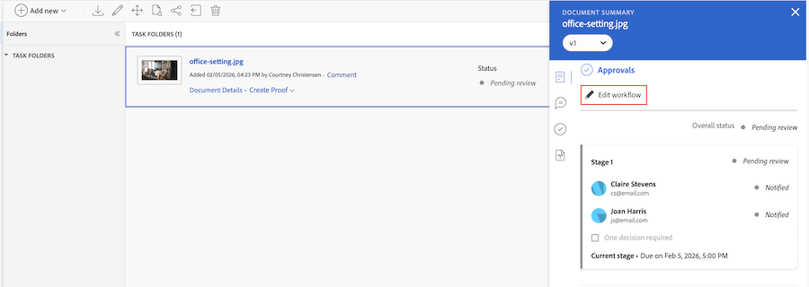
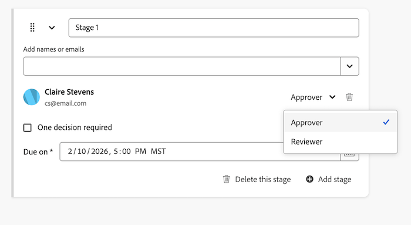
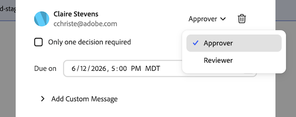
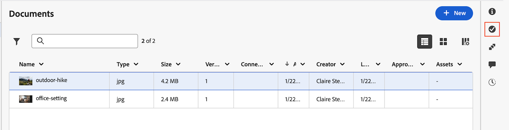

# Agregar aprobadores o revisores adicionales a un flujo de trabajo de aprobación de documentos

Puede agregar aprobadores o revisores adicionales a un flujo de trabajo de aprobación de documentos que ya tenga aprobaciones pendientes.

>[!IMPORTANT]
>
>El contenido de este artículo hace referencia a la funcionalidad actualizada de aprobación de documentos que solo está disponible para cuentas específicas. Para obtener información sobre los procesos de aprobación estándar, consulte los artículos enumerados en [Aprobaciones de trabajo](/help/quicksilver/review-and-approve-work/manage-approvals/manage-approvals.md).

## Requisitos de acceso

+++ Expanda para ver los requisitos de acceso para la funcionalidad en este artículo.

<table style="table-layout:auto"> 
 <tbody> 
  <tr> 
   <td role="rowheader">Paquete de Adobe Workfront</td> 
   <td> 
Cualquier paquete de Workfront para administrar aprobaciones mediante el almacenamiento heredado de Workfront.

Cualquier paquete de flujo de trabajo para administrar aprobaciones mediante el almacenamiento en la nube de Adobe
 </td> 
  </tr> 
  <tr> 
   <td role="rowheader">Licencia de Adobe Workfront</td> 
   <td>
   
Colaborador o superior

   
Revisión o superior
 
   
Si utiliza la integración de Frame.io, debe tener una licencia Standard para crear flujos de trabajo de aprobación.

   </td> 
  </tr> 
  <tr> 
   <td role="rowheader">Configuraciones de nivel de acceso</td> 
   <td> 
Acceso de visualización o superior a Proyectos, Tareas, Problemas, Plantillas, Portafolios, Programas, Informes, Tableros, Calendarios y Documentos
</td> 
  </tr> 
  <tr> 
   <td role="rowheader">Permisos de objeto</td> 
   <td> 
Acceso de visualización o superior al objeto asociado al acceso de solicitud o la aprobación 
</td> 
  </tr> 
 </tbody> 
</table>

Para obtener más información, consulte [Requisitos de acceso en la documentación de Workfront](/help/quicksilver/administration-and-setup/add-users/access-levels-and-object-permissions/access-level-requirements-in-documentation.md).

+++

<!--
## Add additional approvers or reviewers in the legacy documents area in Production

If your organization is on Workfront storage, you will see the legacy documents area when you access documents in Workfront. For more information about Workfront storage, see [Differences between Adobe cloud storage and legacy Workfront storage](/help/quicksilver/review-and-approve-work/esm-overview.md#differences-between-adobe-cloud-storage-and-legacy-workfront-storage).

To add additional approvers or reviewers from the Document Summary:

1. Go to the project, task, or issue that contains the document, then select **Documents** in the left panel.

1. Click on the document you need and the Document Summary panel for that document will open.

1. Select the version of the document you would like to add an approver or reviewer to in the version drop-down menu. The latest version is selected by default.

1. Scroll down to the **Approvals** section, then click **Edit workflow**.

   

1. Locate the stage you would like to add approvers or reviewers to, then add the user's name or email in the text box. You can also add an entire team if needed. 

1. Once their name is added, choose if they are an approver or reviewer. 

   

1. Repeat steps 5-6 to add additional approvers or reviewers.
 Once you save, the participants added receive an email notification that their approval or review is needed on the document.
-->

## Agregar aprobadores o revisores adicionales en el área de documentos heredados

Si su organización está en el almacenamiento de Workfront, verá el área de documentos heredados al acceder a documentos en Workfront. Para obtener más información sobre el almacenamiento de Workfront, consulte [Diferencias entre el almacenamiento en la nube de Adobe y el almacenamiento de Workfront heredado](/help/quicksilver/review-and-approve-work/esm-overview.md#differences-between-adobe-cloud-storage-and-legacy-workfront-storage).

Para agregar aprobadores o revisores adicionales desde el resumen de documento:

1. Vaya al proyecto, tarea o problema que contiene el documento y, a continuación, seleccione **Documentos** en el panel izquierdo.

1. Haga clic en el documento que necesite. Se abre el panel Resumen del documento para ese documento.

1. Seleccione la versión del documento a la que desea agregar un aprobador o revisor en el menú desplegable Versión. La última versión está seleccionada de forma predeterminada.

1. Desplácese hacia abajo hasta la sección **Aprobaciones** y haga clic en **Editar flujo de trabajo**. El cuadro de diálogo Solicitar aprobación se abre en el modo en el que se guardó por última vez la aprobación: Básico para aprobaciones de una sola etapa o Avanzado para aprobaciones de varias etapas y aprobaciones con rutas paralelas.

1. Añada el usuario, equipo o correo electrónico:

   * En el modo Básico, escriba el nombre o el correo electrónico en el campo **Agregar nombres o correos electrónicos**.
   * En el modo Avanzado, seleccione la ruta que contiene la etapa que desea actualizar y, a continuación, escriba el nombre o el correo electrónico en el campo **Agregar nombres o correos electrónicos** de la etapa.

1. Elija si es aprobador o revisor para cada persona que ha agregado.

   

1. Haga clic en **Guardar**. Los participantes que ha añadido reciben una notificación por correo electrónico de que se necesita su aprobación o revisión en el documento.

>[!TIP]
>
>Para reestructurar una aprobación en modo básico en una aprobación de varias etapas o rutas múltiples, haga clic en **Ir a avanzado** en la esquina superior derecha. Los participantes existentes se conservarán como Ruta 1, Fase 1. Después de guardar, no puede volver al modo Básico. Para obtener más información, consulte [Crear un flujo de trabajo de aprobación de documentos](/help/quicksilver/review-and-approve-work/document-reviews-and-approvals/manage-document-approvals/create-a-document-approval.md).

<!--
## Add additional approvers or reviewers in the new Documents area in Production

If your organization uses Adobe cloud storage, you will see the new Documents area when you access documents in Workfront. For more information about Adobe cloud storage, see [Adobe cloud storage overview](/help/quicksilver/review-and-approve-work/esm-overview.md).

1. Go to the project, task, or issue that contains the document, then select **Documents** in the left panel.

1. Click on the document, then click the **Approvals** icon on the right side of the page. 

   

1. Click **Edit workflow**.

1. Locate the stage you would like to add approvers or reviewers to, then add the user's name or email in the text box. You can also add an entire team if needed. 

1. Once their name is added, choose if they are an approver or reviewer. 

   

1. Repeat steps 5-6 to add additional approvers or reviewers.
 Once you save, the participants added receive an email notification that their approval or review is needed on the document.
-->

## Agregar aprobadores o revisores adicionales del Resumen del documento en el área de nuevos documentos

Si su organización utiliza el almacenamiento en la nube de Adobe, verá la nueva área Documentos al acceder a documentos en Workfront. Para obtener más información sobre el almacenamiento en la nube de Adobe, consulte [Información general sobre el almacenamiento en la nube de Adobe](/help/quicksilver/review-and-approve-work/esm-overview.md).

Para agregar aprobadores o revisores adicionales desde el resumen de documento:

1. Vaya al proyecto, tarea o problema que contiene el documento y, a continuación, seleccione **Documentos** en el panel izquierdo.

1. Haga clic en el documento y luego en el icono **Aprobaciones** que encontrará a la derecha de la página.

   

1. Haga clic en **Editar flujo de trabajo**. El cuadro de diálogo Solicitar aprobación se abre en el modo en el que se guardó por última vez la aprobación: Básico para aprobaciones de una sola etapa o Avanzado para aprobaciones de varias etapas y aprobaciones con rutas paralelas.

1. Añada el usuario o correo electrónico:

   * En el modo Básico, escriba el nombre o el correo electrónico en el campo **Agregar nombres o correos electrónicos**.
   * En el modo Avanzado, seleccione la ruta que contiene la etapa que desea actualizar y, a continuación, escriba el nombre o el correo electrónico en el campo **Agregar nombres o correos electrónicos** de la etapa.

1. Elija si es aprobador o revisor para cada persona que ha agregado.

   

1. Haga clic en **Guardar**. Los participantes que ha añadido reciben una notificación por correo electrónico de que se necesita su aprobación o revisión en el documento.

>[!TIP]
>
>Para reestructurar una aprobación en modo básico en una aprobación de varias etapas o rutas múltiples, haga clic en **Ir a avanzado** en la esquina superior derecha. Los participantes existentes se conservarán como Ruta 1, Fase 1. Después de guardar, no puede volver al modo Básico. Para obtener más información, consulte [Crear un flujo de trabajo de aprobación de documentos](/help/quicksilver/review-and-approve-work/document-reviews-and-approvals/manage-document-approvals/create-a-document-approval.md).
