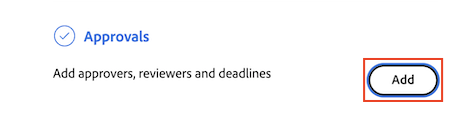

# Crear una solicitud de revisión o aprobación de documento

La información resaltada en esta página hace referencia a funcionalidades que aún no están disponibles de forma general. Solo está disponible en el entorno de vista previa de espacio aislado.

Puede solicitar la aprobación de otros usuarios o equipos para un documento en Adobe Workfront o solicitar que revisen un documento sin necesidad de aprobarlo.

>[!IMPORTANT]
>
>El contenido de este artículo hace referencia a la funcionalidad actualizada de aprobación de documentos que solo está disponible para cuentas específicas. Para obtener información sobre los procesos de aprobación estándar, consulte los artículos enumerados en [Aprobaciones de trabajo](/help/quicksilver/review-and-approve-work/manage-approvals/manage-approvals.md).

## Requisitos de acceso

Debe tener el siguiente acceso para realizar los pasos de este artículo:

<table style="table-layout:auto"> 
 <col> 
 <col> 
 <tbody> 
  <tr> 
   <td role="rowheader">plan Adobe Workfront*</td> 
   <td> 
Cualquiera
 </td> 
  </tr> 
  <tr> 
   <td role="rowheader">Licencia de Adobe Workfront*</td> 
   <td> 
Revisar o superior
 </td> 
  </tr> 
  <tr> 
   <td role="rowheader">Configuraciones de nivel de acceso*</td> 
   <td> 
Acceso de visualización o superior a Proyectos, Tareas, Problemas, Plantillas, Portfolio, Programas, Informes, Tableros y Calendarios, Documentos
 
Nota: Si sigue sin tener acceso, pregunte al administrador de Workfront si ha establecido restricciones adicionales en su nivel de acceso. Para obtener información sobre cómo un administrador de Workfront puede modificar su nivel de acceso, consulte <a href="/help/quicksilver/administration-and-setup/add-users/configure-and-grant-access/create-modify-access-levels.md" class="MCXref xref">Crear o modificar niveles de acceso personalizados</a>.
 </td> 
  </tr>
  <tr> 
   <td role="rowheader">Permisos de objeto</td> 
   <td> 
Administrar el acceso al objeto asociado con el acceso de solicitud o la aprobación 
 
Para obtener información sobre cómo solicitar acceso adicional, consulte <a href="/help/quicksilver/workfront-basics/grant-and-request-access-to-objects/request-access.md" class="MCXref xref">Solicitud de acceso a objetos </a>.
 </td> 
  </tr> 
 </tbody> 
</table>

&#42;Para saber qué plan, tipo de licencia o acceso tiene, póngase en contacto con su administrador de Workfront.

## Crear una solicitud de revisión o aprobación de documento desde la página de documento

1. Pase el ratón sobre el documento y haga clic en Detalles del documento.
   

1. Cerca del nombre del documento, seleccione la versión del documento para la que desea crear una aprobación en la lista desplegable de versión. La última versión se selecciona de forma predeterminada.

1. Clic **Aprobaciones** en el panel izquierdo.

1. (Opcional) Establezca una fecha límite para la aprobación. Los usuarios y equipos reciben una notificación por correo electrónico 72 horas y, a continuación, 24 horas antes del plazo especificado.

1. Para agregar un aprobador, haga clic en **Aprobador** y y empiezan a escribir el nombre de un usuario o equipo.

1. Para agregar un revisor, haga clic en el **Revisor** y empiece a escribir el nombre de un usuario o equipo.

   

1. Repita el paso anterior para agregar más aprobadores o revisores.

## Crear una solicitud de revisión o aprobación de documento desde el panel Resumen de documentos

1. Vaya al proyecto, tarea o problema que contiene el documento y, a continuación, seleccione **Documentos**.

1. Haga clic en el documento que necesita y se abrirá el panel Resumen del documento para ese documento.

1. Seleccione la versión del documento para la que desea crear una aprobación en el menú desplegable de versión. La última versión se selecciona de forma predeterminada.

1. Desplácese hacia abajo hasta el **Aprobaciones** en el panel Resumen del documento y, a continuación, haga clic en **Añadir**.

1. (Opcional) Establezca una fecha límite para la aprobación. Los usuarios y equipos reciben una notificación por correo electrónico 72 horas y, a continuación, 24 horas antes del plazo especificado.

1. Para agregar un aprobador, haga clic en **Aprobador** y y empiezan a escribir el nombre de un usuario o equipo.

1. Para agregar un revisor, haga clic en el **Revisor** y empiece a escribir el nombre de un usuario o equipo.

   

1. Repita el paso anterior para agregar más aprobadores o revisores.

<!--
## Resubmit an approval on a new version

Document approval decisions are not automatically reset when you upload a new version. For example, if your document is approved with changes, the decision will show "changes" as the decision, even if you upload a new version with the specified changes. You can clear the decision on a new version if you manually resubmit the approval.

1. Go to the project, task, or issue that contains the document, then select **Documents**.
1. Find the document you need.

1. Scroll down to the **Approvals** section in the Summary, click the More icon, then click Resubmit.

   
-->
