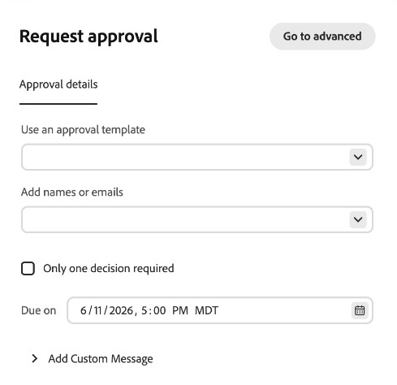
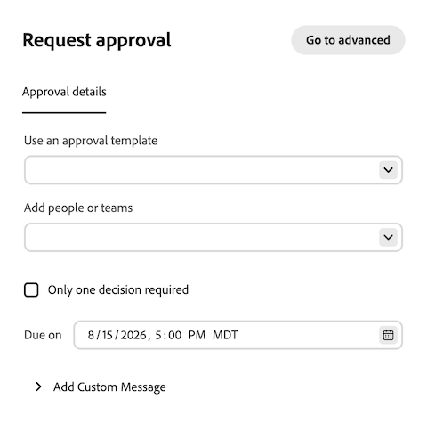
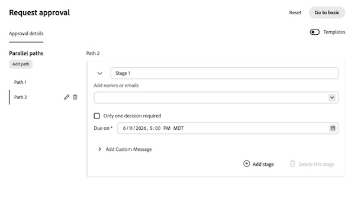
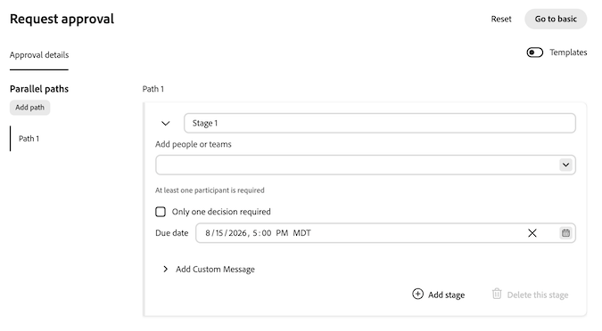
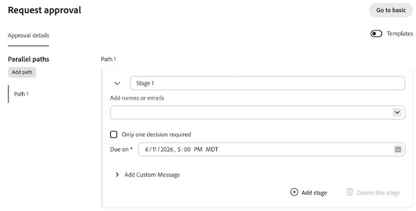

# Crear un flujo de trabajo de aprobación de documentos

{{highlighted-preview}}

Puede solicitar la aprobación de otros usuarios o equipos para un documento en Adobe Workfront o solicitar que revisen un documento sin necesidad de aprobarlo.

>[!IMPORTANT]
>
>El contenido de este artículo hace referencia a la funcionalidad actualizada de aprobación de documentos que solo está disponible para cuentas específicas. Para obtener información sobre los procesos de aprobación estándar, consulte los artículos enumerados en [Aprobaciones de trabajo](/help/quicksilver/review-and-approve-work/manage-approvals/manage-approvals.md).

## Requisitos de acceso

+++ Expanda para ver los requisitos de acceso para la funcionalidad en este artículo.

<table style="table-layout:auto"> 
 <col> 
 <col> 
 <tbody> 
  <tr> 
   <td role="rowheader">Paquete de Adobe Workfront</td> 
   <td> 
Cualquier paquete de Workfront para administrar aprobaciones mediante el almacenamiento heredado de Workfront.

Cualquier paquete de flujo de trabajo para administrar aprobaciones mediante el almacenamiento en la nube de Adobe
 </td> 
  </tr> 
  <tr> 
   <td role="rowheader">Licencia de Adobe Workfront</td>  
   <td>
   
Colaborador o superior

   
Revisión o superior

   
Si utiliza la integración de Frame.io, debe tener una licencia Standard para crear flujos de trabajo de aprobación.

   </td> 
  </tr> 
  <tr> 
   <td role="rowheader">Configuraciones de nivel de acceso</td> 
   <td> 
Acceso de visualización o superior a Proyectos, Tareas, Problemas, Plantillas, Portafolios, Programas, Informes, Paneles de control y Calendarios, Documentos
 </td> 
  </tr>
  <tr> 
   <td role="rowheader">Permisos de objeto</td> 
   <td> 
Acceso de administración al objeto asociado con el acceso de solicitud o la aprobación 
 </td> 
  </tr> 
 </tbody> 
</table>

Para obtener más información, consulte [Requisitos de acceso en la documentación de Workfront](/help/quicksilver/administration-and-setup/add-users/access-levels-and-object-permissions/access-level-requirements-in-documentation.md).

+++

## Creación de un flujo de trabajo de aprobación en el área de documentos heredados

Si su organización está en el almacenamiento de Workfront, verá el área de documentos heredados al acceder a documentos en Workfront. Para obtener más información sobre el almacenamiento de Workfront, consulte [Diferencias entre el almacenamiento en la nube de Adobe y el almacenamiento de Workfront heredado](/help/quicksilver/review-and-approve-work/esm-overview.md#differences-between-adobe-cloud-storage-and-legacy-workfront-storage).

### Creación de un flujo de trabajo de aprobación básico

Para crear un flujo de trabajo de aprobación de una sola etapa:

1. Vaya al proyecto, tarea o problema que contiene el documento y, a continuación, seleccione **Documentos** en el panel izquierdo.

1. Haga clic en el documento que necesita y se abrirá el panel Resumen del documento para ese documento.

1. Seleccione la versión del documento para la que desea crear una aprobación en el menú desplegable de la versión. La última versión está seleccionada de forma predeterminada.

1. Desplácese hacia abajo hasta la sección **Aprobaciones** y haga clic en **Crear flujo de trabajo**. El cuadro de diálogo **Solicitar aprobación** se abre en el modo Básico.

1. Complete los siguientes detalles:

   <table>
   <tr>
   <td><strong>Usar una plantilla de aprobación (opcional)</strong></td>
   <td>Seleccione una plantilla en el menú desplegable. Si la plantilla tiene una ruta y una fase, se aplica en modo Básico. Si la plantilla tiene más de una etapa o más de una ruta, el cuadro de diálogo cambia automáticamente al modo Avanzado y cualquier entrada introducida en el modo Básico se reemplaza por el contenido de la plantilla.</td>
   </tr>
   <tr>
   <td><strong>Añadir nombres o correos electrónicos</strong></td>
   <td>Empiece a escribir el nombre de un usuario o equipo que desee agregar como aprobador o revisor. Si solo tiene revisores, se les notificará y tendrán la opción de completar la revisión, pero no se requerirá ni se adoptará ninguna decisión.</td>
   </tr>
   <tr class="preview">
   <td><strong>Agregar personas o equipos en la vista previa</strong></td>
   <td>Empiece a escribir el nombre de usuario, el equipo o la dirección de correo electrónico. El equipo se añade como un solo aprobador o revisión de forma predeterminada, pero puede elegir añadir a cada miembro del equipo como un participante individual.  
   Nota: Si ya se ha agregado un usuario o pertenece a más de un equipo, se incluirá una vez.</td>
   </tr>
   <tr>
   <td><strong>Solo se requiere una decisión (opcional)</strong></td>
   <td>La primera persona que toma una decisión completa la etapa.</td>
   </tr>
   <tr>
   <td><strong>Vence el (opcional)</strong></td>
   <td>Establezca una fecha límite para la aprobación. Los usuarios y equipos reciben una notificación por correo electrónico 72 horas y, a continuación, 24 horas antes de la fecha de vencimiento especificada.</td>
   </tr>
   <tr>
   <td><strong>Añadir mensaje personalizado (opcional)</strong></td>
   <td>Escriba un mensaje en el cuadro de texto <strong>Agregar mensaje personalizado</strong>. El mensaje aparece en la notificación de correo electrónico de aprobación y en la pestaña Aprobaciones de Workfront.
   
Nota: Si edita un mensaje personalizado después de crear el flujo de trabajo de aprobación, se envía una notificación actualizada por correo electrónico a todos los participantes existentes. Si agrega un participante más adelante, el mensaje personalizado se incluye en su notificación por correo electrónico.

   </td>
   </tr>
   </table>

1. Haga clic en **Solicitar aprobación**.

   

   <!-- 
   preview screen
   -->

### Creación de un flujo de trabajo de aprobación avanzado

El modo avanzado admite varias fases, así como rutas paralelas. Cada ruta se ejecuta de forma independiente y contiene una o más fases secuenciales. Cuando se toman todas las decisiones necesarias en una fase, comienza la siguiente fase de esa ruta, se bloquea la etapa anterior y los revisores y aprobadores de la nueva etapa reciben una notificación por correo electrónico.

Una decisión &quot;Necesita trabajo&quot; detiene la ruta por sí sola, pero no afecta al flujo de trabajo de aprobación en otras rutas. Puede configurar hasta 30 rutas y 100 etapas en total.

Para crear un flujo de trabajo de aprobación avanzado:

1. Vaya al proyecto, tarea o problema que contiene el documento y, a continuación, seleccione **Documentos** en el panel izquierdo.

1. Haga clic en el documento que necesita y se abrirá el panel Resumen del documento para ese documento.

1. Seleccione la versión del documento para la que desea crear una aprobación en el menú desplegable de la versión. La última versión está seleccionada de forma predeterminada.

1. Desplácese hacia abajo hasta la sección **Aprobaciones** y haga clic en **Crear flujo de trabajo**.

1. En la parte superior derecha del cuadro de diálogo **Solicitar aprobación**, haga clic en **Ir a avanzado**. Cualquier entrada introducida en el modo Básico se conserva y se aplica a **Ruta de acceso 1**, **Fase 1**.

   >[!TIP]
   >
   >Mientras está creando la aprobación, puede volver al modo Básico haciendo clic en **Ir a básico** en la parte superior derecha. Después de hacer clic en **Solicitar aprobación**, la opción **Ir a básico** ya no está disponible.

1. Rellene los detalles de la fase 1 de la ruta 1:

   <table>
   <tr>
   <td><strong>Nombre de la fase</strong></td>
   <td>Las fases se denominan <em>Fase 1</em>, <em>Fase 2</em>, etc. de forma predeterminada. Cambie el nombre del escenario por otro más descriptivo, como <em>Revisión inicial</em> o <em>Aprobación final</em>.</td>
   </tr>
   <tr>
   <td><strong>Añadir nombres o correos electrónicos</strong></td>
   <td>Empiece a escribir el nombre de un usuario o equipo que desee agregar como aprobador o revisor. Si solo tiene revisores, se les notificará y tendrán la opción de completar la revisión, pero no se requerirá ni se adoptará ninguna decisión.
Nota: Un revisor o aprobador solo puede asignarse a una fase abierta a la vez en el mismo recurso. Si se abren varias fases paralelas simultáneamente, no se puede agregar la misma persona a más de una.
</td>
   </tr>
   <tr class="preview">
   <td><strong>Agregar personas o equipos en la vista previa</strong></td>
   <td>Empiece a escribir el nombre de usuario, el equipo o la dirección de correo electrónico. El equipo se añade como un solo aprobador o revisión de forma predeterminada, pero puede elegir añadir a cada miembro del equipo como un participante individual.  
   Nota: Si ya se ha agregado un usuario o pertenece a más de un equipo, se incluirá una vez. Además, los participantes solo pueden asignarse a una fase abierta a la vez en el mismo recurso.</td>
   </tr>
   <tr>
   <td><strong>Solo se requiere una decisión (opcional)</strong></td>
   <td>La primera persona que toma una decisión completa la etapa.</td>
   </tr>
   <tr>
   <td><strong>Vence el (opcional)</strong></td>
   <td>La primera etapa de cada ruta admite una fecha de vencimiento absoluta. Cada fase subsiguiente de la ruta admite una fecha de vencimiento relativa: el número de días a partir de la fecha en que se abre esa fase. Los usuarios y equipos reciben una notificación por correo electrónico 72 horas antes de la fecha de vencimiento.</td>
   </tr>
   <tr>
   <td><strong>Añadir mensaje personalizado (opcional)</strong></td>
   <td>Escriba un mensaje en el cuadro de texto <strong>Agregar mensaje personalizado</strong>. El mensaje aparece en la notificación de correo electrónico de aprobación y en la pestaña Aprobaciones de Workfront.
Al agregar una segunda etapa, <strong>Mostrar este mensaje en todas las etapas</strong> está seleccionado de manera predeterminada. Deje seleccionado para utilizar el mismo mensaje en cada fase. Para usar un mensaje diferente para cada fase, desactive <strong>Mostrar este mensaje en todas las fases</strong> y, a continuación, escriba el mensaje específico de la fase en el cuadro de texto <strong>Agregar mensaje personalizado</strong> de cada fase.
</td>
   </tr>
   </table>

1. (Opcional) Haga clic en **Agregar etapa** para agregar otra etapa a la ruta. Las fases dentro de una ruta se ejecutan secuencialmente en el orden en que aparecen en la lista. Puede reordenar las fases dentro de una ruta, pero no puede mover una fase de una ruta a otra. Cada ruta puede tener un número diferente de etapas.

1. (Opcional) En **Rutas paralelas**, haga clic en **Agregar ruta** para agregar otra ruta. La nueva ruta comienza con una etapa vacía y se convierte en la ruta seleccionada. Para cambiar el nombre de una ruta, pase el ratón sobre la etiqueta de la ruta, haga clic en el icono de lápiz y escriba un nombre nuevo.

1. (Opcional) Para quitar una ruta, pase el ratón sobre la etiqueta de la ruta y haga clic en el icono de papelera. **La ruta de acceso 1** no se puede quitar y las rutas de acceso no se pueden reordenar. Otras rutas solo se pueden eliminar si no se ha bloqueado ni completado ninguna etapa dentro de la ruta.

   

<!-- preview screen
   
-->

1. (Opcional) Para borrar todas las rutas y etapas y volver a empezar, haga clic en **Restablecer** en la parte superior derecha.

1. Haga clic en **Solicitar aprobación**.

## Crear un flujo de trabajo de aprobación en la nueva área de documentos

Si su organización utiliza el almacenamiento en la nube de Adobe, verá la nueva área Documentos al acceder a documentos en Workfront. Para obtener más información sobre el almacenamiento en la nube de Adobe, consulte [Información general sobre el almacenamiento en la nube de Adobe](/help/quicksilver/review-and-approve-work/esm-overview.md).

El cuadro de diálogo **Solicitar aprobación** se abre en el modo **Básico** de forma predeterminada. El modo básico es una fase única con un conjunto de aprobadores o revisores. Cambie al modo **Avanzado** para configurar aprobaciones de varias etapas o rutas paralelas.

### Creación de un flujo de trabajo de aprobación básico

Para crear un flujo de trabajo de aprobación de una sola etapa:

1. Vaya al proyecto, tarea o problema que contiene el documento y, a continuación, seleccione **Documentos** en el panel izquierdo.

1. Haga clic en el documento y luego en el icono **Aprobaciones** que encontrará a la derecha de la página.

   

1. Haga clic en **Crear flujo de trabajo**. El cuadro de diálogo **Solicitar aprobación** se abre en el modo Básico.

1. Complete los siguientes detalles:

   <table>
   <tr>
   <td><strong>Usar una plantilla de aprobación (opcional)</strong></td>
   <td>El campo de plantillas está contraído de forma predeterminada. Haga clic en el campo para expandirlo y, a continuación, seleccione una plantilla en el menú desplegable. Si la plantilla tiene una ruta y una fase, se aplica en modo Básico. Si la plantilla tiene más de una etapa o más de una ruta, el cuadro de diálogo cambia automáticamente al modo Avanzado y cualquier entrada introducida en el modo Básico se reemplaza por el contenido de la plantilla.</td>
   </tr>
   <tr>
   <td><strong>Añadir nombres o correos electrónicos</strong></td>
   <td>Empiece a escribir el nombre de usuario o el correo electrónico que desea agregar como aprobador o revisor. Si solo tiene revisores, se les notificará y tendrán la opción de completar la revisión, pero no se requerirá ni se adoptará ninguna decisión.</td>
   </tr>
   <tr class="preview">
   <td><strong>Agregar personas o equipos en la vista previa</strong></td>
   <td>Empiece a escribir el nombre de usuario, el equipo o la dirección de correo electrónico y, a continuación, elija si es un <strong>aprobador</strong> o <strong>revisor</strong>. Workfront agrega cada miembro activo de un equipo individualmente.  
   Nota: Si ya se ha agregado un usuario o pertenece a más de un equipo, se incluirá una vez.</td>
   </tr>
   <tr>
   <td><strong>Solo se requiere una decisión (opcional)</strong></td>
   <td>La primera persona que toma una decisión completa la etapa.</td>
   </tr>
   <tr>
   <td><strong>Vence el (opcional)</strong></td>
   <td>Establezca una fecha límite para la aprobación. Se notifica a los usuarios por correo electrónico 72 horas antes de la fecha de vencimiento especificada.</td>
   </tr>
   <tr>
   <td><strong>Añadir mensaje personalizado (opcional)</strong></td>
   <td>Escriba un mensaje en el cuadro de texto <strong>Agregar mensaje personalizado</strong>. El mensaje aparece en la notificación de correo electrónico de aprobación y en la pestaña Aprobaciones de Workfront.</td>
   </tr>
   </table>

1. Haga clic en **Solicitar aprobación**.

   

   <!-- 
   preview screen
   -->

>[!NOTE]
>
>* El cuadro de diálogo **Solicitar aprobación** se abre en el modo Básico todas las veces, independientemente de la sesión anterior.
>* Si edita un mensaje personalizado después de crear el flujo de trabajo de aprobación, se envía una notificación por correo electrónico actualizada a todos los participantes existentes. Si agrega un participante más adelante, el mensaje personalizado se incluye en su notificación por correo electrónico.
>* Una vez guardada una aprobación, no se puede volver a cambiar al modo Básico. Puede cambiar una aprobación en curso de Básica a Avanzada siempre que la aprobación no esté bloqueada o completada.

### Creación de un flujo de trabajo de aprobación avanzado

El modo avanzado admite rutas paralelas. Cada ruta se ejecuta de forma independiente y contiene una o más fases secuenciales. Cuando se toman todas las decisiones necesarias en una fase, comienza la siguiente fase de esa ruta, se bloquea la etapa anterior y los revisores y aprobadores de la nueva etapa reciben una notificación por correo electrónico.

Una decisión &quot;Necesita trabajo&quot; detiene la ruta por sí sola, pero no afecta al flujo de trabajo de aprobación en otras rutas. Puede configurar hasta 30 rutas y 100 etapas en total.

Para crear un flujo de trabajo de aprobación avanzado:

1. Vaya al proyecto, tarea o problema que contiene el documento y, a continuación, seleccione **Documentos** en el panel izquierdo.

1. Haga clic en el documento y luego en el icono **Aprobaciones** que encontrará a la derecha de la página.

   

1. Haga clic en **Crear flujo de trabajo**.

1. En la parte superior derecha del cuadro de diálogo **Solicitar aprobación**, haga clic en **Ir a avanzado**. Cualquier entrada introducida en el modo Básico se conserva y se aplica a **Ruta de acceso 1**, **Fase 1**.

   >[!TIP]
   >
   >Mientras está creando la aprobación, puede volver al modo Básico haciendo clic en **Ir a básico** en la parte superior derecha. Después de hacer clic en **Solicitar aprobación**, la opción **Ir a básico** ya no está disponible.

1. Rellene los detalles de la fase 1 de la ruta 1:

   <table>
   <tr>
   <td><strong>Nombre de la fase</strong></td>
   <td>Las fases se denominan <em>Fase 1</em>, <em>Fase 2</em>, etc. de forma predeterminada. Cambie el nombre del escenario por otro más descriptivo, como <em>Revisión inicial</em> o <em>Aprobación final</em>.</td>
   </tr>
   <tr>
   <td><strong>Añadir nombres o correos electrónicos</strong></td>
   <td>Empiece a escribir el nombre de usuario o el correo electrónico que desea agregar como aprobador o revisor. Si solo tiene revisores, se les notificará y tendrán la opción de completar la revisión, pero no se requerirá ni se adoptará ninguna decisión.
Nota: Un revisor o aprobador solo puede asignarse a una fase abierta a la vez en el mismo recurso. Si se abren varias fases paralelas simultáneamente, no se puede agregar la misma persona a más de una.
</td>
   </tr>
   <tr class="preview">
   <td><strong>Agregar personas o equipos en la vista previa</strong></td>
   <td>Empiece a escribir el nombre de usuario, el equipo o la dirección de correo electrónico y, a continuación, elija si es un <strong>aprobador</strong> o <strong>revisor</strong>. Workfront agrega cada miembro activo de un equipo individualmente.  
   Nota: Si ya se ha agregado un usuario o pertenece a más de un equipo, se incluirá una vez. Además, los participantes solo pueden asignarse a una fase abierta a la vez en el mismo recurso.</td>
   </tr>
   <tr>
   <td><strong>Solo se requiere una decisión (opcional)</strong></td>
   <td>La primera persona que toma una decisión completa la etapa.</td>
   </tr>
   <tr>
   <td><strong>Vence el (opcional)</strong></td>
   <td>La primera etapa de cada ruta admite una fecha de vencimiento absoluta. Cada fase subsiguiente de la ruta admite una fecha de vencimiento relativa: el número de días a partir de la fecha en que se abre esa fase. Se notifica a los usuarios por correo electrónico 72 horas, luego 24 horas antes de la fecha límite.</td>
   </tr>
   <tr>
   <td><strong>Añadir mensaje personalizado (opcional)</strong></td>
   <td>Escriba un mensaje en el cuadro de texto <strong>Agregar mensaje personalizado</strong>. El mensaje aparece en la notificación de correo electrónico de aprobación y en la pestaña Aprobaciones de Workfront.
Al agregar una segunda etapa, <strong>Mostrar este mensaje en todas las etapas</strong> está seleccionado de manera predeterminada. Deje seleccionado para utilizar el mismo mensaje en cada fase. Para usar un mensaje diferente para cada fase, desactive <strong>Mostrar este mensaje en todas las fases</strong> y, a continuación, escriba el mensaje específico de la fase en el cuadro de texto <strong>Agregar mensaje personalizado</strong> de cada fase.
</td>
   </tr>
   </table>

1. (Opcional) Haga clic en **Agregar etapa** para agregar otra etapa a la ruta. Las fases dentro de una ruta se ejecutan secuencialmente en el orden en que aparecen en la lista. Puede reordenar las fases dentro de una ruta, pero no puede mover una fase de una ruta a otra. Cada ruta puede tener un número diferente de etapas.

1. (Opcional) En **Rutas paralelas**, haga clic en **Agregar ruta** para agregar otra ruta. La nueva ruta comienza con una etapa vacía y se convierte en la ruta seleccionada. Para cambiar el nombre de una ruta, pase el ratón sobre la etiqueta de la ruta, haga clic en el icono de lápiz y escriba un nombre nuevo.

1. (Opcional) Para quitar una ruta, pase el ratón sobre la etiqueta de la ruta y haga clic en el icono de papelera. **La ruta de acceso 1** no se puede quitar y las rutas de acceso no se pueden reordenar. Otras rutas solo se pueden eliminar si no se ha bloqueado ni completado ninguna etapa dentro de la ruta.

   

   <!-- preview screen
   
   -->

1. (Opcional) Para borrar todas las rutas y etapas y volver a empezar, haga clic en **Restablecer** en la parte superior derecha.

1. Haga clic en **Solicitar aprobación**.

## Ver los flujos de trabajo de aprobación de versiones anteriores en el área nueva de Documentos en Vista previa

Si su organización utiliza el almacenamiento en la nube de Adobe, verá la nueva área Documentos al acceder a documentos en Workfront. Para obtener más información sobre el almacenamiento en la nube de Adobe, consulte [Información general sobre el almacenamiento en la nube de Adobe](/help/quicksilver/review-and-approve-work/esm-overview.md).

El panel Aprobaciones muestra únicamente las versiones del documento que tienen un flujo de trabajo de aprobación.

Para ver los flujos de trabajo de aprobación de versiones anteriores:

1. Vaya al proyecto, tarea o problema que contiene el documento y, a continuación, seleccione **Documentos** en el panel izquierdo.
1. Haga clic en el documento y luego en el icono **Aprobaciones** que encontrará a la derecha de la página.

   

1. Haga clic en una versión para expandirla. Puede ver las fases, la decisión de cada aprobador, la regla de decisión de la fase (por ejemplo, si solo se requiere una decisión para completar la fase) y las fechas de vencimiento.
1. Haga clic en otra versión para expandir su flujo de trabajo de aprobación sin salir del panel.

   >[!NOTE]
   >
   >Si el flujo de trabajo de aprobación de una versión se ha retirado porque se ha solicitado la aprobación de una versión más reciente, permanece en la lista, contraído, por lo que aún puede revisar sus decisiones anteriores.

<!--
## Resubmit an approval on a new version

Document approval decisions are not automatically reset when you upload a new version. For example, if your document is approved with changes, the decision will show "changes" as the decision, even if you upload a new version with the specified changes. You can clear the decision on a new version if you manually resubmit the approval.

1. Go to the project, task, or issue that contains the document, then select **Documents**.
1. Find the document you need.

1. Scroll down to the **Approvals** section in the Summary, click the More icon, then click Resubmit.

   
-->