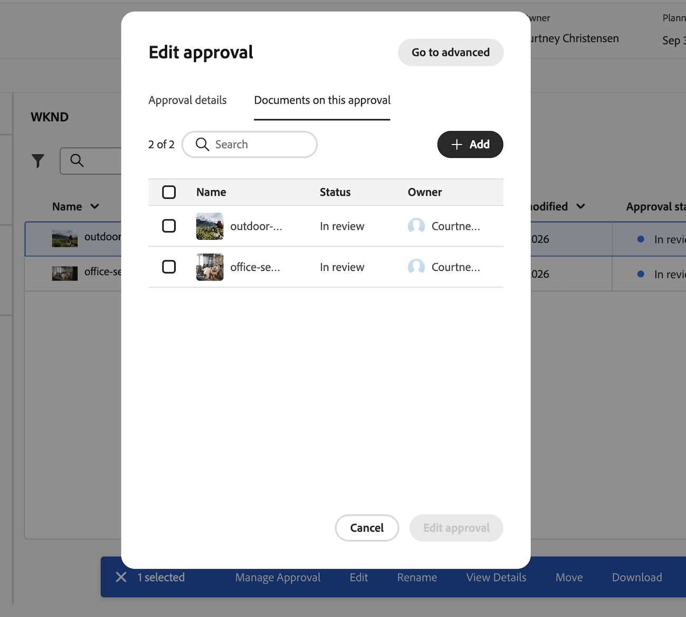

# Creación de una aprobación agrupada

La información de esta página no está disponible en el entorno de vista previa de espacio aislado porque la integración de Frame.io no está disponible allí. Esta funcionalidad estará disponible en los entornos de producción el 14 y 15 de octubre de 2026.

Una aprobación agrupada agrupa varios documentos en un solo flujo de trabajo de aprobación. Puede utilizar los modos Básico y Avanzado, varias fases y rutas paralelas con aprobaciones agrupadas, igual que con las aprobaciones de un solo documento.

Las aprobaciones agrupadas solo están disponibles en la nueva área de Documentos, que aparece cuando su organización utiliza el almacenamiento en la nube de Adobe. Para obtener más información, consulte [Información general sobre el almacenamiento en la nube de Adobe](/help/quicksilver/review-and-approve-work/esm-overview.md).

## Requisitos de acceso

+++ Expanda para ver los requisitos de acceso para la funcionalidad en este artículo.

<table style="table-layout:auto">
 <col>
 <col>
 <tbody>
  <tr>
   <td role="rowheader">Paquete de Adobe Workfront</td>
   <td> 
Cualquier paquete de flujo de trabajo para administrar aprobaciones mediante el almacenamiento en la nube de Adobe
 </td>
  </tr>
  <tr>
   <td role="rowheader">Licencia de Adobe Workfront</td>
   <td>
   
Colaborador o superior

   
Revisión o superior

   
Para los objetos que utilizan el almacenamiento en la nube de Adobe, debe tener una licencia Standard para crear flujos de trabajo de aprobación.

   </td>
  </tr>
  <tr>
   <td role="rowheader">Configuraciones de nivel de acceso</td>
   <td> 
Acceso de visualización o superior a Proyectos, Tareas, Problemas, Plantillas, Portafolios, Programas, Informes, Tableros, Calendarios y Documentos
</td>
  </tr>
  <tr>
   <td role="rowheader">Permisos de objeto</td>
   <td> 
Administrar el acceso al objeto asociado con la solicitud o aprobación
</td>
  </tr>
 </tbody>
</table>

Para obtener más información, consulte [Requisitos de acceso en la documentación de Workfront](/help/quicksilver/administration-and-setup/add-users/access-levels-and-object-permissions/access-level-requirements-in-documentation.md).

+++

## Crear una aprobación agrupada básica

Para crear una aprobación agrupada de una sola etapa:

1. Vaya al proyecto, tarea o problema que contiene los documentos y, a continuación, seleccione **Documentos** en el panel izquierdo.

1. Haga clic en el primer documento que desee incluir y, a continuación, pulse Mayús y haga clic en los documentos adicionales para seleccionar varios documentos.

1. Con los documentos seleccionados, haga clic en **Solicitar aprobación** en el menú inferior. El cuadro de diálogo **Solicitar aprobación** se abre en el modo Básico.

   

1. Complete los siguientes detalles:

   <table>
   <tr>
   <td><strong>Usar una plantilla de aprobación (opcional)</strong></td>
   <td>El campo de plantillas está contraído de forma predeterminada. Haga clic en el campo para expandirlo y, a continuación, seleccione una plantilla en el menú desplegable. Si la plantilla tiene una ruta y una fase, se aplica en modo Básico. Si la plantilla tiene más de una etapa o más de una ruta, el cuadro de diálogo cambia automáticamente al modo Avanzado y cualquier entrada introducida en el modo Básico se reemplaza por el contenido de la plantilla.</td>
   </tr>
   <tr>
   <td><strong>Agregar personas o equipos en la vista previa</strong></td>
   <td>
Empiece a escribir el nombre de usuario, el equipo o la dirección de correo electrónico y, a continuación, elija si es un <strong>aprobador</strong> o <strong>revisor</strong>. Workfront agrega cada miembro activo de un equipo individualmente.

   
Nota: Si ya se ha agregado un usuario o pertenece a más de un equipo, se incluirá una vez.
</td>
   </tr>
   <tr>
   <td><strong>Solo se requiere una decisión (opcional)</strong></td>
   <td>La primera persona que toma una decisión completa la etapa.</td>
   </tr>
   <tr>
   <td><strong>Vence el (opcional)</strong></td>
   <td>Establezca una fecha límite para la aprobación. Se notifica a los usuarios por correo electrónico 72 horas antes de la fecha de vencimiento especificada.</td>
   </tr>
   <tr>
   <td><strong>Añadir mensaje personalizado (opcional)</strong></td>
   <td>Escriba un mensaje en el cuadro de texto <strong>Agregar mensaje personalizado</strong>. El mensaje aparece en la notificación de correo electrónico de aprobación y en la pestaña Aprobaciones de Workfront.</td>
   </tr>
   </table>

1. (Opcional) Haga clic en la ficha **Documentos** para revisar los documentos incluidos en esta aprobación.

1. Haga clic en **Solicitar aprobación**.

   

## Crear una aprobación agrupada avanzada

El modo avanzado admite rutas paralelas. Cada ruta se ejecuta de forma independiente y contiene una o más fases secuenciales. Cuando se toman todas las decisiones necesarias en una fase, comienza la siguiente fase de esa ruta, se bloquea la etapa anterior y los revisores y aprobadores de la nueva etapa reciben una notificación por correo electrónico.

Una decisión &quot;Necesita trabajo&quot; detiene la ruta en la que se encuentra, pero no afecta al flujo de trabajo de aprobación en otras rutas.

<!--
You can configure up to 30 paths and 100 stages total.
-->

Para crear una aprobación agrupada avanzada:

1. Vaya al proyecto, tarea o problema que contiene los documentos y, a continuación, seleccione **Documentos** en el panel izquierdo.

1. Haga clic en el primer documento que desee incluir y, a continuación, pulse Mayús y haga clic en los documentos adicionales para seleccionar varios documentos.

1. Con los documentos seleccionados, haga clic en **Solicitar aprobación** en el menú inferior.

   

1. En la parte superior derecha del cuadro de diálogo **Solicitar aprobación**, haga clic en **Ir a avanzado**. Cualquier entrada introducida en el modo Básico se conserva y se aplica a **Ruta de acceso 1**, **Fase 1**.

   >[!TIP]
   >
   >Mientras está creando la aprobación, puede volver al modo Básico haciendo clic en **Ir a básico** en la parte superior derecha. Una vez enviada la solicitud de aprobación, la opción **Ir a básico** ya no está disponible.

1. Rellene los detalles de la fase 1 de la ruta 1:

   <table>
   <tr>
   <td><strong>Nombre de la fase</strong></td>
   <td>Las fases se denominan <em>Fase 1</em>, <em>Fase 2</em>, etc. de forma predeterminada. Cambie el nombre del escenario por otro más descriptivo, como <em>Revisión inicial</em> o <em>Aprobación final</em>.</td>
   </tr>
   <tr>
   <td><strong>Agregar personas o equipos en la vista previa</strong></td>
   <td>
Empiece a escribir el nombre de usuario, el equipo o la dirección de correo electrónico y, a continuación, elija si es un <strong>aprobador</strong> o <strong>revisor</strong>. Workfront agrega cada miembro activo de un equipo individualmente.

   
Nota: Si ya se ha agregado un usuario o pertenece a más de un equipo, se incluirá una vez.
</td>
   </tr>
   <tr>
   <td><strong>Solo se requiere una decisión (opcional)</strong></td>
   <td>La primera persona que toma una decisión completa la etapa.</td>
   </tr>
   <tr>
   <td><strong>Vence el (opcional)</strong></td>
   <td>La primera etapa de cada ruta admite una fecha de vencimiento absoluta. Cada fase subsiguiente de la ruta admite una fecha de vencimiento relativa (el número de días a partir de la fecha en que se abre esa fase). Se notifica a los usuarios por correo electrónico 72 horas, luego 24 horas antes de la fecha límite.</td>
   </tr>
   <tr>
   <td><strong>Añadir mensaje personalizado (opcional)</strong></td>
   <td>Escriba un mensaje en el cuadro de texto <strong>Agregar mensaje personalizado</strong>. El mensaje aparece en la notificación de correo electrónico de aprobación y en la pestaña Aprobaciones de Workfront.
Al agregar una segunda etapa, <strong>Mostrar este mensaje en todas las etapas</strong> está seleccionado de manera predeterminada. Deje seleccionado para utilizar el mismo mensaje en cada fase. Para usar un mensaje diferente para cada fase, desactive <strong>Mostrar este mensaje en todas las fases</strong> y, a continuación, escriba el mensaje específico de la fase en el cuadro de texto <strong>Agregar mensaje personalizado</strong> de cada fase.
</td>
   </tr>
   </table>

1. (Opcional) Añada fases adicionales a la Ruta 1:
   1. Haga clic en **Agregar etapa** para agregar otra etapa a la ruta actual. Las fases dentro de una ruta se ejecutan secuencialmente en el orden en que aparecen en la lista.
   1. Complete los detalles de la nueva etapa y, a continuación, repita este paso para agregar más etapas según sea necesario.

      >[!NOTE]
      >
      >Puede reordenar las fases dentro de una ruta, pero no puede mover una fase de una ruta a otra. Cada ruta puede tener un número diferente de etapas.

1. (Opcional) Añada una ruta paralela:
   1. En **Rutas paralelas** en el lado izquierdo de la pantalla, haga clic en **Agregar ruta** para agregar otra ruta.
   1. Siga los mismos pasos para agregar etapas y participantes a la nueva ruta. Cada ruta se ejecuta de forma independiente, por lo que puede tener un número diferente de etapas y participantes diferentes en cada ruta.

1. (Opcional) Para quitar una ruta, pase el ratón sobre la etiqueta de la ruta y haga clic en el icono de papelera. **La ruta de acceso 1** no se puede quitar y las rutas de acceso no se pueden reordenar. Otras rutas solo se pueden eliminar si no se ha bloqueado ni completado ninguna etapa dentro de la ruta.

1. (Opcional) Para borrar todas las rutas y etapas y volver a empezar, haga clic en **Restablecer** en la esquina superior derecha.

1. (Opcional) Haga clic en la ficha **Documentos** para revisar los documentos incluidos en esta aprobación.

1. Haga clic en **Solicitar aprobación**.

   

<!--

## Add additional documents to a grouped approval

You can add additional documents to a grouped approval after the approval has been created as long as the first stage has not been completed. 

To add an additional document to a grouped approval:

1. Click any document in the grouped approval, then click **Manage Approval** in the bottom menu.
1. Click **Documents on this approval**, then click **Add**.

   
1. Choose the documents you want to add, then click **Add to approval**. 
1. Once you add all of the documents, click **Edit approval**. The new documents are added to the grouped approval and all participants are notified of the change.

-->

## Limitaciones conocidas

* Actualmente, no se pueden agregar ni eliminar documentos de un flujo de trabajo de aprobación agrupado una vez creado. Esta funcionalidad está planificada para una versión futura.
* Las aprobaciones agrupadas están limitadas temporalmente a 3 rutas y 25 documentos por grupo.