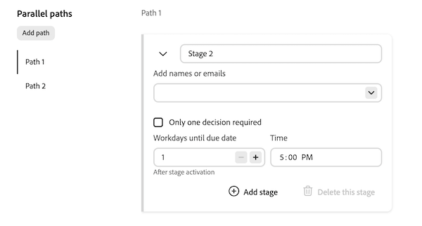

# Creación de una plantilla de flujo de trabajo de aprobación para documentos

En el área Configuración de Workfront, los usuarios con una licencia Estándar pueden crear plantillas de aprobación reutilizables. Una vez creadas, las plantillas de aprobación se pueden aplicar a los recursos del área Documentos de un objeto.
>[!IMPORTANT]
>
>El contenido de este artículo hace referencia a la funcionalidad actualizada de aprobación de documentos que solo está disponible para cuentas específicas. Para obtener información sobre los procesos de aprobación estándar, consulte los artículos enumerados en [Aprobaciones de trabajo](/help/quicksilver/review-and-approve-work/manage-approvals/manage-approvals.md).

## Requisitos de acceso

+++ Expanda para ver los requisitos de acceso para la funcionalidad en este artículo.

<table style="table-layout:auto"> 
 <col> 
 <col> 
 <tbody> 
  <tr> 
   <td role="rowheader">Paquete de Adobe Workfront</td> 
   <td>
Cualquier paquete de Workfront para administrar aprobaciones mediante el almacenamiento heredado de Workfront.

Cualquier paquete de flujo de trabajo para administrar aprobaciones mediante el almacenamiento en la nube de Adobe
 </td> 
  </tr> 
  <tr> 
   <td role="rowheader">Licencia de Adobe Workfront</td> 
   <td> 
Estándar
 
   
Plan

   </td> 
  </tr> 
 </tbody> 
</table>

Para obtener más información sobre el contenido de esta tabla, consulte [Requisitos de acceso en la documentación de Workfront](/help/quicksilver/administration-and-setup/add-users/access-levels-and-object-permissions/access-level-requirements-in-documentation.md).

+++

<!--
## Create an Approval Template in Production

{{step-1-to-setup}}

1. In the left panel, click **Review and Approval** > **Approval Templates**.
1. Click **New Template** on the right side of the page. 

1. Fill in the following details:

   <table>
     <tr>
   <td><strong>Template name</strong></td>
   <td>Add a template name. </td>
   </tr>
   <tr>
   <td><strong>Stage name</strong></td>
   <td>Add a stage name. You can change the name to something more descriptive, such as <em>Initial Review</em> or <em>Final Approval</em>.</td>
   </tr>
   <tr>
   <td><strong>Add names or emails</strong></td>
   <td>Begin typing a user or team name to add as an approver or reviewer. If you only have reviewers, they will be notified and have the option to complete the review but no decision will be required or made.</td>
   </tr>
   <tr>
   <td><strong>One decision required (optional)</strong></td>
   <td>The first person who makes a decision completes the stage.</td>
   </tr>
   <tr>
   <td><strong>Workdays until due date</strong></td>
   <td>Choose how many workdays until the approval is due after a stage is activated.</td>
   </tr>
   </table>

1. (Optional) Repeat the previous step to add additional stages as needed.

   >[!NOTE]
   >
   >If you add multiple stages, the approval workflow proceeds in the order the stages are listed. When all required decisions are made, the next stage begins and the previous stage is locked.

   
    
1. Click **Save**.

Once the template is created, it can be applied to documents in the Documents area of an object to begin the formal review and approval process in Workfront.
-->

## Creación de una plantilla de aprobación

El cuadro de diálogo de plantilla de aprobación siempre se abre en el modo Avanzado. No hay modo Básico para plantillas. Puede configurar hasta 30 rutas paralelas en una plantilla, con un total de hasta 100 fases. Cada ruta se ejecuta de forma independiente y puede contener una o más fases secuenciales.

Para crear una plantilla de aprobación:

{{step-1-to-setup}}

1. En el panel izquierdo, haga clic en **Revisar y aprobar** > **Plantillas de aprobación**.

1. Haga clic en **Nueva plantilla** en el lado derecho de la página.

1. Agregar **nombre de plantilla**.

1. Rellene los detalles de la fase 1 de la ruta 1:

   <table>
   <tr>
   <td><strong>Nombre de la fase</strong></td>
   <td>Las fases se denominan <em>Fase 1</em>, <em>Fase 2</em>, etc. de forma predeterminada. Cambie el nombre del escenario por otro más descriptivo, como <em>Revisión inicial</em> o <em>Aprobación final</em>.</td>
   </tr>
   <tr>
   <td><strong>Agregar nombres o correos electrónicos (opcional)</strong></td>
   <td>Empiece a escribir el nombre de un usuario o equipo que desee agregar como aprobador o revisor. Los participantes son opcionales en las plantillas. Puede agregarlas cuando la plantilla se aplique a un documento.
Nota: Un revisor o aprobador solo puede asignarse a una fase abierta a la vez en el mismo recurso. Si se abren varias fases paralelas simultáneamente, no se puede agregar la misma persona a más de una.
</td>
   </tr>
   <tr>
   <td><strong>Solo se requiere una decisión (opcional)</strong></td>
   <td>La primera persona que toma una decisión completa la etapa.</td>
   </tr>
   <tr>
   <td><strong>Días laborables hasta la fecha de vencimiento (opcional)</strong></td>
   <td>Elija cuántos días laborables tarda la fase en completarse después de su apertura. La primera etapa de cada ruta también admite una fecha de vencimiento absoluta. Cada fase posterior de la ruta admite solo una fecha de vencimiento relativa.</td>
   </tr>
   <tr>
   <td><strong>Añadir mensaje personalizado (opcional)</strong></td>
   <td>Escriba un mensaje en el cuadro de texto <strong>Agregar mensaje personalizado</strong>. Cuando la plantilla se aplica a un documento, el mensaje aparece en la notificación de correo electrónico de aprobación y en la pestaña Aprobaciones de Workfront.
Al agregar una segunda etapa, <strong>Mostrar este mensaje en todas las etapas</strong> está seleccionado de manera predeterminada. Deje seleccionado para utilizar el mismo mensaje en cada fase. Para usar un mensaje diferente para cada fase, desactive <strong>Mostrar este mensaje en todas las fases</strong> y, a continuación, escriba el mensaje específico de la fase en el cuadro de texto <strong>Agregar mensaje personalizado</strong> de cada fase.
</td>
   </tr>
   </table>

   

1. (Opcional) Haga clic en **Agregar etapa** para agregar otra etapa a la ruta. Las fases dentro de una ruta se ejecutan secuencialmente en el orden en que aparecen en la lista. Cuando se toman todas las decisiones necesarias en una fase, comienza la siguiente fase de esa ruta y se bloquea la anterior. Puede reordenar las fases dentro de una ruta, pero no puede mover una fase de una ruta a otra. Cada ruta puede tener un número diferente de etapas.

1. (Opcional) En **Rutas paralelas**, haga clic en **Agregar ruta** para agregar otra ruta. La nueva ruta comienza con una etapa vacía y se convierte en la ruta seleccionada. No se pueden reordenar las rutas.

   

1. (Opcional) Para cambiar el nombre de una ruta, pase el ratón sobre la etiqueta de la ruta, haga clic en el icono de lápiz y, a continuación, escriba un nuevo nombre. Para quitar una ruta, pase el ratón sobre la etiqueta de la ruta y haga clic en el icono de papelera. **La ruta de acceso 1** no se puede quitar, y otras rutas de acceso solo se pueden quitar si no se ha bloqueado ni completado ninguna fase dentro de la ruta de acceso.

1. (Opcional) Para borrar todas las rutas y etapas y volver a empezar, haga clic en **Restablecer** en la esquina superior derecha.

1. Haga clic en **Guardar**.

Una vez creada la plantilla, se puede aplicar a documentos del área Documentos de un objeto para iniciar el proceso formal de revisión y aprobación en Workfront.

<!--
 Once a template is created, it can be applied to assets sent from Frame.io to begin the formal review and approval process in Workfront.

-->
