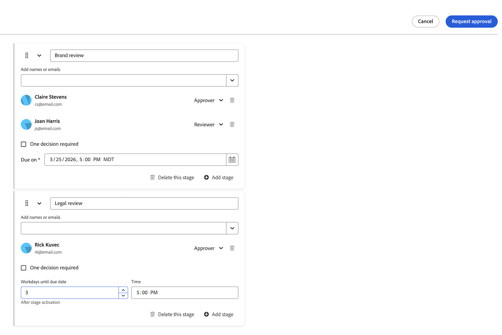

# Cargar una nueva versión del documento y solicitar una aprobación

Si un documento está marcado como &quot;Necesita trabajo&quot; en una revisión anterior, puede cargar una nueva versión en el documento original e iniciar otra ronda de aprobaciones. Una vez cargada una nueva versión del documento, las versiones anteriores se bloquean.

Si el nombre de archivo de la nueva versión es diferente del nombre de archivo de la versión anterior, Workfront muestra el documento con el nombre de archivo más reciente.

Cuando se añade una nueva versión a un documento con aprobaciones pendientes, la aprobación de la versión anterior se muestra como &quot;Retirada&quot;. El proceso de aprobación previo se cierra, incluso si algunos participantes aún no han tomado una decisión.

Si se elimina la versión más reciente del documento, las versiones anteriores permanecerán bloqueadas. Si necesita editar una versión anterior, debe desbloquearla manualmente.

## Requisitos de acceso

+++ Expanda para ver los requisitos de acceso para la funcionalidad en este artículo.

<table style="table-layout:auto"> 
 <col> 
 </col> 
 <col> 
 </col> 
 <tbody> 
  <tr> 
   <td role="rowheader">Paquete de Adobe Workfront</td> 
   <td> 
Cualquier paquete de Workfront para administrar aprobaciones mediante el almacenamiento heredado de Workfront.

Cualquier paquete de flujo de trabajo para administrar aprobaciones mediante el almacenamiento en la nube de Adobe
 </td> 
  </tr> 
  <tr> 
   <td role="rowheader">Licencias de Adobe Workfront</td> 
   <td> 
Solicitud o superior

   
Colaborador o superior

   
Si utiliza la integración de Frame.io, debe tener una licencia Standard para crear flujos de trabajo de aprobación.

    </td> 
  </tr> 
  <tr data-mc-conditions=""> 
   <td role="rowheader">Configuraciones de nivel de acceso</td> 
   <td> 
Acceso de edición a documentos
 </td> 
  </tr> 
  <tr data-mc-conditions=""> 
   <td role="rowheader">Permisos de objeto</td> 
   <td> 
Editar acceso al objeto asociado con el documento
 </td> 
  </tr> 
 </tbody> 
</table>

Para obtener más información, consulte [Requisitos de acceso en la documentación de Workfront](/help/quicksilver/administration-and-setup/add-users/access-levels-and-object-permissions/access-level-requirements-in-documentation.md).

+++

<!--
## Use drag-and-drop to add a new version in the legacy documents area in Production

If your organization is on Workfront storage, you will see the legacy documents area when you access documents in Workfront. For more information about Workfront storage, see [Differences between Adobe cloud storage and legacy Workfront storage](/help/quicksilver/review-and-approve-work/esm-overview.md#differences-between-adobe-cloud-storage-and-legacy-workfront-storage).

>[!NOTE]
>
>Drag-and-drop does not work with Internet Explorer.

If you need another round of review and approval on a document, you can create a new document version in Workfront.

You can add the previous participants, new participants, or a mix of both. You can view information about previous versions and participants on the Document Details page. 

To add a new version:

1. Navigate to the document in Workfront.
1. Drag and drop the new file on top of the previous document. This automatically creates a new version. 

1. Once the document finishes uploading, select the document to open the Document Summary panel. Here you'll see the version number at the top of the panel.

1. Scroll down to the **Approvals** section.

1. Click **Create workflow**, then fill in the following details:

   <table>
   <tr>
   <td><strong>Stage name</strong></td>
   <td>Add a stage name. You can change the name to something more descriptive, such as <em>Initial Review</em> or <em>Final Approval</em>.</td>
   </tr>
   <tr>
   <td><strong>Add names or emails</strong></td>
   <td>Begin typing a user or team name to add as an approver or reviewer. If you only have reviewers, they will be notified and have the option to complete the review but no decision will be required or made.</td>
   </tr>
   <tr>
   <td><strong>One decision required (optional)</strong></td>
   <td>The first person who makes a decision completes the stage.</td>
   </tr>
   <tr>
   <td><strong>Due date (optional)</strong></td>
   <td>Set a due date for the approval. Users and teams are notified by email 72 hours, then 24 hours before the specified due date.</td>
   </tr>
   </table>

1. (Optional) Repeat the previous step to add additional stages as needed.

   >[!NOTE]
   >
   >If you add multiple stages, the approval workflow proceeds in the order the stages are listed. When all required decisions are made, the next stage begins and the previous stage is locked.

1. (Optional) To add an existing approval template, select a template from the left side of the dialog.

   >[!TIP]
   >
   >   Users with a Standard license can create reusable Approval Templates from the Setup area. For more information, see [Create an approval workflow template for documents](/help/quicksilver/review-and-approve-work/document-reviews-and-approvals/manage-document-approvals/create-approval-template.md).

1. Once you have added all the stages and participants you need, click **Request approval**.

   The approval workflow starts and the approvers receive a notification that their approval is needed on the new document version. The previous document version is locked and any outstanding approvals on the previous version are withdrawn.

    
-->

<!--1. To add all previous participants, click **Add all**. You can also add new participants or remove previous participants as needed.-->

## Utilice arrastrar y soltar para agregar una nueva versión en el área de documentos heredados

Si su organización está en el almacenamiento de Workfront, verá el área de documentos heredados al acceder a documentos en Workfront. Para obtener más información sobre el almacenamiento de Workfront, consulte [Diferencias entre el almacenamiento en la nube de Adobe y el almacenamiento de Workfront heredado](/help/quicksilver/review-and-approve-work/esm-overview.md#differences-between-adobe-cloud-storage-and-legacy-workfront-storage).

>[!NOTE]
>
>Arrastrar y soltar no funciona con Internet Explorer.

Si necesita otra ronda de revisión y aprobación de un documento, puede crear una nueva versión del documento en Workfront. Puede agregar los participantes anteriores, nuevos participantes o una combinación de ambos. Puede ver información sobre versiones anteriores y participantes en la página Detalles del documento.

El cuadro de diálogo Solicitar aprobación se abre en el modo Básico de forma predeterminada para una aprobación de una sola etapa. Cambie al modo avanzado para configurar aprobaciones de varias etapas o rutas paralelas.

Para agregar una nueva versión y solicitar aprobación:

1. Navegue hasta el documento en Workfront.

1. Arrastre y suelte el nuevo archivo sobre el documento anterior. Workfront crea automáticamente una nueva versión.

1. Una vez que termine la carga del documento, seleccione el documento para abrir el panel Resumen del documento. El número de versión aparece en la parte superior del panel.

1. Desplácese hacia abajo hasta la sección **Aprobaciones** y haga clic en **Crear flujo de trabajo**. El cuadro de diálogo **Solicitar aprobación** se abre en el modo Básico.

1. Configure el flujo de trabajo de aprobación. Para obtener descripciones de los campos, la opción Modo avanzado y el flujo de rutas paralelas, consulte [Crear un flujo de trabajo de aprobación de documentos](/help/quicksilver/review-and-approve-work/document-reviews-and-approvals/manage-document-approvals/create-a-document-approval.md).

1. Para copiar los mismos revisores y aprobadores de la versión anterior del documento, haga clic en **Copiar**.
1. Haga clic en **Solicitar aprobación**.

   El flujo de trabajo de aprobación se inicia y los aprobadores reciben una notificación que les informa de que necesitan su aprobación en la nueva versión del documento. La versión anterior del documento está bloqueada y se retiran las aprobaciones pendientes de la versión anterior.

## Utilice arrastrar y soltar para agregar una nueva versión en el área de Documentos nueva

Si su organización utiliza el almacenamiento en la nube de Adobe, verá la nueva área Documentos al acceder a documentos en Workfront. Para obtener más información sobre el almacenamiento en la nube de Adobe, consulte [Información general sobre el almacenamiento en la nube de Adobe](/help/quicksilver/review-and-approve-work/esm-overview.md).

>[!NOTE]
>
>Arrastrar y soltar no funciona con Internet Explorer.

Si necesita otra ronda de revisión y aprobación de un documento, puede crear una nueva versión del documento en Workfront. Puede agregar un flujo de trabajo de aprobación a la nueva versión del documento.

<!--
the previous participants, new participants, or a mix of both. You can view information about previous versions and participants on the Document Details page.
-->

El cuadro de diálogo Solicitar aprobación se abre en el modo Básico de forma predeterminada para una aprobación de una sola etapa. Cambie al modo avanzado para configurar aprobaciones de varias etapas o rutas paralelas.

Para agregar una nueva versión y solicitar aprobación:

1. Navegue hasta el documento en Workfront.

1. Arrastre y suelte el nuevo archivo sobre el documento anterior. Workfront crea automáticamente una nueva versión.

1. Una vez que termine la carga del documento, seleccione el documento para abrir el Panel de resumen. La última versión del documento está seleccionada de forma predeterminada.

1. Desplácese hacia abajo hasta la sección **Aprobaciones** y haga clic en **Crear flujo de trabajo**. El cuadro de diálogo **Solicitar aprobación** se abre en el modo Básico.

1. Configure el flujo de trabajo de aprobación. Para obtener descripciones de los campos, la opción Modo avanzado y el flujo de rutas paralelas, consulte [Crear un flujo de trabajo de aprobación de documentos](/help/quicksilver/review-and-approve-work/document-reviews-and-approvals/manage-document-approvals/create-a-document-approval.md).

1. Para copiar los mismos revisores y aprobadores de la versión anterior del documento, haga clic en **Copiar**.
1. Haga clic en **Solicitar aprobación**.

   El flujo de trabajo de aprobación se inicia y los aprobadores reciben una notificación que les informa de que necesitan su aprobación en la nueva versión del documento. La versión anterior del documento está bloqueada y se retiran las aprobaciones pendientes de la versión anterior.

<!--
   The previous version keeps its version number and its approval history, but its status changes to "Withdrawn". For more information about version numbers and status, see [Manage document versions](/help/quicksilver/documents/managing-documents/manage-document-versions.md#view-and-manage-document-versions-in-the-new-documents-area-in-preview).
-->