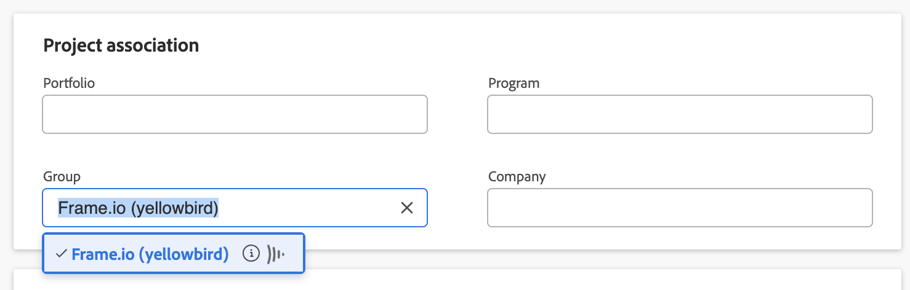

# Conectar Workfront y Frame.io

Workfront utiliza Frame.io en el proceso de revisión y aprobación para conocer a las personas donde desean trabajar. El proceso de administración y aprobación del proyecto se administra en Workfront y el proceso de revisión se completa en Frame.io. Debe completar todas las secciones siguientes para configurar correctamente la integración:

* [Conectar un grupo de Workfront a un equipo de Frame.io](#connect-a-workfront-group-to-a-frameio-team)
* [Crear un proyecto de Workfront y agregar un grupo conectado](#create-a-workfront-project-and-add-a-connected-group)

El contenido de este artículo hace referencia a la funcionalidad actualizada de aprobación de documentos que solo está disponible para cuentas específicas. Para obtener información sobre los procesos de aprobación estándar, consulte los artículos enumerados en [Aprobaciones de trabajo](/help/quicksilver/review-and-approve-work/manage-approvals/manage-approvals.md).

## Requisitos de acceso

* Su organización debe incorporarse manualmente para utilizar la funcionalidad descrita en este artículo. Para obtener más información, consulte [Integración nativa alfa de Adobe Workfront y Frame.io: información general](/help/quicksilver/product-announcements/betas/frame-io-wf-integration-alpha/frame-io-wf-integration-alpha-overview.md).

## Conectar un grupo de Workfront a un equipo de Frame.io

Estamos mejorando activamente esta función para su disponibilidad general en mayo.

### Requisitos previos

* Cree un equipo de Frame.io para asignarlo a un grupo de Workfront.
* Busque el token de desarrollador de API para el equipo. Para obtener más información, consulte [Tokens de desarrollador](https://developer.frame.io/docs/getting-started/authentication#developer-tokens) en el sitio para desarrolladores de Frame.io.

### Conectar un grupo de Workfront a un equipo de Frame.io

{{step-1-to-setup}}

1. En el panel izquierdo, haga clic en **Grupos**.
1. Elija un grupo existente o haga clic en **Crear grupo**.
1. En el panel izquierdo, haga clic en **Conectar con Frame.io**.
   
1. Introduzca el token de desarrollador de API.
1. Clic **Iniciar conexión**.
1. (Condicional) Si es el administrador de más de una cuenta de Frame.io, seleccione la cuenta que desee utilizar.

## Crear un proyecto de Workfront y agregar un grupo conectado

Después de conectar un grupo de Workfront a un equipo de Frame.io, debe crear un proyecto con ese grupo conectado.

### Requisitos previos

* Debe tener un grupo de Workfront conectado a un equipo de Frame.io como se explica en la sección anterior.

### Crear un proyecto de Workfront y agregar un grupo conectado

{{step1-to-projects}}

1. Cree un nuevo proyecto desde cero o una plantilla. Para obtener información sobre cómo crear un proyecto, consulte [Creación de un proyecto](/help/quicksilver/manage-work/projects/create-projects/create-project.md).

1. En el panel izquierdo, busque **Detalles del proyecto**.

1. Busque el **Grupo** en la parte derecha de la pantalla y elimine el grupo Predeterminado.

1. En el menú desplegable, busque el grupo que desee. Los grupos conectados con Frame.io muestran el icono Frame.io.
   

1. Realice cualquier otro cambio en la configuración del proyecto.

1. Haga clic en **Guardar cambios**.

1. Continúe con la sección siguiente.

### Añada una tarea y establezca el estado de integración en Activo

>[!NOTE]
>
>Actualmente, no se admiten subtareas en proyectos Frame.io conectados.

1. Cree las tareas que necesite rellenar en Frame.io

1. Seleccione las tareas que necesite y haga clic en **Editar**.

1. Desplácese hasta **Forms personalizado** y busque el formulario de integración de Frame.io.

   >[!IMPORTANT]
   >
   >Se debe asignar un grupo Frame.io conectado en el área Detalles del proyecto para que aparezca este formulario. Para obtener más información, consulte [Crear un proyecto de Workfront y agregar un grupo conectado](#create-a-workfront-project-and-add-a-connected-group) en este artículo.

1. Habilite la **Estado de integración de esta tarea** y seleccione. **Activo**.
   

1. Clic **Guardar cambios**. Aparece un icono Frame.io junto al nombre del proyecto.

1. Asigne usuarios o equipos a las tareas.

   >[!NOTE]
   >
   >Los usuarios o equipos agregados a las tareas también se agregan al proyecto Frame.io.

1. Cargue cualquier documento o informe creativo en el área Documentos del proyecto.

El proyecto aún no está conectado. Debe continuar a la siguiente sección para finalizar la integración.

### Habilitar el proyecto en Frame.io

1. Cambiar el estado del proyecto de **Planificación** hasta **Actual** o un estado personalizado igual al actual. Esto finaliza la integración y genera el proyecto, las tareas y los documentos en Frame.io.

El icono Frame.io junto al nombre del proyecto se vuelve morado indicando que la integración se ha realizado correctamente. Los usuarios reciben un correo electrónico que les invita al proyecto Frame.io.

>[!IMPORTANT]
>
>Una vez que el proyecto está conectado para Frame.io, los cambios realizados en el grupo de proyectos no se reflejarán en Frame.io.

