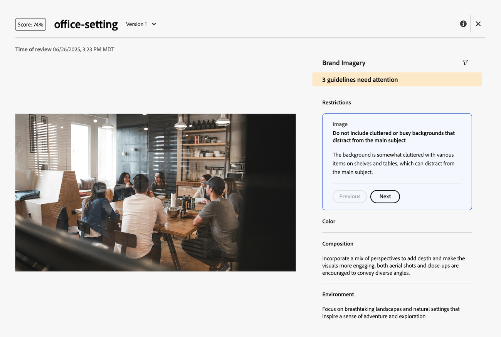

# Ver puntuación y comentarios del revisor de contenido

{{highlighted-preview-article-level}}

Segundos después de enviar la solicitud de revisión y aprobación, puede ver la puntuación y los comentarios del Revisor de contenido en el panel Resumen de documento.

El Revisor de contenido no está diseñado para tomar decisiones en el flujo de trabajo de revisión y aprobación. Solo proporciona una puntuación y recomendaciones para alinear el recurso con los requisitos de marca especificados.

## Ver puntuación y comentarios

Puede ver la puntuación y los comentarios del revisor de contenido desde el panel Resumen del documento o en la pestaña Aprobaciones de la página Detalles del documento.

1. En el correo electrónico de notificación de Workfront, haga clic en **Ir a revisión**.

   O

   Vaya al área Documentos donde se carga el documento y abra el panel Resumen del documento.
1. Haga clic en **Puntuación**.
   

En la ventana de puntuación y comentarios, el Revisor de contenido explica cómo el recurso no cumple las directrices especificadas.

## Cargue una nueva versión y vuelva a agregar el Revisor de contenido

Si necesita ajustar el recurso en función de los comentarios del revisor de contenido, puede cargar una nueva versión e iniciar una nueva revisión.

Para obtener más información, vea [Cargar una nueva versión del documento y solicitar la aprobación](/help/quicksilver/review-and-approve-work/document-reviews-and-approvals/manage-document-approvals/upload-new-doc-version.md).
