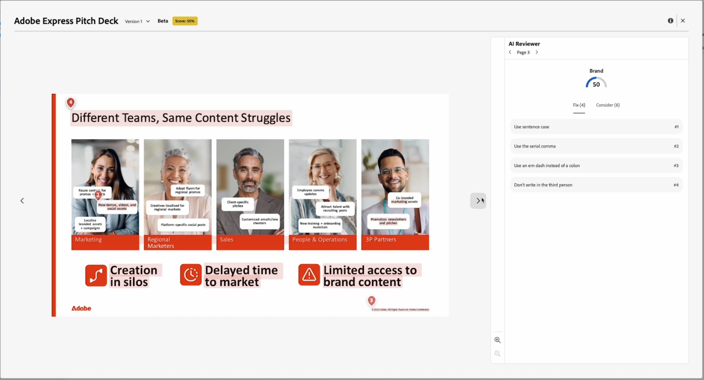
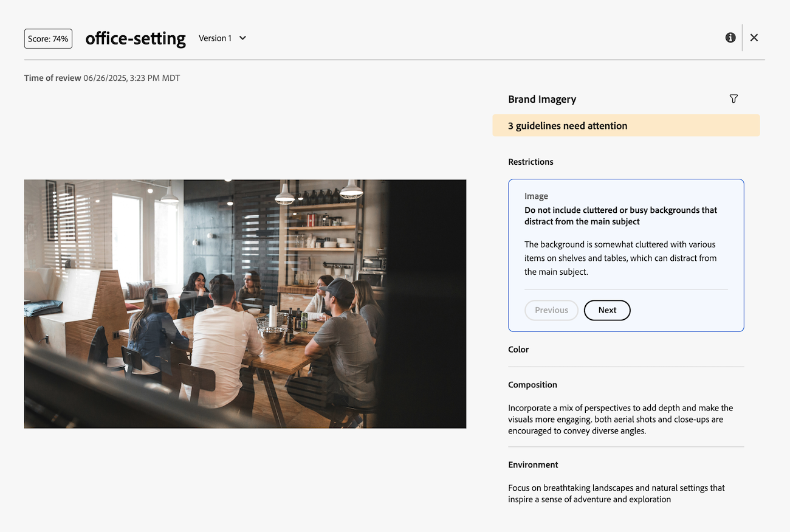

# Ver puntuación y comentarios del comprobador por IA

Segundos después de enviar la solicitud de revisión y aprobación, puede ver la puntuación y los comentarios del revisor de IA en el panel Resumen del documento.

El revisor de IA no está diseñado para tomar decisiones en el flujo de trabajo de revisión y aprobación. Solo proporciona una puntuación y recomendaciones para alinear el recurso con los requisitos de marca especificados.

## Comprender cómo se calculan las puntuaciones

El revisor de IA calcula las puntuaciones de forma diferente en función del tipo de revisión:

* Revisión de imagen: Esta puntuación refleja la proporción de directrices aprobadas respecto a directrices fallidas.
* Revisión de copia: Esta puntuación utiliza una ponderación equilibrada de resultados subjetivos y objetivos. Las directrices objetivas (que se muestran en &quot;Corrección&quot;) se ponderan tres veces más que las directrices subjetivas (que se muestran en &quot;Considerar&quot;).

Como las directrices objetivas tienen más peso en las revisiones de textos, recomendamos escribir directrices concretas y mensurables en su marca. Para obtener más información, consulte la sección [Prácticas recomendadas para escribir directrices de marca](/help/quicksilver/review-and-approve-work/document-reviews-and-approvals/create-a-brand.md#best-practices-for-writing-brand-guidelines) en el artículo Crear y administrar marcas para el revisor de IA.

## Ver puntuación y comentarios

Puede ver la puntuación y los comentarios del revisor de IA en el panel Resumen del documento o en la pestaña Aprobaciones de la página Detalles del documento.

1. En el correo electrónico de notificación de Workfront, haga clic en **Ir a revisión**.

   O

   Vaya al área Documentos donde se carga el documento y abra el panel Resumen del documento.
1. Haga clic en **Puntuación**.
   

En la ventana de puntuación y comentarios, el revisor de IA explica cómo el recurso no cumple las directrices especificadas.

## Cargue una nueva versión y vuelva a añadir AI Reviewer

Si necesita ajustar el recurso en función de los comentarios del revisor de IA, puede cargar una nueva versión e iniciar una nueva revisión.

Para obtener más información, vea [Cargar una nueva versión del documento y solicitar la aprobación](/help/quicksilver/review-and-approve-work/document-reviews-and-approvals/manage-document-approvals/upload-new-doc-version.md).
