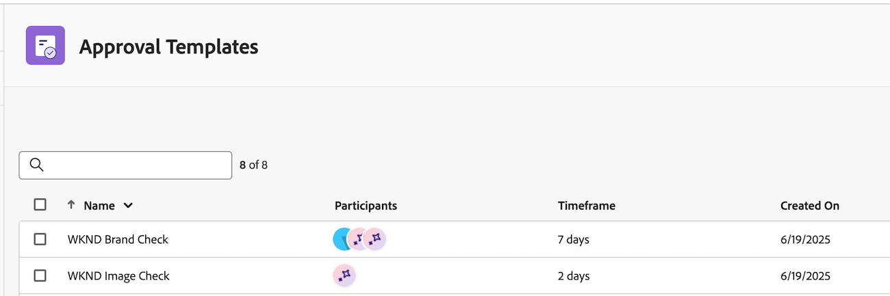

# Introducción al Revisor de IA de Workfront

>[!NOTE]
>
>Esta función se encuentra actualmente en fase beta.

Con Workfront AI Reviewer, puede aumentar la velocidad del contenido y optimizar el cumplimiento de la marca en el flujo de trabajo de revisión y aprobación. Puede agregar revisores de IA a las plantillas de aprobación o a las solicitudes de revisión y aprobación individuales en Workfront.

## Requisitos de acceso

Para configurar revisores de IA en Workfront, debe ser administrador del sistema.

Cualquier usuario puede agregar el revisor de IA a una solicitud de revisión y aprobación.

## Requisitos previos

* Su organización debe haber migrado a Adobe IMS (sistema Identity Management).
* La instancia de Workfront debe tener habilitadas las aprobaciones unificadas.
* Adobe debe tener registrado un acuerdo de Adobe Gen AI.
Para obtener más información sobre la firma del acuerdo, consulte [Firmar el acuerdo de Adobe Gen AI](/help/quicksilver/workfront-basics/ai-assistant/ai-assistant-overview.md#sign-the-adobe-gen-ai-agreement).

## Tipos de archivos compatibles {#supported-file-types-ai-reviewer}

>[!CONTEXTUALHELP]
>id="wf_document_approvals_ai_supported_files"
>title="Tipo de archivo no compatible"
>abstract="Este comprobador por IA no admite el tipo de archivo seleccionado.Cargue un tipo de archivo compatible o elimine el comprobador por IA para enviar la solicitud."

El revisor de IA puede revisar los siguientes tipos de archivos:

* PNG (.png)
* JPEG (.jpeg, .jpg)
* WEBP (.webp)
* GIF no animado (.gif)

## Configurar directrices de marca

El revisor de IA de Workfront utiliza las directrices de marca configuradas en Genstudio Foundations al revisar el contenido. Actualmente, solo puede configurar directrices de marca para imágenes. Para obtener más información, consulte [Introducción a Adobe GenStudio for Performance Marketing](https://experienceleague.adobe.com/es/docs/genstudio-for-performance-marketing/user-guide/get-started).

## Crear revisores de IA

Una vez que hay al menos una marca configurada en GenStudio Foundations, los administradores de Workfront pueden empezar a crear revisores de IA en el área de Configuración. Estos revisores de IA se pueden asignar a plantillas de aprobación y a solicitudes de revisión y aprobación individuales. En este momento, los revisores de IA solo pueden revisar las directrices de marca de imagen.

Para obtener más información, consulte [Crear revisores de IA](/help/quicksilver/review-and-approve-work/document-reviews-and-approvals/set-up-ai-reviewer.md).

## Agregar revisores de IA a solicitudes de revisión y aprobación

Los usuarios pueden agregar revisores de IA a plantillas de aprobación existentes o a solicitudes de revisión y aprobación individuales.

### Plantillas de aprobación

Si su organización agrega con frecuencia las mismas personas a las solicitudes de revisión y aprobación, los usuarios de licencias estándar pueden crear plantillas de aprobación en el área Configuración de Workfront.

Los usuarios pueden agregar revisores de IA a las plantillas de aprobación para comprobar automáticamente la conformidad de la marca cuando se utiliza una plantilla para crear una solicitud.

Una vez creadas, las plantillas de aprobación se pueden aplicar a los recursos del área Documentos de un proyecto, tarea o problema.

Para obtener más información, consulte [Crear una plantilla de aprobación para recursos y documentos](/help/quicksilver/review-and-approve-work/document-reviews-and-approvals/manage-document-approvals/create-approval-template.md).

### Solicitud de revisión y aprobación individual

Cuando los usuarios crean solicitudes de revisión y aprobación individuales, pueden agregar un revisor de IA con otros participantes o pueden crear una única solicitud con solo el revisor de IA para comprobar el cumplimiento de la marca.

Para obtener más información, vea [Crear una solicitud de revisión o aprobación de documento](/help/quicksilver/review-and-approve-work/document-reviews-and-approvals/manage-document-approvals/create-a-document-approval.md).

## Ver puntuación y comentarios del revisor de IA

Segundos después de enviar la solicitud de revisión y aprobación con un revisor de IA, la puntuación y los comentarios del revisor de IA están disponibles en el panel Resumen del documento, incluso si otros participantes siguen revisando y tomando decisiones.

Los propietarios de aprobación también reciben un correo electrónico que les notifica que se ha completado una revisión del recurso. En el correo electrónico, haz clic en **Ir a revisar** y ver la puntuación y los comentarios en Workfront.

El revisor de IA no está diseñado para tomar decisiones en el flujo de trabajo de revisión y aprobación. Solo proporciona una puntuación y recomendaciones para alinear el recurso con los requisitos de marca especificados.

Si la imagen cumple durante mucho tiempo las directrices de marca, el creativo puede cargar una nueva versión y el propietario de la aprobación puede crear una segunda solicitud de revisión y aprobación con el revisor de IA, lo que le permite cambiar entre versiones y comparar los comentarios.

Para obtener más información sobre la visualización de puntuaciones y comentarios, consulte [Ver puntuación y comentarios del revisor de IA](/help/quicksilver/review-and-approve-work/document-reviews-and-approvals/view-ai-reviewer-feedback.md).

## Tutorial de vídeo

>[!VIDEO](https://video.tv.adobe.com/v/3470847/)