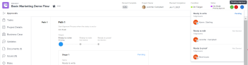

# Aprobación del trabajo

<!--

(NOTE:&nbsp;From&nbsp;Courtney: Linked to Training sites/ articles , don't change title and link)

-->

Si está configurado como aprobador, debe revisar con regularidad qué trabajo está esperando su aprobación.

Para obtener información sobre la creación de procesos de aprobación, consulte [Creación de un proceso de aprobación para elementos de trabajo](../../administration-and-setup/customize-workfront/configure-approval-milestone-processes/create-approval-processes.md).

Para obtener información sobre cómo asociar aprobaciones con trabajos en Workfront, consulte [Asociar un proceso de aprobación nuevo o existente al trabajo](../../review-and-approve-work/manage-approvals/associate-approval-with-work.md).

## Requisitos de acceso

Debe tener el siguiente acceso para realizar los pasos de este artículo:

<table style="table-layout:auto"> 
 <col> 
 <col> 
 <tbody> 
  <tr> 
   <td role="rowheader">plan de Adobe Workfront*</td> 
   <td> 
Cualquiera
 </td> 
  </tr> 
  <tr> 
   <td role="rowheader">Licencia de Adobe Workfront*</td> 
   <td> 
Revisar o superior
 </td> 
  </tr> 
  <tr> 
   <td role="rowheader">Configuraciones de nivel de acceso*</td> 
   <td> 
Ver o acceder más a los objetos asociados con aprobaciones
 
Nota: Si todavía no tiene acceso, pregunte a su administrador de Workfront si establece restricciones adicionales en su nivel de acceso. Para obtener información sobre cómo un administrador de Workfront puede modificar su nivel de acceso, consulte <a href="../../administration-and-setup/add-users/configure-and-grant-access/create-modify-access-levels.md" class="MCXref xref">Crear o modificar niveles de acceso personalizados</a>.
 </td> 
  </tr> 
  <tr> 
   <td role="rowheader">Permisos de objeto</td> 
   <td> 
Ver o conceder permisos superiores a los objetos asociados con aprobaciones
 
Para obtener información sobre la solicitud de acceso adicional, consulte <a href="../../workfront-basics/grant-and-request-access-to-objects/request-access.md" class="MCXref xref">Solicitar acceso a objetos </a>.
 </td> 
  </tr> 
 </tbody> 
</table>

&#42;Para saber qué plan, tipo de licencia o acceso tiene, póngase en contacto con el administrador de Workfront.

## Localización de aprobaciones en Adobe Workfront

Puede ver y administrar las aprobaciones en varias áreas de Workfront.

Para obtener más información sobre la visualización de elementos que esperan aprobaciones o elementos que ha enviado para su aprobación, consulte [Ver aprobaciones](../../review-and-approve-work/manage-approvals/view-approvals.md).

## Aprobar trabajo desde el área de inicio

1. Haga clic en el **Página principal** icono  en la esquina superior izquierda de Adobe Workfront.

   >[!NOTE]
   >
   >El administrador de Workfront puede realizar los siguientes cambios en el icono Inicio de su entorno:
   >
   >   
   >* Sustitúyala por una imagen personalizada para ilustrar su organización. En este caso, el icono tendrá un aspecto diferente al que se muestra en este artículo.
   >* Reemplace la página vinculada por una página diferente. En este caso, haga clic en el botón **Menú principal**  en la esquina superior derecha de la página, haga clic en **Página principal**.

1. Haga clic en el **Filtro** menú desplegable.

   

1. Select **Aprobaciones**.\
   Se muestran todos los elementos de trabajo que requieren aprobación. 

   >[!NOTE]
   >
   >Las aprobaciones asignadas a funciones de trabajo o grupos no se muestran en la página de inicio. Las aprobaciones asignadas a equipos se muestran en la agrupación Solicitud de equipo de la lista de trabajo.

1. (Opcional) Cambie el orden en que se muestran las aprobaciones, tal como se describe en la sección &quot;Agrupar y ordenar por fecha, proyecto o prioridad&quot; del artículo [Mostrar elementos en la lista de trabajo del área principal](../../workfront-basics/using-home/using-the-home-area/display-items-in-home-work-list.md).
1. Seleccione el elemento en el que desea tomar una decisión de aprobación.

   

1. Haga clic en una de las opciones disponibles al tomar una decisión de aprobación en el panel derecho. Las siguientes opciones se muestran en la esquina superior derecha de la página, según el tipo de elemento que apruebe:

   * **Proyectos:** Haga clic en **Aprobar** o **Rechazar**.

   * **Tareas:** Haga clic en **Aprobar** o **Rechazar** .

   * **Problemas:** Haga clic en **Aprobar** o **Rechazar** .

   * **Hojas de tiempo:** Haga clic en **Aprobar** o **Rechazar** .

   * **Documentos:** Haga clic en **Aprobar**, **Rechazar** o **Cambios**.\
       Tenga en cuenta lo siguiente al ver las aprobaciones:

      * Las aprobaciones de prueba se muestran aquí cuando un usuario comparte una prueba con usted, tal como se describe en la sección &quot;Compartir un vínculo de prueba&quot; del artículo [Compartir una prueba en Adobe Workfront](../../review-and-approve-work/proofing/managing-proofs-within-workfront/share-a-proof-in-workfront.md).
      * Las aprobaciones de prueba se muestran en el área principal solo si el entorno de Workfront está integrado con una cuenta de Workfront Proof Premium. Si no puede utilizar pruebas como se explica aquí, póngase en contacto con el administrador de Workfront.
      * Recibe una notificación en la aplicación que le notifica de la aprobación de la prueba.\
         Para obtener más información sobre las notificaciones en la aplicación, consulte [Ver y administrar notificaciones en la aplicación](../../workfront-basics/using-notifications/view-and-manage-in-app-notifications.md).

      * El nombre del usuario que solicitó la aprobación se muestra junto a la imagen en miniatura en el área de inicio, con el siguiente texto:\
         &quot;*Usuario A* quisiera su aprobación el...&quot;

         <!--      
        <MadCap:conditionalText data-mc-conditions="QuicksilverOrClassic.Draft mode">      
        (NOTE:&nbsp;From&nbsp;Courtney: Is this true?)      
        </MadCap:conditionalText>      
        -->

         Si el nombre de usuario no está disponible, se muestra el siguiente texto:\
         &quot;Una nueva versión de una prueba está lista para ser vista&quot;
      * Para tomar una decisión de aprobación en la prueba, haga clic en **Vaya a Prueba**, haga clic en **Finalizar revisión** y, a continuación, haga clic en una de las opciones disponibles. Las opciones disponibles al aprobar una prueba son: **Aprobado**, **Aprobado con cambios**, **Cambios necesarios** y **No relevante**.

      * Después de tomar una decisión sobre la prueba, la prueba permanece en la pestaña Mis aprobaciones con el texto &quot;Decisión realizada&quot; hasta que haga clic en el botón **Actualizar** o hasta que actualice la página del explorador.

         Para obtener información sobre la revisión de una prueba, consulte [Revisar pruebas en Adobe Workfront](../../review-and-approve-work/proofing/reviewing-proofs-within-workfront/review-proofs-in-wf.md).
   * **Acceso:** Seleccione el nivel de acceso que desea conceder en la variable **Cambiar acceso** menú desplegable y haga clic en **Conceder acceso**. O bien, haga clic en **Ignorar**.

## Aprobar el trabajo directamente desde un proyecto, tarea o problema

Cuando un proyecto, tarea o problema está pendiente de aprobación, puede aprobar o rechazar la aprobación directamente desde el proyecto, la tarea o el problema. También puede ver detalles sobre el proceso de aprobación.

Para aprobar el trabajo directamente desde un proyecto, tarea o problema:

1. Vaya al proyecto, la tarea o el problema que requiera su aprobación.

   La información de aprobación relativa al proceso de aprobación actual de un proyecto, tarea o problema se muestra en el encabezado del elemento.

   

   La siguiente información de aprobación está disponible:

   <table style="table-layout:auto"> 
    <col> 
    <col> 
    <tbody> 
     <tr> 
      <td role="rowheader">Estado</td> 
      <td>Estado actual del proyecto, la tarea o el problema. Este es el estado actual del elemento que está pendiente de aprobación. El estado se aprueba después de aprobar cada etapa del proceso de aprobación.</td> 
     </tr> 
     <tr> 
      <td role="rowheader">Fases de aprobación</td> 
      <td>Fases del proceso de aprobación.  El paso actual que está pendiente de aprobación se muestra como Pendiente . Las etapas que ya se han aprobado se muestran como Aprobado . las etapas que aún no se han aprobado se muestran como No iniciado .</td> 
     </tr> 
    </tbody> 
   </table>

1. Haga clic en **Aprobar** o **Rechazar**, en función de si desea aprobar o rechazar el proceso de aprobación.\
   La fase de aprobación que estaba pendiente de aprobación ahora está aprobada y el proceso de aprobación pasa a la siguiente fase. El estado se aprueba después de aprobar todas las etapas.

## Aprobar un documento directamente desde un documento 

1. Vaya al área de documentos que contiene el documento que requiere su aprobación.
1. Seleccione el documento y haga clic en **Aprobar**, **Cambios** o **Rechazar**.\
   \
   

1. (Opcional) Si se ha generado una prueba para el documento, puede aprobarlo en la interfaz de pruebas, tal como se describe en [Aprobar un documento a partir de una prueba](#approve-a-document-from-a-proof).

## Aprobar un documento desde un correo electrónico de notificación de aprobación

Según la configuración de la notificación, puede recibir correos electrónicos que le notifiquen sobre documentos para los que otros usuarios necesiten que tome una decisión de aprobación. Cuando reciba un correo electrónico que contenga un **Decisión de aprobación** , puede iniciar el proceso de aprobación directamente desde el correo electrónico:

1. En el correo electrónico, haga clic en **Decisión de aprobación** para abrir la página Detalles del documento para la prueba .
1. Realice una de las siguientes acciones para revisar el documento:

   * Vea los metadatos del documento.
   * Si se ha creado una prueba para revisar el documento con marcas y comentarios, haga clic en **Abrir prueba**  cerca de la esquina superior derecha y revise la prueba.

      <!--   
     [Andrzej, does it make sense to leave this here if it's s document approval?&nbsp;Would there never be a proof in that situation?]   
     -->

      Para obtener información sobre la revisión de pruebas, consulte [Revisar pruebas en Adobe Workfront](../../review-and-approve-work/proofing/reviewing-proofs-within-workfront/review-proofs-in-wf.md).

1. Haga clic en **Decisión** en la esquina superior derecha para aprobar, aprobar con cambios o rechazar el documento.

## Aprobar un documento a partir de una prueba {#approve-a-document-from-a-proof}

Puede aprobar un documento en el visor de pruebas. Para obtener más información, consulte [Tome una decisión sobre una prueba en el visor de pruebas](../../review-and-approve-work/proofing/reviewing-proofs-within-workfront/make-a-decision-on-a-proof/make-decisions-on-proof.md) en el artículo [Tome una decisión sobre una prueba en el visor de pruebas](../../review-and-approve-work/proofing/reviewing-proofs-within-workfront/make-a-decision-on-a-proof/make-decisions-on-proof.md).
