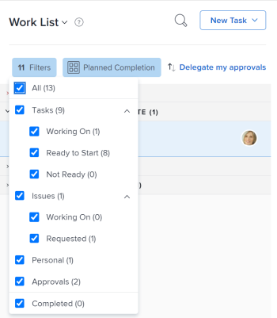

# Aprobación del trabajo

<!--

(NOTE:&nbsp;From&nbsp;Courtney: Linked to Training sites/ articles , don't change title and link)

-->

Si se le ha configurado como aprobador, debe revisar con regularidad qué trabajo espera su aprobación.

Para obtener información acerca de cómo crear procesos de aprobación, vea [Crear un proceso de aprobación para elementos de trabajo](../../administration-and-setup/customize-workfront/configure-approval-milestone-processes/create-approval-processes.md).

Para obtener información acerca de cómo asociar aprobaciones con trabajo en Workfront, vea [Asociar un proceso de aprobación nuevo o existente con trabajo](../../review-and-approve-work/manage-approvals/associate-approval-with-work.md).

## Requisitos de acceso

Debe tener el siguiente acceso para realizar los pasos de este artículo:

<table style="table-layout:auto"> 
 <col> 
 <col> 
 <tbody> 
  <tr> 
   <td role="rowheader">plan Adobe Workfront*</td> 
   <td> 
Cualquiera
 </td> 
  </tr> 
  <tr> 
   <td role="rowheader">Licencia de Adobe Workfront*</td> 
   <td> 
Revisar o superior
 </td> 
  </tr> 
  <tr> 
   <td role="rowheader">Configuraciones de nivel de acceso*</td> 
   <td> 
Acceso de visualización o superior a los objetos asociados con las aprobaciones
 
Nota: Si sigue sin tener acceso, pregunte al administrador de Workfront si ha establecido restricciones adicionales en su nivel de acceso. Para obtener información sobre cómo un administrador de Workfront puede modificar su nivel de acceso, vea <a href="../../administration-and-setup/add-users/configure-and-grant-access/create-modify-access-levels.md" class="MCXref xref">Crear o modificar niveles de acceso personalizados</a>.
 </td> 
  </tr> 
  <tr> 
   <td role="rowheader">Permisos de objeto</td> 
   <td> 
Ver permisos superiores a los objetos asociados con las aprobaciones o
 
Para obtener información sobre cómo solicitar acceso adicional, vea <a href="../../workfront-basics/grant-and-request-access-to-objects/request-access.md" class="MCXref xref">Solicitar acceso a los objetos </a>.
 </td> 
  </tr> 
 </tbody> 
</table>

&#42;Para saber qué plan, tipo de licencia o acceso tiene, póngase en contacto con el administrador de Workfront.

## Localización de aprobaciones en Adobe Workfront

Puede ver y administrar las aprobaciones en varias áreas de Workfront.

Para obtener más información sobre cómo ver los elementos que esperan aprobaciones o los elementos que usted mismo envió para su aprobación, consulte [Ver aprobaciones](../../review-and-approve-work/manage-approvals/view-approvals.md).

## Aprobar trabajo desde el área de Inicio

1. Haga clic en el icono **Inicio**  en la esquina superior izquierda de Adobe Workfront.

   >[!NOTE]
   >
   >El administrador de Workfront puede realizar los siguientes cambios en el icono Inicio de su entorno:
   >
   >   
   >* Sustitúyala por una imagen personalizada para ilustrar su organización. En este caso, el icono tendrá un aspecto diferente al que se muestra en este artículo.
   >* Reemplace la página vinculada a ella por una página diferente. En este caso, haga clic en **Menú principal**  en la esquina superior derecha de la página y, a continuación, haga clic en **Inicio**.

1. Haga clic en el menú desplegable **Filtro**.

   

1. Seleccionar **aprobaciones**.\
   Se muestran todos los elementos de trabajo que requieren su aprobación. 

   >[!NOTE]
   >
   >Las aprobaciones asignadas a roles o grupos de trabajos no se muestran en Inicio. Las aprobaciones asignadas a los equipos se muestran en la agrupación de solicitudes de equipo en la Lista de trabajos.

1. (Opcional) Cambie el orden en que se muestran las aprobaciones, tal como se describe en la sección &quot;Agrupar y ordenar por fecha, proyecto o prioridad&quot; del artículo [Mostrar elementos en la Lista de trabajos en el área de Inicio](../../workfront-basics/using-home/using-the-home-area/display-items-in-home-work-list.md).
1. Seleccione el elemento en el que desea tomar una decisión de aprobación.

   

1. Haga clic en una de las opciones disponibles al tomar una decisión de aprobación en el panel derecho. Las siguientes opciones se muestran en la esquina superior derecha de la página, según el tipo de elemento que apruebe:

   * **Proyectos:** Haga clic en **Aprobar** o **Rechazar**.

   * **Tareas:** Haga clic en **Aprobar** o **Rechazar**.

   * **Problemas:** Haga clic en **Aprobar** o **Rechazar**.

   * **Plantillas de horas:** Haga clic en **Aprobar** o **Rechazar**.

   * **Documentos:** Haga clic en **Aprobar**, **Rechazar** o **Cambios**.\
      Tenga en cuenta lo siguiente al ver  aprobaciones:

      * Las aprobaciones de revisión se muestran aquí cuando un usuario comparte una revisión con usted, tal como se describe en la sección &quot;Compartir un vínculo de revisión&quot; del artículo [Compartir una revisión en Adobe Workfront](../../review-and-approve-work/proofing/managing-proofs-within-workfront/share-a-proof-in-workfront.md).
      * Las aprobaciones de revisión se muestran en el área de Inicio solo si el entorno de Workfront está integrado con una cuenta de Workfront Proof Premium. Si no puede utilizar la revisión como se describe aquí, póngase en contacto con su administrador de Workfront.
      * Recibirá una notificación en la aplicación que le notificará la aprobación de la revisión.\
        Para obtener más información sobre las notificaciones en la aplicación, consulte [Ver y administrar notificaciones en la aplicación](../../workfront-basics/using-notifications/view-and-manage-in-app-notifications.md).

      * El nombre del usuario que solicitó la aprobación se muestra junto a la imagen en miniatura en el área de Inicio, con el siguiente texto:\
        &quot;*El usuario A* desea su aprobación de...&quot;

        <!--      
        <MadCap:conditionalText data-mc-conditions="QuicksilverOrClassic.Draft mode">      
        (NOTE:&nbsp;From&nbsp;Courtney: Is this true?)      
        </MadCap:conditionalText>      
        -->

        Si el nombre de usuario no está disponible, se muestra el siguiente texto:\
        &quot;Una nueva versión de una prueba está lista para verse&quot;
      * Para tomar una decisión de aprobación sobre la prueba, haga clic en **Ir a la prueba**, haga clic en **Finalizar revisión** y, a continuación, haga clic en una de las opciones disponibles. Las opciones disponibles al aprobar una prueba son: **Aprobado**, **Aprobado con cambios**, **Se requieren cambios** y **No es relevante**.

      * Después de tomar una decisión sobre la prueba, esta permanece en la pestaña Mis aprobaciones con el texto &quot;Decisión tomada&quot; hasta que haga clic en el botón **Actualizar** o hasta que actualice la página del explorador.

        Para obtener información acerca de cómo revisar una revisión, vea [Revisar pruebas en Adobe Workfront](../../review-and-approve-work/proofing/reviewing-proofs-within-workfront/review-proofs-in-wf.md).

   * **Acceso:** Seleccione el nivel de acceso que desea conceder en el menú desplegable **Cambiar acceso** y, a continuación, haga clic en **Conceder acceso**. O bien, haga clic en **Omitir**.

## Aprobar el trabajo directamente desde un proyecto, tarea o problema

Cuando un proyecto, tarea o problema tiene aprobación pendiente, puede aprobar o rechazar la aprobación directamente desde el proyecto, la tarea o el problema. También puede ver detalles sobre el proceso de aprobación.

Para aprobar trabajo directamente desde un proyecto, tarea o problema:

1. Vaya al proyecto, tarea o problema que requiera su aprobación.

   La información de aprobación relativa al proceso de aprobación actual de un proyecto, tarea o problema se muestra en el encabezado del elemento.

   

   Está disponible la siguiente información sobre la aprobación:

   <table style="table-layout:auto"> 
    <col> 
    <col> 
    <tbody> 
     <tr> 
      <td role="rowheader">Estado</td> 
      <td>El estado actual del proyecto, tarea o problema. Este es el estado actual del elemento que está pendiente de aprobación. El estado se aprueba después de aprobar cada fase del proceso de aprobación.</td> 
     </tr> 
     <tr> 
      <td role="rowheader">Fases de aprobación</td> 
      <td>Las fases del proceso de aprobación.  La fase actual que está pendiente de aprobación se muestra como Pendiente Las fases que ya se han aprobado se muestran como Aprobadas ; las fases que aún no se han aprobado se muestran como No iniciadas</td> 
     </tr> 
    </tbody> 
   </table>

1. Haga clic en **Aprobar** o **Rechazar**, dependiendo de si desea aprobar o rechazar el proceso de aprobación.\
   La fase de aprobación que estaba pendiente de aprobación ahora se aprueba y el proceso de aprobación pasa a la siguiente fase. El estado se aprueba después de que se hayan aprobado todas las etapas.

## Aprobar un documento directamente desde un documento 

1. Vaya al área de documentos que contiene el documento que requiere su aprobación.
1. Seleccione el documento y haga clic en **Aprobar**, **Cambios** o **Rechazar**.\
   \
   

1. (Opcional) Si se ha generado una prueba para el documento, puede aprobarlo en la interfaz de revisión, tal como se describe en [Aprobar un documento a partir de una revisión](#approve-a-document-from-a-proof).

## Aprobar un documento a partir de un correo electrónico de notificación de aprobación

Según la configuración de las notificaciones, puede recibir correos electrónicos que le notifiquen documentos para los que otros usuarios necesitan que tome una decisión de aprobación. Cuando reciba un correo electrónico que contenga un botón **Tomar decisión sobre la aprobación**, puede iniciar el proceso de aprobación directamente desde el correo electrónico:

1. En el correo electrónico, haga clic en **Tomar decisión de aprobación** para abrir la página Detalles del documento para la revisión
1. Realice una de las siguientes acciones para revisar el documento:

   * Vea los metadatos del documento.
   * Si se ha creado una revisión para revisar el documento con marcas y comentarios, haga clic en **Abrir revisión**  cerca de la esquina superior derecha y revise la revisión.

     <!--   
     [Andrzej, does it make sense to leave this here if it's s document approval?&nbsp;Would there never be a proof in that situation?]   
     -->

     Para obtener información acerca de la revisión de pruebas, vea [Revisar pruebas en Adobe Workfront](../../review-and-approve-work/proofing/reviewing-proofs-within-workfront/review-proofs-in-wf.md).

1. Haga clic en una opción **Decisión** en la esquina superior derecha para aprobar, aprobar con cambios o rechazar el documento.

## Aprobar un documento a partir de una prueba {#approve-a-document-from-a-proof}

Puede aprobar un documento en el visor de revisión. Para obtener más información, consulte [Tomar una decisión sobre una prueba en el visor de pruebas](../../review-and-approve-work/proofing/reviewing-proofs-within-workfront/make-a-decision-on-a-proof/make-decisions-on-proof.md) en el artículo [Tomar una decisión sobre una prueba en el visor de pruebas](../../review-and-approve-work/proofing/reviewing-proofs-within-workfront/make-a-decision-on-a-proof/make-decisions-on-proof.md).
