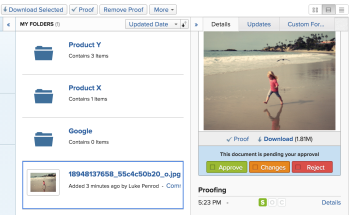

# Aprobación del trabajo

<!--

(NOTE:&nbsp;From&nbsp;Courtney: Linked to Training sites/ articles , don't change title and link)

-->

Si se le ha configurado como aprobador, debe revisar con regularidad qué trabajo espera su aprobación.

Para obtener información acerca de cómo crear procesos de aprobación, consulte [Crear un proceso de aprobación para elementos de trabajo](../../administration-and-setup/customize-workfront/configure-approval-milestone-processes/create-approval-processes.md).

Para obtener información acerca de cómo asociar aprobaciones con trabajo en Workfront, consulte [Asociar un proceso de aprobación nuevo o existente con trabajo](../../review-and-approve-work/manage-approvals/associate-approval-with-work.md).

## Requisitos de acceso

+++ Expanda para ver los requisitos de acceso para la funcionalidad en este artículo.

Debe tener el siguiente acceso para realizar los pasos de este artículo:

<table style="table-layout:auto"> 
 <col> 
 <col> 
 <tbody> 
  <tr> 
   <td role="rowheader">Plan de Adobe Workfront*</td> 
   <td> 
Cualquiera
 </td> 
  </tr> 
  <tr> 
   <td role="rowheader">Licencia de Adobe Workfront*</td> 
   <td> 
Revisión o superior
 </td> 
  </tr> 
  <tr> 
   <td role="rowheader">Configuraciones de nivel de acceso*</td> 
   <td> 
Vista o acceso superior a los objetos asociados con las aprobaciones
 
Nota: Si sigue sin tener acceso, pregunte al administrador de Workfront si ha establecido restricciones adicionales en su nivel de acceso. Para obtener información sobre cómo un administrador de Workfront puede modificar su nivel de acceso, consulte <a href="../../administration-and-setup/add-users/configure-and-grant-access/create-modify-access-levels.md" class="MCXref xref">Crear o modificar niveles de acceso personalizados</a>.
 </td> 
  </tr> 
  <tr> 
   <td role="rowheader">Permisos de objeto</td> 
   <td> 
Vista o permisos superiores a los objetos asociados a aprobaciones
 
Para obtener información sobre cómo solicitar acceso adicional, consulte <a href="../../workfront-basics/grant-and-request-access-to-objects/request-access.md" class="MCXref xref">Solicitar acceso a los objetos </a>.
 </td> 
  </tr> 
 </tbody> 
</table>

Para saber qué plan, tipo de licencia o acceso tiene, póngase en contacto con el administrador de Workfront.

+++

## Localización de aprobaciones en Adobe Workfront

Puede ver y administrar las aprobaciones en varias áreas de Workfront.

Para obtener más información sobre cómo ver los elementos que esperan aprobaciones o los elementos que usted mismo envió para su aprobación, consulte [Ver aprobaciones](../../review-and-approve-work/manage-approvals/view-approvals.md).

## Aprobar trabajo desde el área de Inicio

1. Haga clic en el **[!UICONTROL Menú principal]**  en la esquina superior derecha y, a continuación, haga clic en **[!UICONTROL Inicio]**.
1. (Condicional) Haga clic en **Personalizar** para agregar el widget **Mis aprobaciones**.
1. (Condicional) Haga clic en el menú desplegable **Filtro** y, a continuación, seleccione **Todos** para ver las aprobaciones que se le han asignado y delegado.

   >[!NOTE]
   >
   >Las aprobaciones asignadas a roles o grupos de trabajos no se muestran en Inicio. Las aprobaciones asignadas a los equipos se muestran en el widget Mis aprobaciones para cada miembro del equipo.

1. Seleccione el elemento en el que desea tomar una decisión de aprobación.

   

1. Haga clic en una de las opciones disponibles al tomar una decisión de aprobación en el panel derecho. Las siguientes opciones se muestran en la esquina superior derecha de la página, según el tipo de elemento que apruebe:

   <table>
   <tr>
      <td>
      
<strong>Acceso</strong>

      </td>
      <td>
      
<strong>Elementos de trabajo</strong>

      </td>
      <td>
      
<strong>Documentos</strong>

      </td>
      <td>
      
<strong>Pruebas</strong>

      </td>
   </tr>
   <tr>
      <td>
       <ul>
      <li>Conceder</li>
      <li>Ignorar</li>
      </ul>
      Si lo desea, puede ajustar el nivel de acceso en el menú desplegable <b>Cambiar acceso</b>.
      </td>
      <td>
         <ul>
         <li>Aprobar</li>
         <li>Rechazar</li>
         </ul>
      Puede dejar un comentario con su decisión haciendo clic en el menú desplegable del botón de decisión.
      </td>
      <td>
   Asignado como aprobador
         <ul>
         <li>Aprobar</li>
         <li>Aprobar con cambios</li>
         <li>Necesita trabajo</li>
         </ul>
   Asignado como revisor
         <ul>
         <li>Completar mi revisión</li>
         </ul>
      Las opciones de esta columna se aplican únicamente a las nuevas aprobaciones de documentos. Las aprobaciones de documentos heredados aparecen igual que las aprobaciones de elementos de trabajo. 
      </td>
      <td>
         <ul>
         <li>Ir a la revisión</li>
         </ul>
         La decisión se toma en el visualizador de pruebas. Para obtener información acerca de cómo revisar una revisión, vea <a href="../../review-and-approve-work/proofing/reviewing-proofs-within-workfront/review-proofs-in-wf.md">Revisar pruebas en Adobe Workfront</a>.
      </td>
   </tr>
   </table>

Después de tomar una decisión, la aprobación se elimina del widget Mi aprobación.

## Aprobar el trabajo directamente desde un proyecto, tarea o problema

Cuando un proyecto, tarea o problema tiene aprobación pendiente, puede aprobar o rechazar la aprobación directamente desde el proyecto, la tarea o el problema. También puede ver detalles sobre el proceso de aprobación.

Para aprobar trabajo directamente desde un proyecto, tarea o problema:

1. Vaya al proyecto, tarea o problema que requiera su aprobación.

   La información de aprobación relativa al proceso de aprobación actual de un proyecto, tarea o problema se muestra en el encabezado del elemento.

   

   Está disponible la siguiente información sobre la aprobación:

   <table style="table-layout:auto"> 
    <col> 
    <col> 
    <tbody> 
     <tr> 
      <td role="rowheader">Estado</td> 
      <td>El estado actual del proyecto, tarea o problema. Este es el estado actual del elemento que está pendiente de aprobación. El estado se aprueba después de aprobar cada fase del proceso de aprobación.</td> 
     </tr> 
     <tr> 
      <td role="rowheader">Fases de aprobación</td> 
      <td>Las fases del proceso de aprobación.  La fase actual que está pendiente de aprobación se muestra como Pendiente Las fases que ya se han aprobado se muestran como Aprobadas ; las fases que aún no se han aprobado se muestran como No iniciadas</td> 
     </tr> 
    </tbody> 
   </table>

1. Haga clic en **Aprobar** o **Rechazar**, dependiendo de si desea aprobar o rechazar el proceso de aprobación.\
   La fase de aprobación que estaba pendiente de aprobación ahora se aprueba y el proceso de aprobación pasa a la siguiente fase. El estado se aprueba después de que se hayan aprobado todas las etapas.

## Aprobar un documento directamente desde un documento

1. Vaya al área de documentos que contiene el documento que requiere su aprobación.
1. Seleccione el documento y haga clic en **Aprobar**, **Cambios** o **Rechazar**.\
   \
   

1. (Opcional) Si se ha generado una prueba para el documento, puede aprobarlo en la interfaz de revisión, tal como se describe en [Aprobar un documento a partir de una revisión](#approve-a-document-from-a-proof).

## Aprobar un documento a partir de un correo electrónico de notificación de aprobación

Según la configuración de las notificaciones, puede recibir correos electrónicos que le notifiquen documentos para los que otros usuarios necesitan que tome una decisión de aprobación. Cuando reciba un correo electrónico que contenga un botón **Tomar decisión sobre la aprobación**, puede iniciar el proceso de aprobación directamente desde el correo electrónico:

1. En el correo electrónico, haga clic en **Tomar decisión de aprobación** para abrir la página Detalles del documento para la revisión
1. Realice una de las siguientes acciones para revisar el documento:

   * Vea los metadatos del documento.
   * Si se ha creado una revisión para revisar el documento con marcas y comentarios, haga clic en **Abrir revisión**  cerca de la esquina superior derecha y revise la revisión.

     <!--   
     [Andrzej, does it make sense to leave this here if it's s document approval?&nbsp;Would there never be a proof in that situation?]   
     -->

     Para obtener información acerca de la revisión de pruebas, vea [Revisar pruebas en Adobe Workfront](../../review-and-approve-work/proofing/reviewing-proofs-within-workfront/review-proofs-in-wf.md).

1. Haga clic en una opción **Decisión** en la esquina superior derecha para aprobar, aprobar con cambios o rechazar el documento.

## Aprobar un documento a partir de una prueba {#approve-a-document-from-a-proof}

Puede aprobar un documento en el visor de revisión. Para obtener más información, consulte [Tomar una decisión sobre una prueba en el visor de pruebas](../../review-and-approve-work/proofing/reviewing-proofs-within-workfront/make-a-decision-on-a-proof/make-decisions-on-proof.md) en el artículo [Tomar una decisión sobre una prueba en el visor de pruebas](../../review-and-approve-work/proofing/reviewing-proofs-within-workfront/make-a-decision-on-a-proof/make-decisions-on-proof.md).
