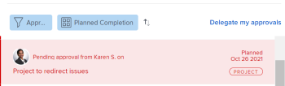

# Recuperar aprobaciones enviadas

Puede recordar cualquiera de los siguientes objetos enviados para aprobación:

* Proyectos
* Tareas
* Problemas
* Plantillas de horas
* Documentos
* Solicitudes de acceso

## Requisitos de acceso

Debe tener el siguiente acceso para realizar los pasos de este artículo:

<table style="table-layout:auto"> 
 <col> 
 <col> 
 <tbody> 
  <tr> 
   <td role="rowheader">plan de Adobe Workfront*</td> 
   <td> 
Cualquiera
 </td> 
  </tr> 
  <tr> 
   <td role="rowheader">Licencia de Adobe Workfront*</td> 
   <td> 
Solicitud o superior
 </td> 
  </tr> 
  <tr> 
   <td role="rowheader">Configuraciones de nivel de acceso*</td> 
   <td> 
Ver o acceder más a Proyectos, Tareas, Problemas, Hojas de horas, Documentos
 
Nota: Si todavía no tiene acceso, pregunte a su administrador de Workfront si establece restricciones adicionales en su nivel de acceso. Para obtener información sobre cómo un administrador de Workfront puede modificar su nivel de acceso, consulte <a href="../../administration-and-setup/add-users/configure-and-grant-access/create-modify-access-levels.md" class="MCXref xref">Crear o modificar niveles de acceso personalizados</a>.
 </td> 
  </tr> 
  <tr> 
   <td role="rowheader">Permisos de objeto</td> 
   <td> 
Ver o acceder más al objeto asociado con la aprobación 
 
Para obtener información sobre la solicitud de acceso adicional, consulte <a href="../../workfront-basics/grant-and-request-access-to-objects/request-access.md" class="MCXref xref">Solicitar acceso a objetos </a>.
 </td> 
  </tr> 
 </tbody> 
</table>

&#42;Para saber qué plan, tipo de licencia o acceso tiene, póngase en contacto con el administrador de Workfront.

## Proyectos

Cuando recuerda una aprobación de proyecto, el proyecto vuelve al estado en el que estaba antes de iniciar el proceso de aprobación.

Si recuerda una aprobación asociada con el estado inicial del proyecto, se omite el proceso de aprobación y el proyecto permanece en el estado inicial.

>[!NOTE]
>
>Puede asociar el primer estado de un proyecto o tarea con un proceso de aprobación mediante una plantilla. Para obtener más información sobre cómo agregar aprobaciones a una plantilla, consulte  [Editar plantillas de proyecto](../../manage-work/projects/create-and-manage-templates/edit-templates.md).

Para recordar una aprobación de proyecto que usted presentó:

1. Haga clic en el **Página principal** icono  en la esquina superior izquierda de Adobe Workfront.

   >[!NOTE]
   El administrador de Workfront puede realizar los siguientes cambios en el icono Inicio de su entorno:
   * Sustitúyala por una imagen personalizada para ilustrar su organización. En este caso, el icono tendrá un aspecto diferente al que se muestra en este artículo.
   * Reemplace la página vinculada por una página diferente. En este caso, haga clic en el botón **Menú principal**  en la esquina superior derecha de la página, haga clic en **Página principal**.

1. En el **Lista de trabajo** , vaya a la **Aprobaciones enviadas** agrupación.

1. Haga clic en **Proyecto** aprobación en la lista de trabajo.

   Esto abre el proyecto a la derecha de la lista de trabajo.

   

1. Haga clic en **Recordar** en la esquina superior derecha del panel derecho.

## Tareas

Cuando recuerda una aprobación de tarea, la tarea vuelve al estado en el que se encontraba antes de iniciar el proceso de aprobación.

Si recuerda una aprobación asociada al estado inicial de la tarea, se omite el proceso de aprobación y la tarea permanece en el estado inicial.

>[!NOTE]
Puede asociar el primer estado de un proyecto o tarea con un proceso de aprobación mediante una plantilla. Para obtener más información sobre cómo agregar aprobaciones a una plantilla, consulte [Editar plantillas de proyecto](../../manage-work/projects/create-and-manage-templates/edit-templates.md).

Para recordar una aprobación de tarea enviada:

1. Haga clic en el **Página principal** icono  en la esquina superior izquierda de Adobe Workfront.

   >[!NOTE]
   El administrador de Workfront puede realizar los siguientes cambios en el icono Inicio de su entorno:
   * Sustitúyala por una imagen personalizada para ilustrar su organización. En este caso, el icono tendrá un aspecto diferente al que se muestra en este artículo.
   * Reemplace la página vinculada por una página diferente. En este caso, haga clic en el botón **Menú principal**  en la esquina superior derecha de la página, haga clic en **Página principal**.

1. En el **Lista de trabajo** , vaya a la **Aprobaciones enviadas** agrupación.

1. Haga clic en **Tarea** aprobación en la lista de trabajo.

   Esto abre la tarea a la derecha de la lista de trabajo.

   

1. Haga clic en **Recordar** en la esquina superior derecha del panel derecho.

## Problemas

Cuando recuerda una aprobación del problema, el problema vuelve al estado en el que estaba antes de iniciar el proceso de aprobación.

Si recuerda una aprobación asociada con el estado inicial del problema, se omite el proceso de aprobación y el problema permanece en el estado inicial.

>[!NOTE]
Puede asociar el primer estado de un problema con un proceso de aprobación mediante una plantilla. Para obtener más información sobre la creación de una cola de solicitudes, consulte [Crear una cola de solicitud](../../manage-work/requests/create-and-manage-request-queues/create-request-queue.md).

1. Haga clic en el **Página principal** icono  en la esquina superior izquierda de Adobe Workfront.

   >[!NOTE]
   El administrador de Workfront puede realizar los siguientes cambios en el icono Inicio de su entorno:
   * Sustitúyala por una imagen personalizada para ilustrar su organización. En este caso, el icono tendrá un aspecto diferente al que se muestra en este artículo.
   * Reemplace la página vinculada por una página diferente. En este caso, haga clic en el botón **Menú principal**  en la esquina superior derecha de la página, haga clic en **Página principal**.

1. En el **Lista de trabajo** , vaya a la **Aprobaciones enviadas** agrupación.

1. Haga clic en **Problema** aprobación en la lista de trabajo.

   Esto abre el problema a la derecha de la lista de trabajo.

   

1. Haga clic en **Recordar** en la esquina superior derecha del panel derecho.

## Plantillas de horas

Cuando recuerda una aprobación de parte de horas, el parte de horas vuelve al estado en el que estaba antes de enviarse para su aprobación.

1. Haga clic en el **Página principal** icono  en la esquina superior izquierda de Adobe Workfront.

   >[!NOTE]
   El administrador de Workfront puede realizar los siguientes cambios en el icono Inicio de su entorno:
   * Sustitúyala por una imagen personalizada para ilustrar su organización. En este caso, el icono tendrá un aspecto diferente al que se muestra en este artículo.
   * Reemplace la página vinculada por una página diferente. En este caso, haga clic en el botón **Menú principal**  en la esquina superior derecha de la página, haga clic en **Página principal**.

1. En el **Lista de trabajo** , vaya a la **Aprobaciones enviadas** agrupación.

1. Haga clic en **Hoja de horas** aprobación en la lista de trabajo.

   Esto abre el parte de horas a la derecha de la lista de trabajo.

   

1. Haga clic en **Recordar** en la esquina superior derecha del panel derecho.

## Documentos

Para recuperar la aprobación de un documento, debe eliminar manualmente uno o todos los usuarios de la aprobación.

1. Haga clic en el **Página principal** icono  en la esquina superior izquierda de Adobe Workfront.

   >[!NOTE]
   El administrador de Workfront puede realizar los siguientes cambios en el icono Inicio de su entorno:
   * Sustitúyala por una imagen personalizada para ilustrar su organización. En este caso, el icono tendrá un aspecto diferente al que se muestra en este artículo.
   * Reemplace la página vinculada por una página diferente. En este caso, haga clic en el botón **Menú principal**  en la esquina superior derecha de la página, haga clic en **Página principal**.

1. En el **Lista de trabajo** , vaya a la **Aprobaciones enviadas** agrupación.

1. Haga clic en **Documento** aprobación en la lista de trabajo.

   Se abrirá el documento a la derecha de la lista de trabajo.

   

1. Haga clic en **Administrar aprobaciones** en la esquina superior derecha del panel derecho. Se abre el cuadro Administrar aprobaciones .
1. Haga clic en el **Eliminar** en línea con el nombre de un usuario dentro del cuadro Administrar aprobaciones . Elimine todos los usuarios para recuperar completamente la aprobación del documento.

   

## Solicitudes de acceso

1. Haga clic en el **Página principal** icono  en la esquina superior izquierda de Adobe Workfront.

   >[!NOTE]
   El administrador de Workfront puede realizar los siguientes cambios en el icono Inicio de su entorno:
   * Sustitúyala por una imagen personalizada para ilustrar su organización. En este caso, el icono tendrá un aspecto diferente al que se muestra en este artículo.
   * Reemplace la página vinculada por una página diferente. En este caso, haga clic en el botón **Menú principal**  en la esquina superior derecha de la página, haga clic en **Página principal**.

1. En el **Lista de trabajo** , vaya a la **Aprobaciones enviadas** agrupación.

1. Haga clic en **Solicitud de acceso** aprobación en la lista de trabajo.

   Esto abre la solicitud de acceso a la derecha de la lista de trabajo.

   

1. Haga clic en **Recordar** en la esquina superior derecha del panel derecho.
