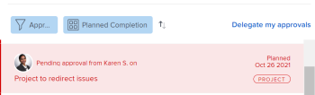
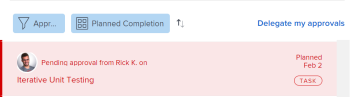
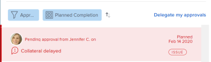
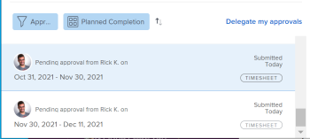
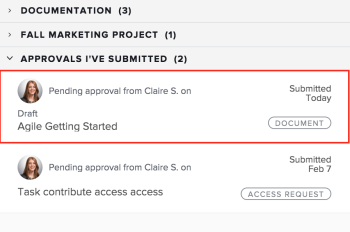
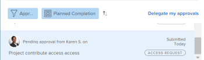

# Recuperar aprobaciones enviadas

Puede recuperar cualquiera de los siguientes objetos enviados para su aprobación:

* Proyectos
* Tareas
* Problemas
* Hojas de horas
* Documentos
* Solicitudes de acceso

## Requisitos de acceso

+++ Expanda para ver los requisitos de acceso para la funcionalidad en este artículo.

<table style="table-layout:auto"> 
 <col> 
 <col> 
 <tbody> 
  <tr> 
   <td role="rowheader">Paquete de Adobe Workfront</td> 
   <td> 
Cualquiera
 </td> 
  </tr> 
  <tr> 
   <td role="rowheader">Licencia de Adobe Workfront</td> 
   <td>
   
Contribute o superior

   
Solicitud o superior

   </td> 
  </tr> 
  <tr> 
   <td role="rowheader">Configuraciones de nivel de acceso</td> 
   <td> 
Acceso de visualización o superior a Proyectos, Tareas, Problemas, Plantillas de horas, Documentos
</td> 
  </tr> 
  <tr> 
   <td role="rowheader">Permisos de objeto</td> 
   <td> 
Acceso de visualización o superior al objeto asociado con la aprobación 
</td> 
  </tr> 
 </tbody> 
</table>

Para obtener más información, consulte [Requisitos de acceso en la documentación de Workfront](/help/quicksilver/administration-and-setup/add-users/access-levels-and-object-permissions/access-level-requirements-in-documentation.md).

+++

## Proyectos

Cuando recupera una aprobación de proyecto, el proyecto vuelve al estado en el que estaba antes de iniciar el proceso de aprobación.

Si recupera una aprobación asociada al estado inicial del proyecto, se omite el proceso de aprobación y el proyecto permanece en el estado inicial.

>[!NOTE]
>
>Puede asociar el primer estado de un proyecto o tarea con un proceso de aprobación mediante una plantilla. Para obtener más información sobre cómo añadir aprobaciones a una plantilla, consulte [Editar plantillas de proyecto](../../manage-work/projects/create-and-manage-templates/edit-templates.md).

Para recuperar una aprobación de proyecto enviada:

1. Haga clic en el icono **Inicio**  en la esquina superior izquierda de Adobe Workfront.

   >[!NOTE]
   >
   >El administrador de Workfront puede realizar los siguientes cambios en el icono de Inicio de su entorno:
   >
   >* Sustitúyalo por una imagen personalizada para ilustrar su organización. En este caso, el icono tendrá un aspecto diferente al que se muestra en este artículo.
   >* Reemplace la página vinculada por una página diferente. En este caso, haga clic en el **icono del menú principal**  en la esquina superior derecha de la página y, a continuación, haga clic en **Inicio**.

1. En el área de **Lista de trabajos**, vaya a la agrupación **Aprobaciones enviadas**.

1. Haga clic en una aprobación de **Proyecto** en la Lista de trabajos.

   Esto abre el proyecto a la derecha de la Lista de trabajos.

   

1. Haga clic en **Recuperar** en la esquina superior derecha del panel derecho.

## Tareas

Cuando recupera una aprobación de tarea, la tarea vuelve al estado en el que estaba antes de iniciar el proceso de aprobación.

Si recupera una aprobación asociada al estado inicial de la tarea, el proceso de aprobación se omite y la tarea permanece en el estado inicial.

>[!NOTE]
>
>Puede asociar el primer estado de un proyecto o tarea con un proceso de aprobación mediante una plantilla. Para obtener más información sobre cómo añadir aprobaciones a una plantilla, consulte [Editar plantillas de proyecto](../../manage-work/projects/create-and-manage-templates/edit-templates.md).

Para recuperar una aprobación de tarea enviada:

1. Haga clic en el icono **Inicio**  en la esquina superior izquierda de Adobe Workfront.

   >[!NOTE]
   >
   >El administrador de Workfront puede realizar los siguientes cambios en el icono de Inicio de su entorno:
   >
   >* Sustitúyalo por una imagen personalizada para ilustrar su organización. En este caso, el icono tendrá un aspecto diferente al que se muestra en este artículo.
   >* Reemplace la página vinculada por una página diferente. En este caso, haga clic en el **icono del menú principal**  en la esquina superior derecha de la página y, a continuación, haga clic en **Inicio**.

1. En el área de **Lista de trabajos**, vaya a la agrupación **Aprobaciones enviadas**.

1. Haga clic en una aprobación de **Tarea** en la Lista de trabajos.

   Esto abre la tarea a la derecha de la Lista de trabajos.

   

1. Haga clic en **Recuperar** en la esquina superior derecha del panel derecho.

## Problemas

Cuando recupera una aprobación de problema, el problema vuelve al estado en el que estaba antes de iniciar el proceso de aprobación.

Si recupera una aprobación asociada al estado inicial del problema, el proceso de aprobación se omite y el problema permanece en el estado inicial.

>[!NOTE]
>
>Puede asociar el primer estado de un problema con un proceso de aprobación mediante una plantilla. Para obtener más información acerca de cómo crear una cola de solicitudes, consulte [Crear una cola de solicitudes](../../manage-work/requests/create-and-manage-request-queues/create-request-queue.md).

1. Haga clic en el icono **Inicio**  en la esquina superior izquierda de Adobe Workfront.

   >[!NOTE]
   >
   >El administrador de Workfront puede realizar los siguientes cambios en el icono de Inicio de su entorno:
   >
   >* Sustitúyalo por una imagen personalizada para ilustrar su organización. En este caso, el icono tendrá un aspecto diferente al que se muestra en este artículo.
   >* Reemplace la página vinculada por una página diferente. En este caso, haga clic en el **icono del menú principal**  en la esquina superior derecha de la página y, a continuación, haga clic en **Inicio**.

1. En el área de **Lista de trabajos**, vaya a la agrupación **Aprobaciones enviadas**.

1. Haga clic en una aprobación de **Problema** en la Lista de trabajos.

   Esto abre el problema a la derecha de la Lista de trabajos.

   

1. Haga clic en **Recuperar** en la esquina superior derecha del panel derecho.

## Hojas de horas

Cuando recupera una aprobación de plantilla de horas, la plantilla de horas vuelve al estado en el que estaba antes de enviarse para su aprobación.

1. Haga clic en el icono **Inicio**  en la esquina superior izquierda de Adobe Workfront.

   >[!NOTE]
   >
   >El administrador de Workfront puede realizar los siguientes cambios en el icono de Inicio de su entorno:
   >
   >* Sustitúyalo por una imagen personalizada para ilustrar su organización. En este caso, el icono tendrá un aspecto diferente al que se muestra en este artículo.
   >* Reemplace la página vinculada por una página diferente. En este caso, haga clic en el **icono del menú principal**  en la esquina superior derecha de la página y, a continuación, haga clic en **Inicio**.

1. En el área de **Lista de trabajos**, vaya a la agrupación **Aprobaciones enviadas**.

1. Haga clic en una aprobación de **Plantilla de horas** en la Lista de trabajos.

   Se abre la plantilla de horas a la derecha de la Lista de trabajos.

   

1. Haga clic en **Recuperar** en la esquina superior derecha del panel derecho.

## Documentos

Para recuperar una aprobación de documento, debe quitar manualmente uno o todos los usuarios de la aprobación.

1. Haga clic en el icono **Inicio**  en la esquina superior izquierda de Adobe Workfront.

   >[!NOTE]
   >
   >El administrador de Workfront puede realizar los siguientes cambios en el icono de Inicio de su entorno:
   >
   >* Sustitúyalo por una imagen personalizada para ilustrar su organización. En este caso, el icono tendrá un aspecto diferente al que se muestra en este artículo.
   >* Reemplace la página vinculada por una página diferente. En este caso, haga clic en el **icono del menú principal**  en la esquina superior derecha de la página y, a continuación, haga clic en **Inicio**.

1. En el área de **Lista de trabajos**, vaya a la agrupación **Aprobaciones enviadas**.

1. Haga clic en una aprobación de **Documento** en la Lista de trabajos.

   Esto abre el documento a la derecha de la Lista de trabajos.

   

1. Haga clic en **Administrar aprobaciones** en la esquina superior derecha del panel derecho. Se abrirá la casilla Administrar aprobaciones.
1. Haga clic en el icono **Quitar** en línea con el nombre de un usuario dentro de la casilla Administrar aprobaciones. Elimine todos los usuarios para recuperar completamente la aprobación del documento.

   

## Solicitudes de acceso

1. Haga clic en el icono **Inicio**  en la esquina superior izquierda de Adobe Workfront.

   >[!NOTE]
   >
   >El administrador de Workfront puede realizar los siguientes cambios en el icono de Inicio de su entorno:
   >
   >* Sustitúyalo por una imagen personalizada para ilustrar su organización. En este caso, el icono tendrá un aspecto diferente al que se muestra en este artículo.
   >* Reemplace la página vinculada por una página diferente. En este caso, haga clic en el **icono del menú principal**  en la esquina superior derecha de la página y, a continuación, haga clic en **Inicio**.

1. En el área de **Lista de trabajos**, vaya a la agrupación **Aprobaciones enviadas**.

1. Haga clic en una aprobación de **Solicitud de acceso** en la Lista de trabajos.

   Esto abre la solicitud de acceso a la derecha de la Lista de trabajos.

   

1. Haga clic en **Recuperar** en la esquina superior derecha del panel derecho.
