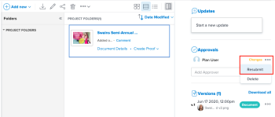

# Request a legacy document approval

Puede solicitar la aprobación de los administradores u otros usuarios de un documento en Adobe Workfront. También puede solicitar aprobaciones de documentos a personas sin cuentas de Workfront si el administrador de Workfront ha habilitado esta capacidad, tal como se describe en [Configurar las preferencias de seguridad del sistema](../../administration-and-setup/manage-workfront/security/configure-security-preferences.md).

>[!NOTE]
>
>La información de este artículo hace referencia a las aprobaciones de documentos heredadas.  
>Para obtener información acerca de la nueva revisión y aprobación unificadas, consulte [Revisión unificada y descripción general de la aprobación](/help/quicksilver/review-and-approve-work/document-reviews-and-approvals/document-approvals-overview.md).

## Requisitos de acceso

+++ Expanda para ver los requisitos de acceso para la funcionalidad en este artículo.

<table style="table-layout:auto"> 
 <col> 
 <col> 
 <tbody> 
  <tr> 
   <td role="rowheader">Paquete de Adobe Workfront</td> 
   <td> 
Cualquiera
 </td> 
  </tr> 
  <tr> 
   <td role="rowheader">Licencia de Adobe Workfront</td> 
   <td>
   
Contribuir o superior

   
Revisión o superior

   </td> 
  </tr> 
  <tr> 
   <td role="rowheader">Configuraciones de nivel de acceso</td> 
   <td> 
Acceso de visualización o superior a Proyectos, Tareas, Problemas, Plantillas, Portafolios, Programas, Informes, Paneles de control y Calendarios, Documentos
</td> 
  </tr> 
  <tr> 
   <td role="rowheader">Permisos de objeto</td> 
   <td> 
Acceso de administración al objeto asociado con el acceso de solicitud o la aprobación 
</td> 
  </tr> 
 </tbody> 
</table>

Para obtener más información, consulte [Requisitos de acceso en la documentación de Workfront](/help/quicksilver/administration-and-setup/add-users/access-levels-and-object-permissions/access-level-requirements-in-documentation.md).

+++

## Solicitar la aprobación de un documento

1. Vaya al proyecto, tarea o problema que contiene el documento y, a continuación, seleccione **Documentos**.
1. Busque el documento que necesita.

1. Desplácese hacia abajo hasta la sección **Aprobaciones** del Resumen y empiece a escribir en el cuadro de texto **Añadir aprobador**. Puede añadir usuarios de Workfront por nombre o usuarios externos por correo electrónico.

1. Si el administrador de Adobe Workfront ha habilitado la capacidad de colaborar con personas que no usan Workfront, tal como se describe en [Configurar las preferencias de seguridad del sistema](../../administration-and-setup/manage-workfront/security/configure-security-preferences.md), puede escribir sus direcciones de correo electrónico para incluirlas.

   No se puede solicitar la aprobación de equipos o grupos.

1. Repita el paso anterior para añadir otros aprobadores.

## Volver a enviar una aprobación para una nueva versión

Las decisiones de aprobación de documentos no se restablecen automáticamente al cargar una nueva versión. Por ejemplo, si el documento se aprueba con cambios, la decisión mostrará “cambios” como la decisión, aunque cargue una nueva versión con los cambios especificados. Puede borrar la decisión sobre una nueva versión si vuelve a enviar manualmente la aprobación.

1. Vaya al proyecto, tarea o problema que contiene el documento y, a continuación, seleccione **Documentos**.
1. Busque el documento que necesita.

1. Desplácese hacia abajo hasta la sección **Aprobaciones** del Resumen, haga clic en el icono Más y, a continuación, haga clic en Volver a enviar.

   

## Eliminar una solicitud de aprobación de un documento

1. Vaya al proyecto, tarea o problema que contiene el documento y, a continuación, seleccione **Documentos**.
1. Busque el documento que necesita.

1. Desplácese hacia abajo hasta la sección **Aprobaciones** del resumen y, a continuación, haga clic en el menú **Más**, en línea con el nombre del aprobador, y seleccione **Eliminar**.

   La solicitud de aprobación se elimina y el aprobador recibe una notificación que le informa de que ya no necesita su aprobación. También se elimina su acceso compartido relacionado con la aprobación.

## Enviar un recordatorio a un aprobador

Puede enviar un mensaje a un aprobador para recordarle que el documento espera sus comentarios.

1. Vaya al proyecto, tarea o problema que contiene el documento y, a continuación, seleccione **Documentos**.
1. Busque el documento que necesita.

1. Desplácese hacia abajo hasta la sección **Aprobaciones** del resumen y, a continuación, haga clic en el menú **Más** en línea con el nombre del aprobador y seleccione **Recordar**.

   El aprobador recibe una notificación que le informa de que la aprobación sigue pendiente. También pueden recibir un recordatorio por correo electrónico si está habilitado.
