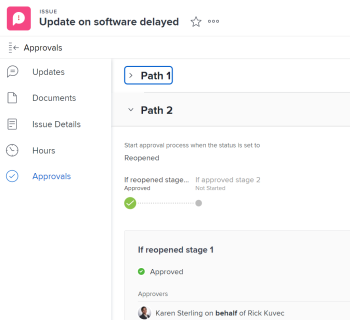

# Ver aprobaciones

La información resaltada en esta página hace referencia a una funcionalidad que aún no está disponible de forma general. Solo está disponible en el entorno de vista previa de espacio aislado.

Los procesos de aprobación proporcionan la flexibilidad para crear aprobaciones de varios pasos para proyectos, tareas y problemas. Los administradores de Adobe Workfront definen los procesos de aprobación para proporcionar coherencia en todo el sistema.

Para obtener información acerca de cómo crear procesos de aprobación, consulte [Crear un proceso de aprobación para elementos de trabajo](../../administration-and-setup/customize-workfront/configure-approval-milestone-processes/create-approval-processes.md).

Para obtener información acerca de cómo asociar aprobaciones con trabajo en Workfront, consulte [Asociar un proceso de aprobación nuevo o existente con trabajo](../../review-and-approve-work/manage-approvals/associate-approval-with-work.md).

## Requisitos de acceso

+++ Expanda para ver los requisitos de acceso para la funcionalidad en este artículo.

<table style="table-layout:auto"> 
 <col> 
 <col> 
 <tbody> 
  <tr> 
   <td role="rowheader">Paquete de Adobe Workfront</td> 
   <td> 
Cualquiera
 </td> 
  </tr> 
  <tr> 
   <td role="rowheader">Licencia de Adobe Workfront</td> 
   <td>
   

Contribuir o superior

   
Revisión o superior

   </td> 
  </tr> 
  <tr> 
   <td role="rowheader">Configuraciones de nivel de acceso</td> 
   <td>
Vista o acceso superior a los objetos asociados con las aprobaciones
 </td> 
  </tr> 
  <tr> 
   <td role="rowheader">Permisos de objeto</td> 
   <td> 
Vista o permisos superiores a los objetos asociados a aprobaciones
</td> 
  </tr> 
 </tbody> 
</table>

Para obtener más información, consulte [Requisitos de acceso en la documentación de Workfront](/help/quicksilver/administration-and-setup/add-users/access-levels-and-object-permissions/access-level-requirements-in-documentation.md).

+++

## Localización de aprobaciones en Adobe Workfront

Puede ver o administrar las aprobaciones de varias áreas de Workfront. Para obtener información sobre cómo administrar aprobaciones en diversas áreas, consulte [Aprobación de trabajo](../../review-and-approve-work/manage-approvals/approving-work.md).

Puede ver o administrar aprobaciones desde las siguientes áreas:

* En el área de Inicio

   * Todos los proyectos, tareas, problemas, hojas de horas, documentos, accesos y solicitudes de Workfront Planning que esperan su aprobación se muestran en el widget Mis aprobaciones en el área de Inicio.
   * Las aprobaciones que usted mismo ha enviado también se muestran en el widget Mis aprobaciones del área de Inicio al elegir la opción de filtro Aprobaciones que he enviado. Para obtener más información, consulte la sección [Revisar el trabajo que envía para su aprobación en el área de Inicio](#review-work-you-submit-for-approval-in-the-home-area) de este artículo.
   * Las aprobaciones se eliminan del widget Mis aprobaciones en el área de Inicio cuando el proyecto, tarea o problema asociado está marcado como Resuelto, En espera, Cerrado o Cancelado.

  Para obtener información sobre cómo usar Inicio, consulte [Introducción a Inicio](../../workfront-basics/using-home/using-the-home-area/get-started-with-home.md).

* En el encabezado de un proyecto, tarea, problema, documento o prueba
* En la sección Aprobaciones de un proyecto, tarea o problema
* En un informe

  >[!NOTE]
  >
  >No se puede tomar una decisión sobre una aprobación de un informe.

  Puede crear un informe de aprobación de proyecto, tarea, problema o documento que contenga información de aprobación.

  Para obtener información sobre cómo crear informes, consulte [Crear un informe personalizado](../../reports-and-dashboards/reports/creating-and-managing-reports/create-custom-report.md).

## Revise el trabajo que envía para su aprobación en el área de Inicio {#review-work-you-submit-for-approval-in-the-home-area}

1. Haga clic en el **[!UICONTROL Menú principal]**  en la esquina superior derecha y, a continuación, haga clic en **[!UICONTROL Inicio]**.
1. (Condicional) Haga clic en **Personalizar** para agregar el widget **Mis aprobaciones**.
1. (Condicional) Haga clic en el menú desplegable **Filtro** y, a continuación, seleccione **Aprobaciones que he enviado** para ver las aprobaciones que ha enviado.

## Ver el estado de aprobación de un objeto

Puede ver el estado de aprobación de un objeto en las siguientes secciones del objeto:

<table style="table-layout:auto"> 
 <col> 
 <col> 
 <tbody> 
  <tr> 
   <td role="rowheader">Actualizaciones </td> 
   <td> 
Muestra todos los estados de aprobación cuando se producen. Los estados de aprobación se muestran en línea con otros estados mostrados en la sección <strong>Actualizaciones</strong>.
 </td> 
  </tr> 
  <tr> 
   <td role="rowheader">Aprobaciones</td> 
   <td> 
Muestra información más detallada sobre el proceso de aprobación, como cada fase del proceso de aprobación y si los aprobadores concedieron la aprobación.
 </td> 
  </tr> 
 </tbody> 
</table>

### Utilice el área de actualizaciones para ver estados de aprobación {#use-the-updates-area-to-view-an-approval-status}

Cuando se inicia una aprobación en un proyecto, tarea o problema, se muestra un estado en la pestaña **Actualizaciones** del objeto indicando el estado de aprobación. Se mostrará un nuevo estado cada vez que el objeto pase por el proceso de aprobación. Esto incluye los siguientes eventos:

* Se inicia un proceso de aprobación en un objeto. El proceso de aprobación se inicia cuando se cambia el estado.
* El objeto se rechaza
* Se aprueba el objeto

>[!TIP]
>
>Si se aplicase una aprobación a una tarea, las actualizaciones de aprobación se mostrarán en la pestaña Actualizaciones de la tarea, no en la pestaña Actualizaciones del proyecto donde resida la tarea.

### Utilice el área de Aprobaciones para ver un estado de aprobación {#use-the-approvals-area-to-view-an-approval-status}

Es posible obtener visibilidad sobre dónde se encuentra actualmente una tarea o problema en el que se esté trabajando en el proceso de aprobación. Se puede ver la siguiente información:

* La fase del proceso de aprobación
* Qué aprobadores ya lo aprobaron
* Qué aprobadores aún no lo aprobaron

Para ver el estado actual en el que se encuentra una tarea o problema en el proceso de aprobación:

1. Vaya al proyecto, tarea o problema con el que está asociada la aprobación.
1. El panel de navegación izquierdo, haga clic en **Aprobaciones**.

   La pestaña Aprobaciones muestra la información completa sobre todas las rutas y etapas de aprobación anteriores. Es posible ver exactamente quién tomó una decisión sobre la aprobación o si la aprobación está establecida para un equipo, rol de trabajo o usuario.

   

   Para obtener información acerca de cómo crear un proceso de aprobación, consulte [Crear un proceso de aprobación para los elementos de trabajo](../../administration-and-setup/customize-workfront/configure-approval-milestone-processes/create-approval-processes.md).
