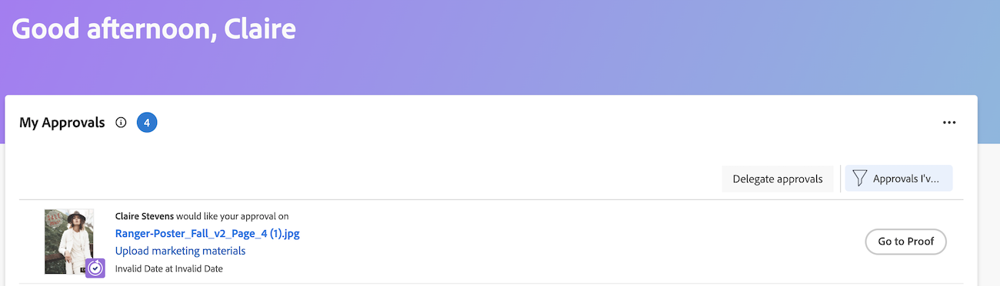

# Ver aprobaciones de prueba enviadas

Las aprobaciones de revisión se muestran en el área de Inicio solo si el entorno de Adobe Workfront está integrado con una cuenta de Workfront Proof Premium. Si no puede utilizar la revisión como se describe aquí, póngase en contacto con su administrador de Workfront.

## Requisitos de acceso

+++ Expanda para ver los requisitos de acceso para la funcionalidad en este artículo.

<table style="table-layout:auto"> 
 <col> 
 <col> 
 <tbody> 
  <tr> 
   <td role="rowheader">paquete de Adobe Workfront</td> 
   <td> 
Cualquiera
 </td> 
  </tr> 
  <tr> 
   <td role="rowheader">Licencia de Adobe Workfront</td> 
   <td> 
   
Contribuir o superior

   
Revisión o superior
 </td> 
  </tr> 
  <tr> 
   <td role="rowheader">Configuraciones de nivel de acceso</td> 
   <td> 
Acceso de visualización o superior a Proyectos, Tareas, Problemas, Plantillas, Portafolios, Programas, Informes, Paneles de control y Calendarios, Documentos
</td> 
  </tr> 
  <tr> 
   <td role="rowheader">Permisos de objeto</td> 
   <td> 
Acceso de visualización o superior al objeto asociado al acceso de solicitud o la aprobación 
 </td> 
  </tr> 
 </tbody> 
</table>

Para obtener más información, consulte [Requisitos de acceso en la documentación de Workfront](/help/quicksilver/administration-and-setup/add-users/access-levels-and-object-permissions/access-level-requirements-in-documentation.md).

+++

## Ver aprobaciones de prueba enviadas

1. Haga clic en el **[!UICONTROL Menú principal]**  en la esquina superior derecha y, a continuación, haga clic en **[!UICONTROL Inicio]**.
1. (Condicional) Haga clic en **Personalizar** para agregar el widget **Mis aprobaciones**.
1. (Condicional) Haga clic en el menú desplegable **Filtro** y, a continuación, seleccione **Aprobaciones que he enviado** para ver las aprobaciones que ha enviado.

   

   >[!NOTE]
   >
   >Si envía una aprobación a un usuario de revisión invitado, la aprobación no se muestra en Inicio.

1. (Opcional) Haga clic en **Ir a la prueba** en la esquina superior derecha del panel derecho para iniciar el visor de corrección.

   <!--
   <note type="note">
   You must have View or Edit access to Documents in your Access Level to launch the proofing viewer.
   </note>
   -->
