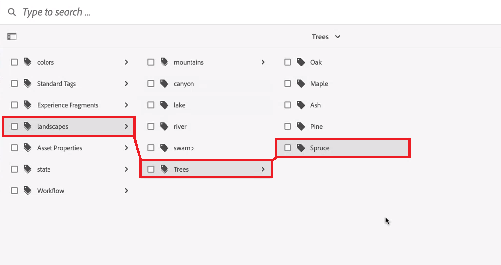

# Uso de Adobe Experience Manager con Workfront y almacenamiento en la nube de Adobe

Puede usar [!DNL Experience Manager Assets]&#x200B;&#x200B; para administrar y almacenar los recursos digitales que han pasado por el ciclo de revisión y aprobación. Esta integración le permite aprovechar las capacidades de Adobe Experience Manager, Frame.io y Workfront para optimizar los procesos de colaboración y administración de contenido.

## Configuración de la integración de Experience Manager Assets

Puede conectar su trabajo con el contenido en [!DNL Experience Manager Assets]:

* Insertar recursos y metadatos de [!DNL Adobe Workfront] a [!DNL Experience Manager Assets]
* Facilitar casos de uso de versiones
* Seguimiento de metadatos para recursos
* Sincronizar metadatos de proyecto entre [!DNL Workfront] y [!DNL Experience Manager Assets]

>[!NOTE]
>
>También puede conectar varios repositorios de [!DNL Experience Manager Assets] a un entorno de [!UICONTROL Workfront] o varios entornos de [!DNL Workfront] a un repositorio de [!DNL Experience Manager Assets] en los identificadores de organización. Siga las instrucciones de configuración de este artículo para cada integración que desee configurar.

## Requisitos de acceso

+++ Expanda para ver los requisitos de acceso para la funcionalidad en este artículo.

<table>
  <tr>
   <td>Paquete de Adobe Workfront
   </td>
   <td> 
PRIME o ULTIMATE

    
Workflow Ultimate

   </td>
  </tr>
    <tr>
   <td>Licencias de Adobe Workfront
   </td>
   <td>
  
Para configurar la integración:

   
Estándar

   
Plan

Para enviar documentos a Experience Manager Assets:

   
Colaborador o superior

   
Solicitud o superior

   </td>
  </tr>
  </tr>
    <tr>
   <td>Licencias de Adobe Experience Manager
   </td>
   <td>Estándar
   </td>
  </tr>
  <tr>
   <td>Productos adicionales
   </td>
   <td>Debe tener [!DNL Experience Manager Assets as a Cloud Service] y se le debe añadir al producto como usuario.
   </td>
  </tr>
   <tr>
   <td>Configuraciones de nivel de acceso
   </td>
   <td>Debe ser administrador de [!DNL Workfront].
   </td>
  </tr>
</table>

Para obtener más información sobre esta tabla, consulte [Requisitos de acceso en la documentación de Workfront](/help/quicksilver/administration-and-setup/add-users/access-levels-and-object-permissions/access-level-requirements-in-documentation.md).

+++

## Requisitos previos

Antes de comenzar,

* Debe tener [!DNL Workfront] y [!DNL Adobe Experience Manager Assets] asociados con un identificador de organización en [!DNL Adobe Admin Console]. Para obtener más información, consulte [Diferencias de administración basadas en la plataforma ([!DNL Adobe Workfront]/[!DNL Adobe Business Platform])](/help/quicksilver/administration-and-setup/get-started-wf-administration/actions-in-admin-console.md).
* La instancia de Workfront debe utilizar Adobe Cloud Storage.

## Configuración de la información de integración

{{step-1-to-setup}}

1. Seleccione **[!UICONTROL Documents]** en el panel izquierdo y, a continuación, seleccione **[!UICONTROL [!DNL Experience Manager]Integration]**.
1. Seleccione **[!UICONTROL Add [!DNL Experience Manager] Integration]**.
1. En el campo **[!UICONTROL Name]**, escriba el nombre que desea que los usuarios vean al interactuar con esta integración en Workfront y Experience Manager Assets.
1. En el campo **[!UICONTROL Navigation URL]**, el sistema rellena automáticamente la URL de navegación. Esta URL de solo lectura se usa para vincular la instancia [!DNL Experience Manager] de su organización desde el [!UICONTROL Main Menu] para obtener acceso rápido.
1. Elija un repositorio en el menú desplegable **[!UICONTROL [!DNL Experience Manager]Assets repository]**. El sistema rellena automáticamente los repositorios de [!DNL Experience Manager] asociados con el identificador de organización al que está asignado el perfil de usuario.
   

1. Haga clic en **[!UICONTROL Guardar]** o continúe con la sección [Configurar metadatos (opcional)](#set-up-metadata-optional) de este artículo.

   >[!IMPORTANT]
   >
   >Debido a la complejidad de la integración, no puede cambiar el repositorio después de guardar la configuración inicial.

## Configurar metadatos (opcional)

Puede asignar [!DNL Workfront] datos de objeto a campos de medios de recursos en [!DNL Experience Manager] Assets.

>[!NOTE]
>
>Solo puede asignar metadatos en una dirección: de [!DNL Workfront] a [!DNL Experience Manager]. Los metadatos de los documentos vinculados a [!DNL Workfront] desde [!DNL Experience Manager] no se pueden transferir a [!DNL Workfront].

### Configuración de los campos de metadatos

Antes de empezar a asignar campos de metadatos, debe configurarlos tanto en Workfront como en Experience Manager Assets.

Para configurar campos de metadatos:

1. Configure un esquema de metadatos en [!DNL Experience Manager Assets] como se explica en [Configurar la asignación de metadatos de recursos entre Adobe [!DNL Workfront]  y  [!DNL Experience Manager Assets]](https://experienceleague.adobe.com/en/docs/experience-manager-cloud-service/content/assets/integrations/configure-asset-metadata-mapping).

1. Configure campos de formulario personalizados en Workfront. [!DNL Workfront] tiene muchos campos personalizados integrados que puede utilizar. Sin embargo, también puede crear sus propios campos personalizados, tal como se explica en [Crear un formulario personalizado](/help/quicksilver/administration-and-setup/customize-workfront/create-manage-custom-forms/form-designer/design-a-form/design-a-form.md).

+++ **Amplíe para ver más información sobre los campos Workfront y Experience Manager Assets compatibles** 

**Etiquetas de Experience Manager Assets**

Puede asignar cualquier campo compatible con Workfront a una etiqueta de Experience Manager Assets. Para ello, debe asegurarse de que los valores de las etiquetas en Experience Manager Assets coinciden con Workfront.

* Los valores de los campos Etiquetas y de Workfront deben coincidir exactamente en cuanto a ortografía y formato.
* Los valores de los campos de Workfront asignados a las etiquetas de Experience Manager Assets deben estar en minúsculas, incluso si la etiqueta de Experience Manager Assets parece tener letras mayúsculas.
* Los valores de los campos de Workfront no deben incluir espacios.
* El valor del campo en Workfront también debe incluir la estructura de carpetas de la etiqueta Experience Manager Assets.
* Para asignar varios campos de texto de una sola línea a las etiquetas, escriba una lista separada por comas de los valores de las etiquetas en el lado Workfront de la asignación de metadatos y `xcm:keywords` en el lado de Experience Manager Assets. Cada valor de campo se asigna a una etiqueta independiente. Puede utilizar un campo calculado para combinar varios campos de Workfront en un único campo de texto separado por comas.
* Puede asignar valores de los campos desplegables, botón de opción o casilla de verificación introduciendo una lista separada por comas de los valores disponibles en ese campo.

>[!INFO]
>
>**Ejemplo**: Para que coincida con la etiqueta mostrada en la estructura de carpetas, el valor del campo en Workfront sería `landscapes:trees/spruce`. Tenga en cuenta las letras minúsculas en el valor del campo Workfront.
>
>Si desea que la etiqueta sea el elemento situado más a la izquierda en el árbol de etiquetas, debe ir seguida de dos puntos. En este ejemplo, para asignar a la etiqueta de paisajes, el valor del campo en Workfront sería `landscapes:`.
>
>

Una vez creadas las etiquetas en Experience Manager Assets, aparecerán en la lista desplegable Etiquetas de la sección Metadatos. Para vincular un campo a una etiqueta, seleccione `xcm:keywords` en la lista desplegable de campos de Experience Manager Assets en el área de asignación de metadatos.

Para obtener más información sobre las etiquetas en Experience Manager Assets, incluyendo cómo crear y administrar etiquetas, consulte [Administración de etiquetas](https://experienceleague.adobe.com/en/docs/experience-manager-64/administering/contentmanagement/tags).

**Campos de esquema de metadatos personalizados de Experience Manager Assets**

Puede asignar campos de Workfront integrados y personalizados a campos de esquema de metadatos personalizados en Experience Manager Assets.

Los campos de metadatos personalizados creados en Experience Manager Assets se organizan en su propia sección, en el área Configuración de metadatos.

<!-- 
link to documentation about creating schema - waiting on response from Anuj about best article to link to
-->

**Campos de Workfront**

Puede asignar campos de Workfront integrados y personalizados a Experience Manager Assets. Los siguientes valores de campo deben coincidir en ambos casos y en la ortografía entre Workfront y Experience Manager Assets:

* Campos desplegables
* Campos de selección múltiple

>[!TIP]
>
> Para comprobar si los valores del campo coinciden exactamente, vaya a
>
> * Configuración > Formularios personalizados en Workfront o el campo en el objeto
> * Recursos > Esquemas de metadatos en Experience Manager Assets

+++

### Asignar metadatos a los recursos

Los metadatos se asignan cuando se inserta un recurso desde [!DNL Workfront] por primera vez. Los documentos con los campos integrados o personalizados se asignan automáticamente a los campos especificados la primera vez que se envía un recurso a [!DNL Experience Manager Assets].

Para asignar metadatos a los recursos:

<!--
1. Select **[!UICONTROL Assets]** above the metadata table.
-->
1. En la columna **[!UICONTROL [!DNL Workfront]campo]**, elija un campo Workfront integrado o personalizado.

   >[!NOTE]
   >
   >Puede asignar un solo campo [!DNL Workfront] a varios campos de [!UICONTROL Experience Manager Assets]. No se pueden asignar varios campos de [!DNL Workfront] a un único campo de [!DNL Experience Manager Assets].
   ><!--To map a Workfront field to an Experience Manager Assets tag, see -->

1. En el campo [!DNL Experience Manager Assets], busque en las categorías previamente completadas o escriba al menos dos letras en el campo de búsqueda para acceder a categorías adicionales.
1. Repita los pasos 2 y 3 según sea necesario.
   
1. Haz clic en [!UICONTROL **Guardar**] o desplázate a la sección [Sincronización de metadatos de objetos](#object-metadata-sync) de este artículo.

### Sincronización de metadatos de objeto

Los campos de [!DNL Experience Manager] asignados a [!DNL Workfront] campos de portafolio, programa, proyecto, tarea, problema y documento se actualizan automáticamente cuando el campo se cambia en [!DNL Workfront].

Cuando esta opción está habilitada, cualquier recurso que se haya insertado en Adobe Experience Manager muestra una vista en tiempo real de los metadatos de Adobe Experience Manager del documento en la página Detalles del documento en Workfront.

1. Habilite el campo **[!UICONTROL Sincronizar metadatos de objeto]** y haga clic en **Guardar**.

>[!IMPORTANT]
>
>Los usuarios deben tener acceso de escritura en [!DNL Experience Manager] para los recursos que residen en el objeto a fin de que los metadatos se sincronicen cuando se actualicen.

## Enviar documentos a Experience Manager Assets o Assets Essentials

Es posible enviar documentos desde Workfront a Experience Manager Assets o Assets Essentials. Los documentos cargados y enviados desde Workfront a Assets Essentials siguen contando en el almacenamiento general de documentos.

Assets enviado a Experience Manager mediante esta integración tiene un límite de tamaño de **5o TB**.

<!--In the Preview environment, Assets sent to Experience Manager through this integration have a size limit of **30 GB**.-->

Los campos de metadatos se asignan por primera vez al enviar un recurso desde Workfront a Experience Manager Assets o a Assets Essentials. También se envían los metadatos configurados para asignar a objetos principales. Para obtener más información sobre la configuración de la asignación de metadatos, consulte [Configuración de la integración de Experience Manager Assets as a Cloud Service](/help/quicksilver/administration-and-setup/configure-integrations/configure-aacs-integration.md) o [Configuración de la integración de Experience Manager Assets Essentials](/help/quicksilver/documents/adobe-workfront-for-experience-manager-assets-essentials/setup-asset-essentials.md).

>[!INFO]
>
>**Ejemplo**: la primera vez que envía un recurso adjunto a un proyecto, los metadatos se asignan a Experience Manager Assets o Assets Essentials, así como cualquier metadato asignado de objetos principales, como un portafolio y un programa.

### Enviar documentos desde Workfront

Cuando un usuario envía un documento desde Workfront a Experience Manager Assets o a Assets Essentials, los metadatos asignados se transfieren a lo largo del documento. Una vez enviado el documento, los cambios realizados en los metadatos del documento en Workfront no se reflejarán en Assets ni en Assets Essentials. Al cambiar campos asignados en Workfront, es necesario enviar una nueva versión del documento con los metadatos actualizados a Assets o a Assets Essentials.

Para enviar documentos:

1. Vaya al área **Documentos** de Workfront y seleccione el documento que quiera enviar.
1. En la barra de la parte inferior de la pantalla, haz clic en **Enviar a**.

1. Elija la integración de Experience Manager que configuró el administrador y luego haga clic en **Enviar**.

   >[!NOTE]
   >
   >El administrador de Workfront puede elegir cualquier nombre para esta integración, por lo que es posible que no mencione específicamente los recursos ni a Assets Essentials.

1. Elija dónde desea que vaya el recurso y haga clic en **Seleccionar carpeta**.

## Vincular contenido desde Experience Manager Assets

Para vincular contenido:

1. Vaya al objeto de Workfront donde desea vincular el contenido.
1. Haga clic en la sección **Documentos** del panel izquierdo.
1. Haga clic en **Nuevo** en el lado derecho de la página y, a continuación, haga clic en **Archivos de AEM** para vincular un recurso individual.
   

1. Con el Asesor de contenido, puede:

   <table style="table-layout:auto">
   <tbody>
      <tr>
         <td><strong>Buscar recursos mediante la Búsqueda por IA.</strong> Utilice búsquedas impulsadas por IA que entiendan el significado y la intención que hay detrás de las consultas, y que admitan varios idiomas, errores tipográficos y sinónimos.</td>
         <td>Para obtener más información, consulte <a href="https://experienceleague.adobe.com/en/docs/experience-manager-cloud-service/content/assets/manage/content-advisor-adobe-applications#content-advisor-ai-search">Búsqueda por IA para una detección de recursos más inteligente</a>.</td>
      </tr>
      <tr>
         <td><strong>Ver sugerencias inteligentes basadas en el contexto y la intención.</strong> Descubra recursos que se alinean con sus necesidades de contenido mediante recomendaciones según el contexto desde la aplicación host de Adobe.</td>
         <td>Para obtener más información, consulte <a href="https://experienceleague.adobe.com/en/docs/experience-manager-cloud-service/content/assets/manage/content-advisor-adobe-applications#smart-suggestions-content-advisor">Sugerencias inteligentes basadas en el contexto y la intención</a>.</td>
      </tr>
      <tr>
         <td><strong>Cargue un informe de campaña para descubrir los recursos relevantes.</strong> Cargue un documento de resumen de campaña de PDF, DOCX o TXT para que el Asesor de contenido pueda analizarlo y recomendar recursos relevantes.</td>
         <td>Para obtener más información, consulte <a href="https://experienceleague.adobe.com/en/docs/experience-manager-cloud-service/content/assets/manage/content-advisor-adobe-applications#campaign-briefs-content-advisor">Informes de Campaign para descubrir recursos relevantes</a>.</td>
      </tr>
      <tr>
         <td><strong>Ver y seleccionar representaciones de recursos de Dynamic Media.</strong> Explore representaciones optimizadas para canales, incluidos ajustes preestablecidos de imagen, recortes inteligentes y tipos de formato, y aplique modificadores de Dynamic Media para previsualizar los ajustes en tiempo real.</td>
         <td>Para obtener más información, consulte <a href="https://experienceleague.adobe.com/en/docs/experience-manager-cloud-service/content/assets/manage/content-advisor-adobe-applications#dynamic-media-renditions-content-advisor">Representaciones de recursos de Dynamic Media disponibles para usar</a>.</td>
      </tr>
      <tr>
         <td><strong>Aplicar modificadores de Dynamic Media a las representaciones.</strong> Añada modificadores para transformar las representaciones de recursos en tiempo real y previsualizar los resultados antes de seleccionar una representación para la aplicación host.</td>
         <td>Para obtener más información, consulte <a href="https://experienceleague.adobe.com/en/docs/experience-manager-cloud-service/content/assets/manage/content-advisor-adobe-applications#dynamic-media-renditions-content-advisor">Representaciones de recursos de Dynamic Media disponibles para usar</a>.</td>
      </tr>
      <!--
      <tr>
         <td><strong>Discover and browse Content Fragments.</strong> Search through Content Fragments, view live thumbnail previews, check status (Draft, Modified, or Published), and inspect detailed properties, references, and variations.</td>
         <td>For more information, see <a href="https://experienceleague.adobe.com/en/docs/experience-manager-cloud-service/content/assets/manage/content-advisor-adobe-applications#content-fragments-discovery-content-advisor">Discovery of Content Fragments</a>.</td>
      </tr>
      -->
      <tr>
         <td><strong>Acceder a los metadatos del recurso.</strong> Revise las propiedades del recurso, como título, descripción, formato, tamaño y otras pestañas de metadatos (Producto, Campaña, Etiquetas) coherentes con la vista de Assets.</td>
         <td>Para obtener más información, consulte <a href="https://experienceleague.adobe.com/en/docs/experience-manager-cloud-service/content/assets/manage/content-advisor-adobe-applications#asset-metadata-content-advisor">Acceder a metadatos de recursos compatibles con la vista de Assets</a>.</td>
      </tr>
      <tr>
         <td><strong>Filtrar recursos mediante filtros predefinidos.</strong> Restrinja los resultados de los recursos mediante filtros como Tipo de archivo, Formato de archivo, Estado del recurso, Tamaño de archivo, Anchura de imagen, Altura de imagen, Fecha de modificación y Fecha de creación.</td>
         <td>Para obtener más información, consulte <a href="https://experienceleague.adobe.com/en/docs/experience-manager-cloud-service/content/assets/manage/content-advisor-adobe-applications#filters-content-advisor">Filtros de acceso compatibles con la vista de Assets</a>.</td>
      </tr>
      <tr>
         <td><strong>Guardar y reutilizar búsquedas.</strong> Cree búsquedas guardadas especificando un término de búsqueda y opciones de filtro y, a continuación, vuelva a utilizarlas en Experience Manager Assets y otras aplicaciones de Adobe.</td>
         <td>Para obtener más información, consulte <a href="https://experienceleague.adobe.com/en/docs/experience-manager-cloud-service/content/assets/manage/content-advisor-adobe-applications#saved-searches-content-advisor">Acceder y reutilizar búsquedas recientes y guardadas</a>.</td>
      </tr>
      <tr>
         <td><strong>Busque recursos en las colecciones y entre ellas.</strong> Busque recursos o colecciones en todas las colecciones, o bien limite la búsqueda a una colección específica.</td>
         <td>Para obtener más información, consulte <a href="https://experienceleague.adobe.com/en/docs/experience-manager-cloud-service/content/assets/manage/content-advisor-adobe-applications#search-collections-content-advisor">Buscar recursos en las colecciones y entre ellas</a>.</td>
      </tr>
   </tbody>
   </table>

   >[!NOTE]
   >
   >El contenido recomendado en el Asesor de contenido utiliza datos de los siguientes elementos para determinar el contenido sugerido en Workfront:
   >
   >* Campos de nombre y descripción de objeto de Workfront
   >* Campos de formulario personalizados marcados como obligatorios
   >* Datos de documentos adjuntos

<!--
### Link a new version from Experience Manager Assets

You can pull new content over from Experience Manager Assets and add it to an existing asset as a new version. If the document is already linked and a new version is added in Experience Manager Assets, the new version appears automatically in Workfront.

To link a new version:

1. Go to the Workfront object where you want to link content.
1. Click the **Documents** section in the left panel.
1. Select the asset you want to replace with a new version. You can't create a new version of an asset in a linked folder.
1. Select **Add New** > **Version**, then select the Experience Manager integration your administrator set up.

   >[!NOTE]
   >
   >The Workfront administrator can choose any name for this integration, so it might not specifically mention Experience Manager Assets.

1. Select the content you want to link.
1. Click **Select**.
-->

<!--
## Link a folder from Experience Manager Assets

Permissions to view individual assets inside of a folder rely on Experience Manager Assets permissions.

To link a folder:

1. Go to the Workfront object where you want to link content.
1. Click the **Documents** section in the left panel.
1. Click **Assets** > **Files & Folders**.
1. Click the **Filter** icon, then in the **Asset Type** section, choose **Folders**.
1. Select the folder you want to link.
1. Click **Select**.
-->

## Consideraciones

* Los flujos de trabajo de revisión y aprobación no son compatibles con los recursos de AEM vinculados.
* Los campos de metadatos se asignan por primera vez al enviar un recurso de Workfront a Experience Manager Assets. Si el administrador de Workfront ha habilitado la sincronización de metadatos de objetos, los campos permanecen actualizados si se modifican en alguna de las aplicaciones.

<!--
 not sure if this is in yet

### Send a new version

You can add a new version to a document you have previously uploaded to Workfront. For more information, see [Upload a new version of a document](/help/quicksilver/documents/managing-documents/upload-new-document-version.md). After the latest version is uploaded, you can send it to Assets Essentials. If a mapped field in Workfront has changed, the new version updates the metadata in Assets Essentials when it sends.

>[!IMPORTANT]
>
>Before you upload a new version to Workfront, we recommend renaming the file. If you upload a new version with the exact same file name as a previous version, only the most recent version can be downloaded from Workfront. All versions can be downloaded from Experience Manager Assets or Assets Essentials regardless of the file name. - is this accuate for ESM?

To send the most recent version:

1. Go to the **Documents** area in Workfront, and locate the document.
1. In the bar at the bottom of the screen, click **Send to**. 

1. Choose the Experience Manager integration your administrator set up, then click **Send**.

   >[!NOTE]
   >
   >The Workfront administrator can choose any name for this integration, so it might not specifically mention Assets or Assets Essentials.

1. Click **Save**. The new version saves in the same location as the previous version.
 
 -->