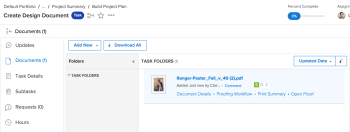

# Creación de una prueba avanzada con un flujo de trabajo automatizado

Un flujo de trabajo automatizado facilita la administración del proceso de revisión si el proceso es complejo o si envía contenido para su revisión a las mismas personas con regularidad. La revisión pasa de una fase a otra y Adobe Workfront notifica a cada usuario cuándo es su turno de revisarla. Para obtener más información sobre los flujos de trabajo automatizados, consulte [Resumen del flujo de trabajo automatizado](../../../review-and-approve-work/proofing/proofing-overview/automated-workflow.md).

## Requisitos de acceso

Debe tener el siguiente acceso para realizar los pasos de este artículo:

<table style="table-layout:auto"> 
 <col> 
 <col> 
 <tbody> 
  <tr> 
   <td role="rowheader">plan Adobe Workfront*</td> 
   <td> 
Plan actual: Pro o Superior
 
o
 
Plan heredado: Select o Superior
 
Para obtener más información sobre la revisión del acceso con los diferentes planes, consulte <a href="/help/quicksilver/administration-and-setup/manage-workfront/configure-proofing/access-to-proofing-functionality.md" class="MCXref xref">Acceso a la funcionalidad de revisión en Workfront</a>.
 </td> 
  </tr> 
  <tr> 
   <td role="rowheader">Licencia de Adobe Workfront*</td> 
   <td> 
Plan actual: Trabajo o Plan
 
Plan heredado: Cualquiera (debe tener la revisión habilitada para el usuario)
 </td> 
  </tr> 
  <tr> 
   <td role="rowheader">Perfil de permiso de revisión </td> 
   <td>Responsable o superior</td> 
  </tr> 
  <tr> 
   <td role="rowheader">Configuraciones de nivel de acceso*</td> 
   <td> 
Editar acceso a documentos
 
Nota: Si sigue sin tener acceso, pregunte al administrador de Workfront si ha establecido restricciones adicionales en su nivel de acceso. Para obtener información sobre cómo un administrador de Workfront puede modificar su nivel de acceso, consulte <a href="../../../administration-and-setup/add-users/configure-and-grant-access/create-modify-access-levels.md" class="MCXref xref">Crear o modificar niveles de acceso personalizados</a>.
 </td> 
  </tr> 
 </tbody> 
</table>

&#42;Para saber qué plan, función o perfil de permiso de pruebas tiene, póngase en contacto con su administrador de Workfront o de Workfront Proof.

## Creación de una prueba avanzada con un flujo de trabajo automatizado

1. Vaya al proyecto, tarea o problema donde desee la prueba y haga clic en **Documentos** pestaña.
1. Clic **Añadir nuevo** > Prueba, cargue el contenido y, a continuación, revise las secciones que se indican a continuación.

   o

   Pase el ratón sobre un documento existente y luego haga clic en **Crear revisión** > **Corrección avanzada** y trabaje en las secciones que se enumeran a continuación.

## Configuración de las fases de prueba

1. En la sección Workflow type, elija **Automatizado**.
1. (Opcional) Si desea utilizar una plantilla de flujo de trabajo automatizado que el administrador de Workfront haya creado y compartido con usted, haga clic en **Añadir plantilla**, seleccione la plantilla en el cuadro que aparece y haga clic en **Añadir plantilla**.

   >[!NOTE]
   >
   >Tenga en cuenta lo siguiente cuando utilice una plantilla de flujo de trabajo automatizado:
   >   
   >* La configuración de una plantilla de Flujo de trabajo automatizado determina lo que puede hacer con el Flujo de trabajo automatizado para una prueba. Por ejemplo, si el botón Add a stage está desactivado en la plantilla, no está visible mientras trabaja con la configuración del flujo de trabajo automatizado para la prueba.
   >* Cuando se añade una persona a una etapa en una plantilla de flujo de trabajo automatizado, pero también está presente como revisor en la prueba, al aplicar la plantilla se elimina al revisor de la etapa. Si no agrega otro revisor al escenario, aparecerá un mensaje en el que se le pedirá que agregue uno.
   >* La posibilidad de modificar una plantilla de flujo de trabajo automatizado depende de la configuración de la plantilla que establezca el administrador de Workfront, tal como se describe en Si la capacidad para modificar la plantilla está desactivada, solo el propietario de la plantilla puede modificarla.

1. Configure la primera fase del flujo de trabajo automatizado:

   1. (Opcional) Si desea crear un nombre para la primera etapa, haga clic en **Fase 1** y, a continuación, escriba el nombre.
   1. En el **Destinatarios** para la fase, añada revisores a la fase.

      >[!NOTE]
      >
      >Tenga en cuenta lo siguiente al agregar revisores a una fase:
      >   
      >* Puede añadir usuarios externos a un escenario con una dirección de correo electrónico.
      >* Después de agregar un usuario a una fase, puede establecer la configuración de ese usuario en la prueba.
      >* Puede arrastrar a los usuarios directamente a otro escenario o arrastrarlos a un escenario del **Fases** diagrama. Para seleccionar varios usuarios, presione Mayús+Ctrl (en Windows) o Mayús+Comando (en Mac).
      >* Puede agregar un revisor a una prueba solo una vez, lo que significa que no puede agregar la misma persona a más de un paso de la prueba.
      >* Los revisores que no se agregan a una fase privada no pueden ver esa fase en la prueba ni en los comentarios realizados en esa fase.
      >* De forma predeterminada, añadir un usuario a una fase concede a ese usuario acceso para ver la prueba desde el momento en que se crea la prueba. El administrador de Workfront puede restringir el acceso de los usuarios a la prueba hasta que el flujo de trabajo entre en la fase en la que se añadió el usuario.

   1. Clic **Configuración del escenario**.
   1. Haga clic en un **Activar fase** para indicar cómo desea que se active la fase.

      Para la primera fase, solo puede seleccionar **Al crear la prueba**, **En una fecha y hora específicas**, o **Manualmente**.

   1. (Condicional) Si ha seleccionado **En una fecha y hora específicas** en el paso anterior, seleccione la fecha y la hora en que desea activar la fase en la **Activar en** que aparece.

   1. Utilice cualquiera de las opciones siguientes para configurar aún más el escenario.

      <table style="table-layout:auto">
       <col>
       <col>
       <tbody>
        <tr>
         <td role="rowheader">Establecer fecha límite de la fase</td>
         <td>
Para establecer una fecha límite para la fase, haga clic en una opción de la <strong>Opciones de fecha límite</strong> lista desplegable. A continuación, en <strong>Plazo</strong>, realice una de las siguientes acciones:

          <ul>
           <li>Si elige <strong>Establecer fecha específica</strong>: seleccione la fecha y la hora límite que desee.</li>
           <li>Si elige <strong>Calcular desde fecha de activación de fase</strong>: seleccione el número de días laborables que desea añadir a la fecha de activación de la fase para determinar la fecha límite.</li>
          </ul></td>
        </tr>
        <tr>
         <td role="rowheader">Bloquear fase</td>
         <td>Especifique cuándo se puede bloquear el escenario. </td>
        </tr>
        <tr>
         <td role="rowheader">Transferir derechos de decisión principales a</td>
         <td>
Seleccione el responsable de la toma de decisiones principal en la fase (disponible solo después de añadir al menos una persona a la fase que tenga la función de Aprobador o superior en Prueba). Si selecciona un responsable de la toma de decisiones principal, la variable <strong>Solo se requiere una decisión</strong> La opción está desactivada en este escenario.
</td>
        </tr>
        <tr>
         <td role="rowheader">Requerir solo una decisión para esta fase</td>
         <td>Finaliza todo el proceso de revisión cuando uno de los responsables de la toma de decisiones toma una decisión.
Esta opción no está disponible si ha designado un usuario en la variable <strong>Responsable principal de la toma de decisiones</strong>menú desplegable.
</td>
        </tr>
        <tr>
         <td role="rowheader">Convertir este paso en privado</td>
         <td>Permite que solo las siguientes personas vean los comentarios y las decisiones tomadas durante esta fase: supervisores, administradores de Workfront y administradores de Workfront Proof</td>
        </tr>
       </tbody>
      </table>

1. Para agregar y configurar otra fase:

   1. Clic **Nueva etapa**.
   1. (Opcional) Si desea crear un nombre para la primera etapa, haga clic en **Fase 2** (o **Fase 3**, **Fase 4**, etc.) y, a continuación, escriba el nombre.

   1. Haga clic en **Activar fase**, luego seleccione una opción para especificar si la fase se activa automática o manualmente.

      Además de las opciones de **Al crear la prueba**, **En una fecha y hora específicas**, o **Manualmente**, puede seleccionar una opción que dependa de lo que haya ocurrido en el paso anterior:

      

   1. Si seleccionó una opción Activar fase que depende de lo que ocurrió en el paso anterior, utilice las opciones que aparecen para configurar la configuración de activación.

      Por ejemplo, si selecciona **Cuando cambie el estado de la etapa anterior**, seleccione la **Fase anterior**, luego seleccione el estado en la **El estado ha cambiado a** cuadro.

1. Repita el paso anterior según sea necesario para agregar más etapas.

   A medida que se añaden fases al flujo de trabajo automatizado, se forma un diagrama en la pantalla para representarlas:

   

1. Continuar con [Configuración de correo electrónico para la prueba](#configure-email-settings-for-the-proof) más abajo.

## Configuración de correo electrónico para la prueba {#configure-email-settings-for-the-proof}

1. En el **Notificación por correo electrónico** , seleccione si desea enviar notificaciones por correo electrónico y un mensaje personalizado a los usuarios seleccionados en [Creación de una prueba avanzada con un flujo de trabajo automatizado](#workflow) anteriormente en este artículo:

   <table>
      <tbody>
      <tr>
      <td>Notificar a los destinatarios sobre esta revisión</td>
      <td>Seleccione esta opción para enviar una notificación por correo electrónico a los usuarios. Cuándo <strong>Uso compartido básico</strong> está seleccionado en la <strong>Flujo de trabajo</strong> , se envía una notificación por correo electrónico cuando se crea la prueba. Cuándo <strong>Flujo de trabajo automatizado</strong> está seleccionado en la <strong>Flujo de trabajo</strong> , se enviará una notificación por correo electrónico cuando la prueba entre en la fase del flujo de trabajo automatizado a la que está asociado el usuario.</td>
      </tr>
      <tr>
      <td>Añadir mensaje personalizado</td>
      <td>Seleccione esta opción para incluir un mensaje personalizado en la notificación. Puede especificar el asunto y el cuerpo del mensaje. El cuerpo del mensaje puede incluir formato de texto enriquecido, como negrita, viñetas e hipervínculos.</td>
      </tr>
      </tbody>
      </table>

1. Continuar con [Configurar ajustes de prueba](#configure-proof-settings) más abajo.

## Configurar ajustes de prueba {#configure-proof-settings}

1. En el **Configuración de revisión** , seleccione cualquiera de las siguientes opciones:

   <table style="table-layout:auto"> 
    <col> 
    <col> 
    <tbody> 
     <tr> 
      <td role="rowheader">Requerir inicio de sesión: la prueba solo se puede compartir con otros usuarios</td> 
      <td>Cuando esta opción está deshabilitada (predeterminada), cualquier persona con la URL puede ver la revisión.  Cuando se selecciona esta opción:
       <ul>
        <li>Solo los usuarios de Workfront Proof pueden ver la prueba.</li>
        <li>Los usuarios no pueden iniciar sesión en la prueba a menos que se les haya agregado a la prueba.</li>
        <li>No se pueden activar las suscripciones.</li>
       </ul></td> 
     </tr> 
     <tr> 
      <td role="rowheader">Solo se requiere una decisión para esta prueba</td> 
      <td>Cuando se selecciona esta opción, la revisión se completa después de que uno de los responsables de la toma de decisiones tome su decisión. Esta opción está desactivada de forma predeterminada.</td> 
     </tr> 
     <tr> 
      <td role="rowheader">Requerir que las decisiones se firmen electrónicamente</td> 
      <td>Los usuarios deben especificar su nombre de usuario y contraseña en el momento en que toman una decisión sobre una prueba.</td> 
     </tr> 
     <tr> 
      <td role="rowheader">Bloquear la revisión cuando se tomen todas las decisiones necesarias</td> 
      <td>Cuando esta configuración está habilitada, el estado de prueba se bloquea después de que se hayan tomado todas las decisiones. El estado cambia automáticamente de desbloqueado a bloqueado cuando el aprobador final toma su decisión. Esta opción está desactivada de forma predeterminada.</td> 
     </tr> 
     <tr> 
      <td role="rowheader">Descargar archivo original</td> 
      <td>Cuando se selecciona esta opción, los revisores pueden descargar el archivo original desde el que se creó la prueba. Cuando esta opción no está seleccionada, el icono Descargar ya no está visible. Esta opción está habilitada de forma predeterminada.</td> 
     </tr> 
     <tr> 
      <td role="rowheader">Compartir la revisión mediante una URL pública o código para insertar</td> 
      <td>Cuando se selecciona esta opción, la prueba se puede compartir mediante una URL pública o un código incrustado.</td> 
     </tr> 
     <tr> 
      <td role="rowheader">Suscribirse a la revisión mediante una URL pública o un código para insertar</td> 
      <td>Si se selecciona esta opción, las personas que no se hayan añadido explícitamente a la prueba podrán suscribirse a ella. A la persona que se suscribe a la prueba se le concede la función y el correo electrónico que defina en la siguiente configuración:
       <ul>
        <li><strong>Función del suscriptor:</strong> La función de prueba predeterminada que se asigna a todos los revisores que se suscriben a la prueba.</li>
        <li><strong>Configuración de alertas de correo electrónico para suscriptores:</strong> La alerta de correo electrónico predeterminada asignada a todos los revisores que se suscriben a la prueba.</li>
       </ul>

        <ul>
         <li><strong>Se requiere acceso de revisión por correo electrónico para:</strong> Configure si el suscriptor recibe un correo electrónico con un vínculo a la prueba. Puede seleccionar <strong>Sin correo electrónico</strong> (no se requiere un enlace de correo electrónico para acceder a la prueba), <strong>Solo correo electrónico de notificación de revisión</strong> (el suscriptor recibe un vínculo a la prueba por correo electrónico sin ninguna verificación), o <strong>Correos electrónicos de validación y notificación de prueba</strong> (el suscriptor recibe un vínculo a la prueba por correo electrónico y debe hacer clic en el vínculo para acceder a una prueba, el propósito de esta opción es garantizar que la persona haya introducido una dirección de correo electrónico correcta a la que tenga acceso).</li>
        </ul>
<strong>Nota:</strong> Si las pruebas tienen un flujo de trabajo automatizado adjunto, todas las suscripciones generarán correos electrónicos de confirmación a los propietarios de la prueba para que puedan decidir a qué fase se debe agregar a la persona. 

</td> 
     </tr> 
    </tbody> 
   </table>

1. Clic **Crear revisión**.

   Workfront comienza a generar una prueba de los documentos o sitios web seleccionados. Según el tamaño y el tipo de archivo, el tiempo de posposición de la carga de un documento puede variar. Tenga paciencia, ya que los archivos más grandes tardan más en generarse. Puede salir de la página y Workfront seguirá generando el archivo. El tamaño máximo de carga de archivo es de 4 GB.

1. Una vez generada la prueba, haga clic en **Abrir revisión** para iniciar el visor de revisión.

   

   Los usuarios que no tengan habilitada la revisión en su cuenta aún pueden ver el documento y realizar comentarios en la revisión [.](../../../timesheets/config-timesheet-prefs/config-time-logged-hrs-days.md)
