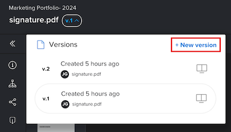

# Crear una nueva versión de una prueba

<!-- Audited: 4/2025 -->

Administrar los comentarios en varias versiones o revisiones de un trabajo puede ser un desafío. Adobe Workfront simplifica este proceso al permitirle crear y comparar varias versiones de una prueba.

Tenga en cuenta la siguiente información al crear una nueva versión de una prueba:

* Puede conceder permiso a un usuario para ver una versión, pero no otra. Por el contrario, si comparte una versión posterior con un usuario, ese usuario no puede ver las versiones anteriores a menos que vuelva atrás y les conceda acceso a esas versiones anteriores.
* Debe tener derechos de edición en la prueba para crear una nueva versión.

  Para obtener más información, consulte [Administrar roles de prueba en Workfront Proof](../../../workfront-proof/wp-work-proofsfiles/share-proofs-and-files/manage-proof-roles.md) y [Perfiles de permisos de prueba en Workfront Proof](../../../workfront-proof/wp-acct-admin/account-settings/proof-perm-profiles-in-wp.md).

  Para obtener información sobre cómo compartir versiones de prueba, consulte [Compartir una prueba en Adobe Workfront](../../../workfront-proof/wp-work-proofsfiles/share-proofs-and-files/share-proof.md).

>[!IMPORTANT]
>
>Si se crea una prueba en Adobe Workfront, también se deben crear en Workfront las nuevas versiones para esa prueba. No se puede crear una nueva versión de una revisión en Workfront Proof si dicha revisión se creó en Workfront.

## Requisitos de acceso

+++ Expanda para ver los requisitos de acceso para la funcionalidad en este artículo.

Debe tener el siguiente acceso para realizar los pasos de este artículo:

<table style="table-layout:auto"> 
 <col> 
 <col> 
 <tbody> 
  <tr> 
   <td role="rowheader">Plan de Adobe Workfront</td> 
   <td> 
Actual: Pro o Superior
 
o
 
Heredado: Select o Premium
 
Para obtener más información sobre el acceso de revisión con los diferentes planes, consulte <a href="/help/quicksilver/administration-and-setup/manage-workfront/configure-proofing/access-to-proofing-functionality.md" class="MCXref xref">Acceso a la funcionalidad de revisión en Workfront</a>.
 </td> 
  </tr> 
  <tr> 
   <td role="rowheader">Licencia de Adobe Workfront</td> 
   <td> 
Actual: Estándar
 
   
O

   
Heredado: trabajo o plan (debe tener la revisión habilitada para el usuario)
 </td> 
  </tr> 
  <tr> 
   <td role="rowheader">Perfil de permiso de prueba </td> 
   <td>Administrador o superior</td> 
  </tr> 
  <tr> 
   <td role="rowheader">Configuraciones de nivel de acceso</td> 
   <td> 
Acceso de edición a documentos
 
Para obtener información sobre cómo solicitar acceso adicional, consulte <a href="../../../workfront-basics/grant-and-request-access-to-objects/request-access.md" class="MCXref xref">Solicitar acceso a los objetos </a>.
 </td> 
  </tr> 
 </tbody> 
</table>

Para obtener más información sobre el contenido de esta tabla, consulte [Requisitos de acceso en la documentación de Workfront](/help/quicksilver/administration-and-setup/add-users/access-levels-and-object-permissions/access-level-requirements-in-documentation.md).

+++

## Creación de una nueva versión de prueba en Workfront

Existen varias formas de cargar una nueva versión de prueba en Workfront. La configuración de prueba predeterminada puede ser o no transferida de la versión anterior según el método que seleccione:

* **Generar automáticamente revisiones al cargar documentos**: Si tiene esta configuración habilitada en su perfil de usuario, la configuración de revisión predeterminada no se traslada al arrastrar y soltar una nueva versión.
* **Crear revisión > Simple**: si selecciona esta opción, la configuración de revisión predeterminada no se traslada de la versión anterior.
* **Agregar nuevo > Versión > Prueba**: si selecciona esta opción, la configuración de prueba predeterminada se transfiere desde la versión anterior.
* **Crear revisión > Avanzado**: si selecciona esta opción, la configuración de revisión predeterminada se transfiere desde la versión anterior.

Para crear una nueva versión de una prueba:

1. Abra la lista de documentos que contiene la prueba.
1. Desde el sistema de archivos del equipo, arrastre y suelte un nuevo archivo sobre la prueba.

   O

   Seleccione la fila donde aparece la prueba, haga clic en **Añadir nueva** > **Versión** y, a continuación, haga clic en la opción que desee usar para añadir la nueva versión de la prueba.

   

## Crear una nueva versión de revisión desde el visor de revisión (solo Workfront Proof)

Si utiliza el Workfront Proof independiente, puede crear una nueva versión de una prueba que contenga un solo archivo o captura web. 

>[!NOTE]
>
>Si su cuenta está en un plan para empresas y carga varios archivos o capturas web, se combinarán automáticamente en una sola versión nueva. Consulte [Crear una prueba de varias páginas](../../../review-and-approve-work/proofing/creating-proofs-within-workfront/create-multi-page-proof.md) para obtener más información.

Para crear una nueva versión de una prueba en Workfront Proof:

1. Abra la prueba.
1. En la esquina superior izquierda, haga clic en el menú desplegable **Versión** y, a continuación, haga clic en **+ Nueva versión** en el cuadro que aparece. Se abre la página de la nueva versión de prueba.

   

1. En la sección **Agregar archivos**, cargue un archivo como la nueva versión de revisión arrastrándolo y soltándolo desde el equipo o haciendo clic en **examinar** y seleccionando un archivo.

   O

   Capture una página web como una nueva versión de la prueba introduciendo una dirección URL.

   >[!NOTE]
   >
   >Arrastrar y soltar solo está disponible con navegadores totalmente compatibles con HTML5. Esto excluye Internet Explorer 7 a 9 y Safari.

1. (Opcional) Seleccione el título de la prueba e introduzca un nuevo **Nombre de la prueba** para la versión.

1. En la sección **Flujo de trabajo**, realice cualquiera de los siguientes cambios para agregar revisores para esta versión de revisión (reemplazará a los revisores de la versión anterior):

   * (Opcional) Cambie **Propietario** de la versión a otro usuario de su cuenta.

     Para obtener más información, consulte [Perfiles de permisos de revisión en Workfront Proof](../../../workfront-proof/wp-acct-admin/account-settings/proof-perm-profiles-in-wp.md).

   * (Opcional) Si usa el **Escriba el nombre de contacto o la dirección de correo electrónico para agregar un cuadro de destinatario**, agregue revisores a la versión. A continuación, puede seleccionar un tipo de **Función de prueba** y **Alertas por correo electrónico** para cada destinatario.

     Para obtener más información, consulte [Agregar grupos a una revisión](../../../workfront-proof/wp-mnguserscontacts/groups/add-groups.md) y [Administrar roles de revisión en Workfront Proof](../../../workfront-proof/wp-work-proofsfiles/share-proofs-and-files/manage-proof-roles.md).

     >[!NOTE]
     >
     >Si el creador o propietario de la prueba tiene deshabilitado el correo electrónico Prueba realizada de forma predeterminada en su configuración personal, no recibirá ningún correo electrónico de Prueba realizada o Nueva prueba aunque la casilla **Notificar a los destinatarios sobre esta prueba** esté marcada en la página Nueva prueba. Para obtener más información, consulte [Configuración de notificaciones por correo electrónico en Workfront Proof](../../../workfront-proof/wp-emailsntfctns/email-alerts/config-email-notification-settings-wp.md), [Correo electrónico de la revisión](../../../workfront-proof/wp-emailsntfctns/proof-notifications-and-reminders/proof-made-email.md) y [Nuevo correo electrónico de la revisión](../../../workfront-proof/wp-emailsntfctns/proof-notifications-and-reminders/new-proof-email.md).

   * (Opcional) Establezca un plazo para la prueba.

   * (Opcional y condicional) Seleccione un nuevo encargado de la toma de decisiones principal en la lista desplegable **Transferir derechos de decisión principales a**.

   * (Opcional) Seleccione el cuadro **Requerir una sola decisión para esta fase** para quitar la opción de establecer un usuario como el nuevo responsable principal de la toma de decisiones.

1. En la sección **Notificación por correo electrónico**, seleccione cualquiera de las siguientes opciones de configuración:

   * (Opcional) **Notificar a los destinatarios sobre esta revisión**: seleccione esta opción para notificar a los revisores la nueva versión. Su selección se registrará en la sección **Actividad** de la página **Detalles de la prueba**. Para obtener más información, consulte [Administrar detalles de revisión en Workfront Proof](../../../workfront-proof/wp-work-proofsfiles/manage-your-work/manage-proof-details.md).

   * (Condicional y opcional) **Agregar asunto y mensaje personalizados**: seleccione esta opción para agregar una línea de asunto y un mensaje personalizados a la notificación por correo electrónico.

1. En la sección **Organización**, seleccione cualquiera de las siguientes opciones de configuración:

   * Aplique una o varias etiquetas a la prueba. Para obtener más información, consulte [Crear y administrar etiquetas en Workfront Proof](../../../workfront-proof/wp-work-proofsfiles/organize-your-work/create-and-manage-tags.md).

   * Añada la versión a una carpeta. La carpeta se copiará de la versión anterior de la prueba. Si selecciona una carpeta diferente, se moverá toda la prueba, que incluye todas las versiones. Para obtener más información, consulte [Administrar carpetas en Workfront Proof](../../../workfront-proof/wp-work-proofsfiles/organize-your-work/manage-folders.md).

   * Los administradores y administradores de facturación pueden hacer que el campo de carpeta sea obligatorio en toda la cuenta en la pestaña **Configuración**.

1. En la sección **Configuración de prueba**, seleccione cualquiera de las siguientes opciones:

   * Requiere que un usuario inicie sesión para ver la prueba.
   * Requerir firmas electrónicas en la prueba (solo plan empresarial).
   * Bloquee la prueba cuando se tomen todas las decisiones.
   * Permitir la descarga del archivo original.
   * Permitir que el público comparta la prueba.
   * Permitir la suscripción a la prueba.

     Las selecciones realizadas en esta sección se mostrarán en la página **Detalles de la prueba** (donde se pueden editar algunos campos). Para obtener más información, consulte [Administrar detalles de revisión en Workfront Proof](../../../workfront-proof/wp-work-proofsfiles/manage-your-work/manage-proof-details.md).

<!--
<h2 data-mc-conditions="QuicksilverOrClassic.Draft mode">Create a new version of a proof from the proofing viewer</h2>
-->

<!--

To create a new version from the proofing viewer

-->

<!--
<ol data-mc-conditions="QuicksilverOrClassic.Draft mode">
<li value="1">Open the proof.</li>
<li value="2"> 
Click the <strong>Version</strong> drop-down menu in the upper-left corner, then click <strong>+ New version</strong> in the box that appears.
 
On the <strong>New proof version of</strong> page that appears, you can see all the reviewers from the previous version, including their roles and email notification settings. You can easily edit the roles and notifications of existing reviewers or remove existing reviewers from the new version on this page.
 </li>
<li value="3"> 
Under <strong>Add files</strong>, upload a file as a new version of the proof by dragging and dropping from your computer or by clicking <strong>browse</strong> and selecting the file you want. You can type a&nbsp;<strong>Proof name</strong>&nbsp;for the version or leave this box blank to&nbsp;use the same filename with a version number added on the end.
 
Or 
 
Capture a web page as a new version of the proof by typing a URL
 <note type="note">
Drag and drop is available only with browsers that fully support HTML5. This excludes Internet Explorer 7 through 9 and Safari.
 
</note> </li>
<li value="4"> 
Under <strong>Workflow</strong>, make any of the following changes to specify the reviewers for this version of the proof.
 
Reviewers from the previous version are replaced by the reviewers you add.

<ul>
<li>Change the <strong>Owner</strong> of the version to another user in your account. For information about owner permissions, see <a href="../../../workfront-proof/wp-acct-admin/account-settings/proof-perm-profiles-in-wp.md" class="MCXref xref">Proof Permissions Profiles in Workfront Proof</a>.</li>
<li> 
Using the <strong>Type contact name or email address to add a recipient box</strong>, add reviewers to the version. You can specify a <strong>Proof role</strong> and an <strong>Email alerts</strong> type for each recipient.
 
For information about adding groups to the proof, see&nbsp;<a href="../../../workfront-proof/wp-mnguserscontacts/groups/add-groups.md" class="MCXref xref">Add Groups to a Proof</a>.&nbsp;For information about roles, see <a href="../../../workfront-proof/wp-work-proofsfiles/share-proofs-and-files/manage-proof-roles.md" class="MCXref xref">Manage Proof Roles in Workfront Proof</a>.
 <note type="note">
If the creator or owner of&nbsp;&nbsp;the proof has
<a href="../../../workfront-proof/wp-emailsntfctns/proof-notifications-and-reminders/proof-made-email.md" class="MCXref xref">The Proof Made email</a> disabled by default (in their personal settings), they won't receive any Proof made or New proof emails even if the Notify people by email box is checked on the New proof page. For information about email notifications, see
<a href="../../../workfront-proof/wp-emailsntfctns/email-alerts/config-email-notification-settings-wp.md" class="MCXref xref">Configure email notification settings in Workfront Proof</a>.&nbsp;See also
<a href="../../../workfront-proof/wp-emailsntfctns/proof-notifications-and-reminders/proof-made-email.md" class="MCXref xref">The Proof Made email</a> and
<a href="../../../workfront-proof/wp-emailsntfctns/proof-notifications-and-reminders/new-proof-email.md" class="MCXref xref">New proof email</a>.
 
</note> </li>
<li>Set a proof deadline for the version.</li>
<li>Hover over a reviewer's name to see any decisions he or she made on a previous version.</li>
</ul> </li>
<li value="5">Under <strong>Email notification</strong>, do any of the following:
<ul>
<li>Specify whether you want to notify the reviewers of the new version. Your selection will be logged in the Proof activity section on the Proof details page.</li>
<li>Add a custom subject and message.</li>
</ul></li>
<li value="6">Under Proof settings, make any of the changes below:
<ul>
<li>Require login on the proof</li>
<li>Require electronic signatures on the proof (Enterprise plan only)</li>
<li>Lock the proof when all decisions are made</li>
<li>Allow or block download of original file</li>
<li>Public sharing of the proof,&nbsp;including public sharing settings</li>
<li>Subscription to the proof The selections made in this section will be shown in the Proof details page.</li>
</ul></li>
</ol>
-->

## Acerca del mensaje Nueva versión

Si había un asunto/mensaje personalizado incluido en la versión anterior de la prueba, se mostrará de forma predeterminada en la página Nueva versión. Puede:

* Edite el asunto y el mensaje.
* Desmarque la casilla Notificar a las personas por correo electrónico, lo que significa que no se enviará ningún correo electrónico a sus revisores para notificarles que tienen una nueva versión para revisar.

  >[!NOTE]
  >
  >Esto no se ve afectado por ningún asunto o mensaje personalizado predeterminado guardado en su configuración personal.

Si tiene un asunto y un mensaje predeterminados guardados en su configuración personal, esto determinará qué mensaje se mostrará de forma predeterminada en la página Nueva versión:

* Si notificó a los revisores la versión de prueba anterior mediante el correo electrónico estándar (por ejemplo, sin asunto/mensaje personalizado), el asunto/mensaje personalizado predeterminado (su configuración personal) se mostrará en la página Nueva versión. A continuación, puede editar el asunto y el mensaje personalizados o anular la selección del cuadro Notificar a las personas por correo electrónico, lo que significa que no se enviará ningún correo electrónico a los revisores para notificarles que tienen una nueva versión que revisar.
* Si no ha informado a los revisores sobre la versión de prueba anterior (por ejemplo, sin correo electrónico estándar o personalizado), la página Nueva versión no incluirá un mensaje de forma predeterminada. Para notificar la nueva versión a los revisores, haga clic en el vínculo Enviar un mensaje, que mostrará el asunto o mensaje personalizado predeterminado (según su configuración personal). A continuación, puede editar el asunto y el mensaje personalizados según sea necesario.

Si no tiene un asunto y un mensaje predeterminados guardados en su configuración personal, se mostrará lo siguiente en la página Nueva versión:

* Si notificó a los revisores la versión de prueba anterior mediante el correo electrónico estándar (por ejemplo, sin asunto/mensaje personalizado), la opción Notificar a las personas por correo electrónico se seleccionará de forma predeterminada en la página Nueva versión. Para añadir un mensaje personalizado, haga clic en el vínculo.
* Si no ha informado a los revisores sobre la versión de prueba anterior (por ejemplo, sin correo electrónico estándar o personalizado), la página Nueva versión no incluirá ningún mensaje de forma predeterminada. Para notificar la nueva versión a los revisores, haga clic en el vínculo Enviar un mensaje. Puede añadir un asunto y un mensaje personalizados haciendo clic en el enlace para añadir un mensaje personalizado.
