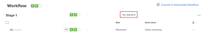

# Establecer una fecha límite para una prueba básica existente

Puede establecer una sola fecha límite para una prueba básica después de crearla.

## Requisitos de acceso

+++ Expanda para ver los requisitos de acceso para la funcionalidad en este artículo.

<table style="table-layout:auto"> 
 <col> 
 <col> 
 <tbody> 
  <tr> 
   <td role="rowheader">Paquete de Adobe Workfront</td> 
   <td> 
Cualquiera
 </td> 
  </tr> 
  <tr> 
   <td role="rowheader">Licencia de Adobe Workfront</td> 
   <td> 
   
Estándar

   
Trabajo o plan

    </td> 
  </tr> 
  <tr> 
   <td role="rowheader">Perfil de permiso de prueba </td> 
   <td>Administrador o superior</td> 
  </tr> 
  <tr> 
   <td role="rowheader">Función de prueba</td> 
   <td>Autor o responsable</td> 
  </tr> 
  <tr> 
   <td role="rowheader">Configuraciones de nivel de acceso</td> 
   <td> 
Acceso de edición a documentos
</td> 
  </tr> 
 </tbody> 
</table>

Para obtener más información, consulte [Requisitos de acceso en la documentación de Workfront](/help/quicksilver/administration-and-setup/add-users/access-levels-and-object-permissions/access-level-requirements-in-documentation.md).

+++

## Establecer una fecha límite para una prueba básica existente

1. Vaya al proyecto, tarea o problema que contiene el documento y, a continuación, seleccione **Documentos**.
1. Encuentre la prueba que necesita.
1. Haga clic en **Flujo de trabajo de revisión**.
1. En el área **Flujo de trabajo**, seleccione **Sin fecha límite**.

   

1. Elija una fecha, especifique una hora y haga clic en cualquier lugar de la pantalla.
1. Seleccione si desea notificar la nueva fecha límite a los revisores .
