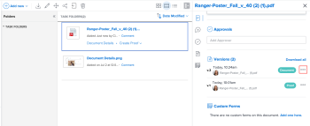

# Descargar versiones de prueba

Puede descargar una sola versión o todas las versiones de una prueba.

## Requisitos de acceso

+++ Expanda para ver los requisitos de acceso para la funcionalidad en este artículo.

Debe tener el siguiente acceso para realizar los pasos de este artículo:

<table style="table-layout:auto"> 
 <col> 
 <col> 
 <tbody> 
  <tr> 
   <td role="rowheader">Plan de Adobe Workfront*</td> 
   <td> 
Plan actual: pro o superior
 
o
 
Plan heredado: select o premium
 
Para obtener más información sobre el acceso de revisión con los diferentes planes, consulte <a href="/help/quicksilver/administration-and-setup/manage-workfront/configure-proofing/access-to-proofing-functionality.md" class="MCXref xref">Acceso a la funcionalidad de revisión en Workfront</a>.
 </td> 
  </tr> 
  <tr> 
   <td role="rowheader">Licencia de Adobe Workfront*</td> 
   <td> 
Plan actual: trabajo o plan
 
Plan heredado: cualquiera (debe tener la revisión habilitada para el usuario)
 </td> 
  </tr> 
  <tr> 
   <td role="rowheader">Perfil de permiso de prueba </td> 
   <td>Administrador o superior</td> 
  </tr> 
  <tr> 
   <td role="rowheader">Configuraciones de nivel de acceso*</td> 
   <td> 
Acceso de edición a documentos
 
Para obtener información sobre cómo solicitar acceso adicional, consulte <a href="../../../../workfront-basics/grant-and-request-access-to-objects/request-access.md" class="MCXref xref">Solicitar acceso a los objetos </a>.
 </td> 
  </tr> 
 </tbody> 
</table>

&#42;Para saber qué plan, función o perfil de permiso de revisión tiene, póngase en contacto con su administrador de Workfront o de Workfront Proof.

+++

## Descargar una sola versión de prueba

1. En la lista de documentos, haga clic en la prueba.
1. En el resumen, en **Versiones**, haga clic en el icono  a la derecha de la versión y, a continuación, haga clic en **Descargar** en la lista desplegable que aparece.

   

## Descargue todas las versiones de una prueba

1. En la lista de documentos, haga clic en la prueba.
1. Haga clic en **Detalles del documento** y, a continuación, seleccione **Todas las versiones** en el panel izquierdo.

1. Haga clic en **Descargar todo** en la parte superior de la lista.
