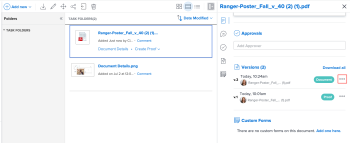

# Descargar versiones de prueba

Puede descargar una sola versión o todas las versiones de una prueba.

## Requisitos de acceso

+++ Expanda para ver los requisitos de acceso para la funcionalidad en este artículo.

<table style="table-layout:auto"> 
 <col> 
 <col> 
 <tbody> 
  <tr> 
   <td role="rowheader">Paquete de Adobe Workfront</td> 
   <td> 
Cualquiera
 </td> 
  </tr> 
  <tr> 
   <td role="rowheader">Licencia de Adobe Workfront</td> 
   <td> 
   
Estándar

   
Trabajo o plan

   </td> 
  </tr> 
  <tr> 
   <td role="rowheader">Perfil de permiso de prueba </td> 
   <td>Administrador o superior</td> 
  </tr> 
  <tr> 
   <td role="rowheader">Configuraciones de nivel de acceso</td> 
   <td> 
Acceso de edición a documentos
 </td> 
  </tr> 
 </tbody> 
</table>

Para obtener más información, consulte [Requisitos de acceso en la documentación de Workfront](/help/quicksilver/administration-and-setup/add-users/access-levels-and-object-permissions/access-level-requirements-in-documentation.md).

+++

## Descargar una sola versión de prueba

1. En la lista de documentos, haga clic en la prueba.
1. En el resumen, en **Versiones**, haga clic en el icono  a la derecha de la versión y, a continuación, haga clic en **Descargar** en la lista desplegable que aparece.

   

## Descargue todas las versiones de una prueba

1. En la lista de documentos, haga clic en la prueba.
1. Haga clic en **Detalles del documento** y, a continuación, seleccione **Todas las versiones** en el panel izquierdo.

1. Haga clic en **Descargar todo** en la parte superior de la lista.
